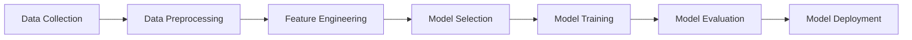

# Machine Learning Basics

> 🎥 [Search YouTube for "Machine Learning Basics"](https://www.youtube.com/results?search_query=Machine%20Learning%20Basics%20AI%20for%20Beginners%20tutorial)

## Machine Learning Basics
### Introduction

Machine learning is a subset of artificial intelligence (AI) that involves training algorithms to make predictions or decisions based on data. There are two primary types of machine learning: **supervised learning** and **unsupervised learning**.

### Supervised Learning

In supervised learning, the algorithm is trained on labeled data, where each example is paired with its corresponding output. The goal is to learn a mapping between the input data and the target output, so the algorithm can make predictions on new, unseen data.

**Example:** Image classification, where the algorithm is trained on images of cats and dogs, and the goal is to predict the type of animal in a new image.

### Unsupervised Learning

In unsupervised learning, the algorithm is trained on unlabeled data, and the goal is to discover patterns or relationships in the data. This type of learning is often used for **clustering**, where similar data points are grouped together.

**Example:** Customer segmentation, where the algorithm groups customers based on their purchasing behavior and demographics.

### Regression vs. Classification

**Regression** is a type of supervised learning where the goal is to predict a continuous value, such as a house price or a stock price.

**Classification** is a type of supervised learning where the goal is to predict a categorical value, such as a spam email or a customer's credit score.

### Machine Learning Workflow



### Key Concepts

* **Bias-Variance Tradeoff**: The balance between the algorithm's ability to fit the training data and its ability to generalize to new data.
* **Overfitting**: When the algorithm is too complex and fits the training data too closely, resulting in poor performance on new data.
* **Underfitting**: When the algorithm is too simple and fails to capture the underlying patterns in the data.

### Example Use Case

Suppose we want to build a model to predict house prices based on features such as the number of bedrooms, square footage, and location.

```python
# Import necessary libraries
import pandas as pd
from sklearn.model_selection import train_test_split
from sklearn.linear_model import LinearRegression

# Load the dataset
data = pd.read_csv("house_prices.csv")

# Preprocess the data
X = data[["bedrooms", "square_footage", "location"]]
y = data["price"]

# Split the data into training and testing sets
X_train, X_test, y_train, y_test = train_test_split(X, y, test_size=0.2, random_state=42)

# Train a linear regression model
model = LinearRegression()
model.fit(X_train, y_train)

# Evaluate the model on the testing set
y_pred = model.predict(X_test)
```

### Image: Machine Learning Workflow


This lesson provides a basic understanding of machine learning concepts, including supervised and unsupervised learning, regression, and classification. It also introduces the machine learning workflow and key concepts such as bias-variance tradeoff, overfitting, and underfitting.
