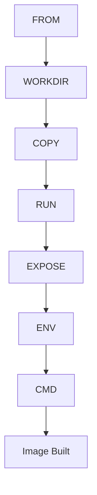

# Building Images

> 🎥 [Search YouTube for "Building Images"](https://www.youtube.com/results?search_query=Building%20Images%20Docker%20Fundamentals%20tutorial)

## Building Images with Dockerfiles

Building a Docker image from a Dockerfile is a crucial step in creating a reproducible and consistent environment for your application. In this lesson, we will explore the process of building a Docker image using a Dockerfile.

### What is a Dockerfile?

A Dockerfile is a text file that contains instructions for building a Docker image. It is used to define the environment in which your application will run, including the operating system, dependencies, and configuration.

### Writing a Simple Dockerfile

Let's start with a simple example. Create a new file called `Dockerfile` in your project directory:
```dockerfile
# Use an official Python image as the base
FROM python:3.9-slim

# Set the working directory in the container
WORKDIR /app

# Copy the current directory contents into the container at /app
COPY . /app

# Install any needed packages
RUN pip install -r requirements.txt

# Make port 80 available to the world
EXPOSE 80

# Define environment variable
ENV NAME World

# Run app.py when the container launches
CMD ["python", "app.py"]
```
This Dockerfile uses the official Python 3.9 image as the base, sets the working directory to `/app`, copies the current directory contents into the container, installs any needed packages, exposes port 80, defines an environment variable, and sets the default command to run `app.py`.

### Building the Docker Image

To build the Docker image, use the following command:
```bash
docker build -t my-python-image .
```
This command tells Docker to build an image with the tag `my-python-image` using the instructions in the `Dockerfile`.

### Understanding the Docker Build Process

The Docker build process involves the following steps:

1. **Step 1: FROM**: The `FROM` instruction specifies the base image for the new image. In this case, we're using the official Python 3.9 image.
2. **Step 2: WORKDIR**: The `WORKDIR` instruction sets the working directory in the container.
3. **Step 3: COPY**: The `COPY` instruction copies the current directory contents into the container at the specified location.
4. **Step 4: RUN**: The `RUN` instruction installs any needed packages.
5. **Step 5: EXPOSE**: The `EXPOSE` instruction makes port 80 available to the world.
6. **Step 6: ENV**: The `ENV` instruction defines an environment variable.
7. **Step 7: CMD**: The `CMD` instruction sets the default command to run when the container launches.

### Mermaid Diagram: Docker Build Process


This Mermaid diagram illustrates the Docker build process, highlighting the steps involved in creating a Docker image from a Dockerfile.

### Building Images in Practice

To reinforce your understanding, let's build a Docker image for a simple web server. Create a new file called `Dockerfile` in your project directory:
```dockerfile
# Use an official Ubuntu image as the base
FROM ubuntu:latest

# Set the working directory in the container
WORKDIR /app

# Copy the current directory contents into the container at /app
COPY . /app

# Install any needed packages
RUN apt-get update
RUN apt-get install -y nginx

# Make port 80 available to the world
EXPOSE 80

# Run nginx when the container launches
CMD ["nginx"]
```
Build the Docker image using the following command:
```bash
docker build -t my-nginx-image .
```
This will create a Docker image with the tag `my-nginx-image` that includes the `nginx` web server.

### Conclusion

In this lesson, we explored the process of building a Docker image from a Dockerfile. We wrote a simple Dockerfile, built the image, and understood the Docker build process. We also created a Mermaid diagram to illustrate the build process and built a Docker image for a simple web server. With this knowledge, you can create reproducible and consistent environments for your applications using Docker.
