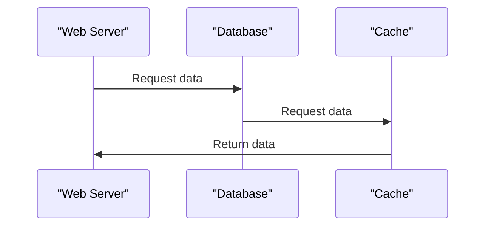

# Docker Compose

> 🎥 [Search YouTube for "Docker Compose"](https://www.youtube.com/results?search_query=Docker%20Compose%20Docker%20Fundamentals%20tutorial)

## Managing Multi-Container Applications with Docker Compose

Docker Compose is a powerful tool that allows you to manage multi-container applications with ease. It provides a simple way to define and run applications that consist of multiple containers, making it an essential tool for developers and system administrators.

### What is Docker Compose?

Docker Compose is a command-line tool that allows you to define and run multi-container applications. It uses a YAML file to define the services, volumes, and networks that make up an application. This file is called a `docker-compose.yml` file.

### Key Features of Docker Compose

*   **Defining Services**: Docker Compose allows you to define multiple services that make up an application. Each service can be a separate container that runs a specific process or application.
*   **Volumes and Networks**: Docker Compose allows you to define volumes and networks that can be shared between services.
*   **Environment Variables**: Docker Compose allows you to define environment variables that can be used by services.
*   **Commands and Options**: Docker Compose provides a range of commands and options that allow you to manage and run your applications.

### Benefits of Using Docker Compose

*   **Simplified Application Management**: Docker Compose simplifies the management of multi-container applications by providing a single command to start and stop all services.
*   **Improved Consistency**: Docker Compose ensures that all services are started and stopped consistently, reducing the risk of human error.
*   **Easy Scaling**: Docker Compose makes it easy to scale applications by allowing you to define multiple instances of a service.

### Example Use Case

Suppose we have a web application that consists of a web server, a database, and a cache. We can define these services using Docker Compose as follows:

```yml
version: '3'
services:
  web:
    image: my-web-server
    ports:
      - "80:80"
    depends_on:
      - db
      - cache
  db:
    image: my-db-server
    environment:
      - DB_PASSWORD=mysecretpassword
    volumes:
      - db-data:/data
  cache:
    image: my-cache-server
    depends_on:
      - web
```

This `docker-compose.yml` file defines three services: `web`, `db`, and `cache`. The `web` service depends on the `db` and `cache` services, and the `cache` service depends on the `web` service.

### Architecture

Here is a Mermaid diagram that illustrates the architecture of our web application:



This diagram shows the flow of data between the `web` service, the `db` service, and the `cache` service.

### Conclusion

Docker Compose is a powerful tool that allows you to manage multi-container applications with ease. It provides a simple way to define and run applications that consist of multiple containers, making it an essential tool for developers and system administrators.

### Further Reading

*   [Docker Compose Documentation](https://docs.docker.com/compose/)
*   [Docker Compose Tutorial](https://www.docker.com/get-started)

### Image


### Example Use Case Image


### Code Block

```bash
docker-compose up
```

This command starts all services defined in the `docker-compose.yml` file.
