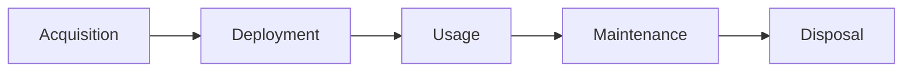

# What is IT Asset Management?

> 🎥 [Search YouTube for "What is IT Asset Management?"](https://www.youtube.com/results?search_query=What%20is%20IT%20Asset%20Management%3F%20IT%20Asset%20Management%20Fundamentals%20tutorial)

## Introduction to IT Asset Management

IT asset management is a critical function in modern organizations, responsible for the acquisition, deployment, maintenance, and disposal of IT assets. These assets can include hardware, software, and other digital components that are essential to the operation of an organization.

### What is IT Asset Management?

**IT asset management** is the practice of managing the entire lifecycle of IT assets, from acquisition to disposal. It involves a set of processes, policies, and procedures designed to optimize the value of these assets, minimize costs, and ensure compliance with regulatory requirements.

### Key Components of IT Asset Management

*   **Asset management**: The process of acquiring, deploying, maintaining, and disposing of IT assets.
*   **Asset tracking**: The process of tracking and monitoring the location, status, and usage of IT assets.
*   **Asset inventory**: A comprehensive list of all IT assets, including their characteristics, location, and ownership.
*   **Asset lifecycle**: The stages of an IT asset's life, from acquisition to disposal.

### Benefits of IT Asset Management

*   **Cost savings**: By optimizing asset utilization, reducing waste, and minimizing costs.
*   **Improved efficiency**: By streamlining processes, reducing manual errors, and increasing productivity.
*   **Compliance**: By ensuring regulatory compliance, reducing the risk of non-compliance.
*   **Risk management**: By identifying and mitigating risks associated with IT assets.

### IT Asset Management Process

The IT asset management process involves the following stages:

1.  Acquisition: The process of acquiring new IT assets.
2.  Deployment: The process of deploying acquired assets into production.
3.  Usage: The process of using IT assets to deliver business value.
4.  Maintenance: The process of maintaining IT assets to ensure optimal performance.
5.  Disposal: The process of disposing of IT assets when they are no longer needed.

### Conclusion

IT asset management is a critical function in modern organizations, responsible for the acquisition, deployment, maintenance, and disposal of IT assets. By understanding the key components, benefits, and process of IT asset management, organizations can optimize the value of their IT assets, minimize costs, and ensure compliance with regulatory requirements.

### Additional Resources

*   [ITIL 4: IT Asset Management](https://www.itil.org.uk/itil-4-manuals/itil-4-service-valuation-and-realization-manual/)
*   [ISO/IEC 19760:2017 - IT asset management](https://www.iso.org/standard/71451.html)
