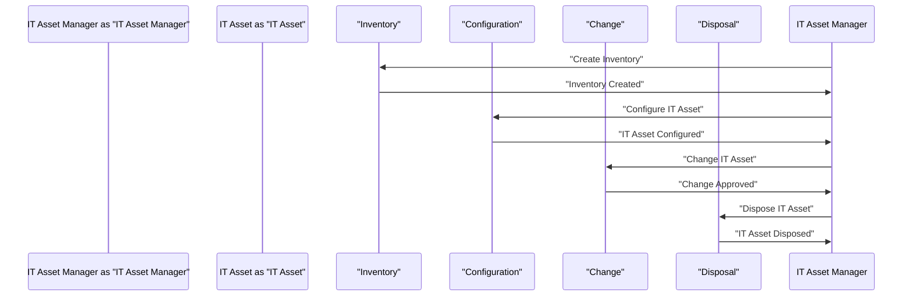

# IT Asset Management Best Practices

> 🎥 [Search YouTube for "IT Asset Management Best Practices"](https://www.youtube.com/results?search_query=IT%20Asset%20Management%20Best%20Practices%20IT%20Asset%20Management%20Fundamentals%20tutorial)

# IT Asset Management Best Practices

IT asset management is the practice of overseeing and managing the lifecycle of IT assets, from procurement to disposal. Implementing best practices in IT asset management is crucial for organizations to ensure that their IT assets are properly managed, maintained, and utilized efficiently. In this lesson, we will explore the best practices for implementing IT asset management.

## Understanding IT Asset Management

IT asset management involves the identification, classification, and management of all IT assets, including hardware, software, and services. The goal of IT asset management is to ensure that IT assets are:

* Accurately inventoried and tracked
* Properly configured and maintained
* Securely stored and disposed of
* Optimally utilized and utilized efficiently

### Key Components of IT Asset Management

* **Inventory Management**: The process of creating and maintaining an accurate inventory of IT assets.
* **Configuration Management**: The process of managing the configuration of IT assets to ensure they meet the organization's requirements.
* **Change Management**: The process of managing changes to IT assets to ensure that they are properly approved and implemented.
* **Disposal Management**: The process of managing the disposal of IT assets to ensure that they are properly disposed of and recycled.

## IT Asset Management Best Practices

### 1. Develop an IT Asset Management Policy

Develop a comprehensive IT asset management policy that outlines the organization's IT asset management goals, objectives, and procedures.

### 2. Conduct Regular Inventory Audits

Conduct regular inventory audits to ensure that the IT asset inventory is accurate and up-to-date.

### 3. Implement Configuration Management

Implement configuration management to ensure that IT assets are properly configured and meet the organization's requirements.

### 4. Develop a Change Management Process

Develop a change management process to ensure that changes to IT assets are properly approved and implemented.

### 5. Implement Disposal Management

Implement disposal management to ensure that IT assets are properly disposed of and recycled.

### 6. Use IT Asset Management Tools

Use IT asset management tools to streamline IT asset management processes and improve accuracy.

### 7. Train IT Staff

Train IT staff on IT asset management best practices to ensure that they understand their roles and responsibilities.

## Mermaid Diagram: IT Asset Management Process



## IT Asset Management Tools

IT asset management tools can help streamline IT asset management processes and improve accuracy. Some popular IT asset management tools include:

* [Microsoft System Center Configuration Manager](https://docs.microsoft.com/en-us/configmgr/overview/)
* [HP Asset Manager](https://www.hpe.com/us/en/virtualization-and-management/asset-manager)
* [ManageEngine AssetExplorer](https://www.manageengine.com/products/asset-explorer/)

## Conclusion

Implementing IT asset management best practices is crucial for organizations to ensure that their IT assets are properly managed, maintained, and utilized efficiently. By following the best practices outlined in this lesson, organizations can improve the accuracy and efficiency of their IT asset management processes.

[Image: A diagram showing the flow of IT asset management processes.](https://upload.wikimedia.org/wikipedia/commons/thumb/6/6f/IT_asset_management_process_diagram.svg/1200px-IT_asset_management_process_diagram.svg.png)

```mermaid
graph LR
    A[IT Asset Manager] --> B[Inventory]
    B --> C[Configuration]
    C --> D[Change]
    D --> E[Disposal]
    E --> F[IT Asset]
