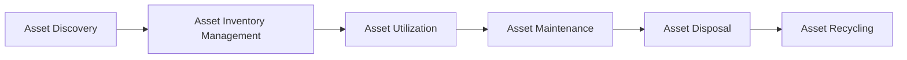

# IT Asset Management Challenges

> 🎥 [Search YouTube for "IT Asset Management Challenges"](https://www.youtube.com/results?search_query=IT%20Asset%20Management%20Challenges%20IT%20Asset%20Management%20Fundamentals%20tutorial)

IT asset management is a critical function in modern organizations, responsible for the acquisition, deployment, maintenance, and disposal of IT assets. However, IT asset management is not without its challenges. In this lesson, we will explore the common challenges faced by organizations in IT asset management.

## Challenges in IT Asset Management

### Inefficient Asset Tracking

*   **Asset discovery**: Identifying and tracking IT assets can be a daunting task, especially in large and distributed organizations.
*   **Asset inventory management**: Maintaining an accurate and up-to-date inventory of IT assets is crucial, but it can be time-consuming and prone to errors.
*   **Asset utilization**: Understanding how assets are being used and utilized is essential, but it can be difficult to collect and analyze usage data.

### Complexity and Fragmentation

*   **Multiple asset types**: IT assets come in various forms, including hardware, software, and services, each with its own unique characteristics and requirements.
*   **Vendor management**: Dealing with multiple vendors and their respective asset management systems can be complex and time-consuming.
*   **Integration with existing systems**: Integrating IT asset management systems with existing IT systems, such as HR and finance systems, can be a significant challenge.

### Security and Compliance

*   **Data security**: IT assets can be a significant security risk if not properly managed, with data breaches and unauthorized access being major concerns.
*   **Compliance**: Ensuring compliance with regulatory requirements, such as GDPR and HIPAA, can be a challenge, especially when it comes to data storage and disposal.
*   **Risk management**: Identifying and mitigating risks associated with IT assets is essential, but it can be difficult to prioritize and manage risks effectively.

### Financial and Operational Challenges

*   **Cost management**: Managing the financial aspects of IT assets, including procurement, maintenance, and disposal, can be complex and time-consuming.
*   **Operational efficiency**: Ensuring that IT assets are used efficiently and effectively can be a challenge, especially in large and distributed organizations.
*   **Disposal and recycling**: Properly disposing of and recycling IT assets can be a challenge, especially when it comes to sensitive data and environmental regulations.



The following image illustrates the importance of IT asset management:


### Conclusion

In conclusion, IT asset management is a complex and multifaceted function that poses several challenges to organizations. By understanding these challenges, organizations can better prepare themselves to address them and improve their overall IT asset management practices.

```bash
# Example of a Python script for IT asset management
import csv

# Read asset data from a CSV file
with open('assets.csv', 'r') as f:
    reader = csv.DictReader(f)
    assets = list(reader)

# Print asset information
for asset in assets:
    print(f"Asset ID: {asset['id']}")
    print(f"Asset Name: {asset['name']}")
    print(f"Asset Type: {asset['type']}")
    print(f"Asset Status: {asset['status']}")
    print()
```

This script demonstrates a basic example of how to read asset data from a CSV file and print asset information.
