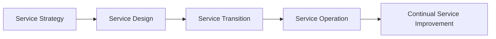

# IT Asset Management Frameworks

> 🎥 [Search YouTube for "IT Asset Management Frameworks"](https://www.youtube.com/results?search_query=IT%20Asset%20Management%20Frameworks%20IT%20Asset%20Management%20Fundamentals%20tutorial)

IT asset management is a critical function in the IT industry, ensuring that organizations can effectively manage their IT assets throughout their lifecycle. This involves identifying, tracking, and maintaining hardware, software, and other digital assets to optimize their utilization and minimize costs. In this lesson, we will explore popular IT asset management frameworks and their applications.

## IT Asset Management Frameworks Overview
IT asset management frameworks provide a structured approach to managing IT assets, helping organizations to standardize and optimize their asset management processes. Some popular frameworks include:

* **ITIL (Information Technology Infrastructure Library)**: A widely adopted framework that provides a comprehensive approach to IT service management, including asset management.
* **COBIT (Control Objectives for Information and Related Technology)**: A framework that focuses on IT governance and management, including asset management.
* **ISO/IEC 19770**: A set of international standards for IT asset management, providing a framework for managing IT assets throughout their lifecycle.

### ITIL Framework
The ITIL framework provides a structured approach to IT service management, including asset management. The ITIL framework consists of five stages:

1. **Service Strategy**: Define the IT service strategy and identify the IT assets required to deliver those services.
2. **Service Design**: Design the IT service and the IT assets required to deliver it.
3. **Service Transition**: Plan and implement the IT service and IT assets.
4. **Service Operation**: Manage and maintain the IT service and IT assets.
5. **Continual Service Improvement**: Continuously improve the IT service and IT assets.

### COBIT Framework
The COBIT framework focuses on IT governance and management, including asset management. The COBIT framework consists of five domains:

1. **Plan and Organize**: Plan and organize the IT function and IT assets.
2. **Acquire and Implement**: Acquire and implement IT assets.
3. **Delivery and Support**: Deliver and support IT services and IT assets.
4. **Monitor and Evaluate**: Monitor and evaluate the IT function and IT assets.
5. **Govern and Manage**: Govern and manage the IT function and IT assets.

### ISO/IEC 19770 Framework
The ISO/IEC 19770 framework provides a set of international standards for IT asset management. The framework consists of three parts:

1. **Part 1: Overview and Concepts**: Defines the concepts and principles of IT asset management.
2. **Part 2: Specification for the Procurement of IT Assets**: Specifies the requirements for procuring IT assets.
3. **Part 3: Guidelines for the Management of IT Assets**: Provides guidelines for managing IT assets throughout their lifecycle.

In conclusion, IT asset management frameworks provide a structured approach to managing IT assets, helping organizations to standardize and optimize their asset management processes. Understanding these frameworks is essential for IT professionals who want to effectively manage IT assets and optimize their utilization.
