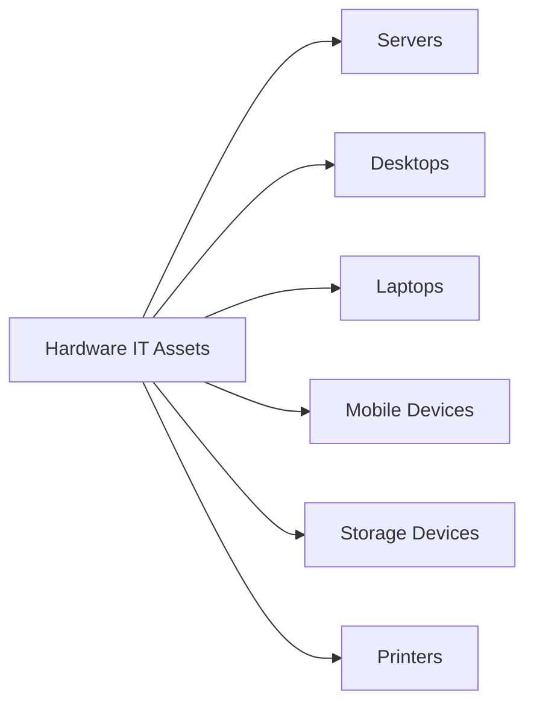

# Types of IT Assets

> 🎥 [Search YouTube for "Types of IT Assets"](https://www.youtube.com/results?search_query=Types%20of%20IT%20Assets%20IT%20Asset%20Management%20Fundamentals%20tutorial)

### IT Asset Types and Classification
#### Types of IT Assets

IT assets are the backbone of any organization's technology infrastructure. Understanding the different types of IT assets is crucial for effective IT asset management. In this lesson, we will explore the various types of IT assets, including hardware, software, and services.

IT assets can be broadly classified into three categories: hardware, software, and services. Each of these categories has its own set of characteristics and requirements.

#### Hardware IT Assets

Hardware IT assets refer to the physical components of a computer system, such as:

* **Servers**: Powerful computers that provide services to clients over a network.
* **Desktops**: Computers used by end-users for tasks such as browsing, emailing, and word processing.
* **Laptops**: Portable computers used by end-users for tasks such as browsing, emailing, and word processing.
* **Mobile Devices**: Smartphones and tablets used by end-users for tasks such as browsing, emailing, and word processing.
* **Storage Devices**: Devices used to store data, such as hard drives and solid-state drives.
* **Printers**: Devices used to print documents and images.



#### Software IT Assets

Software IT assets refer to the programs and applications that run on computer hardware, such as:

* **Operating Systems**: Software that manages computer hardware resources and provides a platform for running applications.
* **Applications**: Software that performs specific tasks, such as word processing, spreadsheets, and database management.
* **Utilities**: Software that provides additional functionality, such as disk cleanup and virus scanning.
* **Security Software**: Software that protects computer systems from malware and other security threats.

#### Service IT Assets

Service IT assets refer to the services provided by IT assets, such as:

* **Cloud Services**: Services provided over the internet, such as storage and computing power.
* **Network Services**: Services provided over a network, such as email and file sharing.
* **Database Services**: Services provided by databases, such as data storage and retrieval.


```bash
# Example of a hardware IT asset inventory
{
  "hardware": [
    {
      "type": "server",
      "model": "Dell PowerEdge R740",
      "serial_number": "1234567890"
    },
    {
      "type": "desktop",
      "model": "Dell OptiPlex 3070",
      "serial_number": "9876543210"
    }
  ]
}
```

In this lesson, we have explored the different types of IT assets, including hardware, software, and services. Understanding these categories is crucial for effective IT asset management.
