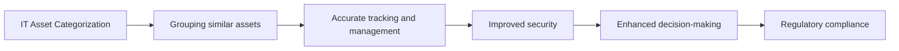

# Asset Categorization

> 🎥 [Search YouTube for "Asset Categorization"](https://www.youtube.com/results?search_query=Asset%20Categorization%20IT%20Asset%20Management%20Fundamentals%20tutorial)

# IT Asset Management Fundamentals
## Module 2: IT Asset Types and Classification
### Lesson: Asset Categorization

IT asset categorization is a crucial step in IT asset management, as it enables organizations to effectively manage and track their IT assets. Categorization involves grouping similar IT assets into logical categories, making it easier to manage, maintain, and dispose of them.

## What is IT Asset Categorization?

IT asset categorization is the process of grouping IT assets into categories based on their characteristics, such as type, usage, value, and risk. This process helps organizations to:

* Identify and classify IT assets accurately
* Determine the ownership and responsibility for each asset
* Develop effective management and maintenance strategies
* Ensure compliance with regulatory requirements

## Types of IT Assets

IT assets can be categorized into several types, including:

* **Hardware**: computers, laptops, smartphones, servers, storage devices, and other physical equipment
* **Software**: operating systems, applications, productivity software, and other digital products
* **Services**: cloud services, subscription-based services, and other intangible assets
* **Data**: sensitive, confidential, or critical data stored on IT assets

## Categorization Methods

There are several methods for categorizing IT assets, including:

* **Type-based categorization**: grouping assets by their type, such as laptops, desktops, or servers
* **Usage-based categorization**: grouping assets by their usage, such as production, development, or testing
* **Value-based categorization**: grouping assets by their value, such as high-value, medium-value, or low-value assets

## Categorization Benefits

Effective IT asset categorization offers several benefits, including:

* **Improved asset management**: accurate tracking and management of IT assets
* **Enhanced security**: secure storage and disposal of sensitive data
* **Better decision-making**: informed decisions on asset acquisition, maintenance, and disposal
* **Regulatory compliance**: adherence to regulatory requirements and industry standards



## Categorization Best Practices

To ensure effective IT asset categorization, organizations should:

* **Develop a clear categorization strategy**: define the categorization method and criteria
* **Establish a centralized asset management system**: track and manage IT assets accurately
* **Regularly review and update categorization**: reflect changes in asset types, usage, and value


```python
# Example code for categorizing IT assets
def categorize_assets(asset_type, usage, value):
    if asset_type == "Hardware":
        if usage == "Production":
            return "High-value"
        elif usage == "Development":
            return "Medium-value"
        else:
            return "Low-value"
    elif asset_type == "Software":
        if value == "High":
            return "Critical"
        elif value == "Medium":
            return "Important"
        else:
            return "Low-priority"

# Example usage
asset_type = "Hardware"
usage = "Production"
value = "High"
print(categorize_assets(asset_type, usage, value))  # Output: High-value
