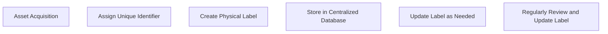

# Asset Tagging and Labeling

> 🎥 [Search YouTube for "Asset Tagging and Labeling"](https://www.youtube.com/results?search_query=Asset%20Tagging%20and%20Labeling%20IT%20Asset%20Management%20Fundamentals%20tutorial)

# Asset Tagging and Labeling

Asset tagging and labeling are essential components of IT asset management, enabling organizations to accurately track, manage, and maintain their IT assets. In this lesson, we will explore the importance of asset tagging and labeling, the different types of asset tags, and the best practices for implementing an effective asset labeling system.

## What is Asset Tagging?

Asset tagging involves assigning a unique identifier to an IT asset, such as a computer, server, or network device. This identifier is used to track the asset's location, ownership, and maintenance history. Asset tags can be physical labels, RFID tags, or digital identifiers stored in a database.

### Types of Asset Tags

*   **Physical Labels**: These are stickers or labels attached to the asset, containing information such as the asset's name, serial number, and owner.
*   **RFID Tags**: These are small electronic tags that store information and can be read using a radio frequency identifier (RFID) reader.
*   **Digital Identifiers**: These are unique codes or numbers stored in a database, used to identify and track assets.

## Why is Asset Labeling Important?

Asset labeling is crucial for IT asset management as it helps organizations:

*   **Track Assets**: Accurately identify and locate assets within the organization.
*   **Maintain Assets**: Schedule regular maintenance and updates for assets.
*   **Comply with Regulations**: Meet regulatory requirements for asset tracking and reporting.
*   **Reduce Costs**: Avoid unnecessary purchases and reduce waste by identifying available assets.

## Best Practices for Asset Labeling

1.  **Standardize Labels**: Use a standardized format for asset labels to ensure consistency and ease of use.
2.  **Use a Centralized Database**: Store asset information in a centralized database for easy access and management.
3.  **Regularly Update Labels**: Update asset labels as assets are moved, replaced, or retired.
4.  **Use RFID Tags**: Consider using RFID tags for high-value or critical assets to improve tracking and security.

### Asset Labeling Process



### Asset Labeling Example

[Image: https://upload.wikimedia.org/wikipedia/commons/thumb/5/5f/Barcode_label_example.svg/800px-Barcode_label_example.svg]

In this example, a barcode label is used to identify a computer asset. The label contains the asset's name, serial number, and owner information.

### Fenced Code Block

```sql
-- SQL query to update asset labels in a database
UPDATE assets
SET label = 'New Label'
WHERE asset_id = '12345';
```

By following these best practices and understanding the importance of asset tagging and labeling, organizations can improve their IT asset management processes, reduce costs, and ensure compliance with regulations.
