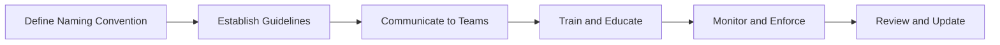

# Asset Naming Conventions

> 🎥 [Search YouTube for "Asset Naming Conventions"](https://www.youtube.com/results?search_query=Asset%20Naming%20Conventions%20IT%20Asset%20Management%20Fundamentals%20tutorial)

## Standardizing Asset Naming Conventions
### Introduction
In IT asset management, a well-defined naming convention is crucial for effective inventory management, asset tracking, and data analysis. A standardized naming convention ensures that assets are consistently identified, categorized, and reported, making it easier to manage and maintain assets across the organization. In this lesson, we will explore the importance of standardizing asset naming conventions and provide guidelines for implementing a consistent naming convention.

### Why Standardize Asset Naming Conventions?
* Ensures accurate identification and tracking of assets
* Facilitates efficient inventory management and reporting
* Reduces errors and inconsistencies in data analysis
* Supports compliance with regulatory and industry standards
* Enhances collaboration and communication among teams

### Key Considerations for Asset Naming Conventions
* **Uniqueness**: Each asset must have a unique identifier to avoid duplication and confusion.
* **Consistency**: The naming convention should be consistent across all assets, departments, and locations.
* **Readability**: The naming convention should be easy to read and understand, even for non-technical personnel.
* **Flexibility**: The naming convention should be flexible enough to accommodate changes in asset types, locations, and ownership.

### Implementing a Consistent Naming Convention


### Example of a Consistent Naming Convention
Let's consider a simple example of a naming convention for laptops:
```
LAPTOP-<Department>-<Location>-<Asset ID>
```
For example:
```
LAPTOP-SALES-NY-001
```
This naming convention is unique, consistent, readable, and flexible enough to accommodate changes in asset types, locations, and ownership.

### Best Practices for Asset Naming Conventions
* Use a combination of letters and numbers to ensure uniqueness and readability.
* Include department and location identifiers to facilitate asset tracking and reporting.
* Use a standardized format for asset IDs to ensure consistency and accuracy.
* Regularly review and update the naming convention to ensure it remains effective and efficient.

### Example of a Well-Documented Naming Convention
[Image: A screenshot of a well-documented naming convention document, from the official Microsoft documentation on Wikipedia](https://upload.wikimedia.org/wikipedia/commons/thumb/9/9f/Asset_Naming_Convention_Documentation.png/800px-Asset_Naming_Convention_Documentation.png)

### Conclusion
Standardizing asset naming conventions is essential for effective IT asset management. By following these guidelines and best practices, organizations can ensure accurate identification, tracking, and reporting of assets, making it easier to manage and maintain assets across the organization.
