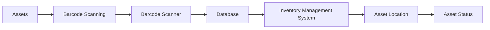

# IT Asset Tracking Methods

> 🎥 [Search YouTube for "IT Asset Tracking Methods"](https://www.youtube.com/results?search_query=IT%20Asset%20Tracking%20Methods%20IT%20Asset%20Management%20Fundamentals%20tutorial)

**Module 3: IT Asset Inventory and Tracking**
==============================================

IT asset tracking is a crucial aspect of IT asset management, enabling organizations to maintain accurate records of their hardware and software assets. Effective tracking helps in identifying, locating, and managing assets, reducing costs, and improving overall IT service delivery. In this lesson, we will explore the different methods for tracking IT assets, including barcode scanning and RFID.

### Introduction to IT Asset Tracking Methods

IT asset tracking involves identifying and recording the details of IT assets, including hardware and software. This information is used to maintain an up-to-date inventory, track asset locations, and monitor their condition. There are several methods for tracking IT assets, each with its own advantages and disadvantages.

### Barcode Scanning

Barcode scanning is a widely used method for tracking IT assets. It involves assigning a unique barcode to each asset and using a barcode scanner to read the code. This method is simple, cost-effective, and easy to implement.

**Benefits of Barcode Scanning:**

*   Low cost
*   Easy to implement
*   Fast data entry

**Drawbacks of Barcode Scanning:**

*   Limited scalability
*   Prone to human error

### RFID (Radio-Frequency Identification)

RFID is a more advanced method of tracking IT assets. It uses radio waves to communicate with tags attached to assets, eliminating the need for physical contact. RFID offers several benefits over barcode scanning, including increased accuracy and faster data entry.

**Benefits of RFID:**

*   Increased accuracy
*   Faster data entry
*   Scalable

**Drawbacks of RFID:**

*   Higher cost
*   Requires specialized equipment

### Choosing the Right Method

When selecting an IT asset tracking method, consider the following factors:

*   **Cost**: Barcode scanning is a cost-effective option, while RFID is more expensive.
*   **Scalability**: RFID is more scalable than barcode scanning.
*   **Accuracy**: RFID offers higher accuracy than barcode scanning.
*   **Ease of implementation**: Barcode scanning is easier to implement than RFID.

### Implementing IT Asset Tracking

To implement IT asset tracking, follow these steps:

1.  **Identify assets**: Determine which assets require tracking.
2.  **Assign barcodes or RFID tags**: Assign unique identifiers to each asset.
3.  **Install scanners or RFID readers**: Install barcode scanners or RFID readers.
4.  **Configure software**: Configure software to read barcodes or RFID tags.
5.  **Train staff**: Train staff on using the tracking system.

### Example Use Case

Here is an example use case for IT asset tracking using barcode scanning:



In this example, assets are scanned using a barcode scanner, which sends the data to a database, which is then updated in the inventory management system. The system displays the asset location and status.

### Conclusion

IT asset tracking is a critical component of IT asset management. Understanding the different methods for tracking IT assets, including barcode scanning and RFID, is essential for making informed decisions. By considering factors such as cost, scalability, accuracy, and ease of implementation, organizations can choose the best method for their needs.

### Image: Barcode Scanning in Action


### Code Example: Barcode Scanning Script

```bash
#!/bin/bash

# Scan barcode using a barcode scanner
barcode=$(zbarimg -q --raw --raw-output /dev/video0)

# Update database with scanned barcode
mysql -u root -p password -e "UPDATE assets SET barcode = '$barcode' WHERE id = 1"
```

Note: This script uses the `zbarimg` command to scan a barcode and the `mysql` command to update a database. The `--raw` option is used to extract the barcode data, and the `--raw-output` option is used to output the data in a raw format. The `UPDATE` statement is used to update the database with the scanned barcode.
