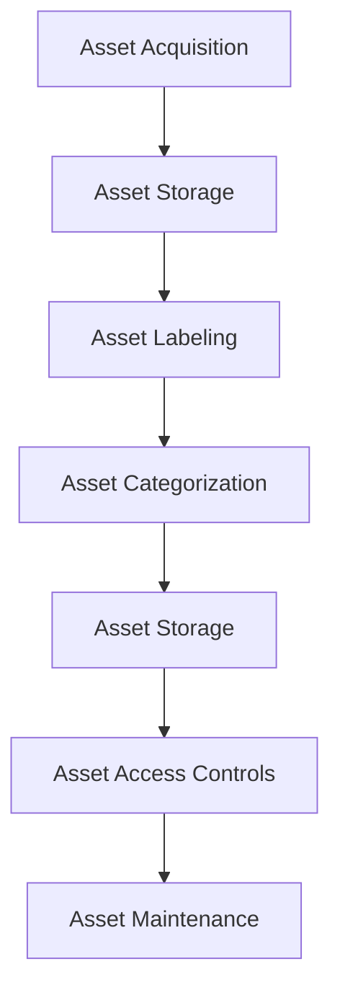

# Asset Location and Storage

> 🎥 [Search YouTube for "Asset Location and Storage"](https://www.youtube.com/results?search_query=Asset%20Location%20and%20Storage%20IT%20Asset%20Management%20Fundamentals%20tutorial)

## Asset Location and Storage

Proper asset location and storage are crucial aspects of IT asset management. It ensures that assets are easily accessible, accounted for, and protected from damage or loss. In this lesson, we will explore the importance of asset location and storage, and how to implement effective practices.

### Why Proper Asset Location and Storage Matter

*   **Data Security**: Assets containing sensitive data, such as laptops or external hard drives, must be stored securely to prevent unauthorized access.
*   **Asset Accountability**: Accurate asset location and storage enable you to track and account for all assets, reducing the risk of loss or theft.
*   **Compliance**: Proper asset storage and location help ensure compliance with regulatory requirements and industry standards.

### Types of Asset Storage

There are several types of asset storage, including:

*   **On-site storage**: Assets are stored in a designated area within the organization's premises.
*   **Off-site storage**: Assets are stored in a secure facility outside the organization's premises, such as a data center or a storage facility.
*   **Cloud storage**: Assets are stored in a virtual environment, accessible through the internet.

### Best Practices for Asset Storage

*   **Label and categorize**: Clearly label and categorize assets to ensure easy identification and retrieval.
*   **Store in a secure location**: Store assets in a secure location, such as a locked cabinet or a secure room.
*   **Implement access controls**: Implement access controls, such as passwords or biometric authentication, to restrict access to assets.

### Asset Location and Storage Best Practices

### Asset Storage Options

Some common asset storage options include:

*   **Asset management software**: Utilize asset management software to track and manage assets, including their location and storage.
*   **Barcode scanning**: Use barcode scanning to quickly and accurately identify and track assets.
*   **RFID tags**: Use RFID tags to track assets and ensure they are stored in the correct location.

### Implementing Effective Asset Storage

To implement effective asset storage, follow these steps:

1.  **Conduct an asset inventory**: Conduct a thorough asset inventory to identify all assets and their locations.
2.  **Implement asset labeling**: Implement asset labeling to ensure easy identification and retrieval of assets.
3.  **Store assets securely**: Store assets in a secure location, such as a locked cabinet or a secure room.
4.  **Implement access controls**: Implement access controls, such as passwords or biometric authentication, to restrict access to assets.

### Conclusion

Proper asset location and storage are essential for ensuring the security, accountability, and compliance of IT assets. By implementing effective asset storage practices, organizations can reduce the risk of loss or theft, and ensure that assets are easily accessible and accounted for.
