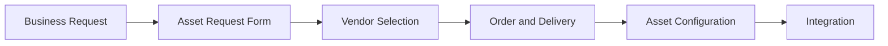

# IT Asset Acquisition

> 🎥 [Search YouTube for "IT Asset Acquisition"](https://www.youtube.com/results?search_query=IT%20Asset%20Acquisition%20IT%20Asset%20Management%20Fundamentals%20tutorial)

# IT Asset Acquisition Process

The IT asset acquisition process is a critical step in the lifecycle management of IT assets. It involves the procurement of new IT assets, such as hardware, software, or services, to meet the business needs of an organization. The acquisition process is essential to ensure that the acquired assets meet the organization's requirements, are properly configured, and are integrated into the existing IT infrastructure.

## IT Asset Acquisition Process Overview

The IT asset acquisition process typically involves the following steps:

1. **Business Request**: A business request is submitted to acquire a new IT asset to meet a specific business need.
2. **Asset Request Form**: An asset request form is completed to gather information about the required asset, including its specifications, budget, and timeline.
3. **Vendor Selection**: A vendor is selected to provide the required asset, based on factors such as price, quality, and reliability.
4. **Order and Delivery**: An order is placed with the selected vendor, and the asset is delivered to the organization.
5. **Asset Configuration**: The acquired asset is configured to meet the organization's requirements, including installation, setup, and testing.
6. **Integration**: The acquired asset is integrated into the existing IT infrastructure, including network, security, and other systems.

### **Acquisition Process Flowchart**



### **Acquisition Process Considerations**

When acquiring new IT assets, the following considerations should be taken into account:

* **Budget**: The cost of the asset should be aligned with the organization's budget.
* **Quality**: The quality of the asset should meet the organization's standards.
* **Reliability**: The asset should be reliable and have a good track record.
* **Integration**: The asset should be integrated into the existing IT infrastructure seamlessly.

### **Best Practices**

The following best practices should be followed during the IT asset acquisition process:

* **Standardize**: Standardize the acquisition process to ensure consistency and efficiency.
* **Document**: Document the acquisition process to ensure transparency and accountability.
* **Test**: Test the acquired asset to ensure it meets the organization's requirements.

### **Example: Acquiring a New Server**

When acquiring a new server, the following steps should be taken:

1. **Determine Requirements**: Determine the server's specifications, including CPU, memory, and storage.
2. **Select Vendor**: Select a vendor that meets the organization's requirements.
3. **Order and Delivery**: Order the server and ensure it is delivered on time.
4. **Configure**: Configure the server to meet the organization's requirements.
5. **Integrate**: Integrate the server into the existing IT infrastructure.


### **Script: Automating the Acquisition Process**

To automate the acquisition process, the following script can be used:
```bash
# Define the asset request form
asset_request_form=$(cat <<EOF
Asset Name: New Server
Asset Type: Server
Specifications: 16 GB RAM, 1 TB Storage
Budget: $5,000
Timeline: 2 weeks
EOF
)

# Define the vendor selection criteria
vendor_selection_criteria=$(cat <<EOF
Price: $3,000
Quality: 4/5
Reliability: 4/5
EOF
)

# Define the order and delivery process
order_and_delivery_process=$(cat <<EOF
Order the server from the selected vendor
Ensure the server is delivered on time
EOF
)

# Define the asset configuration process
asset_configuration_process=$(cat <<EOF
Configure the server to meet the organization's requirements
Install necessary software and applications
Test the server to ensure it meets the organization's requirements
EOF
)

# Define the integration process
integration_process=$(cat <<EOF
Integrate the server into the existing IT infrastructure
Configure network and security settings
Test the server to ensure it meets the organization's requirements
EOF
)

# Automate the acquisition process
acquisition_process=$(cat <<EOF
$asset_request_form
$vendor_selection_criteria
$order_and_delivery_process
$asset_configuration_process
$integration_process
EOF
)

echo "$acquisition_process"
