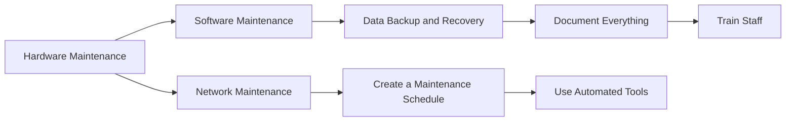

# IT Asset Maintenance and Support

> 🎥 [Search YouTube for "IT Asset Maintenance and Support"](https://www.youtube.com/results?search_query=IT%20Asset%20Maintenance%20and%20Support%20IT%20Asset%20Management%20Fundamentals%20tutorial)

# IT Asset Maintenance and Support

Regular maintenance and support are crucial for the optimal performance and longevity of IT assets. Just like a car requires regular oil changes and tune-ups to keep running smoothly, IT assets need regular updates, repairs, and monitoring to ensure they continue to function as intended. In this lesson, we will explore the importance of IT asset maintenance and support, and discuss the best practices for keeping your IT assets in top condition.

## Why IT Asset Maintenance and Support is Important

* **Prevents Downtime**: Regular maintenance and support help prevent IT assets from becoming outdated, obsolete, or failing altogether, reducing downtime and minimizing the impact on business operations.
* **Extends Lifespan**: Proper maintenance and support can extend the lifespan of IT assets, reducing the need for costly replacements and minimizing electronic waste.
* **Improves Performance**: Regular updates and repairs can improve the performance of IT assets, making them more efficient and effective in meeting business needs.
* **Enhances Security**: Regular maintenance and support can help identify and fix security vulnerabilities, reducing the risk of data breaches and cyber attacks.

### Types of IT Asset Maintenance and Support

* **Hardware Maintenance**: Regular checks and repairs of hardware components, such as servers, storage devices, and network equipment.
* **Software Maintenance**: Regular updates and patches of software applications, including operating systems, productivity software, and security software.
* **Network Maintenance**: Regular checks and repairs of network infrastructure, including routers, switches, and firewalls.
* **Data Backup and Recovery**: Regular backups of critical data and testing of recovery procedures to ensure business continuity.

### Best Practices for IT Asset Maintenance and Support

* **Create a Maintenance Schedule**: Develop a schedule for regular maintenance and support activities, including hardware, software, and network checks.
* **Document Everything**: Keep detailed records of maintenance and support activities, including repairs, updates, and issues.
* **Use Automated Tools**: Utilize automated tools and scripts to streamline maintenance and support activities, such as automated backups and updates.
* **Train Staff**: Provide regular training for IT staff on maintenance and support procedures, including troubleshooting and repair techniques.



[Image: A car receiving regular maintenance, illustrating the importance of IT asset maintenance and support.](https://upload.wikimedia.org/wikipedia/commons/thumb/9/9a/Car_undergoing_maintenance.jpg/800px-Car_undergoing_maintenance.jpg)

```bash
# Example script for automated backups
#!/bin/bash

# Set backup directory and file name
BACKUP_DIR=/path/to/backup/directory
FILE_NAME=backup_file.tar.gz

# Create backup directory if it doesn't exist
mkdir -p $BACKUP_DIR

# Create backup file
tar -czf $BACKUP_DIR/$FILE_NAME /path/to/backup/files
```

By following these best practices and staying on top of regular maintenance and support activities, you can ensure the optimal performance and longevity of your IT assets, reducing downtime, improving performance, and enhancing security.
