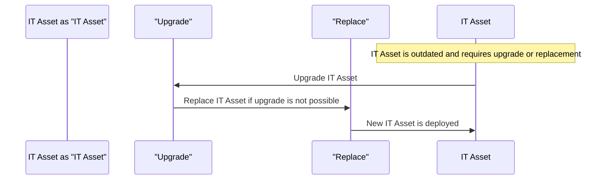

# IT Asset Upgrade and Replacement

> 🎥 [Search YouTube for "IT Asset Upgrade and Replacement"](https://www.youtube.com/results?search_query=IT%20Asset%20Upgrade%20and%20Replacement%20IT%20Asset%20Management%20Fundamentals%20tutorial)

# IT Asset Upgrade and Replacement

IT assets, such as hardware and software, have a limited lifespan and require periodic upgrades and replacements to maintain optimal performance and ensure business continuity. In this lesson, we will explore the importance of IT asset upgrade and replacement, the process involved, and the best practices to follow.

## Why Upgrade and Replace IT Assets?

IT assets are subject to technological advancements, obsolescence, and physical wear and tear. Upgrading and replacing IT assets ensures that an organization's technology infrastructure remains relevant, efficient, and secure. This process also helps to:

*   **Improve performance**: Upgrading IT assets can enhance processing speed, memory, and storage capacity, leading to improved productivity and efficiency.
*   **Enhance security**: Replacing outdated IT assets with newer, more secure models helps to mitigate the risk of cyber attacks and data breaches.
*   **Reduce costs**: Upgrading and replacing IT assets can lead to cost savings through reduced energy consumption, lower maintenance costs, and extended asset lifetimes.

## The IT Asset Upgrade and Replacement Process

The IT asset upgrade and replacement process involves several key steps:

1.  **Assessment**: Evaluate the current state of IT assets, identifying those that require upgrade or replacement.
2.  **Planning**: Develop a plan for upgrading and replacing IT assets, considering factors such as budget, timelines, and resource allocation.
3.  **Implementation**: Execute the plan, ensuring that all necessary upgrades and replacements are completed within the designated timeframe.
4.  **Testing**: Verify that upgraded and replaced IT assets are functioning correctly and meet the required standards.
5.  **Documentation**: Maintain accurate records of the upgrade and replacement process, including asset histories and maintenance schedules.

## Best Practices for IT Asset Upgrade and Replacement

To ensure a successful IT asset upgrade and replacement process, follow these best practices:

*   **Develop a comprehensive asset management plan**: Establish clear policies and procedures for IT asset management, including asset acquisition, deployment, maintenance, and disposal.
*   **Conduct regular asset assessments**: Schedule regular evaluations to identify IT assets that require upgrade or replacement.
*   **Implement a phased approach**: Upgrade and replace IT assets in phases, ensuring that critical systems remain operational throughout the process.
*   **Engage stakeholders**: Involve relevant stakeholders, including IT staff, management, and end-users, in the upgrade and replacement process to ensure that their needs and concerns are addressed.

## IT Asset Upgrade and Replacement Sequence Diagram



## Conclusion

IT asset upgrade and replacement are essential processes that ensure an organization's technology infrastructure remains relevant, efficient, and secure. By following the steps outlined in this lesson and adopting best practices, IT professionals can successfully upgrade and replace IT assets, minimizing disruptions and ensuring business continuity.

## Additional Resources

*   **IT Asset Management**: A comprehensive guide to IT asset management, including best practices and case studies. [https://www.iso.org/standard/50764.html](https://www.iso.org/standard/50764.html)
*   **IT Asset Upgrade and Replacement**: A whitepaper on the importance and process of IT asset upgrade and replacement. [https://www.cisco.com/c/en/us/offer/guides/docs/IT_Asset_Upgrade_and_Replacement.pdf](https://www.cisco.com/c/en/us/offer/guides/docs/IT_Asset_Upgrade_and_Replacement.pdf)

## Image: IT Asset Upgrade and Replacement


## Code Example: IT Asset Upgrade and Replacement Script

```bash
#!/bin/bash

# IT Asset Upgrade and Replacement Script

# Evaluate IT assets and identify those that require upgrade or replacement
assets=$(cat /path/to/asset/list)

# Loop through each IT asset
for asset in $assets; do
  # Check if asset requires upgrade or replacement
  if [ $(echo $asset | grep -o "upgrade" | wc -l) -gt 0 ]; then
    # Upgrade IT asset
    upgrade_asset $asset
  elif [ $(echo $asset | grep -o "replace" | wc -l) -gt 0 ]; then
    # Replace IT asset
    replace_asset $asset
  fi
done
```

Note: The code example is a simplified script and should be adapted to the specific needs of your organization.
