# Developing an IT Asset Management Policy

> 🎥 [Search YouTube for "Developing an IT Asset Management Policy"](https://www.youtube.com/results?search_query=Developing%20an%20IT%20Asset%20Management%20Policy%20IT%20Asset%20Management%20Fundamentals%20tutorial)

**Developing an IT Asset Management Policy**
===========================================

Developing an IT asset management policy is a crucial step in establishing a comprehensive IT asset management program. A well-crafted policy will serve as a guiding document for the organization, outlining the procedures and guidelines for managing IT assets.

### What is an IT Asset Management Policy?

An IT asset management policy is a set of rules and guidelines that outline how IT assets will be acquired, used, maintained, and disposed of within an organization. It is a critical component of an IT asset management program, as it provides a framework for decision-making and ensures that IT assets are used in a way that aligns with the organization's goals and objectives.

### Key Components of an IT Asset Management Policy

The following are key components of an IT asset management policy:

* **Scope**: Defines the extent of the policy, including which IT assets are covered and which departments or teams are responsible for their management.
* **Responsibilities**: Outlines the roles and responsibilities of various stakeholders, including IT asset managers, departmental managers, and end-users.
* **Acquisition**: Specifies the procedures for acquiring new IT assets, including budgeting, procurement, and approval processes.
* **Inventory**: Describes how IT assets will be inventoried, including the use of asset management software and the frequency of inventory updates.
* **Maintenance**: Outlines the procedures for maintaining IT assets, including software updates, hardware maintenance, and troubleshooting.
* **Disposal**: Specifies the procedures for disposing of IT assets, including data erasure, physical destruction, and recycling.
* **Security**: Emphasizes the importance of security and outlines procedures for protecting IT assets from unauthorized access, theft, and damage.

### Mermaid Diagram: IT Asset Management Policy Flowchart

```mermaid
graph LR
    A[Policy Development] --> B[Scope Definition]
    B --> C[Responsibilities Assignment]
    C --> D[Acquisition Procedures]
    D --> E[Inventory Management]
    E --> F[Maintenance Schedule]
    F --> G[Disposal Procedures]
    G --> H[Security Measures]
    H --> I[Review and Update]
```


### Best Practices for Developing an IT Asset Management Policy

When developing an IT asset management policy, consider the following best practices:

* **Involve stakeholders**: Engage with IT asset managers, departmental managers, and end-users to ensure that the policy reflects the needs and concerns of all stakeholders.
* **Keep it concise**: Ensure that the policy is clear, concise, and easy to understand.
* **Review and update regularly**: Regularly review and update the policy to ensure that it remains relevant and effective.
* **Communicate effectively**: Communicate the policy to all stakeholders, including IT asset managers, departmental managers, and end-users.

### Example Image: IT Asset Management Policy Flowchart


### Example Code: IT Asset Management Policy Template
```bash
# IT Asset Management Policy Template

# Scope
scope = "All IT assets within the organization"

# Responsibilities
responsibilities = {
  "IT Asset Manager": "Responsible for developing and implementing the IT asset management policy",
  "Departmental Manager": "Responsible for managing IT assets within their department",
  "End-User": "Responsible for using IT assets in a way that aligns with the organization's goals and objectives"
}

# Acquisition
acquisition_procedures = {
  "Budgeting": "IT assets will be acquired within budgeted amounts",
  "Procurement": "IT assets will be procured through approved vendors",
  "Approval": "IT asset acquisitions will be approved by the IT asset manager"
}

# Inventory
inventory_management = {
  "Software": "IT asset management software will be used to track IT assets",
  "Frequency": "IT asset inventory will be updated quarterly"
}

# Maintenance
maintenance_schedule = {
  "Software Updates": "IT assets will be updated with the latest software versions",
  "Hardware Maintenance": "IT assets will be maintained in accordance with manufacturer's recommendations"
}

# Disposal
disposal_procedures = {
  "Data Erasure": "IT assets will be erased of all data before disposal",
  "Physical Destruction": "IT assets will be physically destroyed before disposal",
  "Recycling": "IT assets will be recycled in accordance with environmental regulations"
}

# Security
security_measures = {
  "Access Control": "IT assets will be protected from unauthorized access",
  "Data Encryption": "IT assets will be encrypted to protect against data breaches"
}
