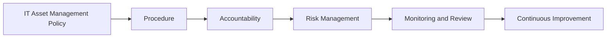

# IT Asset Management Governance

> 🎥 [Search YouTube for "IT Asset Management Governance"](https://www.youtube.com/results?search_query=IT%20Asset%20Management%20Governance%20IT%20Asset%20Management%20Fundamentals%20tutorial)

## IT Asset Management Governance

Effective IT asset management requires a well-defined governance structure to ensure that assets are managed in a way that aligns with the organization's overall goals and objectives. Governance in IT asset management refers to the policies, procedures, and controls that are put in place to manage the acquisition, deployment, maintenance, and disposal of IT assets.

### Importance of Governance in IT Asset Management

Governance in IT asset management is crucial for several reasons:

*   Ensures alignment with organizational goals and objectives
*   Provides a framework for decision-making and accountability
*   Helps to mitigate risks and ensure compliance with regulatory requirements
*   Facilitates effective communication and collaboration among stakeholders

### Key Components of IT Asset Management Governance

The following are key components of IT asset management governance:

*   **Policy**: A clear and concise document that outlines the organization's IT asset management policies and procedures
*   **Procedure**: A detailed guide that outlines the steps to be followed in implementing the IT asset management policy
*   **Accountability**: Clear lines of authority and responsibility for IT asset management decisions and actions
*   **Risk Management**: Processes and procedures in place to identify, assess, and mitigate risks associated with IT assets

### IT Asset Management Governance Structure

The following is a high-level overview of the IT asset management governance structure:



### Best Practices for IT Asset Management Governance

The following are best practices for IT asset management governance:

*   **Establish clear roles and responsibilities**: Clearly define the roles and responsibilities of IT asset management stakeholders
*   **Develop a comprehensive policy**: Develop a comprehensive IT asset management policy that outlines the organization's goals, objectives, and procedures
*   **Implement a risk management framework**: Implement a risk management framework that identifies, assesses, and mitigates risks associated with IT assets
*   **Monitor and review**: Regularly monitor and review IT asset management activities to ensure that they are aligned with the organization's goals and objectives


### Summary

Effective IT asset management governance is crucial for ensuring that IT assets are managed in a way that aligns with the organization's overall goals and objectives. By establishing clear roles and responsibilities, developing a comprehensive policy, implementing a risk management framework, and monitoring and reviewing IT asset management activities, organizations can ensure that their IT assets are managed in a way that supports the organization's overall success.

### Example Code

The following is an example code for a simple IT asset management policy:

```bash
# IT Asset Management Policy

# Purpose
The purpose of this policy is to establish guidelines for the management of IT assets within the organization.

# Scope
This policy applies to all IT assets owned or managed by the organization.

# Roles and Responsibilities
*   The IT Asset Manager is responsible for the development and maintenance of this policy.
*   The IT Asset Manager is responsible for ensuring that all IT assets are properly managed and maintained.
*   The IT Asset Manager is responsible for identifying and mitigating risks associated with IT assets.

# Procedure
1.  The IT Asset Manager will develop and maintain a comprehensive inventory of all IT assets.
2.  The IT Asset Manager will ensure that all IT assets are properly managed and maintained.
3.  The IT Asset Manager will identify and mitigate risks associated with IT assets.

# Monitoring and Review
The IT Asset Manager will regularly monitor and review IT asset management activities to ensure that they are aligned with the organization's goals and objectives.

# Continuous Improvement
The IT Asset Manager will continuously review and improve the IT asset management policy and procedures to ensure that they are effective and efficient.
