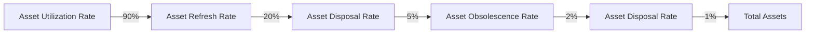

# IT Asset Management Metrics and Reporting

> 🎥 [Search YouTube for "IT Asset Management Metrics and Reporting"](https://www.youtube.com/results?search_query=IT%20Asset%20Management%20Metrics%20and%20Reporting%20IT%20Asset%20Management%20Fundamentals%20tutorial)

## IT Asset Management Metrics and Reporting

In IT asset management, metrics and reporting are crucial components of a comprehensive IT asset management policy and governance framework. Metrics provide a quantitative measure of the performance and effectiveness of IT asset management processes, while reporting enables stakeholders to make informed decisions based on data-driven insights.

### Why Metrics Matter

Metrics are essential in IT asset management as they:

*   Provide a baseline for measuring progress and performance
*   Identify areas for improvement and optimization
*   Facilitate data-driven decision-making
*   Enable benchmarking against industry standards and best practices

Some key metrics in IT asset management include:

*   **Asset Utilization Rate**: The percentage of assets in use compared to the total number of assets
*   **Asset Obsolescence Rate**: The rate at which assets become outdated or obsolete
*   **Asset Disposal Rate**: The rate at which assets are disposed of or retired
*   **Asset Refresh Rate**: The rate at which assets are replaced or upgraded

### Types of Metrics

There are two primary types of metrics in IT asset management:

*   **Leading Metrics**: Indicators of future performance, such as asset utilization rate or asset refresh rate
*   **Lagging Metrics**: Indicators of past performance, such as asset obsolescence rate or asset disposal rate

### Reporting and Communication

Effective reporting and communication are critical in IT asset management. This includes:

*   **Regular Reporting**: Scheduling regular reports to stakeholders, such as quarterly or annually
*   **Ad-hoc Reporting**: Providing reports on an as-needed basis, such as for audits or compliance
*   **Visualization**: Using visual aids, such as charts and graphs, to communicate complex data

### Example Use Case: IT Asset Management Dashboard

Here is an example of an IT asset management dashboard that incorporates metrics and reporting:



This dashboard provides a visual representation of key metrics, including asset utilization rate, asset refresh rate, asset disposal rate, and asset obsolescence rate. It also includes a visualization of the total assets, providing a clear picture of the overall IT asset landscape.

### Conclusion

Metrics and reporting are essential components of a comprehensive IT asset management policy and governance framework. By understanding and applying these concepts, organizations can make informed decisions, optimize their IT asset management processes, and improve overall performance.

### Image: IT Asset Management Dashboard


### Code: Example Report Script

```sql
-- Get asset utilization rate
SELECT 
  AVG(assets_in_use) / AVG(total_assets) AS asset_utilization_rate
FROM 
  it_asset_management;

-- Get asset refresh rate
SELECT 
  COUNT(asset_refresh) / COUNT(total_assets) AS asset_refresh_rate
FROM 
  it_asset_management;

-- Get asset disposal rate
SELECT 
  COUNT(asset_disposal) / COUNT(total_assets) AS asset_disposal_rate
FROM 
  it_asset_management;
