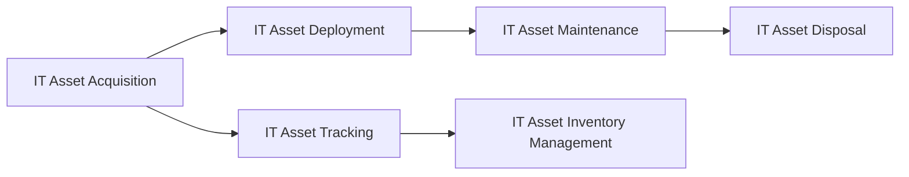

# IT Asset Management Best Practices

> 🎥 [Search YouTube for "IT Asset Management Best Practices"](https://www.youtube.com/results?search_query=IT%20Asset%20Management%20Best%20Practices%20IT%20Asset%20Management%20Fundamentals%20tutorial)

### IT Asset Management Best Practices

Implementing IT asset management (ITAM) requires a structured approach to ensure the effective management of IT assets throughout their lifecycle. A well-defined ITAM policy and governance framework are essential to establish a culture of accountability and responsibility within the organization. In this lesson, we will discuss the best practices for implementing ITAM.

#### Establish a Clear ITAM Policy

A clear ITAM policy outlines the organization's goals, objectives, and scope of ITAM. It should define the roles and responsibilities of ITAM stakeholders, including IT, finance, and procurement teams. The policy should also establish the procedures for IT asset acquisition, deployment, maintenance, and disposal.

**Key Elements of an ITAM Policy:**

* Scope of ITAM
* Roles and responsibilities
* IT asset classification and categorization
* Acquisition and deployment procedures
* Maintenance and support procedures
* Disposal and retirement procedures

#### Implement a Governance Framework

A governance framework provides the structure and oversight necessary to ensure the effective implementation of ITAM. It should include:

* **ITAM Steering Committee:** A committee responsible for overseeing the ITAM program and making strategic decisions.
* **ITAM Working Group:** A team responsible for implementing and maintaining the ITAM processes and procedures.
* **ITAM Metrics and Reporting:** Regular reporting and metrics to measure the effectiveness of ITAM.

#### Implement IT Asset Tracking and Inventory Management

Accurate tracking and inventory management are critical to ITAM. This includes:

* **Barcode Scanning:** Using barcode scanning technology to track IT assets.
* **Asset Tagging:** Assigning unique identifiers to IT assets.
* **Inventory Management Software:** Using software to manage IT asset inventory.



#### Implement IT Asset Maintenance and Support

Regular maintenance and support are essential to ensure the optimal performance and security of IT assets. This includes:

* **Regular Software Updates:** Keeping software up-to-date with the latest security patches and updates.
* **Hardware Maintenance:** Performing regular hardware maintenance, including cleaning and replacing parts.
* **IT Asset Support:** Providing support for IT assets, including troubleshooting and repair.

[](https://en.wikipedia.org/wiki/IT_asset_management)

#### Implement IT Asset Disposal and Retirement

Proper disposal and retirement of IT assets are critical to ensure data security and compliance with regulatory requirements. This includes:

* **Data Erasure:** Erasing data from IT assets before disposal.
* **Asset Disposal:** Disposing of IT assets in a secure and environmentally responsible manner.
* **Asset Retirement:** Retiring IT assets from inventory and updating records.

```bash
# Example of IT asset disposal script
#!/bin/bash

# Erase data from IT asset
dd if=/dev/zero of=/dev/sdX bs=4096 count=1

# Dispose of IT asset
rm /dev/sdX
```

By following these best practices, organizations can establish a robust ITAM program that ensures the effective management of IT assets throughout their lifecycle.
