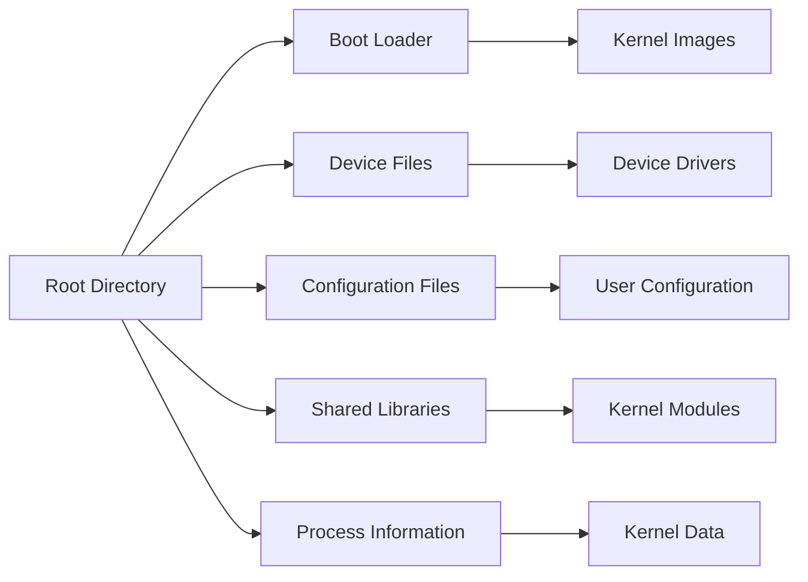

# Linux File System Hierarchy

> 🎥 [Search YouTube for "Linux File System Hierarchy"](https://www.youtube.com/results?search_query=Linux%20File%20System%20Hierarchy%20Linux%20Fundamentals%20tutorial)

### Linux File System Hierarchy

The Linux file system hierarchy is a tree-like structure that organizes files and directories in a logical and consistent manner. Understanding the hierarchy is essential for navigating and managing files on a Linux system.

#### Introduction to the File System Hierarchy

The Linux file system hierarchy is based on the Filesystem Hierarchy Standard (FHS), which defines the structure and organization of files and directories on a Linux system. The hierarchy is divided into several main categories, including:

* **Root directory**: The top-most directory in the hierarchy, represented by the forward slash `/`.
* **System directories**: Directories that contain system-wide configuration files, libraries, and executables.
* **User directories**: Directories that contain user-specific files and settings.

#### System Directories

The system directories are located at the top of the hierarchy and contain system-wide configuration files, libraries, and executables. Some key system directories include:

* `/bin`: Essential command-line utilities and executables.
* `/boot`: Boot loader configuration files and kernel images.
* `/dev`: Device files for hardware components.
* `/etc`: System-wide configuration files.
* `/lib`: Shared libraries and kernel modules.
* `/proc`: Process information and kernel data.
* `/sys`: System information and kernel data.



#### User Directories

User directories are located under the `/home` directory and contain user-specific files and settings. Each user has their own directory, which is typically named after the user's username. Some key user directories include:

* `/home`: User home directories.
* `/home/<username>`: User-specific files and settings.
* `/home/<username>/Documents`: User documents and files.
* `/home/<username>/Pictures`: User pictures and images.


```bash
# List the contents of the root directory
ls /

# List the contents of the /home directory
ls /home

# List the contents of a user's home directory
ls /home/<username>
```

By understanding the Linux file system hierarchy, you can navigate and manage files on a Linux system with ease. This knowledge is essential for any Linux user or administrator.
