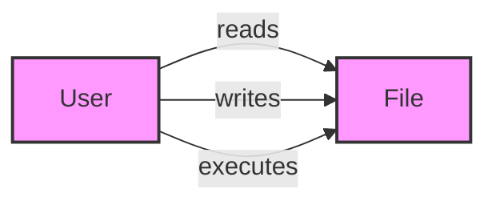

# Navigation and File Management

> 🎥 [Search YouTube for "Navigation and File Management"](https://www.youtube.com/results?search_query=Navigation%20and%20File%20Management%20Linux%20Fundamentals%20tutorial)

Navigation and File Management
=============================

Linux file system navigation is a crucial skill for any Linux user. Understanding how to navigate and manage files is essential for performing tasks such as creating, editing, and deleting files and directories. In this lesson, we will cover the basic navigation and file management commands.

### Understanding the File System Hierarchy

The Linux file system hierarchy is a tree-like structure that starts from the root directory `/`. The root directory contains several important directories, including `/bin`, `/boot`, `/dev`, `/etc`, `/home`, `/lib`, `/media`, `/mnt`, `/opt`, `/proc`, `/root`, `/run`, `/sbin`, `/srv`, `/sys`, `/tmp`, `/usr`, and `/var`.

### Navigation Commands

Navigation commands are used to move around the file system. Here are some common navigation commands:

*   `cd` (change directory): Changes the current working directory.
*   `pwd` (print working directory): Displays the current working directory.
*   `ls` (list): Lists the files and directories in the current working directory.
*   `mkdir` (make directory): Creates a new directory.
*   `rmdir` (remove directory): Removes an empty directory.

### File Management Commands

File management commands are used to create, edit, and delete files and directories. Here are some common file management commands:

*   `touch`: Creates a new empty file.
*   `cp` (copy): Copies a file or directory.
*   `mv` (move): Moves or renames a file or directory.
*   `rm` (remove): Deletes a file or directory.

### File Permissions

File permissions determine who can read, write, or execute a file. There are three types of permissions:

*   **Read** (`r`): Allows the owner, group, or others to read the file.
*   **Write** (`w`): Allows the owner, group, or others to write to the file.
*   **Execute** (`x`): Allows the owner, group, or others to execute the file.



### Example Use Cases

Here are some example use cases for navigation and file management commands:

*   Create a new directory called `mydir` in the current working directory: `mkdir mydir`
*   List the files and directories in the `mydir` directory: `ls mydir`
*   Copy a file called `example.txt` to the `mydir` directory: `cp example.txt mydir`
*   Remove the `mydir` directory: `rmdir mydir`


```bash
# Create a new directory called mydir
mkdir mydir

# List the files and directories in the mydir directory
ls mydir

# Copy a file called example.txt to the mydir directory
cp example.txt mydir

# Remove the mydir directory
rmdir mydir
```

This lesson has covered the basic navigation and file management commands in Linux. Understanding these commands is essential for performing tasks such as creating, editing, and deleting files and directories.
