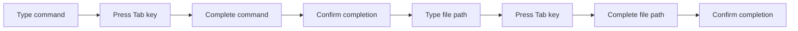

# Command-Line History and Completion

> 🎥 [Search YouTube for "Command-Line History and Completion"](https://www.youtube.com/results?search_query=Command-Line%20History%20and%20Completion%20Linux%20Fundamentals%20tutorial)

**Command-Line History and Completion**
=====================================

Linux provides several features to make your command-line experience more efficient and productive. One of these features is the command-line history, which allows you to recall and re-execute previous commands. Another feature is command-line completion, which helps you complete commands and file paths quickly. In this lesson, we'll explore both of these features in detail.

### Command-Line History

The command-line history is a record of all the commands you've entered in your current terminal session. You can access the command-line history using the **up arrow** key. Each time you press the up arrow key, you'll move up one command in the history. You can also use the **down arrow** key to move down one command.

#### Viewing the Command-Line History

To view the entire command-line history, you can use the `history` command. Here's an example:
```bash
$ history
```
This will display a list of all the commands you've entered in the current terminal session.

#### Searching the Command-Line History

You can search for a specific command in the history using the `history` command with the `-n` option. For example:
```bash
$ history -n <search_term>
```
Replace `<search_term>` with the keyword or phrase you want to search for.

### Command-Line Completion

Command-line completion is a feature that helps you complete commands and file paths quickly. There are two types of completion:

* **Command completion**: completes the command you're typing
* **File completion**: completes the file path you're typing

#### Enabling Command Completion

To enable command completion, you need to press the **Tab** key. When you press the Tab key, the terminal will attempt to complete the command or file path you're typing.

#### Using Command Completion

Here's an example of using command completion:
```bash
$ ls /usr/bin/<tab>
```
Pressing the Tab key will complete the file path `/usr/bin/` with the first matching file or directory.

### Mermaid Diagram: Command-Line Completion Flow



### Tips and Tricks

* Use the **up arrow** key to recall previous commands
* Use the **down arrow** key to move down one command
* Use the `history` command to view the entire command-line history
* Use the `history -n` command to search for a specific command in the history
* Press the **Tab** key to enable command completion
* Use the **Tab** key to complete commands and file paths


This diagram illustrates the flow of command-line completion. When you type a command and press the Tab key, the terminal attempts to complete the command or file path. If a match is found, the terminal will display the completed command or file path.
