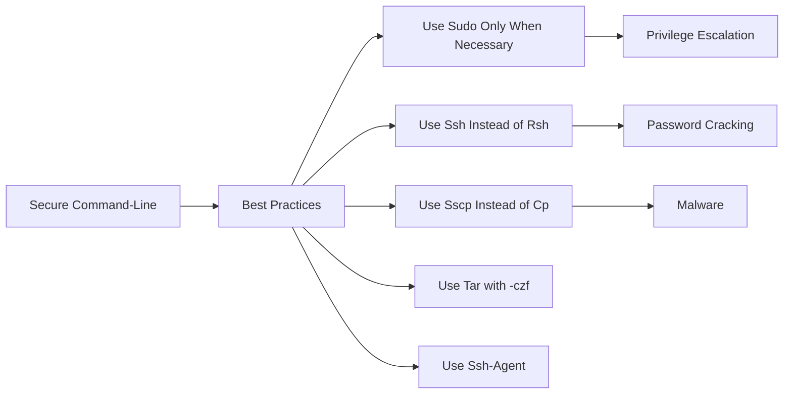

# Linux Command-Line Security

> 🎥 [Search YouTube for "Linux Command-Line Security"](https://www.youtube.com/results?search_query=Linux%20Command-Line%20Security%20Linux%20Fundamentals%20tutorial)

# Linux Command-Line Security

Command-line security is a crucial aspect of Linux system administration. It involves understanding how to use Linux commands securely, protecting your system from unauthorized access, and maintaining the integrity of your data. In this lesson, we will cover the basics of command-line security, including best practices, secure command usage, and common security threats.

## Understanding Command-Line Security

**Command-line security** refers to the measures taken to prevent unauthorized access to a Linux system through the command line. This includes using secure commands, protecting sensitive data, and following best practices to maintain system integrity.

### Best Practices for Command-Line Security

Here are some best practices to follow for command-line security:

*   Use **sudo** (superuser do) only when necessary to avoid giving unnecessary permissions.
*   Use **ssh** (secure shell) for remote connections instead of **rsh** (remote shell).
*   Use **scp** (secure copy) for secure file transfers instead of **cp** (copy).
*   Use **tar** (tape archive) with **-czf** (compress and archive) to create secure archives.
*   Use **ssh-agent** to store and manage secure shell connections.

### Secure Command Usage

Here are some secure command usage examples:

*   Use **ssh-keygen** to generate secure SSH keys.
*   Use **ssh-copy-id** to securely copy your SSH key to a remote server.
*   Use **ssh-agent** to securely store and manage SSH connections.

### Common Security Threats

Here are some common security threats to be aware of:

*   **Privilege escalation**: Using **sudo** to gain elevated privileges.
*   **Password cracking**: Using **crack** or **john** to crack passwords.
*   **Malware**: Using **malware** to gain unauthorized access.

### Secure Command-Line Architecture



## Conclusion

Command-line security is a critical aspect of Linux system administration. By following best practices, using secure commands, and being aware of common security threats, you can protect your system from unauthorized access and maintain the integrity of your data.

### Example Use Case

Here's an example use case for secure command-line usage:

```bash
# Generate secure SSH keys
ssh-keygen -t rsa -b 4096 -C "your_email@example.com"

# Securely copy your SSH key to a remote server
ssh-copy-id user@remote-server

# Securely store and manage SSH connections
ssh-agent
```

### Image

[Secure Command-Line Architecture](https://upload.wikimedia.org/wikipedia/commons/thumb/4/41/Secure_Command-Line_Architecture.svg/800px-Secure_Command-Line_Architecture.svg.png)

### References

*   [Linux Command-Line Security](https://www.linuxsecurity.com/)
*   [Secure Command-Line Usage](https://www.openssh.com/)
*   [Common Security Threats](https://www.cisa.gov/)
