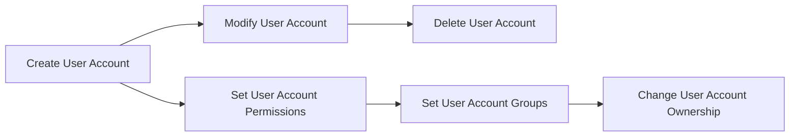

# User Account Management

> 🎥 [Search YouTube for "User Account Management"](https://www.youtube.com/results?search_query=User%20Account%20Management%20Linux%20Fundamentals%20tutorial)

## User Account Management

User account management is a crucial aspect of Linux system administration. It involves creating, modifying, and deleting user accounts to ensure that users have the necessary permissions to perform their tasks. In this lesson, we will cover the basics of user account management in Linux.

### Creating a New User Account

To create a new user account, you can use the `useradd` command. The basic syntax is as follows:
```bash
useradd -m <username>
```
The `-m` option tells `useradd` to create the user's home directory. You can also specify additional options, such as the user's real and login names, and their primary group.

### Modifying a User Account

To modify a user account, you can use the `usermod` command. The basic syntax is as follows:
```bash
usermod -c "New Comment" <username>
```
The `-c` option allows you to change the user's comment field. You can also specify other options, such as the user's real and login names, and their primary group.

### Deleting a User Account

To delete a user account, you can use the `userdel` command. The basic syntax is as follows:
```bash
userdel -r <username>
```
The `-r` option tells `userdel` to delete the user's home directory and all files in it.

### User Account Permissions

User account permissions determine what actions a user can perform on a Linux system. The three main types of permissions are:

* **Read** (r): allows a user to view files and directories
* **Write** (w): allows a user to modify files and directories
* **Execute** (x): allows a user to run programs and execute files

### User Account Groups

User account groups are used to organize users and assign permissions to groups rather than individual users. The `groupadd` command is used to create a new group, and the `groupmod` command is used to modify an existing group.

### User Account Ownership

User account ownership determines who owns a file or directory. The `chown` command is used to change the ownership of a file or directory.

### Mermaid Diagram: User Account Management Flowchart



### Illustrative Image: User Account Management


In this image, you can see the different components of user account management, including user accounts, groups, and permissions.

### Additional Resources

* [Linux User Account Management](https://www.linux.org/docs/man-pages/man8/useradd.html)
* [Linux Group Management](https://www.linux.org/docs/man-pages/man8/groupadd.html)
* [Linux File System Permissions](https://www.linux.org/docs/man-pages/man8/chown.html)
