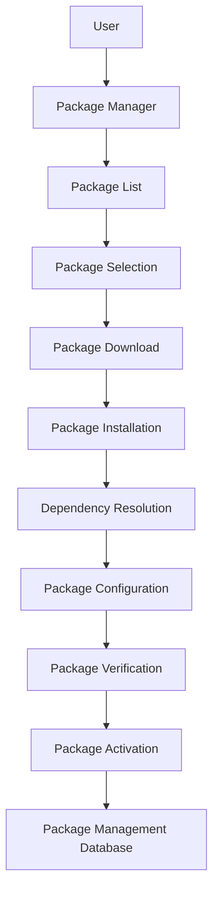

# Package Management Introduction

> 🎥 [Search YouTube for "Package Management Introduction"](https://www.youtube.com/results?search_query=Package%20Management%20Introduction%20Linux%20Fundamentals%20tutorial)

**Package Management Introduction**
=====================================

In Linux, package management is the process of installing, updating, and removing software packages. This module will introduce you to the concept of package management and its importance in the Linux ecosystem.

**Why Package Management Matters**
--------------------------------

**Package management** is crucial in Linux because it allows you to:

* Easily install and remove software packages without manually compiling and linking code
* Keep your system up-to-date with the latest security patches and bug fixes
* Manage dependencies between packages, ensuring that all required libraries and frameworks are installed correctly
* Reproduce a consistent environment for development, testing, and deployment

**Types of Package Management Systems**
----------------------------------------

There are two primary types of package management systems:

* **RPM (Red Hat Package Manager)**: used by Red Hat and other distributions
* **DEB (Debian Package Format)**: used by Debian and other distributions

### Mermaid Diagram: Package Management Flow



This flowchart illustrates the steps involved in package management, from user input to package activation.

**Key Terms**
--------------

* **Package**: a collection of software files and metadata
* **Dependency**: a required library or framework for a package to function correctly
* **Repository**: a centralized location for package storage and distribution
* **Package Manager**: a tool that automates package installation, removal, and updating

### Image: Package Management in Action


This image shows the **pacman** package manager in action, which is used by Arch Linux and other distributions.

**Package Management Tools**
---------------------------

Some popular package management tools include:

* **apt** (Debian-based distributions)
* **yum** (RPM-based distributions)
* **pip** (Python package manager)
* **npm** (Node.js package manager)

These tools provide a user-friendly interface for managing packages and dependencies.

### Fenced Code Block: Package Installation

```bash
# Install a package using apt
sudo apt install <package_name>
```

This code block shows an example of installing a package using **apt**.
