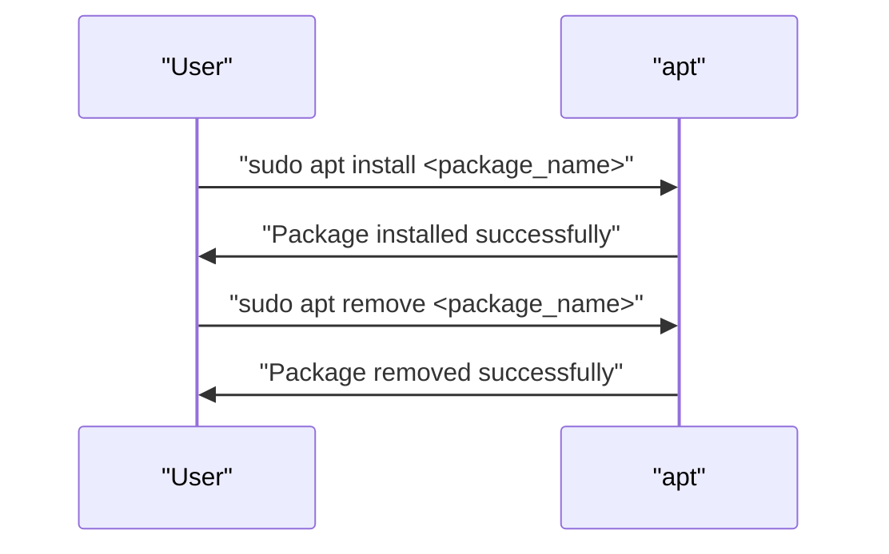

# Package Installation and Removal

> 🎥 [Search YouTube for "Package Installation and Removal"](https://www.youtube.com/results?search_query=Package%20Installation%20and%20Removal%20Linux%20Fundamentals%20tutorial)

## Package Installation and Removal
### Introduction
In the previous module, we discussed how to update the package index and upgrade installed packages. In this lesson, we will explore how to install and remove packages on a Linux system.

### Package Installation
To install a package, you can use the `apt` package manager. Here are the general steps:

*   **Identify the package**: Determine the name of the package you want to install. You can use the `apt search` command to search for packages.
*   **Install the package**: Use the `apt install` command to install the package. For example:
    ```bash
    sudo apt install <package_name>
    ```
*   **Verify the installation**: After installation, you can verify that the package is installed by checking its version or using the `dpkg -l` command.

### Package Removal
To remove a package, you can use the `apt` package manager. Here are the general steps:

*   **Identify the package**: Determine the name of the package you want to remove.
*   **Remove the package**: Use the `apt remove` command to remove the package. For example:
    ```bash
    sudo apt remove <package_name>
    ```
*   **Remove configuration files**: If you want to remove the configuration files of the package, use the `apt purge` command. For example:
    ```bash
    sudo apt purge <package_name>
    ```
*   **Verify the removal**: After removal, you can verify that the package is removed by checking its version or using the `dpkg -l` command.

### Package Dependencies
When installing a package, you may encounter dependencies. Here are some common scenarios:

*   **Required dependencies**: Some packages require other packages to be installed before they can be installed. In this case, the `apt` package manager will automatically install the required dependencies.
*   **Optional dependencies**: Some packages can be installed with optional dependencies. In this case, you can choose to install or not install the optional dependencies.

### Mermaid Diagram


### Illustrative Image


In this image, you can see the `apt` package manager in action, installing and removing packages.

### Conclusion
In this lesson, we learned how to install and remove packages on a Linux system using the `apt` package manager. We also discussed package dependencies and how to handle them. With this knowledge, you can now manage packages on your Linux system with ease.
