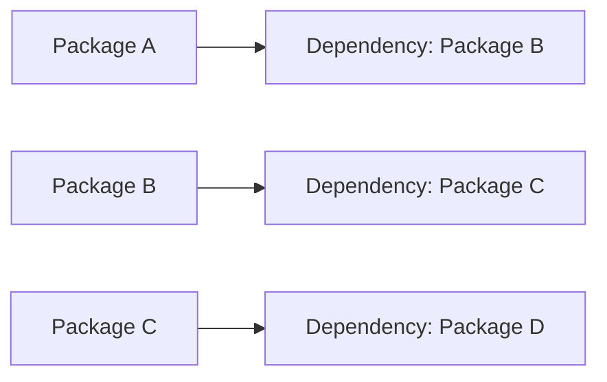

# Package Dependencies and Conflicts

> 🎥 [Search YouTube for "Package Dependencies and Conflicts"](https://www.youtube.com/results?search_query=Package%20Dependencies%20and%20Conflicts%20Linux%20Fundamentals%20tutorial)

## Package Dependencies and Conflicts
Linux package management is a crucial aspect of maintaining and updating your system. In this lesson, we'll explore package dependencies and conflicts, which are essential concepts to understand when working with packages.

### What are Package Dependencies?
**Dependencies** are the relationships between packages that are required for a package to function correctly. A package may depend on other packages to provide a specific functionality or to ensure compatibility. For example, a package may require a certain version of a library to work properly.

### What are Package Conflicts?
**Conflicts** occur when two or more packages have different versions of the same package, causing incompatibilities. This can lead to issues during package installation, updates, or removals.

### Understanding Package Dependencies
To illustrate the concept of package dependencies, let's consider a simple example:

In this example, Package A depends on Package B, which in turn depends on Package C, and so on. This creates a dependency chain that helps us understand how packages are related.

### Managing Package Dependencies
When installing packages, you may encounter conflicts due to different versions of the same package. To resolve these conflicts, you can use tools like `apt` (Advanced Package Tool) or `yum` (Yellowdog Updater, Modified) to manage package dependencies.

### Example: Resolving Package Conflicts
Suppose you're trying to install a package called `package-x` but encounter a conflict with an existing package `package-y`. You can use the following command to resolve the conflict:
```bash
sudo apt install package-x --ignore-depends package-y
```
This command tells `apt` to ignore the dependency conflict and install `package-x` despite the conflict with `package-y`.

### Conclusion
Package dependencies and conflicts are essential concepts to understand when working with packages in Linux. By understanding how packages are related and how to manage dependencies, you can ensure smooth package installation, updates, and removals.

### Image: Package Dependencies


In this image, we see a simple representation of package dependencies, where Package A depends on Package B, which in turn depends on Package C, and so on.

### Further Reading
For more information on package dependencies and conflicts, refer to the official documentation for your Linux distribution, such as [Ubuntu's package management documentation](https://wiki.ubuntu.com/PackageManager).
