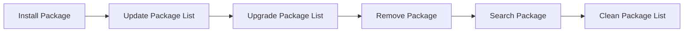

# Package Management Best Practices

> 🎥 [Search YouTube for "Package Management Best Practices"](https://www.youtube.com/results?search_query=Package%20Management%20Best%20Practices%20Linux%20Fundamentals%20tutorial)

# Package Management Best Practices

Package management is a crucial aspect of maintaining a Linux system. It involves installing, updating, and removing software packages to ensure the system remains secure, stable, and up-to-date. In this lesson, we will explore best practices for package management, highlighting key concepts, and providing guidance on how to effectively manage packages on your Linux system.

## Understanding Package Management

**Package management** refers to the process of installing, updating, and removing software packages. A **package** is a collection of files and dependencies that make up a software application. Package management systems, such as **APT** (Advanced Package Tool) for Debian-based systems and **YUM** (Yellowdog Updater, Modified) for RPM-based systems, manage packages and their dependencies.

## Best Practices for Package Management

### 1. Keep Your System Up-to-Date

*   Regularly update your system to ensure you have the latest security patches and bug fixes.
*   Use the package manager's update command, such as `apt-get update` or `yum update`.

### 2. Use the Package Manager's Install Command

*   Instead of manually installing software, use the package manager's install command, such as `apt-get install` or `yum install`.
*   This ensures that the package and its dependencies are installed correctly.

### 3. Be Cautious with Package Removal

*   Be careful when removing packages, as this can also remove dependent packages.
*   Use the package manager's remove command, such as `apt-get remove` or `yum remove`, with caution.

### 4. Use the Package Manager's Search Command

*   Use the package manager's search command, such as `apt-cache search` or `yum search`, to find packages and their descriptions.
*   This helps you make informed decisions when installing software.

### 5. Keep Your Package Lists Clean

*   Regularly clean your package lists to remove unnecessary packages and dependencies.
*   Use the package manager's clean command, such as `apt-get clean` or `yum clean`.

### 6. Use a Package Manager's Upgrade Command

*   Use the package manager's upgrade command, such as `apt-get upgrade` or `yum upgrade`, to update packages and their dependencies.

## Package Management Flow

## Package Management Tools

*   **APT** (Advanced Package Tool): The package manager for Debian-based systems.
*   **YUM** (Yellowdog Updater, Modified): The package manager for RPM-based systems.

## Illustrative Image

## Example Use Cases

*   Installing a package: `apt-get install package_name`
*   Updating the package list: `apt-get update`
*   Upgrading the package list: `apt-get upgrade`

## Conclusion

Effective package management is crucial for maintaining a secure and stable Linux system. By following these best practices, you can ensure that your system remains up-to-date and secure. Remember to use the package manager's commands and tools to install, update, and remove packages, and to keep your package lists clean.
