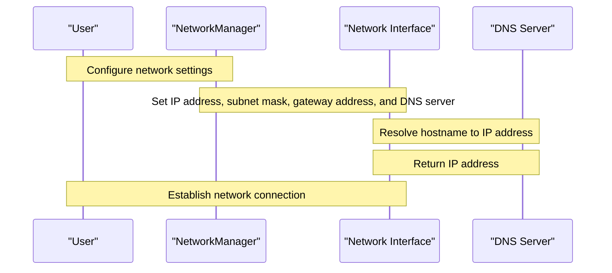

# Network Configuration

> 🎥 [Search YouTube for "Network Configuration"](https://www.youtube.com/results?search_query=Network%20Configuration%20Linux%20Fundamentals%20tutorial)

### Network Configuration

Network configuration is a crucial aspect of Linux system administration. It involves setting up the network settings, such as IP addresses, subnet masks, gateway addresses, and DNS servers, to enable communication between devices on a network. In this lesson, we will cover the basics of network configuration in Linux.

#### Understanding Network Terminology

Before diving into network configuration, it's essential to understand some key terms:

* **IP Address**: A unique address assigned to a device on a network.
* **Subnet Mask**: A 32-bit number that determines the network and host parts of an IP address.
* **Gateway Address**: The IP address of the router that connects a network to the internet.
* **DNS Server**: A server that translates domain names to IP addresses.

#### Configuring Network Settings

To configure network settings in Linux, you can use the `nmcli` command or edit the network configuration files directly. Here's an example of how to configure a network interface using `nmcli`:

```bash
nmcli con add type ethernet con-name eth0 ifname eth0 ip4 192.168.1.100/24 gw4 192.168.1.1 dns4 8.8.8.8
```

This command adds a new Ethernet connection with the name `eth0`, IP address `192.168.1.100`, subnet mask `255.255.255.0`, gateway address `192.168.1.1`, and DNS server `8.8.8.8`.

Alternatively, you can edit the network configuration files directly. For example, to configure the `eth0` interface, you can edit the `/etc/network/interfaces` file:

```bash
sudo nano /etc/network/interfaces
```

Add the following lines to the file:

```bash
auto eth0
iface eth0 inet static
  address 192.168.1.100
  netmask 255.255.255.0
  gateway 192.168.1.1
  dns-nameservers 8.8.8.8
```

Save and close the file, then restart the network service:

```bash
sudo service networking restart
```

#### Network Configuration Files

Linux stores network configuration information in several files, including:

* `/etc/network/interfaces`: This file contains the network configuration for each interface.
* `/etc/hosts`: This file contains the mapping of hostnames to IP addresses.
* `/etc/resolv.conf`: This file contains the DNS server configuration.

Here's a Mermaid diagram illustrating the network configuration process:


#### Conclusion

In this lesson, we covered the basics of network configuration in Linux, including understanding network terminology, configuring network settings, and working with network configuration files. By following these steps, you can configure your Linux system to communicate with other devices on a network.


Note: This diagram illustrates a simple network topology with a router, a DNS server, and several client devices.
