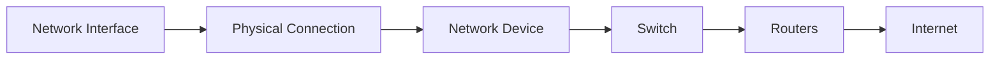

# Network Interfaces and Devices

> 🎥 [Search YouTube for "Network Interfaces and Devices"](https://www.youtube.com/results?search_query=Network%20Interfaces%20and%20Devices%20Linux%20Fundamentals%20tutorial)

**Linux Networking Fundamentals**
==========================

**Network Interfaces and Devices**
=============================

Linux networking is built around the concept of network interfaces and devices. Understanding these fundamental components is crucial for configuring and managing network connections.

**What are Network Interfaces?**
-----------------------------

A network interface is a physical or virtual connection point between a computer and a network. It allows data to be transmitted and received between the system and the network. Common types of network interfaces include:

* Ethernet (e.g., Ethernet cards, Wi-Fi adapters)
* Wi-Fi (wireless)
* InfiniBand (high-speed interconnect)
* Token Ring (legacy)

**Types of Network Interfaces**
-----------------------------

Network interfaces can be categorized into two main types:

* **Physical interfaces**: These are physical connections to a network, such as an Ethernet cable or a Wi-Fi adapter.
* **Virtual interfaces**: These are logical connections created by software, such as a virtual network interface (VNI) or a virtual Ethernet interface.

**Network Devices**
------------------

A network device is a hardware component that enables data transmission and reception. Common network devices include:

* **Network Interface Cards (NICs)**: These are hardware components that connect a computer to a network.
* **Switches**: These are devices that connect multiple computers together, allowing data to be transmitted between them.
* **Routers**: These are devices that connect multiple networks together, allowing data to be transmitted between them.

**Network Interface Configuration**
---------------------------------

To configure a network interface, you need to specify the following:

* **IP address**: The unique address assigned to the interface.
* **Subnet mask**: The number of bits that distinguish one IP network from another.
* **Gateway**: The IP address of the router that connects the network to the internet.

```bash
# Configure the eth0 interface
sudo ifconfig eth0 up
sudo ip addr add 192.168.1.100/24 dev eth0
sudo ip route add default via 192.168.1.1 dev eth0
```

**Network Interface States**
---------------------------

A network interface can be in one of the following states:

* **Up**: The interface is active and transmitting data.
* **Down**: The interface is inactive and not transmitting data.
* **Link down**: The physical link to the network is down.

**Network Interface Metrics**
---------------------------

Network interface metrics provide information about the interface's performance. Common metrics include:

* **RX bytes**: The number of bytes received by the interface.
* **TX bytes**: The number of bytes transmitted by the interface.
* **RX packets**: The number of packets received by the interface.
* **TX packets**: The number of packets transmitted by the interface.

```bash
# Display network interface metrics
sudo ethtool -S eth0
```

**Mermaid Diagram**
-------------------



This diagram illustrates the flow of data from a network interface to the internet through a switch and router.

**Conclusion**
----------

Understanding network interfaces and devices is crucial for configuring and managing network connections. By knowing the different types of network interfaces and devices, you can troubleshoot and optimize network performance.
