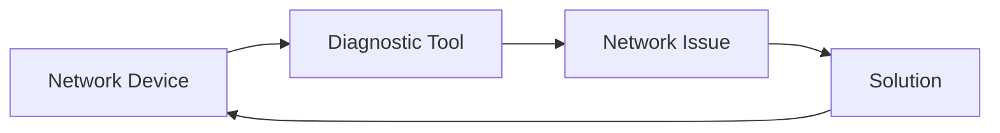

# Network Troubleshooting

> 🎥 [Search YouTube for "Network Troubleshooting"](https://www.youtube.com/results?search_query=Network%20Troubleshooting%20Linux%20Fundamentals%20tutorial)

**Network Troubleshooting**
=========================

Network troubleshooting is an essential skill for any Linux administrator. It involves identifying and resolving issues that prevent devices from communicating with each other. In this lesson, we will cover the basics of network troubleshooting, including common tools and techniques.

### Common Network Issues

Network issues can be categorized into several types, including:

* **Connectivity issues**: Problems with establishing or maintaining a network connection.
* **Performance issues**: Slow data transfer rates or high latency.
* **Security issues**: Unauthorized access or data breaches.
* **Configuration issues**: Problems with network settings or protocols.

### Troubleshooting Steps

When troubleshooting a network issue, follow these steps:

1. **Gather information**: Collect data about the issue, including error messages, logs, and network settings.
2. **Isolate the problem**: Identify the specific network component or protocol that is causing the issue.
3. **Use diagnostic tools**: Utilize tools like `ping`, `traceroute`, and `tcpdump` to gather more information about the issue.
4. **Consult documentation**: Refer to network documentation, such as RFCs and vendor manuals, for guidance on resolving the issue.
5. **Implement a solution**: Apply the necessary configuration changes or software updates to resolve the issue.

### Diagnostic Tools

Some common diagnostic tools used in network troubleshooting include:

* **`ping`**: Verifies connectivity between two devices.
* **`traceroute`**: Displays the route taken by packets between two devices.
* **`tcpdump`**: Captures and displays network traffic.



### Example Use Case

Suppose you are experiencing connectivity issues with a remote server. You can use `ping` to verify connectivity and `traceroute` to identify the route taken by packets.

```bash
# Ping the remote server
ping -c 4 remote-server

# Traceroute to the remote server
traceroute remote-server
```

### Image: Network Architecture


This network architecture diagram illustrates the flow of data between devices on a network.

### Conclusion

Network troubleshooting is a critical skill for any Linux administrator. By following the troubleshooting steps and utilizing diagnostic tools, you can identify and resolve network issues. Remember to gather information, isolate the problem, use diagnostic tools, consult documentation, and implement a solution to resolve the issue.
