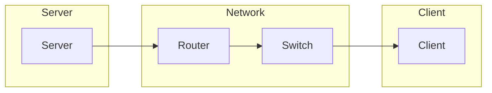

# Network Best Practices

> 🎥 [Search YouTube for "Network Best Practices"](https://www.youtube.com/results?search_query=Network%20Best%20Practices%20Linux%20Fundamentals%20tutorial)

**Linux Networking Fundamentals: Network Best Practices**
=====================================================

As a Linux administrator, understanding network best practices is crucial for maintaining a stable and secure network environment. A well-managed network is essential for efficient data transfer, communication, and overall system performance. In this lesson, we will cover the fundamentals of network best practices, including network configuration, security, and troubleshooting.

### Network Configuration

Proper network configuration is the foundation of a well-managed network. Here are some best practices to keep in mind:

*   **Use a consistent naming convention**: Use a consistent naming convention for network devices, such as using the same prefix for all network interfaces (e.g., `eth0`, `eth1`, etc.).
*   **Configure IP addresses and netmasks**: Ensure that IP addresses and netmasks are correctly configured for each network interface.
*   **Set up DNS and NTP**: Configure DNS and NTP (Network Time Protocol) to ensure accurate timekeeping and domain name resolution.

### Network Security

Network security is a top priority for any organization. Here are some best practices to ensure network security:

*   **Use firewalls**: Configure firewalls to control incoming and outgoing traffic, and to block unauthorized access to sensitive areas of the network.
*   **Enable encryption**: Use encryption protocols such as SSH and HTTPS to secure data in transit.
*   **Use secure protocols**: Use secure protocols such as SFTP and SCP instead of FTP and SCP.

### Network Troubleshooting

Troubleshooting network issues can be challenging, but here are some best practices to make it easier:

*   **Use network monitoring tools**: Use tools such as `netstat` and `tcpdump` to monitor network traffic and identify issues.
*   **Check system logs**: Check system logs for errors and warnings related to network issues.
*   **Use debugging tools**: Use tools such as `strace` and `lsof` to debug network-related issues.

### Network Architecture

A well-designed network architecture is essential for efficient data transfer and communication. Here is a high-level overview of a typical network architecture:



### Network Best Practices in Action

Here is an example of how to configure a network interface using the `ip` command:

```bash
# Configure IP address and netmask for eth0
ip addr add 192.168.1.100/24 dev eth0

# Configure DNS and NTP
echo "nameserver 8.8.8.8" >> /etc/resolv.conf
echo "nameserver 8.8.8.4" >> /etc/resolv.conf
ntpdate -q -s 192.168.1.1
```

Here is an example of how to use `netstat` to monitor network traffic:

```bash
# Display active connections
netstat -an

# Display routing table
netstat -nr
```

### Conclusion

In this lesson, we covered the fundamentals of network best practices, including network configuration, security, and troubleshooting. By following these best practices, you can ensure a stable and secure network environment for efficient data transfer and communication.

[Image: A diagram of a network architecture. Source: Wikimedia Commons](https://upload.wikimedia.org/wikipedia/commons/thumb/5/5e/Network_architecture.svg/800px-Network_architecture.svg.png)
