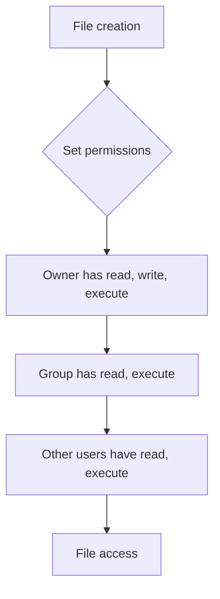

# File and Directory Security

> 🎥 [Search YouTube for "File and Directory Security"](https://www.youtube.com/results?search_query=File%20and%20Directory%20Security%20Linux%20Fundamentals%20tutorial)

# File and Directory Security

Linux provides various mechanisms to control access to files and directories, ensuring that sensitive data remains secure. This lesson explores the key concepts and tools used for file and directory security.

## Access Control Lists (ACLs)

Linux uses Access Control Lists (ACLs) to manage permissions for files and directories. ACLs provide a more fine-grained control over access rights than traditional Unix permissions.

### Setting ACLs

To set ACLs, use the `setfacl` command. For example, to set the ACL for a file named `example.txt`:
```bash
setfacl -m u:username:rwx example.txt
```
This sets the ACL to allow the user `username` to have read (`r`), write (`w`), and execute (`x`) permissions on the file.

### Viewing ACLs

To view the ACLs for a file or directory, use the `getfacl` command. For example:
```bash
getfacl example.txt
```
This will display the ACLs for the file `example.txt`.

## File System Permissions

Linux uses a hierarchical permission system to control access to files and directories. The permission system consists of three types of permissions:

*   **Owner**: The owner of the file or directory has full control over it.
*   **Group**: The group that owns the file or directory has some control over it.
*   **Other**: Everyone else has some control over the file or directory.

### Permission Types

There are three types of permissions:

*   **Read** (`r`): Allows the user to read the file or directory.
*   **Write** (`w`): Allows the user to write to the file or directory.
*   **Execute** (`x`): Allows the user to execute the file or directory as a program.

### Permission Notation

Permissions are represented using a notation that consists of three digits, each representing the permission for the owner, group, and other users, respectively. For example, the permission `755` means:

*   The owner has read (`r`), write (`w`), and execute (`x`) permissions.
*   The group has read (`r`) and execute (`x`) permissions.
*   Other users have read (`r`) and execute (`x`) permissions.

## File and Directory Ownership

Linux uses the concept of ownership to determine who has control over a file or directory. There are two types of ownership:

*   **User ownership**: The user who created the file or directory owns it.
*   **Group ownership**: The group that owns the file or directory has some control over it.

### Changing Ownership

To change the ownership of a file or directory, use the `chown` command. For example:
```bash
chown username:group example.txt
```
This changes the ownership of the file `example.txt` to the user `username` and the group `group`.

## File and Directory Permissions in Practice

Here is a Mermaid diagram showing the flow of file and directory permissions:

This diagram illustrates the flow of permissions for a file. The owner has full control over the file, the group has some control over it, and other users have some control over it.

### Best Practices

Here are some best practices for file and directory security:

*   Use ACLs to manage permissions for sensitive data.
*   Use the `setfacl` command to set ACLs.
*   Use the `getfacl` command to view ACLs.
*   Use the `chown` command to change ownership.
*   Use the `chmod` command to change permissions.

### Example Use Case

Suppose you have a file named `example.txt` that contains sensitive data. You want to allow the user `username` to have read and write permissions on the file, while denying other users access to it. You can use the `setfacl` command to set the ACLs for the file:
```bash
setfacl -m u:username:rwx example.txt
```
This sets the ACLs for the file to allow the user `username` to have read (`r`) and write (`w`) permissions on the file.

### Conclusion

In this lesson, we explored the key concepts and tools used for file and directory security. We learned about Access Control Lists (ACLs), file system permissions, and file and directory ownership. We also discussed best practices for file and directory security and provided an example use case.

### Further Reading

For further reading on file and directory security, refer to the official Linux documentation on [Access Control Lists](https://www.man7.org/linux/man-pages/man2/setfacl.2.html) and [File System Permissions](https://www.man7.org/linux/man-pages/man2/chmod.2.html).

### Image

Here is an illustrative image showing the concept of file and directory ownership:


This image illustrates the concept of file and directory ownership, where the owner has full control over the file or directory, the group has some control over it, and other users have some control over it.
