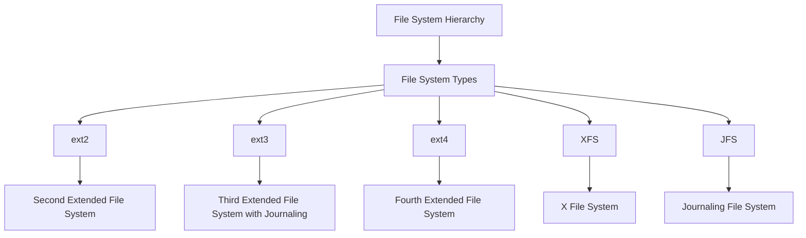

# Advanced File System Topics

> 🎥 [Search YouTube for "Advanced File System Topics"](https://www.youtube.com/results?search_query=Advanced%20File%20System%20Topics%20Linux%20Fundamentals%20tutorial)

**Advanced File System Topics**

In this lesson, we will explore advanced file system topics and concepts that are crucial for Linux administrators. Understanding these concepts will help you manage file systems more effectively, troubleshoot issues, and optimize performance.

## File System Hierarchy

A file system is a hierarchical structure that organizes files and directories. The Linux file system hierarchy is based on the following structure:
```
/
├── bin
├── boot
├── dev
├── etc
├── home
├── lib
├── lib64
├── media
├── mnt
├── opt
├── proc
├── root
├── run
├── sbin
├── srv
├── sys
├── tmp
├── usr
└── var
```
### File System Types

Linux supports various file system types, including:

* **ext2**: Second extended file system, a traditional file system for Linux.
* **ext3**: Third extended file system, an enhanced version of ext2 with journaling.
* **ext4**: Fourth extended file system, a modern file system with improved performance and features.
* **XFS**: X File System, a high-performance file system designed for large storage devices.
* **JFS**: Journaling File System, a file system with journaling capabilities.

## File System Permissions

File system permissions determine who can access and modify files and directories. The following permissions are used:
```
rwxr-xr-x
```
* **r** (read): Allows users to read files and directories.
* **w** (write): Allows users to modify files and directories.
* **x** (execute): Allows users to execute files and access directories.

### File System Ownership

File system ownership determines who owns a file or directory. The following ownership model is used:
```
user:group
```
* **user**: The owner of the file or directory.
* **group**: The group that owns the file or directory.

## File System Mounting

File system mounting allows you to attach a file system to a directory. The following command is used to mount a file system:
```bash
mount -t <fs_type> <device> <mount_point>
```
### Example

Mount the `/dev/sda1` partition as `/mnt` with the `ext4` file system type:
```bash
mount -t ext4 /dev/sda1 /mnt
```
### File System Unmounting

File system unmounting allows you to detach a file system from a directory. The following command is used to unmount a file system:
```bash
umount <mount_point>
```
### Example

Unmount the `/mnt` file system:
```bash
umount /mnt
```

### File System Management

File system management involves creating, deleting, and modifying file systems. The following commands are used:
```bash
mkfs -t <fs_type> <device>
mkfs -t <fs_type> -L <label> <device>
e2label <device> <label>
```
### Example

Create a new file system on `/dev/sda1` with the `ext4` file system type:
```bash
mkfs -t ext4 /dev/sda1
```

### File System Troubleshooting

File system troubleshooting involves identifying and resolving issues with file systems. The following tools are used:
```bash
fsck -t <fs_type> <device>
fsck -t <fs_type> -n <device>
e2fsck <device>
```
### Example

Check the file system on `/dev/sda1` with the `ext4` file system type:
```bash
fsck -t ext4 /dev/sda1
```

### File System Optimization

File system optimization involves improving file system performance. The following tools are used:
```bash
tune2fs -t <fs_type> <device>
tune2fs -t <fs_type> -m <max_blocks> <device>
```
### Example

Optimize the file system on `/dev/sda1` with the `ext4` file system type:
```bash
tune2fs -t ext4 /dev/sda1
```

### Mermaid Diagram



### Conclusion

In this lesson, we explored advanced file system topics and concepts, including file system hierarchy, file system types, file system permissions, file system ownership, file system mounting, file system unmounting, file system management, file system troubleshooting, and file system optimization. Understanding these concepts will help you manage file systems more effectively and troubleshoot issues.
