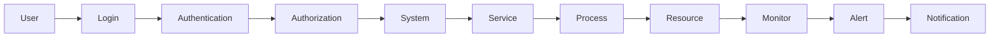

# Advanced System Administration

> 🎥 [Search YouTube for "Advanced System Administration"](https://www.youtube.com/results?search_query=Advanced%20System%20Administration%20Linux%20Fundamentals%20tutorial)

# Advanced System Administration

**System Administration** is the process of managing and maintaining a computer system, ensuring it runs smoothly, securely, and efficiently. As a Linux administrator, you need to understand advanced system administration topics and concepts to effectively manage and troubleshoot complex systems.

## System Configuration

System configuration involves setting up and customizing system settings, such as user accounts, network configurations, and system services. **Systemd** is a system and service manager for Linux operating systems. It provides a way to start, stop, and manage system services and daemons.

### Systemd Configuration

Systemd uses a configuration file, `/etc/systemd/system.conf`, to store system-wide configuration settings. You can edit this file to change system-wide settings, such as the default runlevel or the maximum number of processes.

```bash
# Edit the system.conf file
sudo nano /etc/systemd/system.conf
```

## System Services

System services are programs that run in the background, providing essential system functions. **Systemd** manages system services, and you can use the `systemctl` command to start, stop, and manage services.

### Systemd Services

Systemd services are defined in `/etc/systemd/system/` directory. You can create a new service file by creating a new file in this directory.

```bash
# Create a new service file
sudo nano /etc/systemd/system/my_service.service
```

## System Security

System security involves ensuring that your system is secure and protected from unauthorized access. **SELinux** (Security-Enhanced Linux) is a security module that provides a way to enforce security policies on Linux systems.

### SELinux Configuration

SELinux uses a configuration file, `/etc/selinux/config`, to store security settings. You can edit this file to change security settings, such as the default security level or the maximum number of processes.

```bash
# Edit the selinux.conf file
sudo nano /etc/selinux/config
```

## System Monitoring

System monitoring involves tracking system performance and detecting potential issues. **Prometheus** is a monitoring system that provides a way to collect and display system metrics.

### Prometheus Configuration

Prometheus uses a configuration file, `/etc/prometheus/prometheus.yml`, to store monitoring settings. You can edit this file to change monitoring settings, such as the scrape interval or the alert manager.

```bash
# Edit the prometheus.yml file
sudo nano /etc/prometheus/prometheus.yml
```

## System Troubleshooting

System troubleshooting involves identifying and resolving system issues. **Systemd** provides a way to troubleshoot system services and daemons.

### Systemd Troubleshooting

Systemd uses a diagnostic tool, `systemctl diagnose`, to identify and resolve system issues. You can use this tool to troubleshoot system services and daemons.

```bash
# Run the diagnose tool
sudo systemctl diagnose
```




This lesson covers advanced system administration topics, including system configuration, system services, system security, system monitoring, and system troubleshooting. By understanding these concepts, you can effectively manage and maintain complex Linux systems.
