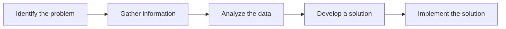

# Advanced Troubleshooting

> 🎥 [Search YouTube for "Advanced Troubleshooting"](https://www.youtube.com/results?search_query=Advanced%20Troubleshooting%20Linux%20Fundamentals%20tutorial)

# Advanced Troubleshooting
==========================

Troubleshooting is an essential skill for any Linux administrator. As systems become more complex, identifying and resolving issues can be a daunting task. In this lesson, we'll explore advanced troubleshooting techniques and concepts to help you become more proficient in resolving issues on your Linux system.

## Introduction to Troubleshooting
### The Troubleshooting Process

Troubleshooting is a systematic approach to identifying and resolving issues. The process involves the following steps:

1. **Identify the problem**: Clearly define the issue and its symptoms.
2. **Gather information**: Collect relevant data and logs to understand the problem.
3. **Analyze the data**: Use tools and techniques to analyze the data and identify the root cause.
4. **Develop a solution**: Based on the analysis, develop a plan to resolve the issue.
5. **Implement the solution**: Execute the plan to resolve the issue.

### Tools and Techniques

Some essential tools and techniques for advanced troubleshooting include:

* **System logs**: Analyze system logs to identify errors and issues.
* **System monitoring tools**: Use tools like `htop` and `sysdig` to monitor system performance and identify issues.
* **Debugging**: Use tools like `gdb` and `strace` to debug applications and identify issues.
* **Network troubleshooting**: Use tools like `tcpdump` and `Wireshark` to troubleshoot network issues.

### Advanced Troubleshooting Concepts

Some advanced troubleshooting concepts to keep in mind:

* **Root cause analysis**: Identify the root cause of the issue, rather than just treating the symptoms.
* **Symptom-based troubleshooting**: Identify the symptoms of the issue and use that information to guide the troubleshooting process.
* **Data-driven troubleshooting**: Use data and analytics to inform the troubleshooting process.

### Example Use Case

Suppose you're troubleshooting a Linux system that's experiencing high CPU usage. You've identified the issue, but you're not sure what's causing it. You use `htop` to monitor system performance and identify that the `syslog` process is consuming most of the CPU resources.

```bash
# htop
htop -u syslog
```

You then use `strace` to debug the `syslog` process and identify the issue.

```bash
# strace
strace -p 1234 -s 50 -f
```

By using these advanced troubleshooting techniques and concepts, you're able to identify the root cause of the issue and develop a plan to resolve it.

### Advanced Troubleshooting Techniques

Some advanced troubleshooting techniques to keep in mind:

* **System call tracing**: Use tools like `strace` to trace system calls and identify issues.
* **Network protocol analysis**: Use tools like `tcpdump` to analyze network protocols and identify issues.
* **System configuration analysis**: Use tools like `systemd` to analyze system configuration and identify issues.

### Conclusion

Advanced troubleshooting requires a systematic approach to identifying and resolving issues. By using tools and techniques like system logs, system monitoring tools, and debugging, you can become more proficient in resolving issues on your Linux system. Remember to identify the root cause of the issue, rather than just treating the symptoms, and use data and analytics to inform the troubleshooting process.



[Image: A flowchart showing the troubleshooting process]

https://upload.wikimedia.org/wikipedia/commons/thumb/4/4c/Flowchart.svg/800px-Flowchart.svg.png

```bash
# strace
strace -p 1234 -s 50 -f
```

[Image: A screenshot of the `strace` output]

https://placehold.co/800x400?text=System+call+tracing
