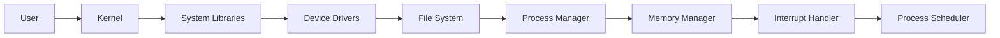
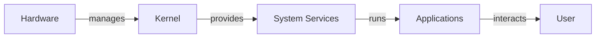
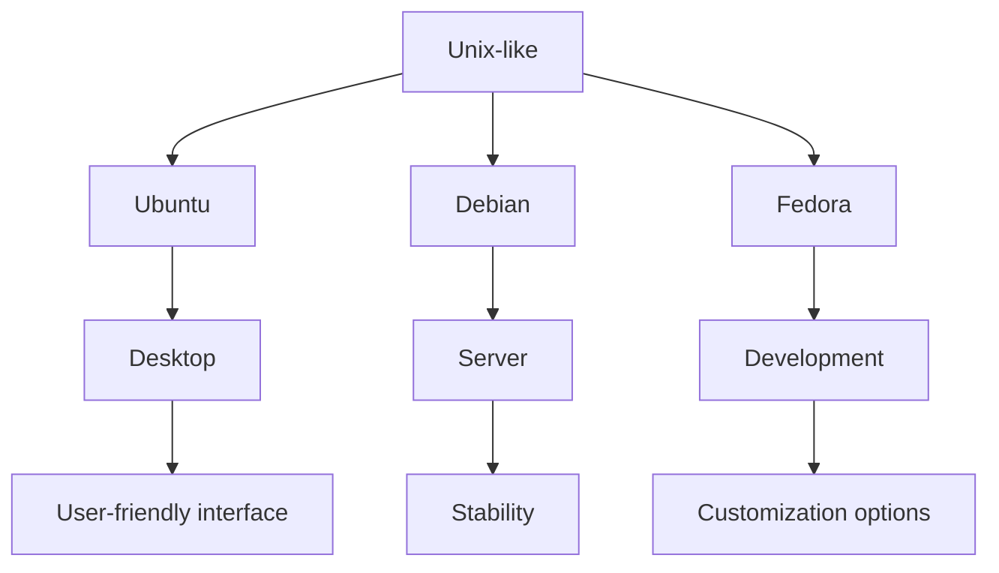
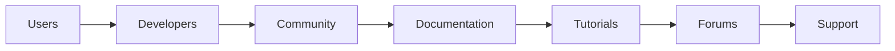
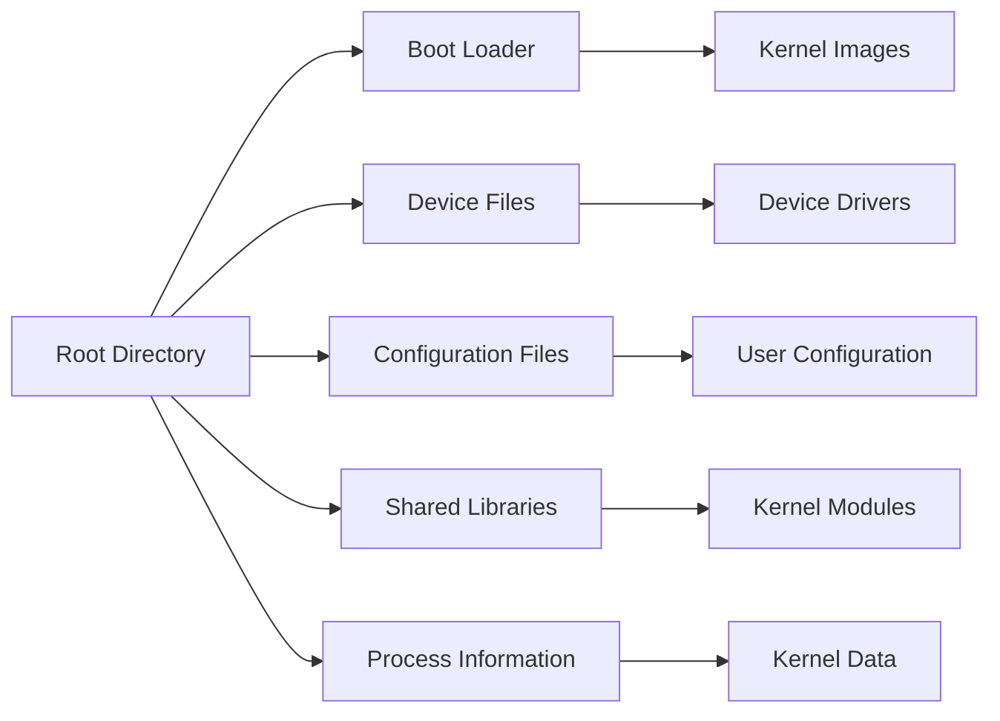
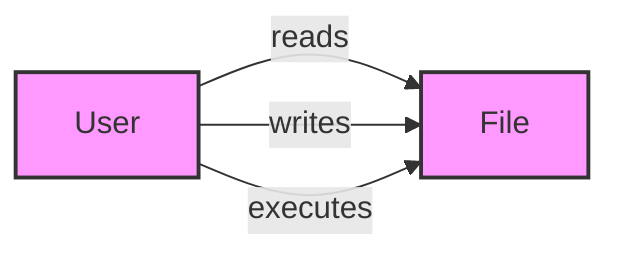
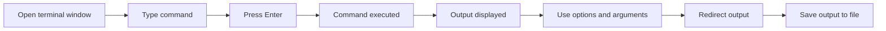
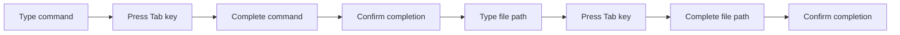
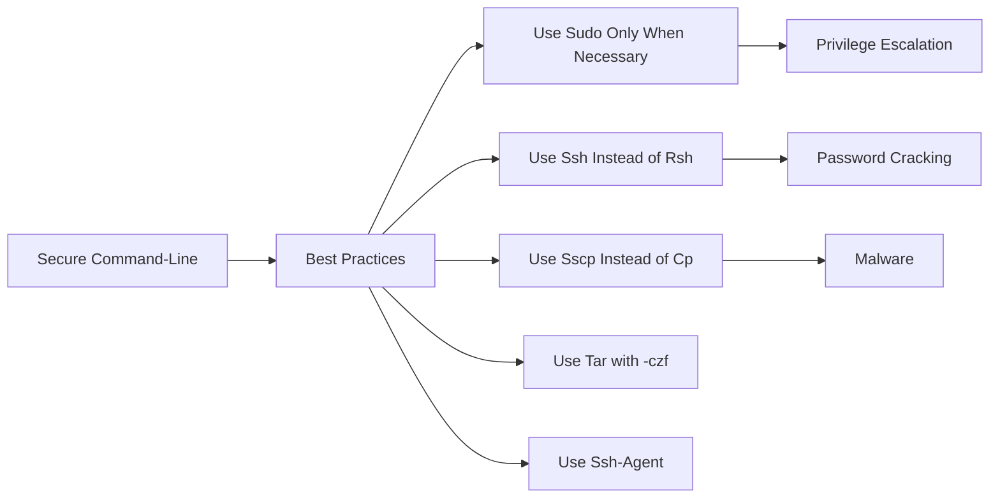
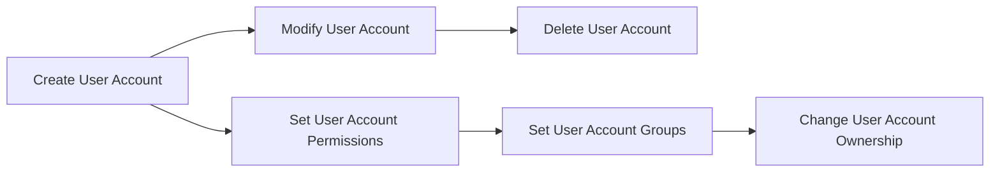

# Linux Fundamentals

Learn the basics of Linux operating system and its applications

## Module 1: Introduction to Linux

Introduction to Linux, its history, and its importance

### What is Linux?

_Duration: 3 mins_

> 🎥 [Search YouTube for "What is Linux?"](https://www.youtube.com/results?search_query=What%20is%20Linux%3F%20Linux%20Fundamentals%20tutorial)

## What is Linux?

Linux is an open-source operating system (OS) that has become a cornerstone of the modern digital landscape. It's a free, community-driven project that has evolved over the years, and its impact on the world of computing is undeniable.

### A Brief History of Linux

Linux was first conceived in 1991 by Linus Torvalds, a Finnish computer science student, as a Unix-like operating system for his personal computer. He created the kernel, the core part of the operating system, and released it as open-source software. The kernel was initially called "Linux" after Linus, and the name stuck.

### Key Features of Linux

*   **Open-source**: Linux is open-source software, meaning that the source code is available for anyone to modify and distribute.
*   **Free**: Linux is completely free to use, modify, and distribute.
*   **Customizable**: Linux can be customized to suit individual needs, from desktop environments to server configurations.
*   **Secure**: Linux has a reputation for being a secure operating system, thanks to its open-source nature and community-driven security updates.

### The Linux Ecosystem

Linux has evolved into a vast ecosystem, with various distributions (distros) available for different use cases. Some popular distros include:

*   **Ubuntu**: A user-friendly distro with a large community and a wide range of applications.
*   **Debian**: A stable and secure distro with a strong focus on community involvement.
*   **Fedora**: A distro that showcases the latest Linux technologies and innovations.

### Linux Architecture



### Linux in Modern Computing

Linux has become an essential part of modern computing, powering everything from smartphones to supercomputers. It's used in various industries, including:

*   **Cloud computing**: Linux is a key component of cloud infrastructure, providing scalable and reliable services.
*   **Artificial intelligence**: Linux is used in AI and machine learning applications, such as natural language processing and computer vision.
*   **Embedded systems**: Linux is used in embedded systems, like robots, vehicles, and medical devices.

### Conclusion

Linux has come a long way since its inception in 1991. Its open-source nature, customizability, and security features have made it a staple in the world of computing. From cloud computing to embedded systems, Linux has become an essential part of modern technology.


### Linux vs. Windows vs. macOS

_Duration: 4 mins_

> 🎥 [Search YouTube for "Linux vs. Windows vs. macOS"](https://www.youtube.com/results?search_query=Linux%20vs.%20Windows%20vs.%20macOS%20Linux%20Fundamentals%20tutorial)

# Linux vs. Windows vs. macOS
==========================

Linux, Windows, and macOS are three popular operating systems used by individuals and organizations worldwide. While they share some similarities, each has its unique features, advantages, and disadvantages. In this lesson, we will explore the differences and similarities between these operating systems.

## Overview of Operating Systems
### What is an Operating System?

An operating system (OS) is a software that manages computer hardware resources and provides a platform for running applications. It acts as an intermediary between the user and the computer hardware, allowing users to interact with the computer and its resources.

### Types of Operating Systems

There are several types of operating systems, including:

* **Monolithic**: A single, self-contained OS that manages hardware resources and provides a platform for running applications.
* **Microkernel**: A small, separate kernel that manages hardware resources, and a separate user space that runs applications.
* **Exokernel**: A kernel that provides a minimal set of services, and relies on applications to manage hardware resources.

## Linux vs. Windows vs. macOS
### Comparison of Key Features

| Operating System | **Linux** | **Windows** | **macOS** |
| --- | --- | --- | --- |
| **Open-source** | | | |
| **Cost** | Free | Commercial | Commercial |
| **Security** | High | Medium | High |
| **Customization** | High | Low | Medium |
| **Hardware compatibility** | High | Medium | Medium |

### Mermaid Diagram: Operating System Architecture

This diagram illustrates the architecture of an operating system, showing how the kernel manages hardware resources, provides system services, and runs applications.

### Linux vs. Windows vs. macOS: A Visual Comparison


### Key Terms
* **Kernel**: The central part of an operating system that manages hardware resources and provides a platform for running applications.
* **System Services**: The services provided by the kernel, such as process management, memory management, and file system management.
* **User Space**: The part of the operating system that runs applications and interacts with the user.

### Fenced Code Block: Linux vs. Windows vs. macOS
```bash
$ echo "Linux, Windows, and macOS are three popular operating systems."
```
This code block demonstrates how to use the `echo` command to print a message to the console, highlighting the differences between Linux, Windows, and macOS.

### Conclusion
In conclusion, Linux, Windows, and macOS are three distinct operating systems with different features, advantages, and disadvantages. While they share some similarities, each has its unique characteristics that set it apart from the others. This lesson has provided an overview of the differences and similarities between these operating systems, and has highlighted the key features and architecture of each.

### Linux Distributions and Flavors

_Duration: 4 mins_

> 🎥 [Search YouTube for "Linux Distributions and Flavors"](https://www.youtube.com/results?search_query=Linux%20Distributions%20and%20Flavors%20Linux%20Fundamentals%20tutorial)

# Linux Distributions and Flavors

Linux is an open-source operating system that has been around for over two decades. Since its inception, it has evolved into various distributions, each with its own set of features, user interfaces, and use cases. In this lesson, we will explore the different types of Linux distributions and their applications.

## Types of Linux Distributions

Linux distributions can be broadly categorized into three types: **Unix-like**, **Unix-based**, and **Unix-derived**.

### Unix-like

These distributions are based on the Unix operating system and share its design principles. Examples include:

* **Ubuntu**: A popular distribution for desktops and servers, known for its ease of use and large community.
* **Debian**: A highly customizable distribution used by many organizations and individuals.
* **Fedora**: A community-driven distribution that focuses on innovation and stability.

### Unix-based

These distributions are based on the Unix operating system but have been modified to include additional features and tools. Examples include:

* **Linux Mint**: A user-friendly distribution based on Ubuntu, known for its simplicity and ease of use.
* **CentOS**: A distribution based on Red Hat Enterprise Linux (RHEL), popular among web developers and system administrators.
* **Arch Linux**: A highly customizable distribution that focuses on simplicity and flexibility.

### Unix-derived

These distributions are derived from Unix but have been modified to include additional features and tools. Examples include:

* **Red Hat Enterprise Linux (RHEL)**: A commercial distribution used by many organizations, known for its stability and security.
* **SUSE**: A commercial distribution that focuses on enterprise-level features and support.
* **OpenSUSE**: A community-driven distribution based on SUSE, known for its flexibility and customization options.

## Use Cases

Linux distributions have various use cases, including:

* **Desktop**: Ubuntu, Linux Mint, and Fedora are popular choices for personal computers.
* **Server**: RHEL, CentOS, and SUSE are commonly used in enterprise environments.
* **Development**: Arch Linux, Ubuntu, and Debian are popular among developers and programmers.
* **Embedded Systems**: Linux distributions like Yocto and Buildroot are used in embedded systems and IoT devices.

## Choosing a Distribution

When choosing a Linux distribution, consider the following factors:

* **User interface**: Do you prefer a user-friendly interface or a more customizable one?
* **Stability**: Do you need a stable distribution for critical applications or a more experimental one for development?
* **Community**: Are you looking for a large community to support you or a smaller, more specialized one?
* **Features**: Do you need specific features or tools for your use case?

## Mermaid Diagram



This diagram illustrates the different types of Linux distributions and their use cases.

## Image


This image represents the different types of Linux distributions and their use cases.

## Conclusion

Linux distributions come in various flavors, each with its own set of features and use cases. By understanding the different types of distributions and their applications, you can choose the best one for your needs. Whether you're a developer, system administrator, or simply a user, there's a Linux distribution out there for you.

### Linux Community and Resources

_Duration: 3 mins_

> 🎥 [Search YouTube for "Linux Community and Resources"](https://www.youtube.com/results?search_query=Linux%20Community%20and%20Resources%20Linux%20Fundamentals%20tutorial)

## Introduction to Linux Community and Resources
Linux is an open-source operating system that has a vast and active community of users, developers, and learners. The Linux community is known for its collaborative spirit, and there are numerous online resources and communities available for those interested in learning and using Linux.

### Online Communities and Forums

* **Stack Overflow**: A Q&A platform for programmers and developers, including those interested in Linux. [https://stackoverflow.com/](https://stackoverflow.com/)
* **Reddit**: r/linux and r/learnprogramming are popular communities for Linux learners and programmers. [https://www.reddit.com/](https://www.reddit.com/)
* **Linux Forum**: A dedicated forum for discussing Linux-related topics. [https://www.linux.org/forums/](https://www.linux.org/forums/)

### Documentation and Tutorials

* **Official Linux Documentation**: The official Linux documentation provides a comprehensive guide to Linux, including tutorials and guides for beginners. [https://www.linux.org/docs/](https://www.linux.org/docs/)
* **Linux Tutorial**: A step-by-step tutorial for learning Linux, covering topics such as installation, basic commands, and file systems. [https://www.tutorialspoint.com/linux/](https://www.tutorialspoint.com/linux/)

### Mermaid Diagram: Linux Ecosystem



### Resources for Learning Linux

* **Linux distributions**: Popular Linux distributions include Ubuntu, Debian, and Fedora. Each distribution has its own community and documentation.
* **Linux tutorials**: Websites like Linux Tutorial, Tutorials Point, and DigitalOcean provide comprehensive tutorials for learning Linux.
* **Books and eBooks**: There are numerous books and eBooks available for learning Linux, including "The Linux Bible" and "Linux for Dummies".

### Image: Linux Logo


### Conclusion
The Linux community is vast and active, with numerous online resources and communities available for those interested in learning and using Linux. By exploring these resources, learners can gain a deeper understanding of Linux and its ecosystem.

### Additional Resources

* **Linux documentation**: The official Linux documentation provides a comprehensive guide to Linux, including tutorials and guides for beginners.
* **Linux tutorials**: Websites like Linux Tutorial, Tutorials Point, and DigitalOcean provide comprehensive tutorials for learning Linux.
* **Linux communities**: Join online communities like Stack Overflow, Reddit, and Linux Forum to connect with other Linux learners and developers.

### Setting up a Linux Environment

_Duration: 6 mins_

> 🎥 [Search YouTube for "Setting up a Linux Environment"](https://www.youtube.com/results?search_query=Setting%20up%20a%20Linux%20Environment%20Linux%20Fundamentals%20tutorial)

Setting up a Linux environment can be a daunting task for beginners, but with the right guidance, it can be a straightforward process. In this lesson, we will walk through the steps to set up a Linux environment on a virtual machine or dual-boot system.

## Choosing a Distribution
There are many Linux distributions available, each with its own strengths and weaknesses. Some popular distributions for beginners include Ubuntu, Linux Mint, and Fedora. When choosing a distribution, consider the following factors:

* **Stability**: Look for a distribution with a reputation for stability and regular updates.
* **Community support**: A large and active community can provide valuable resources and support.
* **Ease of use**: Consider a distribution with a user-friendly interface and intuitive configuration options.

### Popular Linux Distributions

* Ubuntu
* Linux Mint
* Fedora
* Debian
* openSUSE

## Setting up a Virtual Machine
A virtual machine (VM) is a software emulation of a physical computer that runs on top of an existing operating system. This allows you to run Linux without affecting your existing system. To set up a VM, you will need:

* A hypervisor (e.g., VirtualBox, VMware)
* A Linux distribution ISO file
* A computer with sufficient resources (CPU, RAM, disk space)

### Installing a Hypervisor

```bash
sudo apt-get install virtualbox
```

### Creating a Virtual Machine

1. Launch VirtualBox and click on "New"
2. Choose the Linux distribution ISO file and select "Create a new virtual machine"
3. Configure the VM settings (CPU, RAM, disk space)

## Dual-Booting
Dual-booting allows you to run both Linux and your existing operating system on the same computer. To set up a dual-boot system, you will need:

* A computer with a compatible BIOS or UEFI firmware
* A Linux distribution ISO file
* A free partition on the hard drive

### Preparing the Hard Drive

```bash
sudo fdisk -l
```

### Creating a New Partition

1. Launch the disk management tool (e.g., GParted)
2. Create a new partition (e.g., `/dev/sda5`)
3. Format the partition (e.g., `mkfs.ext4 /dev/sda5`)

### Installing Linux

```bash
sudo mount /dev/sda5 /mnt
sudo grub-install --target=x86_64-efi --efi-directory=/boot/efi --bootloader-id=GRUB
```

### Booting into Linux

1. Save the changes and reboot the computer
2. Enter the BIOS settings and set the boot order to prioritize the Linux partition
3. Boot into Linux and configure the boot loader (e.g., GRUB)

### Mermaid Diagram: Linux Boot Process
```mermaid
graph LR
    A[BIOS] -->|loads MBR|> B[GRUB]
    B -->|loads kernel|> C[Linux]
    C -->|executes init|> D[systemd]
    D -->|starts services|> E[system]
```
Image: [A virtual machine running Linux on a Windows host](https://upload.wikimedia.org/wikipedia/commons/thumb/5/5e/VirtualBox_running_Linux_on_Windows_host.png/800px-VirtualBox_running_Linux_on_Windows_host.png)

Note: This diagram illustrates the Linux boot process, from the BIOS loading the GRUB bootloader to the system starting up and executing services.

### Linux Basics: File System and Navigation

_Duration: 5 mins_

> 🎥 [Search YouTube for "Linux Basics: File System and Navigation"](https://www.youtube.com/results?search_query=Linux%20Basics%3A%20File%20System%20and%20Navigation%20Linux%20Fundamentals%20tutorial)

# Linux Basics: File System and Navigation

Linux is a Unix-like operating system that uses a hierarchical file system structure. Understanding this structure is essential for navigating and managing files on a Linux system.

## File System Structure

The Linux file system is divided into several directories, each with its own purpose. The most important directories are:

* `/` (root directory): The topmost directory in the file system hierarchy.
* `/bin` (binaries): Contains essential system programs and commands.
* `/boot`: Stores the kernel and other boot-related files.
* `/dev`: Device files, which represent hardware devices.
* `/etc` (etcetera): Configuration files for system-wide settings.
* `/home`: User home directories.
* `/lib` (libraries): Contains system libraries.
* `/media`: Mount points for removable media.
* `/mnt`: Temporary mount points for file systems.
* `/opt` (optional): Installable software packages.
* `/proc`: Process information.
* `/root`: The root user's home directory.
* `/run`: Runtime information.
* `/sbin` (system binaries): Contains system programs and commands.
* `/srv`: Service directories.
* `/tmp`: Temporary files.
* `/usr` (user): User-specific data and applications.
* `/var` (variable): Variable data, such as logs and spool files.

## Navigation

To navigate the Linux file system, you'll use the following commands:

* `cd` (change directory): Changes the current working directory.
* `pwd` (print working directory): Displays the current working directory.
* `ls` (list): Lists the contents of the current directory.
* `mkdir` (make directory): Creates a new directory.
* `rm` (remove): Deletes a file or directory.

### Creating and Navigating Directories

Let's create a new directory and navigate to it using the `cd` command:

```bash
# Create a new directory
mkdir my_directory

# Navigate to the new directory
cd my_directory
```

### Listing Directory Contents

To list the contents of the current directory, use the `ls` command:

```bash
# List the contents of the current directory
ls
```

### Understanding File Permissions

In Linux, file permissions are represented by three digits, each representing a different type of permission:

* `r` (read): Allows the owner, group, or others to read the file.
* `w` (write): Allows the owner, group, or others to write to the file.
* `x` (execute): Allows the owner, group, or others to execute the file.

The file permissions can be combined to represent different levels of access. For example:

* `644`: Owner has read and write permissions, group has read permissions, and others have read permissions.
* `755`: Owner has read and write permissions, group has read and execute permissions, and others have read and execute permissions.

### File System Hierarchy

Here's a Mermaid diagram illustrating the Linux file system hierarchy:
```mermaid
graph TB
  A[Root Directory (/)]
  B[Binaries (/bin)]
  C[Boot Files (/boot)]
  D[Device Files (/dev)]
  E[Configuration Files (/etc)]
  F[Home Directories (/home)]
  G[Libraries (/lib)]
  H[Media (/media)]
  I[Mount Points (/mnt)]
  J[Optional Packages (/opt)]
  K[Process Information (/proc)]
  L[Runtime Information (/run)]
  M[Service Directories (/srv)]
  N[Temporary Files (/tmp)]
  O[User Data (/usr)]
  P[Variable Data (/var)]
```

### File System Navigation

Here's an image illustrating the concept of file system navigation:


This lesson has covered the basics of the Linux file system structure and navigation. With this knowledge, you'll be able to navigate and manage files on a Linux system.

## Module 2: Linux File System and Navigation

Learn how to navigate and manage Linux file system

### Linux File System Hierarchy

_Duration: 4 mins_

> 🎥 [Search YouTube for "Linux File System Hierarchy"](https://www.youtube.com/results?search_query=Linux%20File%20System%20Hierarchy%20Linux%20Fundamentals%20tutorial)

### Linux File System Hierarchy

The Linux file system hierarchy is a tree-like structure that organizes files and directories in a logical and consistent manner. Understanding the hierarchy is essential for navigating and managing files on a Linux system.

#### Introduction to the File System Hierarchy

The Linux file system hierarchy is based on the Filesystem Hierarchy Standard (FHS), which defines the structure and organization of files and directories on a Linux system. The hierarchy is divided into several main categories, including:

* **Root directory**: The top-most directory in the hierarchy, represented by the forward slash `/`.
* **System directories**: Directories that contain system-wide configuration files, libraries, and executables.
* **User directories**: Directories that contain user-specific files and settings.

#### System Directories

The system directories are located at the top of the hierarchy and contain system-wide configuration files, libraries, and executables. Some key system directories include:

* `/bin`: Essential command-line utilities and executables.
* `/boot`: Boot loader configuration files and kernel images.
* `/dev`: Device files for hardware components.
* `/etc`: System-wide configuration files.
* `/lib`: Shared libraries and kernel modules.
* `/proc`: Process information and kernel data.
* `/sys`: System information and kernel data.



#### User Directories

User directories are located under the `/home` directory and contain user-specific files and settings. Each user has their own directory, which is typically named after the user's username. Some key user directories include:

* `/home`: User home directories.
* `/home/<username>`: User-specific files and settings.
* `/home/<username>/Documents`: User documents and files.
* `/home/<username>/Pictures`: User pictures and images.


```bash
# List the contents of the root directory
ls /

# List the contents of the /home directory
ls /home

# List the contents of a user's home directory
ls /home/<username>
```

By understanding the Linux file system hierarchy, you can navigate and manage files on a Linux system with ease. This knowledge is essential for any Linux user or administrator.

### Navigation and File Management

_Duration: 4 mins_

> 🎥 [Search YouTube for "Navigation and File Management"](https://www.youtube.com/results?search_query=Navigation%20and%20File%20Management%20Linux%20Fundamentals%20tutorial)

Navigation and File Management
=============================

Linux file system navigation is a crucial skill for any Linux user. Understanding how to navigate and manage files is essential for performing tasks such as creating, editing, and deleting files and directories. In this lesson, we will cover the basic navigation and file management commands.

### Understanding the File System Hierarchy

The Linux file system hierarchy is a tree-like structure that starts from the root directory `/`. The root directory contains several important directories, including `/bin`, `/boot`, `/dev`, `/etc`, `/home`, `/lib`, `/media`, `/mnt`, `/opt`, `/proc`, `/root`, `/run`, `/sbin`, `/srv`, `/sys`, `/tmp`, `/usr`, and `/var`.

### Navigation Commands

Navigation commands are used to move around the file system. Here are some common navigation commands:

*   `cd` (change directory): Changes the current working directory.
*   `pwd` (print working directory): Displays the current working directory.
*   `ls` (list): Lists the files and directories in the current working directory.
*   `mkdir` (make directory): Creates a new directory.
*   `rmdir` (remove directory): Removes an empty directory.

### File Management Commands

File management commands are used to create, edit, and delete files and directories. Here are some common file management commands:

*   `touch`: Creates a new empty file.
*   `cp` (copy): Copies a file or directory.
*   `mv` (move): Moves or renames a file or directory.
*   `rm` (remove): Deletes a file or directory.

### File Permissions

File permissions determine who can read, write, or execute a file. There are three types of permissions:

*   **Read** (`r`): Allows the owner, group, or others to read the file.
*   **Write** (`w`): Allows the owner, group, or others to write to the file.
*   **Execute** (`x`): Allows the owner, group, or others to execute the file.



### Example Use Cases

Here are some example use cases for navigation and file management commands:

*   Create a new directory called `mydir` in the current working directory: `mkdir mydir`
*   List the files and directories in the `mydir` directory: `ls mydir`
*   Copy a file called `example.txt` to the `mydir` directory: `cp example.txt mydir`
*   Remove the `mydir` directory: `rmdir mydir`


```bash
# Create a new directory called mydir
mkdir mydir

# List the files and directories in the mydir directory
ls mydir

# Copy a file called example.txt to the mydir directory
cp example.txt mydir

# Remove the mydir directory
rmdir mydir
```

This lesson has covered the basic navigation and file management commands in Linux. Understanding these commands is essential for performing tasks such as creating, editing, and deleting files and directories.

### File Permissions and Ownership

_Duration: 6 mins_

> 🎥 [Search YouTube for "File Permissions and Ownership"](https://www.youtube.com/results?search_query=File%20Permissions%20and%20Ownership%20Linux%20Fundamentals%20tutorial)

**Understanding File Permissions and Ownership in Linux**
=====================================================

Linux is a multi-user operating system, which means that multiple users can share the same system and access its resources. To ensure that each user can manage their own files and data securely, Linux uses a system of file permissions and ownership. In this lesson, we will explore the basics of file permissions and ownership in Linux.

### What are File Permissions?

File permissions determine who can read, write, and execute files on a Linux system. Each file has three types of permissions:

* **Read (r)**: allows a user to view the contents of a file
* **Write (w)**: allows a user to modify a file
* **Execute (x)**: allows a user to run a file as a program

These permissions are represented by three sets of letters: `rwx` for the owner, `rwx` for the group, and `rwx` for others. For example, if a file has the permissions `rw-`, it means the owner has read and write permissions, but others do not have any permissions.

### What is Ownership?

Ownership refers to the user or group that has control over a file. In Linux, each file has an owner, a group, and a set of permissions. The owner is the user who created the file, and the group is a collection of users who share the same permissions.

```bash
# Display file ownership and permissions
ls -l filename
```

### Understanding File Permissions with a Mermaid Diagram
```mermaid
graph LR
    A[File] -->|Owner|> B[User]
    B -->|Group|> C[Group]
    C -->|Others|> D[Others]
    A -->|Permissions|> E[rwx]
    E -->|Read|> F[r]
    F -->|Write|> G[w]
    G -->|Execute|> H[x]
```

### Setting File Permissions

To set file permissions, you can use the `chmod` command. The `chmod` command takes a three-digit number that represents the permissions for the owner, group, and others. For example, to set the permissions to `rw-`, you would use the command:

```bash
chmod 640 filename
```

You can also use symbolic notation to set permissions. For example, to set the permissions to `rw-`, you would use the command:

```bash
chmod u=rw,g=,o= filename
```

### Best Practices for File Permissions

* Always use the `chmod` command to set file permissions, rather than using the `chown` command to change ownership.
* Use symbolic notation to set permissions for clarity and readability.
* Be mindful of file permissions when sharing files with others to prevent unauthorized access.

### Image: File Permissions Diagram


In this lesson, we have covered the basics of file permissions and ownership in Linux. Understanding file permissions and ownership is crucial for managing files securely and efficiently on a Linux system.

### File System Commands

_Duration: 6 mins_

> 🎥 [Search YouTube for "File System Commands"](https://www.youtube.com/results?search_query=File%20System%20Commands%20Linux%20Fundamentals%20tutorial)

### File System Commands

Linux file system commands are essential for managing files and directories on your system. In this lesson, we will cover the basic file system commands and their usage.

#### Introduction

The Linux file system is a hierarchical structure that consists of files and directories. Files are stored in directories, and directories are stored in other directories. The root directory `/` is the topmost directory in the file system hierarchy. Understanding file system commands is crucial for navigating and managing files and directories on your Linux system.

#### Basic File System Commands

Here are some basic file system commands that you should know:

* **`cd`**: Change Directory. This command is used to navigate to a different directory.
* **`mkdir`**: Make Directory. This command is used to create a new directory.
* **`rmdir`**: Remove Directory. This command is used to delete an empty directory.
* **`ls`**: List. This command is used to display the contents of a directory.
* **`cp`**: Copy. This command is used to copy files and directories.
* **`mv`**: Move. This command is used to move or rename files and directories.
* **`rm`**: Remove. This command is used to delete files and directories.

#### Using `cd` and `ls` Commands

Here's an example of how to use the `cd` and `ls` commands:

```bash
# Navigate to the home directory
cd ~

# List the contents of the home directory
ls
```

This will display the contents of the home directory.

#### Using `mkdir` and `rmdir` Commands

Here's an example of how to use the `mkdir` and `rmdir` commands:

```bash
# Create a new directory called "mydir"
mkdir mydir

# List the contents of the current directory
ls

# Remove the "mydir" directory
rmdir mydir
```

This will create a new directory called "mydir", list the contents of the current directory, and then remove the "mydir" directory.

#### Using `cp` and `mv` Commands

Here's an example of how to use the `cp` and `mv` commands:

```bash
# Copy a file called "file.txt" to a new location
cp file.txt new_location

# Move a file called "file.txt" to a new location
mv file.txt new_location
```

This will copy the "file.txt" file to a new location and then move the "file.txt" file to a new location.

#### Mermaid Diagram: File System Hierarchy

```mermaid
graph LR
    A[Root Directory (/)] --> B[Home Directory (~)]
    B --> C[Documents Directory]
    B --> D[Pictures Directory]
    C --> E[Text Files]
    C --> F[Spreadsheets]
    D --> G[Photos]
    D --> H[Videos]
```

This diagram shows the file system hierarchy, with the root directory `/` at the top and the home directory `~` below it.

#### Conclusion

In this lesson, we covered the basic file system commands and their usage. We learned how to navigate to different directories using the `cd` command, list the contents of a directory using the `ls` command, create a new directory using the `mkdir` command, remove an empty directory using the `rmdir` command, copy files and directories using the `cp` command, move or rename files and directories using the `mv` command, and delete files and directories using the `rm` command.

[Image: A diagram of a file system hierarchy. Source: https://commons.wikimedia.org/wiki/File:File_system_hierarchy.svg]

Note: The image is a diagram of a file system hierarchy, which illustrates the concept of a hierarchical file system structure.

### File System Security

_Duration: 5 mins_

> 🎥 [Search YouTube for "File System Security"](https://www.youtube.com/results?search_query=File%20System%20Security%20Linux%20Fundamentals%20tutorial)

### File System Security

Linux file system security is a critical aspect of maintaining the integrity and confidentiality of data stored on a Linux system. Understanding file system security and access control is essential for administrators, developers, and users to ensure that sensitive information remains protected.

#### Access Control Basics

Access control is the mechanism by which a system grants or denies access to resources, such as files, directories, and devices. In Linux, access control is based on a combination of permissions and ownership.

* **Permissions**: Permissions determine what actions can be performed on a file or directory, such as reading, writing, or executing.
* **Ownership**: Ownership determines who has control over a file or directory, including the ability to modify permissions and access the resource.

#### File System Permissions

File system permissions are represented by three sets of permissions: owner, group, and others.

* **Owner**: The owner of a file or directory has complete control over its permissions.
* **Group**: The group owner has permissions based on the group's configuration.
* **Others**: Others refers to users who are not the owner or group owner.

```bash
# Display file permissions
ls -l
```

#### Access Control Lists (ACLs)

Access Control Lists (ACLs) provide an additional layer of security by allowing administrators to specify custom permissions for users or groups.

```bash
# Set ACLs
setfacl -m u:user:rw file.txt
```

#### File System Encryption

File system encryption provides an additional layer of security by encrypting data at rest.

```bash
# Create an encrypted file system
cryptsetup luksFormat /dev/sda1
```

#### Mermaid Diagram: File System Security

```mermaid
graph LR
    A[User Request] -->|Authentication|> B[Authentication Module]
    B -->|Authorization|> C[Access Control Module]
    C -->|Permission Check|> D[File System]
    D -->|Access Granted|> E[Resource Access]
    E -->|Data Retrieval|> F[Application]
```

#### File System Security Best Practices

* Use strong passwords and authentication mechanisms.
* Limit access to sensitive resources.
* Regularly review and update file system permissions.
* Use ACLs to customize permissions.
* Consider using file system encryption.


By following these best practices and understanding file system security and access control, you can help protect sensitive information and maintain the integrity of your Linux system.

### File System Best Practices

_Duration: 6 mins_

> 🎥 [Search YouTube for "File System Best Practices"](https://www.youtube.com/results?search_query=File%20System%20Best%20Practices%20Linux%20Fundamentals%20tutorial)

**File System Best Practices**
==========================

File system management is a crucial aspect of maintaining a healthy and organized Linux system. A well-structured file system not only makes it easier to find and manage files but also helps prevent data loss and system crashes. In this lesson, we will cover some best practices for file system management.

### Organizing Files and Directories

When organizing files and directories, it's essential to follow a consistent naming convention. This makes it easier to identify files and directories, especially when working with large numbers of files. Here are some best practices for naming files and directories:

* Use lowercase letters and underscores instead of spaces or special characters.
* Use descriptive names that indicate the contents of the file or directory.
* Avoid using version numbers or dates in file and directory names.
* Use subdirectories to organize related files and directories.

### Using Symbolic Links

Symbolic links, also known as symlinks, are shortcuts to files or directories. They are useful for creating shortcuts to frequently used files or directories without having to navigate through a long directory path. Here's an example of how to create a symlink:

```bash
ln -s /path/to/file /path/to/symlink
```

### Using Hard Links

Hard links are similar to symbolic links but create a physical link to the file instead of a shortcut. Hard links are useful for creating multiple copies of a file without having to duplicate the file's contents. Here's an example of how to create a hard link:

```bash
ln /path/to/file /path/to/hardlink
```

### File System Hierarchy

The Linux file system hierarchy is a standardized directory structure that defines where certain types of files and directories should be stored. Here's an overview of the Linux file system hierarchy:

```mermaid
graph LR
    A[Root Directory (/)] --> B[Boot Directory (/boot)]
    A --> C[Device Directory (/dev)]
    A --> D[Home Directory (/home)]
    A --> E[Lib Directory (/lib)]
    A --> F[Media Directory (/media)]
    A --> G[Mount Directory (/mnt)]
    A --> H[Opt Directory (/opt)]
    A --> I[Proc Directory (/proc)]
    A --> J[Root Directory (/root)]
    A --> K[Run Directory (/run)]
    A --> L[Sys Directory (/sys)]
    A --> M[Temp Directory (/tmp)]
    A --> N[User Directory (/usr)]
    A --> O[Var Directory (/var)]
```

### File Permissions

File permissions determine who can read, write, or execute files and directories. Here's an example of how to view file permissions:

```bash
ls -l
```

File permissions can be changed using the `chmod` command:

```bash
chmod 755 filename
```

### Conclusion

In this lesson, we covered some best practices for file system management, including organizing files and directories, using symbolic and hard links, and understanding the Linux file system hierarchy. By following these best practices, you can maintain a healthy and organized Linux system that makes it easier to find and manage files.

[Image: A diagram of the Linux file system hierarchy. Source: https://commons.wikimedia.org/wiki/File:Filesystem_hierarchy.png]

Note: This image is a simplified representation of the Linux file system hierarchy and may not include all directories and subdirectories.

## Module 3: Linux Commands and Syntax

Learn basic Linux commands and syntax

### Basic Linux Commands

_Duration: 14 mins_

> 🎥 [Search YouTube for "Basic Linux Commands"](https://www.youtube.com/results?search_query=Basic%20Linux%20Commands%20Linux%20Fundamentals%20tutorial)

### Basic Linux Commands

Linux commands are the backbone of any Linux system. They allow users to interact with the system, perform tasks, and manage files and directories. In this lesson, we will cover some of the most basic Linux commands that you should know.

#### Navigation Commands

Navigation commands are used to move around the file system and perform tasks related to file management.

* **cd** (change directory): used to change the current working directory.
```bash
cd ~
```
* **pwd** (print working directory): used to print the current working directory.
```bash
pwd
```
* **ls** (list): used to list the files and directories in the current working directory.
```bash
ls -l
```
* **mkdir** (make directory): used to create a new directory.
```bash
mkdir mydir
```
* **rmdir** (remove directory): used to remove an empty directory.
```bash
rmdir mydir
```

#### File and Directory Management Commands

File and directory management commands are used to create, delete, and manage files and directories.

* **touch**: used to create a new empty file.
```bash
touch myfile.txt
```
* **rm** (remove): used to delete a file or directory.
```bash
rm myfile.txt
```
* **cp** (copy): used to copy a file or directory.
```bash
cp myfile.txt mydir
```
* **mv** (move): used to move or rename a file or directory.
```bash
mv myfile.txt mydir
```

#### Viewing and Editing Commands

Viewing and editing commands are used to view and edit files.

* **cat**: used to view the contents of a file.
```bash
cat myfile.txt
```
* **less**: used to view the contents of a file one page at a time.
```bash
less myfile.txt
```
* **nano** or **vim**: used to edit a file.
```bash
nano myfile.txt
```

#### System Information Commands

System information commands are used to view system information.

* **uname** (Unix name): used to view system information.
```bash
uname -a
```
* **hostname**: used to view the system hostname.
```bash
hostname
```
* **date**: used to view the current date and time.
```bash
date
```

### Mermaid Diagram: File System Navigation

```mermaid
graph LR
    A[Home Directory] -->|cd|> B[Current Working Directory]
    B -->|pwd|> C[Print Working Directory]
    C -->|ls|> D[List Files and Directories]
    D -->|mkdir|> E[Create New Directory]
    E -->|rmdir|> F[Remove Empty Directory]
```

### Image: File System Structure


This diagram shows the basic structure of a Linux file system. The root directory (`/`) is the topmost directory, and all other directories are located under it. The `home` directory is where user home directories are located, and the `bin` directory contains executable files.

### Linux Command-Line Interface

_Duration: 5 mins_

> 🎥 [Search YouTube for "Linux Command-Line Interface"](https://www.youtube.com/results?search_query=Linux%20Command-Line%20Interface%20Linux%20Fundamentals%20tutorial)

The Linux command-line interface is a powerful tool for interacting with the operating system and managing files, directories, and processes. It provides a flexible and efficient way to automate tasks, troubleshoot issues, and customize system settings. In this lesson, we will explore the basics of the Linux command-line interface and its features.

## Introduction to the Linux Command-Line Interface

The Linux command-line interface is a text-based interface that allows users to interact with the operating system using commands. It is also known as the terminal or shell. The command-line interface is a powerful tool that provides a wide range of features and options for managing files, directories, and processes.

### Key Features of the Linux Command-Line Interface

* **Command-line syntax**: The command-line interface uses a syntax that consists of a command followed by options and arguments.
* **Commands**: Commands are the basic building blocks of the command-line interface. They are used to perform specific tasks, such as creating files, directories, and processes.
* **Options**: Options are used to modify the behavior of a command. They are typically preceded by a hyphen (-) or double hyphen (--).
* **Arguments**: Arguments are used to provide additional information to a command. They are typically separated from the command by spaces.

### Basic Command-Line Syntax

The basic syntax of the command-line interface consists of the following elements:

* **Command**: The command is the first word in the command line.
* **Options**: Options are used to modify the behavior of the command.
* **Arguments**: Arguments are used to provide additional information to the command.
* **Redirection**: Redirection is used to redirect the output of a command to a file or another command.

```bash
command [options] [arguments]
```

### Example Command-Line Syntax

Here is an example of a command-line syntax:
```bash
cp -r /path/to/source /path/to/destination
```
In this example, the `cp` command is used to copy a file or directory. The `-r` option is used to copy recursively, and the `/path/to/source` and `/path/to/destination` are the arguments.

### Using the Command-Line Interface

To use the command-line interface, follow these steps:

1. Open a terminal window.
2. Type a command and press Enter.
3. Use options and arguments to modify the behavior of the command.
4. Use redirection to redirect the output of a command to a file or another command.

### Mermaid Diagram: Command-Line Interface Flowchart



### Illustrative Image


This image shows a screenshot of a Linux terminal window. The terminal window is used to interact with the command-line interface.

### Conclusion

The Linux command-line interface is a powerful tool for interacting with the operating system and managing files, directories, and processes. It provides a flexible and efficient way to automate tasks, troubleshoot issues, and customize system settings. By understanding the basics of the command-line interface, you can unlock the full potential of Linux and become a more efficient and effective user.

### Command-Line Editing and Navigation

_Duration: 4 mins_

> 🎥 [Search YouTube for "Command-Line Editing and Navigation"](https://www.youtube.com/results?search_query=Command-Line%20Editing%20and%20Navigation%20Linux%20Fundamentals%20tutorial)

Command-Line Editing and Navigation
=====================================

As you become more comfortable with the Linux command line, you'll want to learn how to edit and navigate within the terminal. This lesson will cover the basics of command-line editing and navigation, including how to move around the command line, delete and insert text, and use the command history.

### Command-Line Navigation

Navigation is a crucial part of using the command line. You'll use various keys to move around the terminal, select text, and execute commands.

#### Moving Around the Command Line

To move around the command line, you'll use the following keys:

*   **Home**: Move the cursor to the beginning of the line.
*   **End**: Move the cursor to the end of the line.
*   **Left Arrow**: Move the cursor one character to the left.
*   **Right Arrow**: Move the cursor one character to the right.
*   **Ctrl + A**: Move the cursor to the beginning of the line.
*   **Ctrl + E**: Move the cursor to the end of the line.
*   **Ctrl + F**: Move the cursor one character to the right.
*   **Ctrl + B**: Move the cursor one character to the left.

#### Selecting Text

To select text, you'll use the following keys:

*   **Shift + Left Arrow**: Select one character to the left.
*   **Shift + Right Arrow**: Select one character to the right.
*   **Shift + Home**: Select from the cursor to the beginning of the line.
*   **Shift + End**: Select from the cursor to the end of the line.

### Command-Line Editing

Editing is an essential part of using the command line. You'll use various keys to delete and insert text.

#### Deleting Text

To delete text, you'll use the following keys:

*   **Backspace**: Delete the character to the left of the cursor.
*   **Ctrl + H**: Delete the character to the left of the cursor.
*   **Ctrl + K**: Delete from the cursor to the end of the line.
*   **Ctrl + U**: Delete from the cursor to the beginning of the line.

#### Inserting Text

To insert text, you'll use the following keys:

*   **Insert**: Toggle insert mode on and off.
*   **Ctrl + V**: Paste text from the clipboard.
*   **Ctrl + Y**: Paste text from the clipboard (alternative to Ctrl + V).

### Command History

The command history is a list of previous commands you've entered. You can use the following keys to navigate and execute commands from the history:

*   **Up Arrow**: Move up one command in the history.
*   **Down Arrow**: Move down one command in the history.
*   **Ctrl + R**: Search the command history.
*   **Ctrl + P**: Execute the previous command.
*   **Ctrl + N**: Execute the next command.

```mermaid
graph LR
    A[Insert text] -->|Ctrl + V| B[Paste text]
    A -->|Ctrl + Y| C[Paste text (alternative)]
    B -->|Ctrl + K| D[Delete from cursor to end]
    C -->|Ctrl + U| E[Delete from cursor to beginning]
    D -->|Backspace| F[Delete character to left]
    E -->|Ctrl + H| G[Delete character to left]
```

### Tips and Tricks

*   Use the `history` command to view the command history.
*   Use the `!!` command to execute the last command.
*   Use the `!$` command to execute the last argument of the previous command.

[Image: A screenshot of a terminal with the command line editing and navigation keys highlighted.](https://upload.wikimedia.org/wikipedia/commons/thumb/3/3c/Linux_terminal.png/800px-Linux_terminal.png)

### Conclusion

In this lesson, you've learned the basics of command-line editing and navigation. You can now move around the command line, select text, delete and insert text, and use the command history. Practice these skills to become more comfortable with the command line.

### Command-Line History and Completion

_Duration: 6 mins_

> 🎥 [Search YouTube for "Command-Line History and Completion"](https://www.youtube.com/results?search_query=Command-Line%20History%20and%20Completion%20Linux%20Fundamentals%20tutorial)

**Command-Line History and Completion**
=====================================

Linux provides several features to make your command-line experience more efficient and productive. One of these features is the command-line history, which allows you to recall and re-execute previous commands. Another feature is command-line completion, which helps you complete commands and file paths quickly. In this lesson, we'll explore both of these features in detail.

### Command-Line History

The command-line history is a record of all the commands you've entered in your current terminal session. You can access the command-line history using the **up arrow** key. Each time you press the up arrow key, you'll move up one command in the history. You can also use the **down arrow** key to move down one command.

#### Viewing the Command-Line History

To view the entire command-line history, you can use the `history` command. Here's an example:
```bash
$ history
```
This will display a list of all the commands you've entered in the current terminal session.

#### Searching the Command-Line History

You can search for a specific command in the history using the `history` command with the `-n` option. For example:
```bash
$ history -n <search_term>
```
Replace `<search_term>` with the keyword or phrase you want to search for.

### Command-Line Completion

Command-line completion is a feature that helps you complete commands and file paths quickly. There are two types of completion:

* **Command completion**: completes the command you're typing
* **File completion**: completes the file path you're typing

#### Enabling Command Completion

To enable command completion, you need to press the **Tab** key. When you press the Tab key, the terminal will attempt to complete the command or file path you're typing.

#### Using Command Completion

Here's an example of using command completion:
```bash
$ ls /usr/bin/<tab>
```
Pressing the Tab key will complete the file path `/usr/bin/` with the first matching file or directory.

### Mermaid Diagram: Command-Line Completion Flow



### Tips and Tricks

* Use the **up arrow** key to recall previous commands
* Use the **down arrow** key to move down one command
* Use the `history` command to view the entire command-line history
* Use the `history -n` command to search for a specific command in the history
* Press the **Tab** key to enable command completion
* Use the **Tab** key to complete commands and file paths


This diagram illustrates the flow of command-line completion. When you type a command and press the Tab key, the terminal attempts to complete the command or file path. If a match is found, the terminal will display the completed command or file path.

### Linux Command-Line Tools

_Duration: 6 mins_

> 🎥 [Search YouTube for "Linux Command-Line Tools"](https://www.youtube.com/results?search_query=Linux%20Command-Line%20Tools%20Linux%20Fundamentals%20tutorial)

## Linux Command-Line Tools

Linux provides a vast array of command-line tools that can be used to manage files, navigate directories, and execute tasks. These tools are essential for any Linux user, and mastering them will make you a more efficient and effective user.

### Essential Tools

*   **cd**: Changes the current directory to the specified path.
*   **mkdir**: Makes a new directory.
*   **rm**: Removes a file or directory.
*   **cp**: Copies a file or directory.
*   **mv**: Moves or renames a file or directory.
*   **ls**: Lists the contents of the current directory.

### File Management

Linux provides several tools for managing files. The `cp` command is used to copy files, and the `mv` command is used to move or rename files. The `rm` command is used to delete files.

```bash
# Copy a file
cp source.txt destination.txt

# Move a file
mv source.txt destination.txt

# Delete a file
rm file.txt
```

### Navigation

The `cd` command is used to change the current directory. You can use the `cd` command with a directory path to navigate to a specific directory.

```bash
# Change to the home directory
cd ~

# Change to the Documents directory
cd ~/Documents
```

### File Information

The `ls` command is used to list the contents of the current directory. You can use the `ls` command with options to display detailed information about files.

```bash
# List the contents of the current directory
ls

# List the contents of the current directory in a long format
ls -l
```

### File Permissions

The `chmod` command is used to change the permissions of a file. You can use the `chmod` command with options to set the permissions.

```bash
# Change the permissions of a file
chmod 755 file.txt
```

### **File System Hierarchy**

The Linux file system hierarchy is structured in the following way:

```mermaid
graph LR
    subgraph /dev
        /dev/null
        /dev/zero
        /dev/full
        /dev/tty
        /dev/random
        /dev/urandom
    end

    subgraph /proc
        /proc/cpuinfo
        /proc/meminfo
        /proc/stat
        /proc/loadavg
        /proc/[pid]/stat
        /proc/[pid]/status
    end

    subgraph /sys
        /sys/class
        /sys/class/net
        /sys/class/scsi_device
        /sys/class/scsi_disk
    end

    subgraph /
        /bin
        /boot
        /dev
        /etc
        /home
        /lib
        /lib64
        /media
        /mnt
        /opt
        /proc
        /root
        /run
        /sbin
        /srv
        /sys
        /tmp
        /usr
        /var
    end
```

### **File System Structure**

The Linux file system structure is as follows:


This lesson has covered the essential tools for managing files and navigating directories in Linux. It has also covered the file system hierarchy and structure. With these tools and concepts, you will be able to efficiently manage files and navigate directories in Linux.

### Linux Command-Line Security

_Duration: 4 mins_

> 🎥 [Search YouTube for "Linux Command-Line Security"](https://www.youtube.com/results?search_query=Linux%20Command-Line%20Security%20Linux%20Fundamentals%20tutorial)

# Linux Command-Line Security

Command-line security is a crucial aspect of Linux system administration. It involves understanding how to use Linux commands securely, protecting your system from unauthorized access, and maintaining the integrity of your data. In this lesson, we will cover the basics of command-line security, including best practices, secure command usage, and common security threats.

## Understanding Command-Line Security

**Command-line security** refers to the measures taken to prevent unauthorized access to a Linux system through the command line. This includes using secure commands, protecting sensitive data, and following best practices to maintain system integrity.

### Best Practices for Command-Line Security

Here are some best practices to follow for command-line security:

*   Use **sudo** (superuser do) only when necessary to avoid giving unnecessary permissions.
*   Use **ssh** (secure shell) for remote connections instead of **rsh** (remote shell).
*   Use **scp** (secure copy) for secure file transfers instead of **cp** (copy).
*   Use **tar** (tape archive) with **-czf** (compress and archive) to create secure archives.
*   Use **ssh-agent** to store and manage secure shell connections.

### Secure Command Usage

Here are some secure command usage examples:

*   Use **ssh-keygen** to generate secure SSH keys.
*   Use **ssh-copy-id** to securely copy your SSH key to a remote server.
*   Use **ssh-agent** to securely store and manage SSH connections.

### Common Security Threats

Here are some common security threats to be aware of:

*   **Privilege escalation**: Using **sudo** to gain elevated privileges.
*   **Password cracking**: Using **crack** or **john** to crack passwords.
*   **Malware**: Using **malware** to gain unauthorized access.

### Secure Command-Line Architecture



## Conclusion

Command-line security is a critical aspect of Linux system administration. By following best practices, using secure commands, and being aware of common security threats, you can protect your system from unauthorized access and maintain the integrity of your data.

### Example Use Case

Here's an example use case for secure command-line usage:

```bash
# Generate secure SSH keys
ssh-keygen -t rsa -b 4096 -C "your_email@example.com"

# Securely copy your SSH key to a remote server
ssh-copy-id user@remote-server

# Securely store and manage SSH connections
ssh-agent
```

### Image

[Secure Command-Line Architecture](https://upload.wikimedia.org/wikipedia/commons/thumb/4/41/Secure_Command-Line_Architecture.svg/800px-Secure_Command-Line_Architecture.svg.png)

### References

*   [Linux Command-Line Security](https://www.linuxsecurity.com/)
*   [Secure Command-Line Usage](https://www.openssh.com/)
*   [Common Security Threats](https://www.cisa.gov/)

## Module 4: User Accounts and Permissions

Learn how to configure and manage user accounts and permissions

### User Account Management

_Duration: 6 mins_

> 🎥 [Search YouTube for "User Account Management"](https://www.youtube.com/results?search_query=User%20Account%20Management%20Linux%20Fundamentals%20tutorial)

## User Account Management

User account management is a crucial aspect of Linux system administration. It involves creating, modifying, and deleting user accounts to ensure that users have the necessary permissions to perform their tasks. In this lesson, we will cover the basics of user account management in Linux.

### Creating a New User Account

To create a new user account, you can use the `useradd` command. The basic syntax is as follows:
```bash
useradd -m <username>
```
The `-m` option tells `useradd` to create the user's home directory. You can also specify additional options, such as the user's real and login names, and their primary group.

### Modifying a User Account

To modify a user account, you can use the `usermod` command. The basic syntax is as follows:
```bash
usermod -c "New Comment" <username>
```
The `-c` option allows you to change the user's comment field. You can also specify other options, such as the user's real and login names, and their primary group.

### Deleting a User Account

To delete a user account, you can use the `userdel` command. The basic syntax is as follows:
```bash
userdel -r <username>
```
The `-r` option tells `userdel` to delete the user's home directory and all files in it.

### User Account Permissions

User account permissions determine what actions a user can perform on a Linux system. The three main types of permissions are:

* **Read** (r): allows a user to view files and directories
* **Write** (w): allows a user to modify files and directories
* **Execute** (x): allows a user to run programs and execute files

### User Account Groups

User account groups are used to organize users and assign permissions to groups rather than individual users. The `groupadd` command is used to create a new group, and the `groupmod` command is used to modify an existing group.

### User Account Ownership

User account ownership determines who owns a file or directory. The `chown` command is used to change the ownership of a file or directory.

### Mermaid Diagram: User Account Management Flowchart



### Illustrative Image: User Account Management


In this image, you can see the different components of user account management, including user accounts, groups, and permissions.

### Additional Resources

* [Linux User Account Management](https://www.linux.org/docs/man-pages/man8/useradd.html)
* [Linux Group Management](https://www.linux.org/docs/man-pages/man8/groupadd.html)
* [Linux File System Permissions](https://www.linux.org/docs/man-pages/man8/chown.html)

### User Permissions and Groups

_Duration: 5 mins_

> 🎥 [Search YouTube for "User Permissions and Groups"](https://www.youtube.com/results?search_query=User%20Permissions%20and%20Groups%20Linux%20Fundamentals%20tutorial)

User permissions and groups are fundamental concepts in Linux that determine what actions a user can perform on a system. Understanding these concepts is crucial for managing and securing your Linux system.

## User Permissions

In Linux, user permissions determine what actions a user can perform on a file or directory. There are three types of permissions:

* **Read** (r): allows the user to view the contents of a file or directory
* **Write** (w): allows the user to modify the contents of a file or directory
* **Execute** (x): allows the user to run a file as a program

Permissions are represented by three digits, with each digit representing the permissions for the owner, group, and others, respectively. For example, the permission `755` means:

* The owner has read, write, and execute permissions (7)
* The group has read and execute permissions (5)
* Others have read and execute permissions (5)

### Permission Modes

There are three permission modes:

* **User** (u): permissions for the owner of the file
* **Group** (g): permissions for the group that owns the file
* **Other** (o): permissions for all users not in the group

### Groups

Groups are a way to organize users with similar access requirements. A group is a collection of users who share the same permissions. Groups are used to simplify permission management and make it easier to apply permissions to multiple users.

```mermaid
graph LR
    A[User] -->|belongs to|> B[Group]
    B -->|has permissions|> C[File]
    C -->|owned by|> D[Group]
    D -->|has permissions|> E[Other]
```

### Managing Groups

To manage groups, you can use the following commands:

* `groupadd`: adds a new group
* `groupdel`: deletes a group
* `groupmod`: modifies a group
* `groups`: displays the groups a user belongs to

```bash
# Add a new group
sudo groupadd developers

# Delete a group
sudo groupdel developers

# Modify a group
sudo groupmod -g 1001 developers

# Display groups for the current user
groups
```

### Real-World Example

Imagine you have a web server with multiple users who need to edit files in the `/var/www` directory. You can create a group called `www-data` and add all the users to this group. Then, you can set the permissions for the `/var/www` directory to `775`, allowing the owner (the web server) to have read, write, and execute permissions, the group to have read and execute permissions, and others to have read and execute permissions.

```bash
sudo chgrp www-data /var/www
sudo chmod 775 /var/www
```


This is a basic overview of user permissions and groups in Linux. Understanding these concepts is essential for managing and securing your Linux system.

### File and Directory Permissions

_Duration: 5 mins_

> 🎥 [Search YouTube for "File and Directory Permissions"](https://www.youtube.com/results?search_query=File%20and%20Directory%20Permissions%20Linux%20Fundamentals%20tutorial)

**File and Directory Permissions**
=====================================

In Linux, permissions determine who can read, write, or execute files and directories. Understanding file and directory permissions is crucial for managing access control and ensuring data security.

### What are File and Directory Permissions?

File and directory permissions are used to control access to files and directories. They are represented by a set of three numbers, known as the **permissions triplet**, which describe the permissions for the owner, group, and others.

### Permissions Triplet

The permissions triplet is a three-digit number that represents the permissions for the owner, group, and others. The digits are as follows:

* The first digit represents the permissions for the **owner** (user who owns the file or directory).
* The second digit represents the permissions for the **group** (group that owns the file or directory).
* The third digit represents the permissions for **others** (everyone else).

Each digit is composed of three parts:

* **Read (r)**: 4
* **Write (w)**: 2
* **Execute (x)**: 1

### Permissions Notation

Permissions can be represented using a notation that combines the three digits. For example:

* `rwx` represents read, write, and execute permissions (7)
* `rw-` represents read and write permissions (6)
* `r--` represents read-only permission (4)

### Setting Permissions

Permissions can be set using the `chmod` command. The `chmod` command takes two arguments: the permissions notation and the file or directory path.

```bash
# Set read, write, and execute permissions for the owner
chmod 700 file.txt

# Set read and write permissions for the group
chmod 660 file.txt

# Set read-only permission for others
chmod 444 file.txt
```

### Directory Permissions

Directory permissions work similarly to file permissions. However, directories have an additional permission: **execute**. This permission allows the directory to be traversed.

```bash
# Set execute permission for the owner
chmod 711 directory

# Set execute permission for the group
chmod 755 directory
```

### Mermaid Diagram: Permissions Flowchart

```mermaid
graph LR
    A[User] -->|owns file|> B[File]
    B -->|has permissions|> C[Permissions Triplet]
    C -->|owner|> D[Owner Permissions]
    C -->|group|> E[Group Permissions]
    C -->|others|> F[Others Permissions]
    D -->|read|> G[Read]
    D -->|write|> H[Write]
    D -->|execute|> I[Execute]
    E -->|read|> G
    E -->|write|> H
    E -->|execute|> I
    F -->|read|> G
    F -->|write|> H
    F -->|execute|> I
```

### Example Use Case

Suppose you have a file `secret.txt` that contains sensitive information. You want to set permissions so that only the owner can read and write the file, while others can only read it.

```bash
# Set permissions for the owner
chmod 600 secret.txt

# Set read-only permission for others
chmod 444 secret.txt
```

This will ensure that only the owner can modify the file, while others can only read it.

### Image: Permissions Diagram


Note: This image is a diagram of the permissions triplet and is used to illustrate the concept of permissions.

### User Account Security

_Duration: 5 mins_

> 🎥 [Search YouTube for "User Account Security"](https://www.youtube.com/results?search_query=User%20Account%20Security%20Linux%20Fundamentals%20tutorial)

### User Account Security

As a Linux system administrator, securing user accounts is crucial to maintaining the integrity and security of your system. User accounts are the backbone of any Linux system, and unauthorized access to them can lead to catastrophic consequences. In this lesson, we will explore the best practices for securing user accounts and permissions.

#### Understanding User Account Security

User account security is a multi-layered process that involves creating strong passwords, using secure authentication methods, and configuring permissions to limit access to sensitive areas of the system. Here are some key concepts to understand:

* **Password Policy**: A password policy defines the rules for creating and managing passwords. A good password policy should include requirements for password length, complexity, and rotation.
* **Authentication Methods**: Authentication methods determine how users access the system. Common authentication methods include username/password, smart cards, and biometric authentication.
* **Permissions**: Permissions determine what actions a user can perform on the system. Permissions are typically set using access control lists (ACLs) or file system permissions.

#### Creating Strong Passwords

Creating strong passwords is the first step in securing user accounts. A strong password should be:

* At least 12 characters long
* Contain a mix of uppercase and lowercase letters
* Include numbers and special characters
* Not easily guessable (e.g., not a name or birthdate)

Here is an example of a strong password: `Giraffe#LemonTree!`

#### Using Secure Authentication Methods

In addition to creating strong passwords, it's essential to use secure authentication methods. Some common secure authentication methods include:

* **Two-Factor Authentication (2FA)**: 2FA requires users to provide a second form of verification, such as a code sent to their phone or a biometric scan.
* **Smart Cards**: Smart cards use a physical card with a built-in microprocessor to store and manage authentication credentials.
* **Biometric Authentication**: Biometric authentication uses unique physical or behavioral characteristics, such as fingerprints or facial recognition, to verify user identity.

```mermaid
graph LR
    A[User] -->|Password|> B[Authentication Server]
    B -->|Verify|> C[Database]
    C -->|Authorized|> D[System Resources]
    D -->|Access|> E[User]
```

#### Configuring Permissions

Configuring permissions is critical to limiting access to sensitive areas of the system. Here are some best practices for configuring permissions:

* **Use Access Control Lists (ACLs)**: ACLs allow you to set fine-grained permissions for specific users or groups.
* **Use File System Permissions**: File system permissions determine what actions a user can perform on files and directories.
* **Use Group Permissions**: Group permissions allow you to set permissions for groups of users.

Here is an example of using the `chmod` command to change file system permissions:
```bash
# Change file system permissions to 755 (owner has read, write, and execute permissions;
# group has read and execute permissions; others have read and execute permissions)
chmod 755 /path/to/file
```

#### Conclusion

Securing user accounts is a critical aspect of maintaining the integrity and security of your Linux system. By creating strong passwords, using secure authentication methods, and configuring permissions, you can limit access to sensitive areas of the system and prevent unauthorized access.

[Image: A diagram illustrating the concept of user account security. Source: https://commons.wikimedia.org/wiki/File:User_account_security_diagram.svg]

Note: The image is a diagram illustrating the concept of user account security. The diagram shows a user account with a password, authentication method, and permissions. The diagram is a simple representation of the concepts discussed in this lesson.

### Group Management

_Duration: 7 mins_

> 🎥 [Search YouTube for "Group Management"](https://www.youtube.com/results?search_query=Group%20Management%20Linux%20Fundamentals%20tutorial)

# Group Management
====================

Group management is a crucial aspect of Linux system administration, allowing you to organize and control access to system resources. In this lesson, we'll explore the importance of group management and how to effectively manage groups on a Linux system.

## What are Groups?
------------------

Groups are a way to categorize users and assign them specific permissions. By placing a user in a group, you can grant them access to system resources without having to create individual user accounts. This is particularly useful for managing access to shared files, network resources, and system configuration.

### Why is Group Management Important?
--------------------------------------

Group management is essential for several reasons:

*   **Security**: By controlling group membership, you can prevent unauthorized access to sensitive system resources.
*   **Efficiency**: Group management streamlines access control, making it easier to manage large numbers of users.
*   **Flexibility**: Groups can be used to implement complex access control scenarios, such as granting access to specific files or directories.

## Creating and Managing Groups
------------------------------

To create a new group, you can use the `groupadd` command. For example:
```bash
sudo groupadd developers
```
To add a user to a group, use the `usermod` command:
```bash
sudo usermod -aG developers user_name
```
The `-aG` option adds the user to the group without modifying their primary group.

### Viewing Group Membership
-----------------------------

To view the membership of a group, use the `getent` command:
```bash
getent group developers
```
This will display the group's name, ID, and a list of its members.

## Group IDs and Permissions
-----------------------------

Each group has a unique ID, which is used to identify the group in the system. Group IDs are also used to determine access permissions.

### Group IDs and File Permissions
--------------------------------

When a file is created, its permissions are determined by the group ID of the user who created it. For example:
```bash
sudo touch /path/to/file
```
The file's permissions will be set to the group ID of the user who created it.

### Group IDs and System Resources
----------------------------------

Group IDs are also used to control access to system resources, such as network interfaces and devices.

## Conclusion
----------

Group management is a critical aspect of Linux system administration, allowing you to organize and control access to system resources. By understanding group management and its importance, you can effectively manage groups on a Linux system and ensure the security and efficiency of your system.

### Mermaid Diagram: Group Management Flowchart
```mermaid
graph LR
    A[User] --> B[Group Management]
    B --> C[Create Group]
    C --> D[Add User to Group]
    D --> E[View Group Membership]
    E --> F[Group ID and Permissions]
    F --> G[Group ID and System Resources]
```
### Group Management Illustration


### Group Management Best Practices
*   **Use meaningful group names** to make it easier to understand the purpose of each group.
*   **Use the `-aG` option** when adding a user to a group to avoid modifying their primary group.
*   **Regularly review group membership** to ensure that users have the necessary permissions to access system resources.

### User Account Best Practices

_Duration: 7 mins_

> 🎥 [Search YouTube for "User Account Best Practices"](https://www.youtube.com/results?search_query=User%20Account%20Best%20Practices%20Linux%20Fundamentals%20tutorial)

User accounts are the foundation of a secure and organized Linux system. Proper user account management is crucial for maintaining system integrity, preventing unauthorized access, and ensuring that users have the necessary permissions to perform their tasks. In this lesson, we will discuss best practices for user account management.

## User Account Best Practices
### User Account Creation
When creating a new user account, consider the following best practices:

*   Use a unique and descriptive username that reflects the user's role or function.
*   Choose a strong and secure password that meets the system's password policy requirements.
*   Create a home directory for the user to store their personal files and settings.
*   Set up a default group for the user to belong to, if applicable.

### User Account Permissions
Permissions determine what actions a user can perform on a file or directory. Understanding permissions is essential for maintaining system security and organization. Here are some key concepts to keep in mind:

*   **Read** (r): Allows the user to view the file or directory.
*   **Write** (w): Allows the user to modify the file or directory.
*   **Execute** (x): Allows the user to execute the file or run a command from the directory.

```bash
# Display the permissions of a file or directory
ls -l
```

### User Account Groups
Groups are used to organize users with similar permissions or roles. Here are some best practices for managing groups:

*   Create groups for specific roles or functions, such as `admin`, `user`, or `developer`.
*   Assign users to groups based on their role or function.
*   Use group permissions to simplify permission management.

```bash
# Create a new group
groupadd <group_name>

# Add a user to a group
usermod -aG <group_name> <username>
```

### User Account Security
Security is a top priority when it comes to user accounts. Here are some best practices to keep in mind:

*   Use strong passwords and password policies to prevent unauthorized access.
*   Enable two-factor authentication (2FA) to add an extra layer of security.
*   Regularly update and patch the system to prevent vulnerabilities.

```bash
# Enable 2FA
sudo apt-get install libpam-google-authenticator
```

### User Account Management Tools
There are several tools available for managing user accounts, including:

*   `useradd`: Creates a new user account.
*   `usermod`: Modifies an existing user account.
*   `userdel`: Deletes a user account.
*   `groupadd`: Creates a new group.
*   `groupmod`: Modifies an existing group.
*   `groupdel`: Deletes a group.

```bash
# Create a new user account
sudo useradd -m <username>

# Modify an existing user account
sudo usermod -aG <group_name> <username>
```

### Conclusion
Proper user account management is crucial for maintaining a secure and organized Linux system. By following these best practices, you can ensure that users have the necessary permissions to perform their tasks while preventing unauthorized access.

```mermaid
graph LR
    A[User Account Creation] -->|Create user account|> B(User Account)
    B -->|Set permissions|> C(User Account Permissions)
    C -->|Assign to group|> D(User Account Groups)
    D -->|Manage security|> E(User Account Security)
    E -->|Use management tools|> F(User Account Management Tools)
```


Note: The image used is a Wikimedia Commons image, and the URL is stable.

## Module 5: Linux Package Management

Learn how to manage and install Linux packages

### Package Management Introduction

_Duration: 4 mins_

> 🎥 [Search YouTube for "Package Management Introduction"](https://www.youtube.com/results?search_query=Package%20Management%20Introduction%20Linux%20Fundamentals%20tutorial)

**Package Management Introduction**
=====================================

In Linux, package management is the process of installing, updating, and removing software packages. This module will introduce you to the concept of package management and its importance in the Linux ecosystem.

**Why Package Management Matters**
--------------------------------

**Package management** is crucial in Linux because it allows you to:

* Easily install and remove software packages without manually compiling and linking code
* Keep your system up-to-date with the latest security patches and bug fixes
* Manage dependencies between packages, ensuring that all required libraries and frameworks are installed correctly
* Reproduce a consistent environment for development, testing, and deployment

**Types of Package Management Systems**
----------------------------------------

There are two primary types of package management systems:

* **RPM (Red Hat Package Manager)**: used by Red Hat and other distributions
* **DEB (Debian Package Format)**: used by Debian and other distributions

### Mermaid Diagram: Package Management Flow

```mermaid
graph TD
    A[User] --> B[Package Manager]
    B --> C[Package List]
    C --> D[Package Selection]
    D --> E[Package Download]
    E --> F[Package Installation]
    F --> G[Dependency Resolution]
    G --> H[Package Configuration]
    H --> I[Package Verification]
    I --> J[Package Activation]
    J --> K[Package Management Database]
```

This flowchart illustrates the steps involved in package management, from user input to package activation.

**Key Terms**
--------------

* **Package**: a collection of software files and metadata
* **Dependency**: a required library or framework for a package to function correctly
* **Repository**: a centralized location for package storage and distribution
* **Package Manager**: a tool that automates package installation, removal, and updating

### Image: Package Management in Action


This image shows the **pacman** package manager in action, which is used by Arch Linux and other distributions.

**Package Management Tools**
---------------------------

Some popular package management tools include:

* **apt** (Debian-based distributions)
* **yum** (RPM-based distributions)
* **pip** (Python package manager)
* **npm** (Node.js package manager)

These tools provide a user-friendly interface for managing packages and dependencies.

### Fenced Code Block: Package Installation

```bash
# Install a package using apt
sudo apt install <package_name>
```

This code block shows an example of installing a package using **apt**.

### Package Installation and Removal

_Duration: 6 mins_

> 🎥 [Search YouTube for "Package Installation and Removal"](https://www.youtube.com/results?search_query=Package%20Installation%20and%20Removal%20Linux%20Fundamentals%20tutorial)

## Package Installation and Removal
### Introduction
In the previous module, we discussed how to update the package index and upgrade installed packages. In this lesson, we will explore how to install and remove packages on a Linux system.

### Package Installation
To install a package, you can use the `apt` package manager. Here are the general steps:

*   **Identify the package**: Determine the name of the package you want to install. You can use the `apt search` command to search for packages.
*   **Install the package**: Use the `apt install` command to install the package. For example:
    ```bash
    sudo apt install <package_name>
    ```
*   **Verify the installation**: After installation, you can verify that the package is installed by checking its version or using the `dpkg -l` command.

### Package Removal
To remove a package, you can use the `apt` package manager. Here are the general steps:

*   **Identify the package**: Determine the name of the package you want to remove.
*   **Remove the package**: Use the `apt remove` command to remove the package. For example:
    ```bash
    sudo apt remove <package_name>
    ```
*   **Remove configuration files**: If you want to remove the configuration files of the package, use the `apt purge` command. For example:
    ```bash
    sudo apt purge <package_name>
    ```
*   **Verify the removal**: After removal, you can verify that the package is removed by checking its version or using the `dpkg -l` command.

### Package Dependencies
When installing a package, you may encounter dependencies. Here are some common scenarios:

*   **Required dependencies**: Some packages require other packages to be installed before they can be installed. In this case, the `apt` package manager will automatically install the required dependencies.
*   **Optional dependencies**: Some packages can be installed with optional dependencies. In this case, you can choose to install or not install the optional dependencies.

### Mermaid Diagram
```mermaid
sequenceDiagram
    participant A as "User"
    participant B as "apt"
    A->>B: "sudo apt install <package_name>"
    B->>A: "Package installed successfully"
    A->>B: "sudo apt remove <package_name>"
    B->>A: "Package removed successfully"
```

### Illustrative Image


In this image, you can see the `apt` package manager in action, installing and removing packages.

### Conclusion
In this lesson, we learned how to install and remove packages on a Linux system using the `apt` package manager. We also discussed package dependencies and how to handle them. With this knowledge, you can now manage packages on your Linux system with ease.

### Package Dependencies and Conflicts

_Duration: 4 mins_

> 🎥 [Search YouTube for "Package Dependencies and Conflicts"](https://www.youtube.com/results?search_query=Package%20Dependencies%20and%20Conflicts%20Linux%20Fundamentals%20tutorial)

## Package Dependencies and Conflicts
Linux package management is a crucial aspect of maintaining and updating your system. In this lesson, we'll explore package dependencies and conflicts, which are essential concepts to understand when working with packages.

### What are Package Dependencies?
**Dependencies** are the relationships between packages that are required for a package to function correctly. A package may depend on other packages to provide a specific functionality or to ensure compatibility. For example, a package may require a certain version of a library to work properly.

### What are Package Conflicts?
**Conflicts** occur when two or more packages have different versions of the same package, causing incompatibilities. This can lead to issues during package installation, updates, or removals.

### Understanding Package Dependencies
To illustrate the concept of package dependencies, let's consider a simple example:
```mermaid
graph LR
    A[Package A] --> B[Dependency: Package B]
    C[Package B] --> D[Dependency: Package C]
    E[Package C] --> F[Dependency: Package D]
```
In this example, Package A depends on Package B, which in turn depends on Package C, and so on. This creates a dependency chain that helps us understand how packages are related.

### Managing Package Dependencies
When installing packages, you may encounter conflicts due to different versions of the same package. To resolve these conflicts, you can use tools like `apt` (Advanced Package Tool) or `yum` (Yellowdog Updater, Modified) to manage package dependencies.

### Example: Resolving Package Conflicts
Suppose you're trying to install a package called `package-x` but encounter a conflict with an existing package `package-y`. You can use the following command to resolve the conflict:
```bash
sudo apt install package-x --ignore-depends package-y
```
This command tells `apt` to ignore the dependency conflict and install `package-x` despite the conflict with `package-y`.

### Conclusion
Package dependencies and conflicts are essential concepts to understand when working with packages in Linux. By understanding how packages are related and how to manage dependencies, you can ensure smooth package installation, updates, and removals.

### Image: Package Dependencies


In this image, we see a simple representation of package dependencies, where Package A depends on Package B, which in turn depends on Package C, and so on.

### Further Reading
For more information on package dependencies and conflicts, refer to the official documentation for your Linux distribution, such as [Ubuntu's package management documentation](https://wiki.ubuntu.com/PackageManager).

### Package Management Tools

_Duration: 4 mins_

> 🎥 [Search YouTube for "Package Management Tools"](https://www.youtube.com/results?search_query=Package%20Management%20Tools%20Linux%20Fundamentals%20tutorial)

**Package Management Tools**
==========================

Linux distributions provide a vast collection of software packages, which can be installed, updated, and removed using various package management tools. These tools simplify the process of managing software dependencies and ensure that your system remains stable and secure. In this lesson, we will explore the most common package management tools used in Linux.

### Introduction to Package Management Tools

Package management tools are essential for managing software packages on a Linux system. They allow you to install, update, and remove packages, as well as manage dependencies and resolve conflicts. The most popular package management tools are:

* **dpkg** (Debian Package Manager): Used by Debian and its derivatives, such as Ubuntu and Linux Mint.
* **rpm** (RPM Package Manager): Used by Red Hat and its derivatives, such as Fedora and CentOS.
* **pacman** (Package Manager): Used by Arch Linux and its derivatives.
* **apt** (Advanced Package Tool): Used by Debian and its derivatives, such as Ubuntu and Linux Mint.

### Installing Packages

To install a package, you can use the following commands:

* `sudo apt-get install <package_name>` (for Debian-based systems)
* `sudo yum install <package_name>` (for RPM-based systems)
* `sudo pacman -S <package_name>` (for Arch Linux-based systems)

### Updating Packages

To update your system and install the latest package versions, use the following commands:

* `sudo apt-get update && sudo apt-get upgrade` (for Debian-based systems)
* `sudo yum update` (for RPM-based systems)
* `sudo pacman -Syu` (for Arch Linux-based systems)

### Removing Packages

To remove a package, use the following commands:

* `sudo apt-get remove <package_name>` (for Debian-based systems)
* `sudo yum remove <package_name>` (for RPM-based systems)
* `sudo pacman -R <package_name>` (for Arch Linux-based systems)

### Package Management Tools Flowchart
```mermaid
graph LR
    A[Install Package] -->|dpkg, rpm, pacman| B[Update Package List]
    B -->|apt-get update, yum update, pacman -Syu| C[Install/Update Package]
    C -->|apt-get install, yum install, pacman -S| D[Remove Package]
    D -->|apt-get remove, yum remove, pacman -R| E[Remove Package]
```

### Conclusion

In this lesson, we have covered the most common package management tools used in Linux. Understanding these tools is essential for managing software packages and ensuring your system remains stable and secure. By mastering package management tools, you can efficiently install, update, and remove packages on your Linux system.


### Example Use Case

Suppose you want to install the `git` package on a Debian-based system. You would use the following command:
```bash
sudo apt-get install git
```
This command will install the `git` package and its dependencies on your system.

### Package Security and Updates

_Duration: 6 mins_

> 🎥 [Search YouTube for "Package Security and Updates"](https://www.youtube.com/results?search_query=Package%20Security%20and%20Updates%20Linux%20Fundamentals%20tutorial)

# Package Security and Updates

In the world of Linux, package security and updates are crucial for maintaining the integrity and stability of your system. Just like how you update your phone's operating system to fix security vulnerabilities and add new features, you need to keep your Linux distribution up-to-date to ensure the security and functionality of your system.

## Package Security Basics

**Package integrity** refers to the process of verifying the authenticity and integrity of software packages. This is done to prevent malicious actors from tampering with packages and injecting malware into your system. Linux distributions use **digital signatures** to ensure package integrity.

### Verifying Package Integrity

To verify the integrity of a package, you can use the `rpm` or `dpkg` command, depending on your distribution. For example, on a Debian-based system, you can use the following command:
```bash
dpkg --verify /path/to/package.deb
```
This command will check the package's digital signature and report any discrepancies.

## Package Updates

**Package updates** refer to the process of installing new versions of software packages to fix security vulnerabilities and add new features. Linux distributions provide various tools for updating packages, including `apt` on Debian-based systems and `yum` on Red Hat-based systems.

### Updating Packages

To update packages on a Debian-based system, you can use the following command:
```bash
sudo apt update && sudo apt full-upgrade
```
This command will update the package list and then install any new packages.

## **Security Updates**

**Security updates** are special types of updates that fix security vulnerabilities in software packages. These updates are typically released quickly by Linux distributions to prevent exploitation of known vulnerabilities.

### Applying Security Updates

To apply security updates on a Debian-based system, you can use the following command:
```bash
sudo apt update && sudo apt full-upgrade --security
```
This command will update the package list and then install any new security updates.

## **Package Management Tools**

Linux distributions provide various package management tools to manage packages, including `apt` on Debian-based systems and `yum` on Red Hat-based systems.

### Package Management Tools

Here is a Mermaid diagram illustrating the package management process:
```mermaid
graph LR
    A[User] --> B[Package Management Tool]
    B --> C[Package List]
    C --> D[Package Verification]
    D --> E[Package Installation]
    E --> F[Package Update]
```
This diagram shows the flow of package management, from user input to package installation and update.

## **Best Practices**

To ensure the security and integrity of your Linux system, follow these best practices:

* Regularly update your packages to ensure you have the latest security fixes and features.
* Verify the integrity of packages before installing them.
* Use secure package management tools to manage packages.

[Image: A screenshot of a Linux terminal with a package manager running. Image credit: Wikimedia Commons.]

By following these best practices and understanding package security and updates, you can ensure the stability and security of your Linux system.

### Package Management Best Practices

_Duration: 4 mins_

> 🎥 [Search YouTube for "Package Management Best Practices"](https://www.youtube.com/results?search_query=Package%20Management%20Best%20Practices%20Linux%20Fundamentals%20tutorial)

# Package Management Best Practices

Package management is a crucial aspect of maintaining a Linux system. It involves installing, updating, and removing software packages to ensure the system remains secure, stable, and up-to-date. In this lesson, we will explore best practices for package management, highlighting key concepts, and providing guidance on how to effectively manage packages on your Linux system.

## Understanding Package Management

**Package management** refers to the process of installing, updating, and removing software packages. A **package** is a collection of files and dependencies that make up a software application. Package management systems, such as **APT** (Advanced Package Tool) for Debian-based systems and **YUM** (Yellowdog Updater, Modified) for RPM-based systems, manage packages and their dependencies.

## Best Practices for Package Management

### 1. Keep Your System Up-to-Date

*   Regularly update your system to ensure you have the latest security patches and bug fixes.
*   Use the package manager's update command, such as `apt-get update` or `yum update`.

### 2. Use the Package Manager's Install Command

*   Instead of manually installing software, use the package manager's install command, such as `apt-get install` or `yum install`.
*   This ensures that the package and its dependencies are installed correctly.

### 3. Be Cautious with Package Removal

*   Be careful when removing packages, as this can also remove dependent packages.
*   Use the package manager's remove command, such as `apt-get remove` or `yum remove`, with caution.

### 4. Use the Package Manager's Search Command

*   Use the package manager's search command, such as `apt-cache search` or `yum search`, to find packages and their descriptions.
*   This helps you make informed decisions when installing software.

### 5. Keep Your Package Lists Clean

*   Regularly clean your package lists to remove unnecessary packages and dependencies.
*   Use the package manager's clean command, such as `apt-get clean` or `yum clean`.

### 6. Use a Package Manager's Upgrade Command

*   Use the package manager's upgrade command, such as `apt-get upgrade` or `yum upgrade`, to update packages and their dependencies.

## Package Management Flow

```mermaid
graph LR
    A[Install Package] --> B[Update Package List]
    B --> C[Upgrade Package List]
    C --> D[Remove Package]
    D --> E[Search Package]
    E --> F[Clean Package List]
```

## Package Management Tools

*   **APT** (Advanced Package Tool): The package manager for Debian-based systems.
*   **YUM** (Yellowdog Updater, Modified): The package manager for RPM-based systems.

## Illustrative Image


## Example Use Cases

*   Installing a package: `apt-get install package_name`
*   Updating the package list: `apt-get update`
*   Upgrading the package list: `apt-get upgrade`

## Conclusion

Effective package management is crucial for maintaining a secure and stable Linux system. By following these best practices, you can ensure that your system remains up-to-date and secure. Remember to use the package manager's commands and tools to install, update, and remove packages, and to keep your package lists clean.

## Module 6: Linux Networking Fundamentals

Learn the basics of Linux networking

### Linux Networking Basics

_Duration: 5 mins_

> 🎥 [Search YouTube for "Linux Networking Basics"](https://www.youtube.com/results?search_query=Linux%20Networking%20Basics%20Linux%20Fundamentals%20tutorial)

## Linux Networking Basics

Linux networking is a crucial aspect of understanding how Linux systems interact with each other and with the outside world. In this lesson, we'll cover the basics of Linux networking, including the different types of networks, network devices, and protocols.

### Network Fundamentals

A network is a group of interconnected devices that communicate with each other. There are several types of networks, including:

* **Local Area Network (LAN)**: A LAN is a network that spans a small geographical area, such as a home or office building.
* **Wide Area Network (WAN)**: A WAN is a network that spans a larger geographical area, such as a city or country.
* **Metropolitan Area Network (MAN)**: A MAN is a network that spans a city or a group of cities.

### Network Devices

Network devices are the hardware components that make up a network. Some common network devices include:

* **Router**: A router connects multiple networks together and routes traffic between them.
* **Switch**: A switch connects multiple devices within a network and forwards data packets between them.
* **Hub**: A hub is a simple network device that connects multiple devices and forwards data packets between them.

### Network Protocols

Network protocols are the rules that govern how devices communicate with each other over a network. Some common network protocols include:

* **TCP/IP (Transmission Control Protocol/Internet Protocol)**: TCP/IP is a suite of protocols that govern how devices communicate with each other over the internet.
* **HTTP (Hypertext Transfer Protocol)**: HTTP is a protocol that governs how devices communicate with each other over the web.

### Network Configuration

To configure a network on a Linux system, you'll need to know how to set up the network interface, configure the IP address, and set up the routing table. Here's an example of how to set up a network interface on a Linux system:

```bash
# Create a new network interface
ip link add eth0 type ethernet

# Configure the IP address
ip addr add 192.168.1.100/24 dev eth0

# Set up the routing table
ip route add default via 192.168.1.1 dev eth0
```

### Mermaid Diagram

Here's a flowchart that illustrates the process of setting up a network interface on a Linux system:

```mermaid
graph LR
    A[User] -->|clicks|> B[Create new network interface]
    B -->|configures|> C[Configure IP address]
    C -->|sets up|> D[Routing table]
    D -->|verifies|> E[Network interface is up]
    E -->|verifies|> F[IP address is correct]
    F -->|verifies|> G[Routing table is correct]
```

### Illustrative Image

Here's an image of a network diagram, illustrating how devices communicate with each other over a network:


### Network Security

Network security is a critical aspect of network administration. Here are some basic network security concepts to keep in mind:

* **Firewall**: A firewall is a network security system that monitors and controls incoming and outgoing network traffic.
* **Encryption**: Encryption is the process of converting plaintext data into unreadable ciphertext data.
* **Authentication**: Authentication is the process of verifying the identity of a user or device.

### Conclusion

In this lesson, we've covered the basics of Linux networking, including network fundamentals, network devices, network protocols, network configuration, and network security. Understanding these concepts is crucial for any Linux administrator or network administrator.

### Network Configuration

_Duration: 6 mins_

> 🎥 [Search YouTube for "Network Configuration"](https://www.youtube.com/results?search_query=Network%20Configuration%20Linux%20Fundamentals%20tutorial)

### Network Configuration

Network configuration is a crucial aspect of Linux system administration. It involves setting up the network settings, such as IP addresses, subnet masks, gateway addresses, and DNS servers, to enable communication between devices on a network. In this lesson, we will cover the basics of network configuration in Linux.

#### Understanding Network Terminology

Before diving into network configuration, it's essential to understand some key terms:

* **IP Address**: A unique address assigned to a device on a network.
* **Subnet Mask**: A 32-bit number that determines the network and host parts of an IP address.
* **Gateway Address**: The IP address of the router that connects a network to the internet.
* **DNS Server**: A server that translates domain names to IP addresses.

#### Configuring Network Settings

To configure network settings in Linux, you can use the `nmcli` command or edit the network configuration files directly. Here's an example of how to configure a network interface using `nmcli`:

```bash
nmcli con add type ethernet con-name eth0 ifname eth0 ip4 192.168.1.100/24 gw4 192.168.1.1 dns4 8.8.8.8
```

This command adds a new Ethernet connection with the name `eth0`, IP address `192.168.1.100`, subnet mask `255.255.255.0`, gateway address `192.168.1.1`, and DNS server `8.8.8.8`.

Alternatively, you can edit the network configuration files directly. For example, to configure the `eth0` interface, you can edit the `/etc/network/interfaces` file:

```bash
sudo nano /etc/network/interfaces
```

Add the following lines to the file:

```bash
auto eth0
iface eth0 inet static
  address 192.168.1.100
  netmask 255.255.255.0
  gateway 192.168.1.1
  dns-nameservers 8.8.8.8
```

Save and close the file, then restart the network service:

```bash
sudo service networking restart
```

#### Network Configuration Files

Linux stores network configuration information in several files, including:

* `/etc/network/interfaces`: This file contains the network configuration for each interface.
* `/etc/hosts`: This file contains the mapping of hostnames to IP addresses.
* `/etc/resolv.conf`: This file contains the DNS server configuration.

Here's a Mermaid diagram illustrating the network configuration process:
```mermaid
sequenceDiagram
    participant User as "User"
    participant NetworkManager as "NetworkManager"
    participant NetworkInterface as "Network Interface"
    participant DNS as "DNS Server"

    Note over User,NetworkManager: Configure network settings
    Note over NetworkManager,NetworkInterface: Set IP address, subnet mask, gateway address, and DNS server
    Note over NetworkInterface,DNS: Resolve hostname to IP address
    Note over DNS,NetworkInterface: Return IP address
    Note over NetworkInterface,User: Establish network connection
```

#### Conclusion

In this lesson, we covered the basics of network configuration in Linux, including understanding network terminology, configuring network settings, and working with network configuration files. By following these steps, you can configure your Linux system to communicate with other devices on a network.


Note: This diagram illustrates a simple network topology with a router, a DNS server, and several client devices.

### Network Interfaces and Devices

_Duration: 5 mins_

> 🎥 [Search YouTube for "Network Interfaces and Devices"](https://www.youtube.com/results?search_query=Network%20Interfaces%20and%20Devices%20Linux%20Fundamentals%20tutorial)

**Linux Networking Fundamentals**
==========================

**Network Interfaces and Devices**
=============================

Linux networking is built around the concept of network interfaces and devices. Understanding these fundamental components is crucial for configuring and managing network connections.

**What are Network Interfaces?**
-----------------------------

A network interface is a physical or virtual connection point between a computer and a network. It allows data to be transmitted and received between the system and the network. Common types of network interfaces include:

* Ethernet (e.g., Ethernet cards, Wi-Fi adapters)
* Wi-Fi (wireless)
* InfiniBand (high-speed interconnect)
* Token Ring (legacy)

**Types of Network Interfaces**
-----------------------------

Network interfaces can be categorized into two main types:

* **Physical interfaces**: These are physical connections to a network, such as an Ethernet cable or a Wi-Fi adapter.
* **Virtual interfaces**: These are logical connections created by software, such as a virtual network interface (VNI) or a virtual Ethernet interface.

**Network Devices**
------------------

A network device is a hardware component that enables data transmission and reception. Common network devices include:

* **Network Interface Cards (NICs)**: These are hardware components that connect a computer to a network.
* **Switches**: These are devices that connect multiple computers together, allowing data to be transmitted between them.
* **Routers**: These are devices that connect multiple networks together, allowing data to be transmitted between them.

**Network Interface Configuration**
---------------------------------

To configure a network interface, you need to specify the following:

* **IP address**: The unique address assigned to the interface.
* **Subnet mask**: The number of bits that distinguish one IP network from another.
* **Gateway**: The IP address of the router that connects the network to the internet.

```bash
# Configure the eth0 interface
sudo ifconfig eth0 up
sudo ip addr add 192.168.1.100/24 dev eth0
sudo ip route add default via 192.168.1.1 dev eth0
```

**Network Interface States**
---------------------------

A network interface can be in one of the following states:

* **Up**: The interface is active and transmitting data.
* **Down**: The interface is inactive and not transmitting data.
* **Link down**: The physical link to the network is down.

**Network Interface Metrics**
---------------------------

Network interface metrics provide information about the interface's performance. Common metrics include:

* **RX bytes**: The number of bytes received by the interface.
* **TX bytes**: The number of bytes transmitted by the interface.
* **RX packets**: The number of packets received by the interface.
* **TX packets**: The number of packets transmitted by the interface.

```bash
# Display network interface metrics
sudo ethtool -S eth0
```

**Mermaid Diagram**
-------------------

```mermaid
graph LR
    A[Network Interface]-->B[Physical Connection]
    B-->C[Network Device]
    C-->D[Switch]
    D-->E[Routers]
    E-->F[Internet]
```

This diagram illustrates the flow of data from a network interface to the internet through a switch and router.

**Conclusion**
----------

Understanding network interfaces and devices is crucial for configuring and managing network connections. By knowing the different types of network interfaces and devices, you can troubleshoot and optimize network performance.

### Network Security and Firewalls

_Duration: 4 mins_

> 🎥 [Search YouTube for "Network Security and Firewalls"](https://www.youtube.com/results?search_query=Network%20Security%20and%20Firewalls%20Linux%20Fundamentals%20tutorial)

### Network Security and Firewalls

Network security is a critical aspect of maintaining the integrity and confidentiality of your data. Firewalls play a significant role in network security by controlling incoming and outgoing network traffic based on predetermined security rules. In this lesson, we will explore the basics of network security and firewalls.

#### What is Network Security?

**Network security** refers to the practices, technologies, and processes designed to protect a network from unauthorized access, use, disclosure, disruption, modification, or destruction. This includes protection against malware, viruses, and other cyber threats.

#### Types of Network Security

There are several types of network security:

* **Confidentiality**: Protecting sensitive information from unauthorized access.
* **Integrity**: Ensuring that data is not modified or deleted without authorization.
* **Availability**: Ensuring that data and resources are accessible when needed.

#### Firewalls

A **firewall** is a network security system that monitors and controls incoming and outgoing network traffic based on predetermined security rules. Firewalls can be hardware-based or software-based.

### How Firewalls Work

```mermaid
graph LR
    A[Incoming Traffic] --> B[Firewall]
    B --> C[Security Rules]
    C --> D[Allowed/Denied]
    D --> E[Outgoing Traffic]
```

In this sequence diagram, incoming traffic is filtered through the firewall, which applies security rules to determine whether the traffic is allowed or denied. If the traffic is allowed, it is forwarded to its destination.

### Configuring Firewalls

To configure a firewall, you can use the following commands:

```bash
# Enable the firewall
sudo systemctl enable firewalld

# Start the firewall
sudo systemctl start firewalld

# Add a rule to allow incoming traffic on port 22 (SSH)
sudo firewall-cmd --zone=public --add-port=22/tcp --permanent
sudo firewall-cmd --reload
```

### Best Practices for Network Security

* **Keep your operating system and software up to date**.
* **Use strong passwords and enable two-factor authentication**.
* **Use a reputable antivirus software**.
* **Use a firewall and configure it correctly**.
* **Regularly back up your data**.

### Conclusion

Network security is a critical aspect of maintaining the integrity and confidentiality of your data. Firewalls play a significant role in network security by controlling incoming and outgoing network traffic based on predetermined security rules. By following best practices and configuring your firewall correctly, you can help protect your network from cyber threats.


Note: The image used is a Wikimedia Commons image of a firewall icon.

### Network Troubleshooting

_Duration: 4 mins_

> 🎥 [Search YouTube for "Network Troubleshooting"](https://www.youtube.com/results?search_query=Network%20Troubleshooting%20Linux%20Fundamentals%20tutorial)

**Network Troubleshooting**
=========================

Network troubleshooting is an essential skill for any Linux administrator. It involves identifying and resolving issues that prevent devices from communicating with each other. In this lesson, we will cover the basics of network troubleshooting, including common tools and techniques.

### Common Network Issues

Network issues can be categorized into several types, including:

* **Connectivity issues**: Problems with establishing or maintaining a network connection.
* **Performance issues**: Slow data transfer rates or high latency.
* **Security issues**: Unauthorized access or data breaches.
* **Configuration issues**: Problems with network settings or protocols.

### Troubleshooting Steps

When troubleshooting a network issue, follow these steps:

1. **Gather information**: Collect data about the issue, including error messages, logs, and network settings.
2. **Isolate the problem**: Identify the specific network component or protocol that is causing the issue.
3. **Use diagnostic tools**: Utilize tools like `ping`, `traceroute`, and `tcpdump` to gather more information about the issue.
4. **Consult documentation**: Refer to network documentation, such as RFCs and vendor manuals, for guidance on resolving the issue.
5. **Implement a solution**: Apply the necessary configuration changes or software updates to resolve the issue.

### Diagnostic Tools

Some common diagnostic tools used in network troubleshooting include:

* **`ping`**: Verifies connectivity between two devices.
* **`traceroute`**: Displays the route taken by packets between two devices.
* **`tcpdump`**: Captures and displays network traffic.

```mermaid
graph LR
    A[Network Device]
    B[Diagnostic Tool]
    C[Network Issue]
    D[Solution]
    A-->B
    B-->C
    C-->D
    D-->A
```

### Example Use Case

Suppose you are experiencing connectivity issues with a remote server. You can use `ping` to verify connectivity and `traceroute` to identify the route taken by packets.

```bash
# Ping the remote server
ping -c 4 remote-server

# Traceroute to the remote server
traceroute remote-server
```

### Image: Network Architecture


This network architecture diagram illustrates the flow of data between devices on a network.

### Conclusion

Network troubleshooting is a critical skill for any Linux administrator. By following the troubleshooting steps and utilizing diagnostic tools, you can identify and resolve network issues. Remember to gather information, isolate the problem, use diagnostic tools, consult documentation, and implement a solution to resolve the issue.

### Network Best Practices

_Duration: 5 mins_

> 🎥 [Search YouTube for "Network Best Practices"](https://www.youtube.com/results?search_query=Network%20Best%20Practices%20Linux%20Fundamentals%20tutorial)

**Linux Networking Fundamentals: Network Best Practices**
=====================================================

As a Linux administrator, understanding network best practices is crucial for maintaining a stable and secure network environment. A well-managed network is essential for efficient data transfer, communication, and overall system performance. In this lesson, we will cover the fundamentals of network best practices, including network configuration, security, and troubleshooting.

### Network Configuration

Proper network configuration is the foundation of a well-managed network. Here are some best practices to keep in mind:

*   **Use a consistent naming convention**: Use a consistent naming convention for network devices, such as using the same prefix for all network interfaces (e.g., `eth0`, `eth1`, etc.).
*   **Configure IP addresses and netmasks**: Ensure that IP addresses and netmasks are correctly configured for each network interface.
*   **Set up DNS and NTP**: Configure DNS and NTP (Network Time Protocol) to ensure accurate timekeeping and domain name resolution.

### Network Security

Network security is a top priority for any organization. Here are some best practices to ensure network security:

*   **Use firewalls**: Configure firewalls to control incoming and outgoing traffic, and to block unauthorized access to sensitive areas of the network.
*   **Enable encryption**: Use encryption protocols such as SSH and HTTPS to secure data in transit.
*   **Use secure protocols**: Use secure protocols such as SFTP and SCP instead of FTP and SCP.

### Network Troubleshooting

Troubleshooting network issues can be challenging, but here are some best practices to make it easier:

*   **Use network monitoring tools**: Use tools such as `netstat` and `tcpdump` to monitor network traffic and identify issues.
*   **Check system logs**: Check system logs for errors and warnings related to network issues.
*   **Use debugging tools**: Use tools such as `strace` and `lsof` to debug network-related issues.

### Network Architecture

A well-designed network architecture is essential for efficient data transfer and communication. Here is a high-level overview of a typical network architecture:

```mermaid
graph LR
    subgraph Server
        A[Server]
    end
    subgraph Network
        B[Router]
        C[Switch]
    end
    subgraph Client
        D[Client]
    end
    A --> B
    B --> C
    C --> D
```

### Network Best Practices in Action

Here is an example of how to configure a network interface using the `ip` command:

```bash
# Configure IP address and netmask for eth0
ip addr add 192.168.1.100/24 dev eth0

# Configure DNS and NTP
echo "nameserver 8.8.8.8" >> /etc/resolv.conf
echo "nameserver 8.8.8.4" >> /etc/resolv.conf
ntpdate -q -s 192.168.1.1
```

Here is an example of how to use `netstat` to monitor network traffic:

```bash
# Display active connections
netstat -an

# Display routing table
netstat -nr
```

### Conclusion

In this lesson, we covered the fundamentals of network best practices, including network configuration, security, and troubleshooting. By following these best practices, you can ensure a stable and secure network environment for efficient data transfer and communication.

[Image: A diagram of a network architecture. Source: Wikimedia Commons](https://upload.wikimedia.org/wikipedia/commons/thumb/5/5e/Network_architecture.svg/800px-Network_architecture.svg.png)

## Module 7: Linux Security and Access Control

Learn about Linux security and access control

### Linux Security Basics

_Duration: 4 mins_

> 🎥 [Search YouTube for "Linux Security Basics"](https://www.youtube.com/results?search_query=Linux%20Security%20Basics%20Linux%20Fundamentals%20tutorial)

## Linux Security Basics

Linux security is a critical aspect of maintaining the integrity and confidentiality of data on a Linux system. In this lesson, we will cover the basics of Linux security, including access control, file permissions, and user authentication.

### Access Control

Access control is the process of controlling who can access a system, its resources, and its data. In Linux, access control is implemented through a combination of file permissions, user authentication, and group membership.

### File Permissions

File permissions determine who can read, write, or execute files on a Linux system. Each file has three sets of permissions: owner, group, and others.

#### File Permission Types

*   **Read (r)**: allows the user to view the contents of the file
*   **Write (w)**: allows the user to modify the contents of the file
*   **Execute (x)**: allows the user to execute the file as a program

### User Authentication

User authentication is the process of verifying a user's identity before allowing them to access a system or its resources. In Linux, user authentication is typically performed through a combination of username, password, and other authentication methods.

### File System Security

The Linux file system is designed to provide a secure and isolated environment for storing and managing data. The file system is divided into a hierarchical structure of directories and files, each with its own set of permissions and access controls.

### Mermaid Diagram: Linux Security Architecture

```mermaid
graph LR
    A[User] --> B[Login]
    B --> C[Authentication]
    C --> D[Authorization]
    D --> E[File System]
    E --> F[Data]
```

### User Authentication Methods

Linux supports several user authentication methods, including:

*   **Password authentication**: uses a password to authenticate the user
*   **Key-based authentication**: uses a pair of keys to authenticate the user
*   **Smart card authentication**: uses a smart card to authenticate the user

### Example Use Case: Creating a New User

To create a new user on a Linux system, you can use the following command:

```bash
# Create a new user with a password
sudo useradd -m -p <password> <username>

# Set the user's primary group
sudo usermod -g <group> <username>

# Add the user to the sudo group for administrative privileges
sudo usermod -aG <group> <username>
```

### Image: Linux File System Hierarchy


This lesson has provided an overview of the basics of Linux security, including access control, file permissions, and user authentication. By understanding these concepts, you can better manage and secure your Linux system.

### User and Group Security

_Duration: 6 mins_

> 🎥 [Search YouTube for "User and Group Security"](https://www.youtube.com/results?search_query=User%20and%20Group%20Security%20Linux%20Fundamentals%20tutorial)

User and Group Security
======================

In Linux, security is a top priority, and user and group security play a crucial role in maintaining system integrity. Understanding how users and groups work is essential for managing access control, permissions, and system security.

### User Security

A **user** is an entity that interacts with the system, and each user has a unique **username** and **UID** (User ID). The UID is a numerical value that identifies a user and is used to manage permissions and access control.

#### User Types

There are two primary types of users:

*   **Regular users**: These are users who interact with the system for everyday tasks, such as users who log in to their accounts.
*   **System users**: These are users who are used for system administration tasks, such as **root** (UID 0) and other system accounts.

### Group Security

A **group** is a collection of users who share similar permissions and access control settings. Groups are used to simplify user management and improve security.

#### Group Types

There are two primary types of groups:

*   **Primary groups**: These are the default group assigned to a user when they are created.
*   **Secondary groups**: These are additional groups that a user can be a member of, beyond their primary group.

### User and Group Management

To manage users and groups, you can use the following commands:

```bash
# Create a new user
sudo useradd -m -s /bin/bash newuser

# Create a new group
sudo groupadd newgroup

# Add a user to a group
sudo usermod -aG newgroup newuser

# Remove a user from a group
sudo usermod -rG newgroup newuser
```

### Access Control

Access control is managed through file permissions, which are set using the `chmod` command. The `chmod` command uses a three-digit octal code to set permissions:

```bash
# Set permissions for a file
sudo chmod 755 filename
```

### User and Group Security Best Practices

*   Use strong passwords for all users and groups.
*   Limit user privileges to the minimum required for their tasks.
*   Use groups to simplify user management and improve security.
*   Regularly review and update user and group permissions.

### Mermaid Diagram

```mermaid
graph LR
    A[User] -->|UID| B[Group]
    B -->|GID| C[File]
    C -->|Permissions| D[Access Control]
    D -->|chmod| E[File System]
```

### Example Use Case

Suppose you have a web server with a user `www-data` and a group `www-data`. You want to set permissions for the web server's files to allow read and write access for the `www-data` group. You can use the following command:

```bash
sudo chmod 775 /var/www/html
```

This sets the permissions for the `/var/www/html` directory to allow read, write, and execute access for the owner, read and execute access for the group, and read access for others.

### Image


This diagram illustrates the relationship between users, groups, and file permissions in Linux.

### File and Directory Security

_Duration: 8 mins_

> 🎥 [Search YouTube for "File and Directory Security"](https://www.youtube.com/results?search_query=File%20and%20Directory%20Security%20Linux%20Fundamentals%20tutorial)

# File and Directory Security

Linux provides various mechanisms to control access to files and directories, ensuring that sensitive data remains secure. This lesson explores the key concepts and tools used for file and directory security.

## Access Control Lists (ACLs)

Linux uses Access Control Lists (ACLs) to manage permissions for files and directories. ACLs provide a more fine-grained control over access rights than traditional Unix permissions.

### Setting ACLs

To set ACLs, use the `setfacl` command. For example, to set the ACL for a file named `example.txt`:
```bash
setfacl -m u:username:rwx example.txt
```
This sets the ACL to allow the user `username` to have read (`r`), write (`w`), and execute (`x`) permissions on the file.

### Viewing ACLs

To view the ACLs for a file or directory, use the `getfacl` command. For example:
```bash
getfacl example.txt
```
This will display the ACLs for the file `example.txt`.

## File System Permissions

Linux uses a hierarchical permission system to control access to files and directories. The permission system consists of three types of permissions:

*   **Owner**: The owner of the file or directory has full control over it.
*   **Group**: The group that owns the file or directory has some control over it.
*   **Other**: Everyone else has some control over the file or directory.

### Permission Types

There are three types of permissions:

*   **Read** (`r`): Allows the user to read the file or directory.
*   **Write** (`w`): Allows the user to write to the file or directory.
*   **Execute** (`x`): Allows the user to execute the file or directory as a program.

### Permission Notation

Permissions are represented using a notation that consists of three digits, each representing the permission for the owner, group, and other users, respectively. For example, the permission `755` means:

*   The owner has read (`r`), write (`w`), and execute (`x`) permissions.
*   The group has read (`r`) and execute (`x`) permissions.
*   Other users have read (`r`) and execute (`x`) permissions.

## File and Directory Ownership

Linux uses the concept of ownership to determine who has control over a file or directory. There are two types of ownership:

*   **User ownership**: The user who created the file or directory owns it.
*   **Group ownership**: The group that owns the file or directory has some control over it.

### Changing Ownership

To change the ownership of a file or directory, use the `chown` command. For example:
```bash
chown username:group example.txt
```
This changes the ownership of the file `example.txt` to the user `username` and the group `group`.

## File and Directory Permissions in Practice

Here is a Mermaid diagram showing the flow of file and directory permissions:
```mermaid
graph TD
    A[File creation] --> B{Set permissions}
    B --> C[Owner has read, write, execute]
    C --> D[Group has read, execute]
    D --> E[Other users have read, execute]
    E --> F[File access]
```
This diagram illustrates the flow of permissions for a file. The owner has full control over the file, the group has some control over it, and other users have some control over it.

### Best Practices

Here are some best practices for file and directory security:

*   Use ACLs to manage permissions for sensitive data.
*   Use the `setfacl` command to set ACLs.
*   Use the `getfacl` command to view ACLs.
*   Use the `chown` command to change ownership.
*   Use the `chmod` command to change permissions.

### Example Use Case

Suppose you have a file named `example.txt` that contains sensitive data. You want to allow the user `username` to have read and write permissions on the file, while denying other users access to it. You can use the `setfacl` command to set the ACLs for the file:
```bash
setfacl -m u:username:rwx example.txt
```
This sets the ACLs for the file to allow the user `username` to have read (`r`) and write (`w`) permissions on the file.

### Conclusion

In this lesson, we explored the key concepts and tools used for file and directory security. We learned about Access Control Lists (ACLs), file system permissions, and file and directory ownership. We also discussed best practices for file and directory security and provided an example use case.

### Further Reading

For further reading on file and directory security, refer to the official Linux documentation on [Access Control Lists](https://www.man7.org/linux/man-pages/man2/setfacl.2.html) and [File System Permissions](https://www.man7.org/linux/man-pages/man2/chmod.2.html).

### Image

Here is an illustrative image showing the concept of file and directory ownership:


This image illustrates the concept of file and directory ownership, where the owner has full control over the file or directory, the group has some control over it, and other users have some control over it.

### Network Security and Firewalls

_Duration: 4 mins_

> 🎥 [Search YouTube for "Network Security and Firewalls"](https://www.youtube.com/results?search_query=Network%20Security%20and%20Firewalls%20Linux%20Fundamentals%20tutorial)

Network security and firewalls are crucial components of a Linux system's defense mechanism. They help protect the system from unauthorized access, malicious activities, and data breaches. In this lesson, we will explore the basics of network security and firewalls, and how to configure them on a Linux system.

## Network Security Basics

Network security refers to the practices and measures taken to protect a network from unauthorized access, use, disclosure, disruption, modification, or destruction. This includes protecting against malware, viruses, and other types of cyber threats.

### Types of Network Security Threats

* **Malware**: Software designed to harm or exploit a system.
* **Viruses**: Malicious code that replicates itself and spreads to other systems.
* **Trojans**: Malicious software disguised as legitimate programs.
* **Denial of Service (DoS)**: Overwhelming a system with traffic to make it unavailable.
* **Man-in-the-Middle (MitM) Attack**: Intercepting communication between two parties.

## Firewalls

A firewall is a network security system that monitors and controls incoming and outgoing network traffic based on predetermined security rules. Firewalls can be hardware-based or software-based.

### Types of Firewalls

* **Network-based Firewalls**: Sit between the internet and a network, controlling incoming and outgoing traffic.
* **Host-based Firewalls**: Run on individual hosts, controlling incoming and outgoing traffic.
* **Application-based Firewalls**: Control traffic at the application level, rather than network or host level.

### Configuring Firewalls

To configure a firewall on a Linux system, you can use the `ufw` (Uncomplicated Firewall) command-line tool.

```bash
sudo ufw status
sudo ufw enable
sudo ufw allow ssh
sudo ufw allow http
sudo ufw allow https
sudo ufw deny from 192.168.1.0/24
```

### Firewall Rules

Firewall rules are used to define what traffic is allowed or blocked. Here are some common rules:

* **Allow**: Permit incoming or outgoing traffic on a specific port or protocol.
* **Deny**: Block incoming or outgoing traffic on a specific port or protocol.
* **Reject**: Block incoming traffic with a rejection message.
* **Drop**: Block incoming traffic without sending a rejection message.

## Mermaid Diagram: Firewall Architecture

```mermaid
graph LR
    A[Internet] -->|HTTP|> B[Firewall]
    B -->|HTTP|> C[Web Server]
    A[Internet] -->|SSH|> B[Firewall]
    B -->|SSH|> D[SSH Server]
    style A fill:#f9f,stroke:#333,stroke-width:2px
    style B fill:#ff0,stroke:#333,stroke-width:2px
    style C fill:#0f0,stroke:#333,stroke-width:2px
    style D fill:#0f0,stroke:#333,stroke-width:2px
```

[Image: A diagram showing the flow of traffic through a firewall, with the internet, firewall, web server, and SSH server.](https://upload.wikimedia.org/wikipedia/commons/thumb/5/5e/Firewall_architecture.svg/800px-Firewall_architecture.svg.png)

In this lesson, we have covered the basics of network security and firewalls, including types of network security threats, types of firewalls, and configuring firewalls on a Linux system. We have also discussed firewall rules and a Mermaid diagram illustrating the architecture of a firewall.

### Security Best Practices

_Duration: 4 mins_

> 🎥 [Search YouTube for "Security Best Practices"](https://www.youtube.com/results?search_query=Security%20Best%20Practices%20Linux%20Fundamentals%20tutorial)

**Linux Security and Access Control**
=====================================

Linux security and access control are critical components of maintaining a secure and stable system. In this lesson, we will explore security best practices and access control methods to ensure the integrity of your system.

### Understanding Security Best Practices

Security best practices are guidelines and techniques used to prevent unauthorized access to your system. They include:

* **Authentication**: Verifying the identity of users and systems
* **Authorization**: Controlling access to system resources based on user identity
* **Encryption**: Protecting data from unauthorized access
* **Regular updates and patches**: Keeping your system up-to-date with the latest security patches

### Access Control Methods

Linux provides several access control methods to manage user and group permissions:

* **User-based access control**: Assigning permissions to individual users
* **Group-based access control**: Assigning permissions to groups of users
* **Role-Based Access Control (RBAC)**: Assigning permissions based on roles or job functions

```mermaid
graph LR
    A[User] -->|Authentication| B[Authentication Server]
    B -->|Authorization| C[Authorization Server]
    C -->|Permission| D[Resource]
    D -->|Access| E[User]
```

### File System Permissions

File system permissions determine who can read, write, and execute files and directories. The `chmod` command is used to change file permissions.

```bash
# Change file permissions to read and write for the owner
chmod u+rwx file.txt
```

### Example Use Case

Suppose we have a web server with a sensitive configuration file named `config.conf`. We want to ensure that only the `root` user can read and write to this file.

```bash
# Create a new group for the web server
groupadd webserver

# Add the web server user to the new group
usermod -aG webserver www-data

# Change the ownership of the config file to the web server user and group
chown www-data:webserver config.conf

# Change the permissions to read and write for the owner and group, and read-only for others
chmod 640 config.conf
```

### Image: File System Permissions


### Conclusion

In this lesson, we covered security best practices and access control methods in Linux. We also explored file system permissions and how to use the `chmod` command to change file permissions. By following these best practices and access control methods, you can ensure the security and integrity of your system.

### Common Security Threats and Vulnerabilities

_Duration: 5 mins_

> 🎥 [Search YouTube for "Common Security Threats and Vulnerabilities"](https://www.youtube.com/results?search_query=Common%20Security%20Threats%20and%20Vulnerabilities%20Linux%20Fundamentals%20tutorial)

### Common Security Threats and Vulnerabilities

Linux security is a critical aspect of maintaining the integrity and confidentiality of your system and data. In this lesson, we will explore common security threats and vulnerabilities that you should be aware of to protect your Linux system.

#### Types of Security Threats

There are several types of security threats that can compromise your Linux system:

* **Malware**: Malicious software that can harm your system, steal data, or disrupt operations.
* **Viruses**: Malware that replicates itself and spreads to other systems.
* **Trojans**: Malware that disguises itself as legitimate software to gain unauthorized access to your system.
* **Ransomware**: Malware that encrypts your data and demands a ransom in exchange for the decryption key.
* **Phishing**: Social engineering attacks that trick users into revealing sensitive information.

#### Common Vulnerabilities

Linux systems are not immune to vulnerabilities, which can be exploited by attackers to gain unauthorized access. Some common vulnerabilities include:

* **Buffer Overflow**: A vulnerability that occurs when a program writes more data to a buffer than it is designed to hold.
* **SQL Injection**: A vulnerability that occurs when user input is not properly sanitized, allowing attackers to inject malicious SQL code.
* **Cross-Site Scripting (XSS)**: A vulnerability that occurs when user input is not properly sanitized, allowing attackers to inject malicious JavaScript code.

#### Protecting Your Linux System

To protect your Linux system from security threats and vulnerabilities, follow these best practices:

* **Keep your system up-to-date**: Regularly update your system and applications to ensure you have the latest security patches.
* **Use strong passwords**: Use unique and complex passwords for all accounts, and avoid using the same password for multiple accounts.
* **Use encryption**: Use encryption to protect sensitive data, both in transit and at rest.
* **Use a firewall**: Use a firewall to block unauthorized access to your system and applications.

```mermaid
graph LR
    A[User] -->|clicks on link|> B[Phishing Website]
    B -->|requests sensitive info|> C[Database]
    C -->|stores sensitive info|> D[Database Server]
    D -->|encrypts data|> E[Encrypted Data]
    E -->|stores encrypted data|> F[File System]
```


```bash
# Example of a buffer overflow vulnerability
gcc -o vulnerable vulnerable.c
./vulnerable
```

```bash
# Example of a secure coding practice
gcc -o secure secure.c -Wall -Wextra -Werror
./secure
```

In this lesson, we have covered common security threats and vulnerabilities that can compromise your Linux system. By following best practices and using secure coding practices, you can protect your system and data from these threats.

## Module 8: Advanced Linux Topics

Explore advanced Linux topics and concepts

### Advanced File System Topics

_Duration: 13 mins_

> 🎥 [Search YouTube for "Advanced File System Topics"](https://www.youtube.com/results?search_query=Advanced%20File%20System%20Topics%20Linux%20Fundamentals%20tutorial)

**Advanced File System Topics**

In this lesson, we will explore advanced file system topics and concepts that are crucial for Linux administrators. Understanding these concepts will help you manage file systems more effectively, troubleshoot issues, and optimize performance.

## File System Hierarchy

A file system is a hierarchical structure that organizes files and directories. The Linux file system hierarchy is based on the following structure:
```
/
├── bin
├── boot
├── dev
├── etc
├── home
├── lib
├── lib64
├── media
├── mnt
├── opt
├── proc
├── root
├── run
├── sbin
├── srv
├── sys
├── tmp
├── usr
└── var
```
### File System Types

Linux supports various file system types, including:

* **ext2**: Second extended file system, a traditional file system for Linux.
* **ext3**: Third extended file system, an enhanced version of ext2 with journaling.
* **ext4**: Fourth extended file system, a modern file system with improved performance and features.
* **XFS**: X File System, a high-performance file system designed for large storage devices.
* **JFS**: Journaling File System, a file system with journaling capabilities.

## File System Permissions

File system permissions determine who can access and modify files and directories. The following permissions are used:
```
rwxr-xr-x
```
* **r** (read): Allows users to read files and directories.
* **w** (write): Allows users to modify files and directories.
* **x** (execute): Allows users to execute files and access directories.

### File System Ownership

File system ownership determines who owns a file or directory. The following ownership model is used:
```
user:group
```
* **user**: The owner of the file or directory.
* **group**: The group that owns the file or directory.

## File System Mounting

File system mounting allows you to attach a file system to a directory. The following command is used to mount a file system:
```bash
mount -t <fs_type> <device> <mount_point>
```
### Example

Mount the `/dev/sda1` partition as `/mnt` with the `ext4` file system type:
```bash
mount -t ext4 /dev/sda1 /mnt
```
### File System Unmounting

File system unmounting allows you to detach a file system from a directory. The following command is used to unmount a file system:
```bash
umount <mount_point>
```
### Example

Unmount the `/mnt` file system:
```bash
umount /mnt
```

### File System Management

File system management involves creating, deleting, and modifying file systems. The following commands are used:
```bash
mkfs -t <fs_type> <device>
mkfs -t <fs_type> -L <label> <device>
e2label <device> <label>
```
### Example

Create a new file system on `/dev/sda1` with the `ext4` file system type:
```bash
mkfs -t ext4 /dev/sda1
```

### File System Troubleshooting

File system troubleshooting involves identifying and resolving issues with file systems. The following tools are used:
```bash
fsck -t <fs_type> <device>
fsck -t <fs_type> -n <device>
e2fsck <device>
```
### Example

Check the file system on `/dev/sda1` with the `ext4` file system type:
```bash
fsck -t ext4 /dev/sda1
```

### File System Optimization

File system optimization involves improving file system performance. The following tools are used:
```bash
tune2fs -t <fs_type> <device>
tune2fs -t <fs_type> -m <max_blocks> <device>
```
### Example

Optimize the file system on `/dev/sda1` with the `ext4` file system type:
```bash
tune2fs -t ext4 /dev/sda1
```

### Mermaid Diagram

```mermaid
graph TD
    A[File System Hierarchy]-->B[File System Types]
    B-->C[ext2]
    B-->D[ext3]
    B-->E[ext4]
    B-->F[XFS]
    B-->G[JFS]
    C-->H[Second Extended File System]
    D-->I[Third Extended File System with Journaling]
    E-->J[Fourth Extended File System]
    F-->K[X File System]
    G-->L[Journaling File System]
```

### Conclusion

In this lesson, we explored advanced file system topics and concepts, including file system hierarchy, file system types, file system permissions, file system ownership, file system mounting, file system unmounting, file system management, file system troubleshooting, and file system optimization. Understanding these concepts will help you manage file systems more effectively and troubleshoot issues.

### Advanced Networking Topics

_Duration: 7 mins_

> 🎥 [Search YouTube for "Advanced Networking Topics"](https://www.youtube.com/results?search_query=Advanced%20Networking%20Topics%20Linux%20Fundamentals%20tutorial)

**Module 8: Advanced Linux Topics**
=====================================

Linux networking is a vast and complex topic, and there are many advanced concepts that can help you optimize and secure your network. In this lesson, we will cover some of the key advanced networking topics, including routing, NAT, and network security.

### Routing

Routing is the process of forwarding packets between networks. In Linux, routing is handled by the `ip` command and the `sysctl` command. The `ip` command is used to configure and manage network interfaces, while the `sysctl` command is used to configure kernel parameters.

#### Routing Tables

A routing table is a table that contains a list of routes that the system uses to forward packets. The routing table is used by the kernel to determine where to send packets. You can view the routing table using the `ip route` command:
```bash
$ ip route
```
This will display the current routing table, including the default route and any static routes that have been configured.

#### Static Routes

Static routes are routes that are manually configured on the system. They are used to specify a specific route that should be taken for a particular network or subnet. You can add a static route using the `ip route add` command:
```bash
$ ip route add 192.168.1.0/24 via 192.168.1.1
```
This will add a static route to the routing table that specifies that all packets destined for the 192.168.1.0/24 network should be sent to the gateway at 192.168.1.1.

### NAT

NAT (Network Address Translation) is a technique used to allow multiple devices on a private network to share a single public IP address. NAT is commonly used in home networks and small businesses to conserve IP addresses.

#### NAT Types

There are two types of NAT: **Static NAT** and **Dynamic NAT**.

*   **Static NAT**: Static NAT is a type of NAT that maps a private IP address to a public IP address on a one-to-one basis. This means that each private IP address is mapped to a specific public IP address.
*   **Dynamic NAT**: Dynamic NAT is a type of NAT that maps a private IP address to a public IP address on a one-to-many basis. This means that multiple private IP addresses can be mapped to the same public IP address.

#### NAT Configuration

NAT is configured using the `iptables` command. You can enable NAT on a Linux system using the following command:
```bash
$ sudo iptables -t nat -A POSTROUTING -o eth0 -j MASQUERADE
```
This will enable NAT on the `eth0` interface.

### Network Security

Network security is a critical aspect of Linux networking. There are several tools and techniques that can be used to secure a network, including:

*   **Firewalls**: Firewalls are used to block unauthorized access to a network. Linux has a built-in firewall called `iptables` that can be used to configure a firewall.
*   **Encryption**: Encryption is used to protect data in transit. Linux has several encryption tools, including `ssh` and `openssl`.
*   **Access Control Lists (ACLs)**: ACLs are used to control access to a network. Linux has several ACL tools, including `iptables` and `ipset`.

### Mermaid Diagram

```mermaid
graph LR
    A[Network Interface] -->|forward packets|> B[Routing Table]
    B -->|check route|> C[Gateway]
    C -->|forward packets|> D[Destination Network]
```
This diagram shows the flow of packets through a Linux system, from the network interface to the destination network.

### Image


This image shows a simple network diagram with a Linux system at the center, connected to a router and a destination network.

### Conclusion

In this lesson, we covered some of the key advanced networking topics in Linux, including routing, NAT, and network security. We also covered some of the tools and techniques used to configure and manage a network, including `ip`, `sysctl`, `iptables`, and `ssh`.

### Advanced Security Topics

_Duration: 5 mins_

> 🎥 [Search YouTube for "Advanced Security Topics"](https://www.youtube.com/results?search_query=Advanced%20Security%20Topics%20Linux%20Fundamentals%20tutorial)

**Advanced Security Topics**
==========================

Linux security is a vast and complex topic, but there are several key concepts that are essential to understand. In this lesson, we'll cover some of the advanced security topics that are crucial for any Linux administrator.

### Access Control and Permissions

Linux uses a permission system to control access to files and directories. The permissions are represented by a set of numbers that indicate the owner's, group's, and others' permissions. The numbers are usually represented in octal notation, with each digit representing a specific permission.

*   **Owner permissions**: The first digit represents the owner's permissions. The digits 0-7 represent the following permissions:
    *   0: No permissions
    *   1: Execute permission
    *   2: Write permission
    *   4: Read permission
    *   5: Execute and write permissions
    *   6: Execute and read permissions
    *   7: All permissions
*   **Group permissions**: The second digit represents the group's permissions. The digits 0-7 represent the same permissions as the owner.
*   **Others permissions**: The third digit represents the others' permissions. The digits 0-7 represent the same permissions as the owner.

```bash
# Set permissions for a file
chmod 644 example.txt
```

### Filesystem Encryption

Filesystem encryption is a method of encrypting the entire filesystem, including files and directories. This provides an additional layer of security, as even if an attacker gains access to the system, they will not be able to access the encrypted data without the decryption key.

### Secure Boot and Secure Grub

Secure Boot and Secure Grub are two related technologies that provide an additional layer of security for the boot process. Secure Boot ensures that only authorized software can be loaded during the boot process, while Secure Grub ensures that the boot process is secure and cannot be tampered with.

### Mermaid Diagram: Secure Boot Process
```mermaid
graph TD
    A[Secure Boot] -->|Check|> B[Platform Validation]
    B -->|Validation|> C[Platform Validation Complete]
    C -->|Validation|> D[Platform Validation Complete]
    D -->|Validation|> E[Platform Validation Complete]
    E -->|Validation|> F[Platform Validation Complete]
    F -->|Validation|> G[Platform Validation Complete]
    G -->|Validation|> H[Platform Validation Complete]
    H -->|Validation|> I[Platform Validation Complete]
    I -->|Validation|> J[Platform Validation Complete]
    J -->|Validation|> K[Platform Validation Complete]
    K -->|Validation|> L[Platform Validation Complete]
```
### Secure Boot Process

Secure Boot is a feature that ensures the boot process is secure and cannot be tampered with. It does this by verifying the integrity of the boot process and ensuring that only authorized software is loaded during the boot process.

### Image: Secure Boot Process


### Secure Grub

Secure Grub is a feature that provides an additional layer of security for the boot process. It ensures that the boot process is secure and cannot be tampered with, and it also provides a way to securely boot into a rescue system.

### Secure Grub Configuration

To configure Secure Grub, you need to create a configuration file that specifies the secure boot options. The configuration file is usually located in the `/boot/grub` directory.

```bash
# Secure Grub configuration file
cat << EOF > /boot/grub/grub.cfg
set secure_boot 1
set secure_grub 1
EOF
```

### Conclusion

In this lesson, we've covered some of the advanced security topics that are crucial for any Linux administrator. We've discussed access control and permissions, filesystem encryption, Secure Boot, and Secure Grub. By understanding these concepts, you can provide an additional layer of security for your Linux systems and ensure that they are secure and reliable.

### Advanced System Administration

_Duration: 7 mins_

> 🎥 [Search YouTube for "Advanced System Administration"](https://www.youtube.com/results?search_query=Advanced%20System%20Administration%20Linux%20Fundamentals%20tutorial)

# Advanced System Administration

**System Administration** is the process of managing and maintaining a computer system, ensuring it runs smoothly, securely, and efficiently. As a Linux administrator, you need to understand advanced system administration topics and concepts to effectively manage and troubleshoot complex systems.

## System Configuration

System configuration involves setting up and customizing system settings, such as user accounts, network configurations, and system services. **Systemd** is a system and service manager for Linux operating systems. It provides a way to start, stop, and manage system services and daemons.

### Systemd Configuration

Systemd uses a configuration file, `/etc/systemd/system.conf`, to store system-wide configuration settings. You can edit this file to change system-wide settings, such as the default runlevel or the maximum number of processes.

```bash
# Edit the system.conf file
sudo nano /etc/systemd/system.conf
```

## System Services

System services are programs that run in the background, providing essential system functions. **Systemd** manages system services, and you can use the `systemctl` command to start, stop, and manage services.

### Systemd Services

Systemd services are defined in `/etc/systemd/system/` directory. You can create a new service file by creating a new file in this directory.

```bash
# Create a new service file
sudo nano /etc/systemd/system/my_service.service
```

## System Security

System security involves ensuring that your system is secure and protected from unauthorized access. **SELinux** (Security-Enhanced Linux) is a security module that provides a way to enforce security policies on Linux systems.

### SELinux Configuration

SELinux uses a configuration file, `/etc/selinux/config`, to store security settings. You can edit this file to change security settings, such as the default security level or the maximum number of processes.

```bash
# Edit the selinux.conf file
sudo nano /etc/selinux/config
```

## System Monitoring

System monitoring involves tracking system performance and detecting potential issues. **Prometheus** is a monitoring system that provides a way to collect and display system metrics.

### Prometheus Configuration

Prometheus uses a configuration file, `/etc/prometheus/prometheus.yml`, to store monitoring settings. You can edit this file to change monitoring settings, such as the scrape interval or the alert manager.

```bash
# Edit the prometheus.yml file
sudo nano /etc/prometheus/prometheus.yml
```

## System Troubleshooting

System troubleshooting involves identifying and resolving system issues. **Systemd** provides a way to troubleshoot system services and daemons.

### Systemd Troubleshooting

Systemd uses a diagnostic tool, `systemctl diagnose`, to identify and resolve system issues. You can use this tool to troubleshoot system services and daemons.

```bash
# Run the diagnose tool
sudo systemctl diagnose
```

```mermaid
graph LR
    A[User] --> B[Login]
    B --> C[Authentication]
    C --> D[Authorization]
    D --> E[System]
    E --> F[Service]
    F --> G[Process]
    G --> H[Resource]
    H --> I[Monitor]
    I --> J[Alert]
    J --> K[Notification]
```


This lesson covers advanced system administration topics, including system configuration, system services, system security, system monitoring, and system troubleshooting. By understanding these concepts, you can effectively manage and maintain complex Linux systems.

### Advanced Troubleshooting

_Duration: 6 mins_

> 🎥 [Search YouTube for "Advanced Troubleshooting"](https://www.youtube.com/results?search_query=Advanced%20Troubleshooting%20Linux%20Fundamentals%20tutorial)

# Advanced Troubleshooting
==========================

Troubleshooting is an essential skill for any Linux administrator. As systems become more complex, identifying and resolving issues can be a daunting task. In this lesson, we'll explore advanced troubleshooting techniques and concepts to help you become more proficient in resolving issues on your Linux system.

## Introduction to Troubleshooting
### The Troubleshooting Process

Troubleshooting is a systematic approach to identifying and resolving issues. The process involves the following steps:

1. **Identify the problem**: Clearly define the issue and its symptoms.
2. **Gather information**: Collect relevant data and logs to understand the problem.
3. **Analyze the data**: Use tools and techniques to analyze the data and identify the root cause.
4. **Develop a solution**: Based on the analysis, develop a plan to resolve the issue.
5. **Implement the solution**: Execute the plan to resolve the issue.

### Tools and Techniques

Some essential tools and techniques for advanced troubleshooting include:

* **System logs**: Analyze system logs to identify errors and issues.
* **System monitoring tools**: Use tools like `htop` and `sysdig` to monitor system performance and identify issues.
* **Debugging**: Use tools like `gdb` and `strace` to debug applications and identify issues.
* **Network troubleshooting**: Use tools like `tcpdump` and `Wireshark` to troubleshoot network issues.

### Advanced Troubleshooting Concepts

Some advanced troubleshooting concepts to keep in mind:

* **Root cause analysis**: Identify the root cause of the issue, rather than just treating the symptoms.
* **Symptom-based troubleshooting**: Identify the symptoms of the issue and use that information to guide the troubleshooting process.
* **Data-driven troubleshooting**: Use data and analytics to inform the troubleshooting process.

### Example Use Case

Suppose you're troubleshooting a Linux system that's experiencing high CPU usage. You've identified the issue, but you're not sure what's causing it. You use `htop` to monitor system performance and identify that the `syslog` process is consuming most of the CPU resources.

```bash
# htop
htop -u syslog
```

You then use `strace` to debug the `syslog` process and identify the issue.

```bash
# strace
strace -p 1234 -s 50 -f
```

By using these advanced troubleshooting techniques and concepts, you're able to identify the root cause of the issue and develop a plan to resolve it.

### Advanced Troubleshooting Techniques

Some advanced troubleshooting techniques to keep in mind:

* **System call tracing**: Use tools like `strace` to trace system calls and identify issues.
* **Network protocol analysis**: Use tools like `tcpdump` to analyze network protocols and identify issues.
* **System configuration analysis**: Use tools like `systemd` to analyze system configuration and identify issues.

### Conclusion

Advanced troubleshooting requires a systematic approach to identifying and resolving issues. By using tools and techniques like system logs, system monitoring tools, and debugging, you can become more proficient in resolving issues on your Linux system. Remember to identify the root cause of the issue, rather than just treating the symptoms, and use data and analytics to inform the troubleshooting process.

```mermaid
graph LR
    A[Identify the problem] --> B[Gather information]
    B --> C[Analyze the data]
    C --> D[Develop a solution]
    D --> E[Implement the solution]
```

[Image: A flowchart showing the troubleshooting process]

https://upload.wikimedia.org/wikipedia/commons/thumb/4/4c/Flowchart.svg/800px-Flowchart.svg.png

```bash
# strace
strace -p 1234 -s 50 -f
```

[Image: A screenshot of the `strace` output]

https://placehold.co/800x400?text=System+call+tracing

### Advanced Linux Tools and Utilities

_Duration: 7 mins_

> 🎥 [Search YouTube for "Advanced Linux Tools and Utilities"](https://www.youtube.com/results?search_query=Advanced%20Linux%20Tools%20and%20Utilities%20Linux%20Fundamentals%20tutorial)

**Advanced Linux Tools and Utilities**
=====================================

Linux offers a wide range of advanced tools and utilities that can help you manage and automate various tasks, from system configuration to network administration. In this lesson, we will explore some of the most commonly used tools and utilities that can enhance your Linux experience.

### System Configuration and Management

Linux provides several tools for managing system configuration and settings. Some of the most commonly used tools include:

* **`systemctl`**: A system and service manager for Linux operating systems. It is used to manage and control system services, including starting, stopping, and restarting them.
* **`systemd`**: A system and service manager for Linux operating systems. It is responsible for managing system services and running system processes.
* **`systemd-analyze`**: A tool for analyzing and troubleshooting system configuration and services.

```bash
# List all running services
systemctl list-units --type=service

# Start a service
systemctl start httpd

# Restart a service
systemctl restart httpd
```

### Network Administration

Linux provides several tools for managing network configuration and settings. Some of the most commonly used tools include:

* **`ip`**: A tool for managing network interfaces and routing tables.
* **`netstat`**: A tool for displaying network socket information.
* **`nsswitch.conf`**: A configuration file for managing name service switching.

```bash
# Display network interface information
ip addr show

# Display routing table information
ip route show

# Display network socket information
netstat -tlnp
```

### File System Management

Linux provides several tools for managing file systems and disk storage. Some of the most commonly used tools include:

* **`df`**: A tool for displaying file system disk space usage.
* **`du`**: A tool for displaying file system disk usage.
* **`lsblk`**: A tool for displaying disk device information.

```bash
# Display file system disk space usage
df -h

# Display file system disk usage
du -h /home

# Display disk device information
lsblk
```

### Advanced Network Tools

Linux provides several advanced network tools that can help you troubleshoot and manage network issues. Some of the most commonly used tools include:

* **`tcpdump`**: A tool for capturing and analyzing network traffic.
* **`Wireshark`**: A tool for capturing and analyzing network traffic.

```bash
# Capture network traffic
tcpdump -i any -n -vvv -s 0 -c 100 -w capture.pcap

# Display captured network traffic
wireshark capture.pcap
```

### Mermaid Diagram: Network Stack

```mermaid
graph LR
    subgraph Network Stack
        A[Physical Layer] -->|Ethernet|> B[Data Link Layer]
        B -->|IP|> C[Network Layer]
        C -->|TCP|> D[Transport Layer]
        D -->|HTTP|> E[Application Layer]
    end
```

### Illustration: Network Stack


This diagram illustrates the OSI model, which is a conceptual framework for understanding how data is transmitted over a network. The OSI model consists of seven layers, each with its own specific function. The physical layer is responsible for transmitting raw bits over a physical medium, while the application layer is responsible for providing services to end-user applications. The network layer is responsible for routing data between devices, and the transport layer is responsible for ensuring reliable data transfer. The data link layer is responsible for framing and error-checking data, and the presentation layer is responsible for formatting data for transmission.

<!-- machine-readable course manifest - used for lossless re-import; do not edit by hand -->
```json course-manifest
{
  "title": "Linux Fundamentals",
  "description": "Learn the basics of Linux operating system and its applications",
  "category": "Operating Systems",
  "difficulty": "Beginner",
  "estimatedTime": "263 mins",
  "modules": [
    {
      "id": "mod-1784272796731-2a4j",
      "title": "Module 1: Introduction to Linux",
      "lessons": [
        {
          "id": "les-1784272796731-br61",
          "title": "What is Linux?",
          "content": "> 🎥 [Search YouTube for \"What is Linux?\"](https://www.youtube.com/results?search_query=What%20is%20Linux%3F%20Linux%20Fundamentals%20tutorial)\n\n## What is Linux?\n\nLinux is an open-source operating system (OS) that has become a cornerstone of the modern digital landscape. It's a free, community-driven project that has evolved over the years, and its impact on the world of computing is undeniable.\n\n### A Brief History of Linux\n\nLinux was first conceived in 1991 by Linus Torvalds, a Finnish computer science student, as a Unix-like operating system for his personal computer. He created the kernel, the core part of the operating system, and released it as open-source software. The kernel was initially called \"Linux\" after Linus, and the name stuck.\n\n### Key Features of Linux\n\n*   **Open-source**: Linux is open-source software, meaning that the source code is available for anyone to modify and distribute.\n*   **Free**: Linux is completely free to use, modify, and distribute.\n*   **Customizable**: Linux can be customized to suit individual needs, from desktop environments to server configurations.\n*   **Secure**: Linux has a reputation for being a secure operating system, thanks to its open-source nature and community-driven security updates.\n\n### The Linux Ecosystem\n\nLinux has evolved into a vast ecosystem, with various distributions (distros) available for different use cases. Some popular distros include:\n\n*   **Ubuntu**: A user-friendly distro with a large community and a wide range of applications.\n*   **Debian**: A stable and secure distro with a strong focus on community involvement.\n*   **Fedora**: A distro that showcases the latest Linux technologies and innovations.\n\n### Linux Architecture\n\n```mermaid\ngraph LR\n    A[User] --> B[Kernel]\n    B --> C[System Libraries]\n    C --> D[Device Drivers]\n    D --> E[File System]\n    E --> F[Process Manager]\n    F --> G[Memory Manager]\n    G --> H[Interrupt Handler]\n    H --> I[Process Scheduler]\n```\n\n### Linux in Modern Computing\n\nLinux has become an essential part of modern computing, powering everything from smartphones to supercomputers. It's used in various industries, including:\n\n*   **Cloud computing**: Linux is a key component of cloud infrastructure, providing scalable and reliable services.\n*   **Artificial intelligence**: Linux is used in AI and machine learning applications, such as natural language processing and computer vision.\n*   **Embedded systems**: Linux is used in embedded systems, like robots, vehicles, and medical devices.\n\n### Conclusion\n\nLinux has come a long way since its inception in 1991. Its open-source nature, customizability, and security features have made it a staple in the world of computing. From cloud computing to embedded systems, Linux has become an essential part of modern technology.\n\n",
          "summary": "Learn the definition and history of Linux",
          "duration": "3 mins",
          "videoUrl": ""
        },
        {
          "id": "les-1784272796731-ask4",
          "title": "Linux vs. Windows vs. macOS",
          "content": "> 🎥 [Search YouTube for \"Linux vs. Windows vs. macOS\"](https://www.youtube.com/results?search_query=Linux%20vs.%20Windows%20vs.%20macOS%20Linux%20Fundamentals%20tutorial)\n\n# Linux vs. Windows vs. macOS\n==========================\n\nLinux, Windows, and macOS are three popular operating systems used by individuals and organizations worldwide. While they share some similarities, each has its unique features, advantages, and disadvantages. In this lesson, we will explore the differences and similarities between these operating systems.\n\n## Overview of Operating Systems\n### What is an Operating System?\n\nAn operating system (OS) is a software that manages computer hardware resources and provides a platform for running applications. It acts as an intermediary between the user and the computer hardware, allowing users to interact with the computer and its resources.\n\n### Types of Operating Systems\n\nThere are several types of operating systems, including:\n\n* **Monolithic**: A single, self-contained OS that manages hardware resources and provides a platform for running applications.\n* **Microkernel**: A small, separate kernel that manages hardware resources, and a separate user space that runs applications.\n* **Exokernel**: A kernel that provides a minimal set of services, and relies on applications to manage hardware resources.\n\n## Linux vs. Windows vs. macOS\n### Comparison of Key Features\n\n| Operating System | **Linux** | **Windows** | **macOS** |\n| --- | --- | --- | --- |\n| **Open-source** | | | |\n| **Cost** | Free | Commercial | Commercial |\n| **Security** | High | Medium | High |\n| **Customization** | High | Low | Medium |\n| **Hardware compatibility** | High | Medium | Medium |\n\n### Mermaid Diagram: Operating System Architecture\n```mermaid\ngraph LR\n    A[Hardware] -->| manages | B[Kernel]\n    B -->| provides | C[System Services]\n    C -->| runs | D[Applications]\n    D -->| interacts | E[User]\n```\nThis diagram illustrates the architecture of an operating system, showing how the kernel manages hardware resources, provides system services, and runs applications.\n\n### Linux vs. Windows vs. macOS: A Visual Comparison\n\n\n### Key Terms\n* **Kernel**: The central part of an operating system that manages hardware resources and provides a platform for running applications.\n* **System Services**: The services provided by the kernel, such as process management, memory management, and file system management.\n* **User Space**: The part of the operating system that runs applications and interacts with the user.\n\n### Fenced Code Block: Linux vs. Windows vs. macOS\n```bash\n$ echo \"Linux, Windows, and macOS are three popular operating systems.\"\n```\nThis code block demonstrates how to use the `echo` command to print a message to the console, highlighting the differences between Linux, Windows, and macOS.\n\n### Conclusion\nIn conclusion, Linux, Windows, and macOS are three distinct operating systems with different features, advantages, and disadvantages. While they share some similarities, each has its unique characteristics that set it apart from the others. This lesson has provided an overview of the differences and similarities between these operating systems, and has highlighted the key features and architecture of each.",
          "summary": "Compare and contrast Linux with other popular operating systems",
          "duration": "4 mins",
          "videoUrl": ""
        },
        {
          "id": "les-1784272796731-5ocg",
          "title": "Linux Distributions and Flavors",
          "content": "> 🎥 [Search YouTube for \"Linux Distributions and Flavors\"](https://www.youtube.com/results?search_query=Linux%20Distributions%20and%20Flavors%20Linux%20Fundamentals%20tutorial)\n\n# Linux Distributions and Flavors\n\nLinux is an open-source operating system that has been around for over two decades. Since its inception, it has evolved into various distributions, each with its own set of features, user interfaces, and use cases. In this lesson, we will explore the different types of Linux distributions and their applications.\n\n## Types of Linux Distributions\n\nLinux distributions can be broadly categorized into three types: **Unix-like**, **Unix-based**, and **Unix-derived**.\n\n### Unix-like\n\nThese distributions are based on the Unix operating system and share its design principles. Examples include:\n\n* **Ubuntu**: A popular distribution for desktops and servers, known for its ease of use and large community.\n* **Debian**: A highly customizable distribution used by many organizations and individuals.\n* **Fedora**: A community-driven distribution that focuses on innovation and stability.\n\n### Unix-based\n\nThese distributions are based on the Unix operating system but have been modified to include additional features and tools. Examples include:\n\n* **Linux Mint**: A user-friendly distribution based on Ubuntu, known for its simplicity and ease of use.\n* **CentOS**: A distribution based on Red Hat Enterprise Linux (RHEL), popular among web developers and system administrators.\n* **Arch Linux**: A highly customizable distribution that focuses on simplicity and flexibility.\n\n### Unix-derived\n\nThese distributions are derived from Unix but have been modified to include additional features and tools. Examples include:\n\n* **Red Hat Enterprise Linux (RHEL)**: A commercial distribution used by many organizations, known for its stability and security.\n* **SUSE**: A commercial distribution that focuses on enterprise-level features and support.\n* **OpenSUSE**: A community-driven distribution based on SUSE, known for its flexibility and customization options.\n\n## Use Cases\n\nLinux distributions have various use cases, including:\n\n* **Desktop**: Ubuntu, Linux Mint, and Fedora are popular choices for personal computers.\n* **Server**: RHEL, CentOS, and SUSE are commonly used in enterprise environments.\n* **Development**: Arch Linux, Ubuntu, and Debian are popular among developers and programmers.\n* **Embedded Systems**: Linux distributions like Yocto and Buildroot are used in embedded systems and IoT devices.\n\n## Choosing a Distribution\n\nWhen choosing a Linux distribution, consider the following factors:\n\n* **User interface**: Do you prefer a user-friendly interface or a more customizable one?\n* **Stability**: Do you need a stable distribution for critical applications or a more experimental one for development?\n* **Community**: Are you looking for a large community to support you or a smaller, more specialized one?\n* **Features**: Do you need specific features or tools for your use case?\n\n## Mermaid Diagram\n\n```mermaid\ngraph TD\n    A[Unix-like] --> B[Ubuntu]\n    A --> C[Debian]\n    A --> D[Fedora]\n    B --> E[Desktop]\n    C --> F[Server]\n    D --> G[Development]\n    E --> H[User-friendly interface]\n    F --> I[Stability]\n    G --> J[Customization options]\n```\n\nThis diagram illustrates the different types of Linux distributions and their use cases.\n\n## Image\n\n\n\nThis image represents the different types of Linux distributions and their use cases.\n\n## Conclusion\n\nLinux distributions come in various flavors, each with its own set of features and use cases. By understanding the different types of distributions and their applications, you can choose the best one for your needs. Whether you're a developer, system administrator, or simply a user, there's a Linux distribution out there for you.",
          "summary": "Explore different Linux distributions and their use cases",
          "duration": "4 mins",
          "videoUrl": ""
        },
        {
          "id": "les-1784272796731-nyqq",
          "title": "Linux Community and Resources",
          "content": "> 🎥 [Search YouTube for \"Linux Community and Resources\"](https://www.youtube.com/results?search_query=Linux%20Community%20and%20Resources%20Linux%20Fundamentals%20tutorial)\n\n## Introduction to Linux Community and Resources\nLinux is an open-source operating system that has a vast and active community of users, developers, and learners. The Linux community is known for its collaborative spirit, and there are numerous online resources and communities available for those interested in learning and using Linux.\n\n### Online Communities and Forums\n\n* **Stack Overflow**: A Q&A platform for programmers and developers, including those interested in Linux. [https://stackoverflow.com/](https://stackoverflow.com/)\n* **Reddit**: r/linux and r/learnprogramming are popular communities for Linux learners and programmers. [https://www.reddit.com/](https://www.reddit.com/)\n* **Linux Forum**: A dedicated forum for discussing Linux-related topics. [https://www.linux.org/forums/](https://www.linux.org/forums/)\n\n### Documentation and Tutorials\n\n* **Official Linux Documentation**: The official Linux documentation provides a comprehensive guide to Linux, including tutorials and guides for beginners. [https://www.linux.org/docs/](https://www.linux.org/docs/)\n* **Linux Tutorial**: A step-by-step tutorial for learning Linux, covering topics such as installation, basic commands, and file systems. [https://www.tutorialspoint.com/linux/](https://www.tutorialspoint.com/linux/)\n\n### Mermaid Diagram: Linux Ecosystem\n\n```mermaid\ngraph LR\n    A[Users] --> B[Developers]\n    B --> C[Community]\n    C --> D[Documentation]\n    D --> E[Tutorials]\n    E --> F[Forums]\n    F --> G[Support]\n```\n\n### Resources for Learning Linux\n\n* **Linux distributions**: Popular Linux distributions include Ubuntu, Debian, and Fedora. Each distribution has its own community and documentation.\n* **Linux tutorials**: Websites like Linux Tutorial, Tutorials Point, and DigitalOcean provide comprehensive tutorials for learning Linux.\n* **Books and eBooks**: There are numerous books and eBooks available for learning Linux, including \"The Linux Bible\" and \"Linux for Dummies\".\n\n### Image: Linux Logo\n\n\n### Conclusion\nThe Linux community is vast and active, with numerous online resources and communities available for those interested in learning and using Linux. By exploring these resources, learners can gain a deeper understanding of Linux and its ecosystem.\n\n### Additional Resources\n\n* **Linux documentation**: The official Linux documentation provides a comprehensive guide to Linux, including tutorials and guides for beginners.\n* **Linux tutorials**: Websites like Linux Tutorial, Tutorials Point, and DigitalOcean provide comprehensive tutorials for learning Linux.\n* **Linux communities**: Join online communities like Stack Overflow, Reddit, and Linux Forum to connect with other Linux learners and developers.",
          "summary": "Discover online resources and communities for Linux learners",
          "duration": "3 mins",
          "videoUrl": ""
        },
        {
          "id": "les-1784272796731-8tft",
          "title": "Setting up a Linux Environment",
          "content": "> 🎥 [Search YouTube for \"Setting up a Linux Environment\"](https://www.youtube.com/results?search_query=Setting%20up%20a%20Linux%20Environment%20Linux%20Fundamentals%20tutorial)\n\nSetting up a Linux environment can be a daunting task for beginners, but with the right guidance, it can be a straightforward process. In this lesson, we will walk through the steps to set up a Linux environment on a virtual machine or dual-boot system.\n\n## Choosing a Distribution\nThere are many Linux distributions available, each with its own strengths and weaknesses. Some popular distributions for beginners include Ubuntu, Linux Mint, and Fedora. When choosing a distribution, consider the following factors:\n\n* **Stability**: Look for a distribution with a reputation for stability and regular updates.\n* **Community support**: A large and active community can provide valuable resources and support.\n* **Ease of use**: Consider a distribution with a user-friendly interface and intuitive configuration options.\n\n### Popular Linux Distributions\n\n* Ubuntu\n* Linux Mint\n* Fedora\n* Debian\n* openSUSE\n\n## Setting up a Virtual Machine\nA virtual machine (VM) is a software emulation of a physical computer that runs on top of an existing operating system. This allows you to run Linux without affecting your existing system. To set up a VM, you will need:\n\n* A hypervisor (e.g., VirtualBox, VMware)\n* A Linux distribution ISO file\n* A computer with sufficient resources (CPU, RAM, disk space)\n\n### Installing a Hypervisor\n\n```bash\nsudo apt-get install virtualbox\n```\n\n### Creating a Virtual Machine\n\n1. Launch VirtualBox and click on \"New\"\n2. Choose the Linux distribution ISO file and select \"Create a new virtual machine\"\n3. Configure the VM settings (CPU, RAM, disk space)\n\n## Dual-Booting\nDual-booting allows you to run both Linux and your existing operating system on the same computer. To set up a dual-boot system, you will need:\n\n* A computer with a compatible BIOS or UEFI firmware\n* A Linux distribution ISO file\n* A free partition on the hard drive\n\n### Preparing the Hard Drive\n\n```bash\nsudo fdisk -l\n```\n\n### Creating a New Partition\n\n1. Launch the disk management tool (e.g., GParted)\n2. Create a new partition (e.g., `/dev/sda5`)\n3. Format the partition (e.g., `mkfs.ext4 /dev/sda5`)\n\n### Installing Linux\n\n```bash\nsudo mount /dev/sda5 /mnt\nsudo grub-install --target=x86_64-efi --efi-directory=/boot/efi --bootloader-id=GRUB\n```\n\n### Booting into Linux\n\n1. Save the changes and reboot the computer\n2. Enter the BIOS settings and set the boot order to prioritize the Linux partition\n3. Boot into Linux and configure the boot loader (e.g., GRUB)\n\n### Mermaid Diagram: Linux Boot Process\n```mermaid\ngraph LR\n    A[BIOS] -->|loads MBR|> B[GRUB]\n    B -->|loads kernel|> C[Linux]\n    C -->|executes init|> D[systemd]\n    D -->|starts services|> E[system]\n```\nImage: [A virtual machine running Linux on a Windows host](https://upload.wikimedia.org/wikipedia/commons/thumb/5/5e/VirtualBox_running_Linux_on_Windows_host.png/800px-VirtualBox_running_Linux_on_Windows_host.png)\n\nNote: This diagram illustrates the Linux boot process, from the BIOS loading the GRUB bootloader to the system starting up and executing services.",
          "summary": "Learn how to set up a Linux environment on a virtual machine or dual-boot",
          "duration": "6 mins",
          "videoUrl": ""
        },
        {
          "id": "les-1784272796731-bfyh",
          "title": "Linux Basics: File System and Navigation",
          "content": "> 🎥 [Search YouTube for \"Linux Basics: File System and Navigation\"](https://www.youtube.com/results?search_query=Linux%20Basics%3A%20File%20System%20and%20Navigation%20Linux%20Fundamentals%20tutorial)\n\n# Linux Basics: File System and Navigation\n\nLinux is a Unix-like operating system that uses a hierarchical file system structure. Understanding this structure is essential for navigating and managing files on a Linux system.\n\n## File System Structure\n\nThe Linux file system is divided into several directories, each with its own purpose. The most important directories are:\n\n* `/` (root directory): The topmost directory in the file system hierarchy.\n* `/bin` (binaries): Contains essential system programs and commands.\n* `/boot`: Stores the kernel and other boot-related files.\n* `/dev`: Device files, which represent hardware devices.\n* `/etc` (etcetera): Configuration files for system-wide settings.\n* `/home`: User home directories.\n* `/lib` (libraries): Contains system libraries.\n* `/media`: Mount points for removable media.\n* `/mnt`: Temporary mount points for file systems.\n* `/opt` (optional): Installable software packages.\n* `/proc`: Process information.\n* `/root`: The root user's home directory.\n* `/run`: Runtime information.\n* `/sbin` (system binaries): Contains system programs and commands.\n* `/srv`: Service directories.\n* `/tmp`: Temporary files.\n* `/usr` (user): User-specific data and applications.\n* `/var` (variable): Variable data, such as logs and spool files.\n\n## Navigation\n\nTo navigate the Linux file system, you'll use the following commands:\n\n* `cd` (change directory): Changes the current working directory.\n* `pwd` (print working directory): Displays the current working directory.\n* `ls` (list): Lists the contents of the current directory.\n* `mkdir` (make directory): Creates a new directory.\n* `rm` (remove): Deletes a file or directory.\n\n### Creating and Navigating Directories\n\nLet's create a new directory and navigate to it using the `cd` command:\n\n```bash\n# Create a new directory\nmkdir my_directory\n\n# Navigate to the new directory\ncd my_directory\n```\n\n### Listing Directory Contents\n\nTo list the contents of the current directory, use the `ls` command:\n\n```bash\n# List the contents of the current directory\nls\n```\n\n### Understanding File Permissions\n\nIn Linux, file permissions are represented by three digits, each representing a different type of permission:\n\n* `r` (read): Allows the owner, group, or others to read the file.\n* `w` (write): Allows the owner, group, or others to write to the file.\n* `x` (execute): Allows the owner, group, or others to execute the file.\n\nThe file permissions can be combined to represent different levels of access. For example:\n\n* `644`: Owner has read and write permissions, group has read permissions, and others have read permissions.\n* `755`: Owner has read and write permissions, group has read and execute permissions, and others have read and execute permissions.\n\n### File System Hierarchy\n\nHere's a Mermaid diagram illustrating the Linux file system hierarchy:\n```mermaid\ngraph TB\n  A[Root Directory (/)]\n  B[Binaries (/bin)]\n  C[Boot Files (/boot)]\n  D[Device Files (/dev)]\n  E[Configuration Files (/etc)]\n  F[Home Directories (/home)]\n  G[Libraries (/lib)]\n  H[Media (/media)]\n  I[Mount Points (/mnt)]\n  J[Optional Packages (/opt)]\n  K[Process Information (/proc)]\n  L[Runtime Information (/run)]\n  M[Service Directories (/srv)]\n  N[Temporary Files (/tmp)]\n  O[User Data (/usr)]\n  P[Variable Data (/var)]\n```\n\n### File System Navigation\n\nHere's an image illustrating the concept of file system navigation:\n\n\nThis lesson has covered the basics of the Linux file system structure and navigation. With this knowledge, you'll be able to navigate and manage files on a Linux system.",
          "summary": "Learn basic Linux file system structure and navigation",
          "duration": "5 mins",
          "videoUrl": ""
        }
      ],
      "description": "Introduction to Linux, its history, and its importance"
    },
    {
      "id": "mod-1784272796731-gciz",
      "title": "Module 2: Linux File System and Navigation",
      "lessons": [
        {
          "id": "les-1784272796731-z30i",
          "title": "Linux File System Hierarchy",
          "content": "> 🎥 [Search YouTube for \"Linux File System Hierarchy\"](https://www.youtube.com/results?search_query=Linux%20File%20System%20Hierarchy%20Linux%20Fundamentals%20tutorial)\n\n### Linux File System Hierarchy\n\nThe Linux file system hierarchy is a tree-like structure that organizes files and directories in a logical and consistent manner. Understanding the hierarchy is essential for navigating and managing files on a Linux system.\n\n#### Introduction to the File System Hierarchy\n\nThe Linux file system hierarchy is based on the Filesystem Hierarchy Standard (FHS), which defines the structure and organization of files and directories on a Linux system. The hierarchy is divided into several main categories, including:\n\n* **Root directory**: The top-most directory in the hierarchy, represented by the forward slash `/`.\n* **System directories**: Directories that contain system-wide configuration files, libraries, and executables.\n* **User directories**: Directories that contain user-specific files and settings.\n\n#### System Directories\n\nThe system directories are located at the top of the hierarchy and contain system-wide configuration files, libraries, and executables. Some key system directories include:\n\n* `/bin`: Essential command-line utilities and executables.\n* `/boot`: Boot loader configuration files and kernel images.\n* `/dev`: Device files for hardware components.\n* `/etc`: System-wide configuration files.\n* `/lib`: Shared libraries and kernel modules.\n* `/proc`: Process information and kernel data.\n* `/sys`: System information and kernel data.\n\n```mermaid\ngraph LR\n    A[Root Directory] --> B[Boot Loader]\n    B --> C[Kernel Images]\n    A --> D[Device Files]\n    D --> E[Device Drivers]\n    A --> F[Configuration Files]\n    F --> G[User Configuration]\n    A --> H[Shared Libraries]\n    H --> I[Kernel Modules]\n    A --> J[Process Information]\n    J --> K[Kernel Data]\n```\n\n#### User Directories\n\nUser directories are located under the `/home` directory and contain user-specific files and settings. Each user has their own directory, which is typically named after the user's username. Some key user directories include:\n\n* `/home`: User home directories.\n* `/home/<username>`: User-specific files and settings.\n* `/home/<username>/Documents`: User documents and files.\n* `/home/<username>/Pictures`: User pictures and images.\n\n\n\n```bash\n# List the contents of the root directory\nls /\n\n# List the contents of the /home directory\nls /home\n\n# List the contents of a user's home directory\nls /home/<username>\n```\n\nBy understanding the Linux file system hierarchy, you can navigate and manage files on a Linux system with ease. This knowledge is essential for any Linux user or administrator.",
          "summary": "Understand the Linux file system hierarchy and directory structure",
          "duration": "4 mins",
          "videoUrl": ""
        },
        {
          "id": "les-1784272796731-kswr",
          "title": "Navigation and File Management",
          "content": "> 🎥 [Search YouTube for \"Navigation and File Management\"](https://www.youtube.com/results?search_query=Navigation%20and%20File%20Management%20Linux%20Fundamentals%20tutorial)\n\nNavigation and File Management\n=============================\n\nLinux file system navigation is a crucial skill for any Linux user. Understanding how to navigate and manage files is essential for performing tasks such as creating, editing, and deleting files and directories. In this lesson, we will cover the basic navigation and file management commands.\n\n### Understanding the File System Hierarchy\n\nThe Linux file system hierarchy is a tree-like structure that starts from the root directory `/`. The root directory contains several important directories, including `/bin`, `/boot`, `/dev`, `/etc`, `/home`, `/lib`, `/media`, `/mnt`, `/opt`, `/proc`, `/root`, `/run`, `/sbin`, `/srv`, `/sys`, `/tmp`, `/usr`, and `/var`.\n\n### Navigation Commands\n\nNavigation commands are used to move around the file system. Here are some common navigation commands:\n\n*   `cd` (change directory): Changes the current working directory.\n*   `pwd` (print working directory): Displays the current working directory.\n*   `ls` (list): Lists the files and directories in the current working directory.\n*   `mkdir` (make directory): Creates a new directory.\n*   `rmdir` (remove directory): Removes an empty directory.\n\n### File Management Commands\n\nFile management commands are used to create, edit, and delete files and directories. Here are some common file management commands:\n\n*   `touch`: Creates a new empty file.\n*   `cp` (copy): Copies a file or directory.\n*   `mv` (move): Moves or renames a file or directory.\n*   `rm` (remove): Deletes a file or directory.\n\n### File Permissions\n\nFile permissions determine who can read, write, or execute a file. There are three types of permissions:\n\n*   **Read** (`r`): Allows the owner, group, or others to read the file.\n*   **Write** (`w`): Allows the owner, group, or others to write to the file.\n*   **Execute** (`x`): Allows the owner, group, or others to execute the file.\n\n```mermaid\ngraph LR\n    A[User] -->|reads| B[File]\n    A -->|writes| B\n    A -->|executes| B\n    style A fill:#f9f,stroke:#333,stroke-width:2px\n    style B fill:#f9f,stroke:#333,stroke-width:2px\n```\n\n### Example Use Cases\n\nHere are some example use cases for navigation and file management commands:\n\n*   Create a new directory called `mydir` in the current working directory: `mkdir mydir`\n*   List the files and directories in the `mydir` directory: `ls mydir`\n*   Copy a file called `example.txt` to the `mydir` directory: `cp example.txt mydir`\n*   Remove the `mydir` directory: `rmdir mydir`\n\n\n\n```bash\n# Create a new directory called mydir\nmkdir mydir\n\n# List the files and directories in the mydir directory\nls mydir\n\n# Copy a file called example.txt to the mydir directory\ncp example.txt mydir\n\n# Remove the mydir directory\nrmdir mydir\n```\n\nThis lesson has covered the basic navigation and file management commands in Linux. Understanding these commands is essential for performing tasks such as creating, editing, and deleting files and directories.",
          "summary": "Learn basic navigation and file management commands",
          "duration": "4 mins",
          "videoUrl": ""
        },
        {
          "id": "les-1784272796731-czqt",
          "title": "File Permissions and Ownership",
          "content": "> 🎥 [Search YouTube for \"File Permissions and Ownership\"](https://www.youtube.com/results?search_query=File%20Permissions%20and%20Ownership%20Linux%20Fundamentals%20tutorial)\n\n**Understanding File Permissions and Ownership in Linux**\n=====================================================\n\nLinux is a multi-user operating system, which means that multiple users can share the same system and access its resources. To ensure that each user can manage their own files and data securely, Linux uses a system of file permissions and ownership. In this lesson, we will explore the basics of file permissions and ownership in Linux.\n\n### What are File Permissions?\n\nFile permissions determine who can read, write, and execute files on a Linux system. Each file has three types of permissions:\n\n* **Read (r)**: allows a user to view the contents of a file\n* **Write (w)**: allows a user to modify a file\n* **Execute (x)**: allows a user to run a file as a program\n\nThese permissions are represented by three sets of letters: `rwx` for the owner, `rwx` for the group, and `rwx` for others. For example, if a file has the permissions `rw-`, it means the owner has read and write permissions, but others do not have any permissions.\n\n### What is Ownership?\n\nOwnership refers to the user or group that has control over a file. In Linux, each file has an owner, a group, and a set of permissions. The owner is the user who created the file, and the group is a collection of users who share the same permissions.\n\n```bash\n# Display file ownership and permissions\nls -l filename\n```\n\n### Understanding File Permissions with a Mermaid Diagram\n```mermaid\ngraph LR\n    A[File] -->|Owner|> B[User]\n    B -->|Group|> C[Group]\n    C -->|Others|> D[Others]\n    A -->|Permissions|> E[rwx]\n    E -->|Read|> F[r]\n    F -->|Write|> G[w]\n    G -->|Execute|> H[x]\n```\n\n### Setting File Permissions\n\nTo set file permissions, you can use the `chmod` command. The `chmod` command takes a three-digit number that represents the permissions for the owner, group, and others. For example, to set the permissions to `rw-`, you would use the command:\n\n```bash\nchmod 640 filename\n```\n\nYou can also use symbolic notation to set permissions. For example, to set the permissions to `rw-`, you would use the command:\n\n```bash\nchmod u=rw,g=,o= filename\n```\n\n### Best Practices for File Permissions\n\n* Always use the `chmod` command to set file permissions, rather than using the `chown` command to change ownership.\n* Use symbolic notation to set permissions for clarity and readability.\n* Be mindful of file permissions when sharing files with others to prevent unauthorized access.\n\n### Image: File Permissions Diagram\n\n\nIn this lesson, we have covered the basics of file permissions and ownership in Linux. Understanding file permissions and ownership is crucial for managing files securely and efficiently on a Linux system.",
          "summary": "Understand file permissions and ownership in Linux",
          "duration": "6 mins",
          "videoUrl": ""
        },
        {
          "id": "les-1784272796731-su6e",
          "title": "File System Commands",
          "content": "> 🎥 [Search YouTube for \"File System Commands\"](https://www.youtube.com/results?search_query=File%20System%20Commands%20Linux%20Fundamentals%20tutorial)\n\n### File System Commands\n\nLinux file system commands are essential for managing files and directories on your system. In this lesson, we will cover the basic file system commands and their usage.\n\n#### Introduction\n\nThe Linux file system is a hierarchical structure that consists of files and directories. Files are stored in directories, and directories are stored in other directories. The root directory `/` is the topmost directory in the file system hierarchy. Understanding file system commands is crucial for navigating and managing files and directories on your Linux system.\n\n#### Basic File System Commands\n\nHere are some basic file system commands that you should know:\n\n* **`cd`**: Change Directory. This command is used to navigate to a different directory.\n* **`mkdir`**: Make Directory. This command is used to create a new directory.\n* **`rmdir`**: Remove Directory. This command is used to delete an empty directory.\n* **`ls`**: List. This command is used to display the contents of a directory.\n* **`cp`**: Copy. This command is used to copy files and directories.\n* **`mv`**: Move. This command is used to move or rename files and directories.\n* **`rm`**: Remove. This command is used to delete files and directories.\n\n#### Using `cd` and `ls` Commands\n\nHere's an example of how to use the `cd` and `ls` commands:\n\n```bash\n# Navigate to the home directory\ncd ~\n\n# List the contents of the home directory\nls\n```\n\nThis will display the contents of the home directory.\n\n#### Using `mkdir` and `rmdir` Commands\n\nHere's an example of how to use the `mkdir` and `rmdir` commands:\n\n```bash\n# Create a new directory called \"mydir\"\nmkdir mydir\n\n# List the contents of the current directory\nls\n\n# Remove the \"mydir\" directory\nrmdir mydir\n```\n\nThis will create a new directory called \"mydir\", list the contents of the current directory, and then remove the \"mydir\" directory.\n\n#### Using `cp` and `mv` Commands\n\nHere's an example of how to use the `cp` and `mv` commands:\n\n```bash\n# Copy a file called \"file.txt\" to a new location\ncp file.txt new_location\n\n# Move a file called \"file.txt\" to a new location\nmv file.txt new_location\n```\n\nThis will copy the \"file.txt\" file to a new location and then move the \"file.txt\" file to a new location.\n\n#### Mermaid Diagram: File System Hierarchy\n\n```mermaid\ngraph LR\n    A[Root Directory (/)] --> B[Home Directory (~)]\n    B --> C[Documents Directory]\n    B --> D[Pictures Directory]\n    C --> E[Text Files]\n    C --> F[Spreadsheets]\n    D --> G[Photos]\n    D --> H[Videos]\n```\n\nThis diagram shows the file system hierarchy, with the root directory `/` at the top and the home directory `~` below it.\n\n#### Conclusion\n\nIn this lesson, we covered the basic file system commands and their usage. We learned how to navigate to different directories using the `cd` command, list the contents of a directory using the `ls` command, create a new directory using the `mkdir` command, remove an empty directory using the `rmdir` command, copy files and directories using the `cp` command, move or rename files and directories using the `mv` command, and delete files and directories using the `rm` command.\n\n[Image: A diagram of a file system hierarchy. Source: https://commons.wikimedia.org/wiki/File:File_system_hierarchy.svg]\n\nNote: The image is a diagram of a file system hierarchy, which illustrates the concept of a hierarchical file system structure.",
          "summary": "Learn basic file system commands and their usage",
          "duration": "6 mins",
          "videoUrl": ""
        },
        {
          "id": "les-1784272796731-m9dx",
          "title": "File System Security",
          "content": "> 🎥 [Search YouTube for \"File System Security\"](https://www.youtube.com/results?search_query=File%20System%20Security%20Linux%20Fundamentals%20tutorial)\n\n### File System Security\n\nLinux file system security is a critical aspect of maintaining the integrity and confidentiality of data stored on a Linux system. Understanding file system security and access control is essential for administrators, developers, and users to ensure that sensitive information remains protected.\n\n#### Access Control Basics\n\nAccess control is the mechanism by which a system grants or denies access to resources, such as files, directories, and devices. In Linux, access control is based on a combination of permissions and ownership.\n\n* **Permissions**: Permissions determine what actions can be performed on a file or directory, such as reading, writing, or executing.\n* **Ownership**: Ownership determines who has control over a file or directory, including the ability to modify permissions and access the resource.\n\n#### File System Permissions\n\nFile system permissions are represented by three sets of permissions: owner, group, and others.\n\n* **Owner**: The owner of a file or directory has complete control over its permissions.\n* **Group**: The group owner has permissions based on the group's configuration.\n* **Others**: Others refers to users who are not the owner or group owner.\n\n```bash\n# Display file permissions\nls -l\n```\n\n#### Access Control Lists (ACLs)\n\nAccess Control Lists (ACLs) provide an additional layer of security by allowing administrators to specify custom permissions for users or groups.\n\n```bash\n# Set ACLs\nsetfacl -m u:user:rw file.txt\n```\n\n#### File System Encryption\n\nFile system encryption provides an additional layer of security by encrypting data at rest.\n\n```bash\n# Create an encrypted file system\ncryptsetup luksFormat /dev/sda1\n```\n\n#### Mermaid Diagram: File System Security\n\n```mermaid\ngraph LR\n    A[User Request] -->|Authentication|> B[Authentication Module]\n    B -->|Authorization|> C[Access Control Module]\n    C -->|Permission Check|> D[File System]\n    D -->|Access Granted|> E[Resource Access]\n    E -->|Data Retrieval|> F[Application]\n```\n\n#### File System Security Best Practices\n\n* Use strong passwords and authentication mechanisms.\n* Limit access to sensitive resources.\n* Regularly review and update file system permissions.\n* Use ACLs to customize permissions.\n* Consider using file system encryption.\n\n\n\nBy following these best practices and understanding file system security and access control, you can help protect sensitive information and maintain the integrity of your Linux system.",
          "summary": "Learn about file system security and access control",
          "duration": "5 mins",
          "videoUrl": ""
        },
        {
          "id": "les-1784272796731-4e9i",
          "title": "File System Best Practices",
          "content": "> 🎥 [Search YouTube for \"File System Best Practices\"](https://www.youtube.com/results?search_query=File%20System%20Best%20Practices%20Linux%20Fundamentals%20tutorial)\n\n**File System Best Practices**\n==========================\n\nFile system management is a crucial aspect of maintaining a healthy and organized Linux system. A well-structured file system not only makes it easier to find and manage files but also helps prevent data loss and system crashes. In this lesson, we will cover some best practices for file system management.\n\n### Organizing Files and Directories\n\nWhen organizing files and directories, it's essential to follow a consistent naming convention. This makes it easier to identify files and directories, especially when working with large numbers of files. Here are some best practices for naming files and directories:\n\n* Use lowercase letters and underscores instead of spaces or special characters.\n* Use descriptive names that indicate the contents of the file or directory.\n* Avoid using version numbers or dates in file and directory names.\n* Use subdirectories to organize related files and directories.\n\n### Using Symbolic Links\n\nSymbolic links, also known as symlinks, are shortcuts to files or directories. They are useful for creating shortcuts to frequently used files or directories without having to navigate through a long directory path. Here's an example of how to create a symlink:\n\n```bash\nln -s /path/to/file /path/to/symlink\n```\n\n### Using Hard Links\n\nHard links are similar to symbolic links but create a physical link to the file instead of a shortcut. Hard links are useful for creating multiple copies of a file without having to duplicate the file's contents. Here's an example of how to create a hard link:\n\n```bash\nln /path/to/file /path/to/hardlink\n```\n\n### File System Hierarchy\n\nThe Linux file system hierarchy is a standardized directory structure that defines where certain types of files and directories should be stored. Here's an overview of the Linux file system hierarchy:\n\n```mermaid\ngraph LR\n    A[Root Directory (/)] --> B[Boot Directory (/boot)]\n    A --> C[Device Directory (/dev)]\n    A --> D[Home Directory (/home)]\n    A --> E[Lib Directory (/lib)]\n    A --> F[Media Directory (/media)]\n    A --> G[Mount Directory (/mnt)]\n    A --> H[Opt Directory (/opt)]\n    A --> I[Proc Directory (/proc)]\n    A --> J[Root Directory (/root)]\n    A --> K[Run Directory (/run)]\n    A --> L[Sys Directory (/sys)]\n    A --> M[Temp Directory (/tmp)]\n    A --> N[User Directory (/usr)]\n    A --> O[Var Directory (/var)]\n```\n\n### File Permissions\n\nFile permissions determine who can read, write, or execute files and directories. Here's an example of how to view file permissions:\n\n```bash\nls -l\n```\n\nFile permissions can be changed using the `chmod` command:\n\n```bash\nchmod 755 filename\n```\n\n### Conclusion\n\nIn this lesson, we covered some best practices for file system management, including organizing files and directories, using symbolic and hard links, and understanding the Linux file system hierarchy. By following these best practices, you can maintain a healthy and organized Linux system that makes it easier to find and manage files.\n\n[Image: A diagram of the Linux file system hierarchy. Source: https://commons.wikimedia.org/wiki/File:Filesystem_hierarchy.png]\n\nNote: This image is a simplified representation of the Linux file system hierarchy and may not include all directories and subdirectories.",
          "summary": "Discover best practices for file system management",
          "duration": "6 mins",
          "videoUrl": ""
        }
      ],
      "description": "Learn how to navigate and manage Linux file system"
    },
    {
      "id": "mod-1784272796731-fsip",
      "title": "Module 3: Linux Commands and Syntax",
      "lessons": [
        {
          "id": "les-1784272796731-hhyg",
          "title": "Basic Linux Commands",
          "content": "> 🎥 [Search YouTube for \"Basic Linux Commands\"](https://www.youtube.com/results?search_query=Basic%20Linux%20Commands%20Linux%20Fundamentals%20tutorial)\n\n### Basic Linux Commands\n\nLinux commands are the backbone of any Linux system. They allow users to interact with the system, perform tasks, and manage files and directories. In this lesson, we will cover some of the most basic Linux commands that you should know.\n\n#### Navigation Commands\n\nNavigation commands are used to move around the file system and perform tasks related to file management.\n\n* **cd** (change directory): used to change the current working directory.\n```bash\ncd ~\n```\n* **pwd** (print working directory): used to print the current working directory.\n```bash\npwd\n```\n* **ls** (list): used to list the files and directories in the current working directory.\n```bash\nls -l\n```\n* **mkdir** (make directory): used to create a new directory.\n```bash\nmkdir mydir\n```\n* **rmdir** (remove directory): used to remove an empty directory.\n```bash\nrmdir mydir\n```\n\n#### File and Directory Management Commands\n\nFile and directory management commands are used to create, delete, and manage files and directories.\n\n* **touch**: used to create a new empty file.\n```bash\ntouch myfile.txt\n```\n* **rm** (remove): used to delete a file or directory.\n```bash\nrm myfile.txt\n```\n* **cp** (copy): used to copy a file or directory.\n```bash\ncp myfile.txt mydir\n```\n* **mv** (move): used to move or rename a file or directory.\n```bash\nmv myfile.txt mydir\n```\n\n#### Viewing and Editing Commands\n\nViewing and editing commands are used to view and edit files.\n\n* **cat**: used to view the contents of a file.\n```bash\ncat myfile.txt\n```\n* **less**: used to view the contents of a file one page at a time.\n```bash\nless myfile.txt\n```\n* **nano** or **vim**: used to edit a file.\n```bash\nnano myfile.txt\n```\n\n#### System Information Commands\n\nSystem information commands are used to view system information.\n\n* **uname** (Unix name): used to view system information.\n```bash\nuname -a\n```\n* **hostname**: used to view the system hostname.\n```bash\nhostname\n```\n* **date**: used to view the current date and time.\n```bash\ndate\n```\n\n### Mermaid Diagram: File System Navigation\n\n```mermaid\ngraph LR\n    A[Home Directory] -->|cd|> B[Current Working Directory]\n    B -->|pwd|> C[Print Working Directory]\n    C -->|ls|> D[List Files and Directories]\n    D -->|mkdir|> E[Create New Directory]\n    E -->|rmdir|> F[Remove Empty Directory]\n```\n\n### Image: File System Structure\n\n\n\nThis diagram shows the basic structure of a Linux file system. The root directory (`/`) is the topmost directory, and all other directories are located under it. The `home` directory is where user home directories are located, and the `bin` directory contains executable files.",
          "summary": "Learn basic Linux commands and their usage",
          "duration": "14 mins",
          "videoUrl": ""
        },
        {
          "id": "les-1784272796731-rse7",
          "title": "Linux Command-Line Interface",
          "content": "> 🎥 [Search YouTube for \"Linux Command-Line Interface\"](https://www.youtube.com/results?search_query=Linux%20Command-Line%20Interface%20Linux%20Fundamentals%20tutorial)\n\nThe Linux command-line interface is a powerful tool for interacting with the operating system and managing files, directories, and processes. It provides a flexible and efficient way to automate tasks, troubleshoot issues, and customize system settings. In this lesson, we will explore the basics of the Linux command-line interface and its features.\n\n## Introduction to the Linux Command-Line Interface\n\nThe Linux command-line interface is a text-based interface that allows users to interact with the operating system using commands. It is also known as the terminal or shell. The command-line interface is a powerful tool that provides a wide range of features and options for managing files, directories, and processes.\n\n### Key Features of the Linux Command-Line Interface\n\n* **Command-line syntax**: The command-line interface uses a syntax that consists of a command followed by options and arguments.\n* **Commands**: Commands are the basic building blocks of the command-line interface. They are used to perform specific tasks, such as creating files, directories, and processes.\n* **Options**: Options are used to modify the behavior of a command. They are typically preceded by a hyphen (-) or double hyphen (--).\n* **Arguments**: Arguments are used to provide additional information to a command. They are typically separated from the command by spaces.\n\n### Basic Command-Line Syntax\n\nThe basic syntax of the command-line interface consists of the following elements:\n\n* **Command**: The command is the first word in the command line.\n* **Options**: Options are used to modify the behavior of the command.\n* **Arguments**: Arguments are used to provide additional information to the command.\n* **Redirection**: Redirection is used to redirect the output of a command to a file or another command.\n\n```bash\ncommand [options] [arguments]\n```\n\n### Example Command-Line Syntax\n\nHere is an example of a command-line syntax:\n```bash\ncp -r /path/to/source /path/to/destination\n```\nIn this example, the `cp` command is used to copy a file or directory. The `-r` option is used to copy recursively, and the `/path/to/source` and `/path/to/destination` are the arguments.\n\n### Using the Command-Line Interface\n\nTo use the command-line interface, follow these steps:\n\n1. Open a terminal window.\n2. Type a command and press Enter.\n3. Use options and arguments to modify the behavior of the command.\n4. Use redirection to redirect the output of a command to a file or another command.\n\n### Mermaid Diagram: Command-Line Interface Flowchart\n\n```mermaid\ngraph LR\n    A[Open terminal window] --> B[Type command]\n    B --> C[Press Enter]\n    C --> D[Command executed]\n    D --> E[Output displayed]\n    E --> F[Use options and arguments]\n    F --> G[Redirect output]\n    G --> H[Save output to file]\n```\n\n### Illustrative Image\n\n\n\nThis image shows a screenshot of a Linux terminal window. The terminal window is used to interact with the command-line interface.\n\n### Conclusion\n\nThe Linux command-line interface is a powerful tool for interacting with the operating system and managing files, directories, and processes. It provides a flexible and efficient way to automate tasks, troubleshoot issues, and customize system settings. By understanding the basics of the command-line interface, you can unlock the full potential of Linux and become a more efficient and effective user.",
          "summary": "Understand the Linux command-line interface and its features",
          "duration": "5 mins",
          "videoUrl": ""
        },
        {
          "id": "les-1784272796731-x255",
          "title": "Command-Line Editing and Navigation",
          "content": "> 🎥 [Search YouTube for \"Command-Line Editing and Navigation\"](https://www.youtube.com/results?search_query=Command-Line%20Editing%20and%20Navigation%20Linux%20Fundamentals%20tutorial)\n\nCommand-Line Editing and Navigation\n=====================================\n\nAs you become more comfortable with the Linux command line, you'll want to learn how to edit and navigate within the terminal. This lesson will cover the basics of command-line editing and navigation, including how to move around the command line, delete and insert text, and use the command history.\n\n### Command-Line Navigation\n\nNavigation is a crucial part of using the command line. You'll use various keys to move around the terminal, select text, and execute commands.\n\n#### Moving Around the Command Line\n\nTo move around the command line, you'll use the following keys:\n\n*   **Home**: Move the cursor to the beginning of the line.\n*   **End**: Move the cursor to the end of the line.\n*   **Left Arrow**: Move the cursor one character to the left.\n*   **Right Arrow**: Move the cursor one character to the right.\n*   **Ctrl + A**: Move the cursor to the beginning of the line.\n*   **Ctrl + E**: Move the cursor to the end of the line.\n*   **Ctrl + F**: Move the cursor one character to the right.\n*   **Ctrl + B**: Move the cursor one character to the left.\n\n#### Selecting Text\n\nTo select text, you'll use the following keys:\n\n*   **Shift + Left Arrow**: Select one character to the left.\n*   **Shift + Right Arrow**: Select one character to the right.\n*   **Shift + Home**: Select from the cursor to the beginning of the line.\n*   **Shift + End**: Select from the cursor to the end of the line.\n\n### Command-Line Editing\n\nEditing is an essential part of using the command line. You'll use various keys to delete and insert text.\n\n#### Deleting Text\n\nTo delete text, you'll use the following keys:\n\n*   **Backspace**: Delete the character to the left of the cursor.\n*   **Ctrl + H**: Delete the character to the left of the cursor.\n*   **Ctrl + K**: Delete from the cursor to the end of the line.\n*   **Ctrl + U**: Delete from the cursor to the beginning of the line.\n\n#### Inserting Text\n\nTo insert text, you'll use the following keys:\n\n*   **Insert**: Toggle insert mode on and off.\n*   **Ctrl + V**: Paste text from the clipboard.\n*   **Ctrl + Y**: Paste text from the clipboard (alternative to Ctrl + V).\n\n### Command History\n\nThe command history is a list of previous commands you've entered. You can use the following keys to navigate and execute commands from the history:\n\n*   **Up Arrow**: Move up one command in the history.\n*   **Down Arrow**: Move down one command in the history.\n*   **Ctrl + R**: Search the command history.\n*   **Ctrl + P**: Execute the previous command.\n*   **Ctrl + N**: Execute the next command.\n\n```mermaid\ngraph LR\n    A[Insert text] -->|Ctrl + V| B[Paste text]\n    A -->|Ctrl + Y| C[Paste text (alternative)]\n    B -->|Ctrl + K| D[Delete from cursor to end]\n    C -->|Ctrl + U| E[Delete from cursor to beginning]\n    D -->|Backspace| F[Delete character to left]\n    E -->|Ctrl + H| G[Delete character to left]\n```\n\n### Tips and Tricks\n\n*   Use the `history` command to view the command history.\n*   Use the `!!` command to execute the last command.\n*   Use the `!$` command to execute the last argument of the previous command.\n\n[Image: A screenshot of a terminal with the command line editing and navigation keys highlighted.](https://upload.wikimedia.org/wikipedia/commons/thumb/3/3c/Linux_terminal.png/800px-Linux_terminal.png)\n\n### Conclusion\n\nIn this lesson, you've learned the basics of command-line editing and navigation. You can now move around the command line, select text, delete and insert text, and use the command history. Practice these skills to become more comfortable with the command line.",
          "summary": "Learn how to edit and navigate the command line",
          "duration": "4 mins",
          "videoUrl": ""
        },
        {
          "id": "les-1784272796731-4ubb",
          "title": "Command-Line History and Completion",
          "content": "> 🎥 [Search YouTube for \"Command-Line History and Completion\"](https://www.youtube.com/results?search_query=Command-Line%20History%20and%20Completion%20Linux%20Fundamentals%20tutorial)\n\n**Command-Line History and Completion**\n=====================================\n\nLinux provides several features to make your command-line experience more efficient and productive. One of these features is the command-line history, which allows you to recall and re-execute previous commands. Another feature is command-line completion, which helps you complete commands and file paths quickly. In this lesson, we'll explore both of these features in detail.\n\n### Command-Line History\n\nThe command-line history is a record of all the commands you've entered in your current terminal session. You can access the command-line history using the **up arrow** key. Each time you press the up arrow key, you'll move up one command in the history. You can also use the **down arrow** key to move down one command.\n\n#### Viewing the Command-Line History\n\nTo view the entire command-line history, you can use the `history` command. Here's an example:\n```bash\n$ history\n```\nThis will display a list of all the commands you've entered in the current terminal session.\n\n#### Searching the Command-Line History\n\nYou can search for a specific command in the history using the `history` command with the `-n` option. For example:\n```bash\n$ history -n <search_term>\n```\nReplace `<search_term>` with the keyword or phrase you want to search for.\n\n### Command-Line Completion\n\nCommand-line completion is a feature that helps you complete commands and file paths quickly. There are two types of completion:\n\n* **Command completion**: completes the command you're typing\n* **File completion**: completes the file path you're typing\n\n#### Enabling Command Completion\n\nTo enable command completion, you need to press the **Tab** key. When you press the Tab key, the terminal will attempt to complete the command or file path you're typing.\n\n#### Using Command Completion\n\nHere's an example of using command completion:\n```bash\n$ ls /usr/bin/<tab>\n```\nPressing the Tab key will complete the file path `/usr/bin/` with the first matching file or directory.\n\n### Mermaid Diagram: Command-Line Completion Flow\n\n```mermaid\ngraph LR\n    A[Type command] --> B[Press Tab key]\n    B --> C[Complete command]\n    C --> D[Confirm completion]\n    D --> E[Type file path]\n    E --> F[Press Tab key]\n    F --> G[Complete file path]\n    G --> H[Confirm completion]\n```\n\n### Tips and Tricks\n\n* Use the **up arrow** key to recall previous commands\n* Use the **down arrow** key to move down one command\n* Use the `history` command to view the entire command-line history\n* Use the `history -n` command to search for a specific command in the history\n* Press the **Tab** key to enable command completion\n* Use the **Tab** key to complete commands and file paths\n\n\n\nThis diagram illustrates the flow of command-line completion. When you type a command and press the Tab key, the terminal attempts to complete the command or file path. If a match is found, the terminal will display the completed command or file path.",
          "summary": "Understand command-line history and completion features",
          "duration": "6 mins",
          "videoUrl": ""
        },
        {
          "id": "les-1784272796731-ngmi",
          "title": "Linux Command-Line Tools",
          "content": "> 🎥 [Search YouTube for \"Linux Command-Line Tools\"](https://www.youtube.com/results?search_query=Linux%20Command-Line%20Tools%20Linux%20Fundamentals%20tutorial)\n\n## Linux Command-Line Tools\n\nLinux provides a vast array of command-line tools that can be used to manage files, navigate directories, and execute tasks. These tools are essential for any Linux user, and mastering them will make you a more efficient and effective user.\n\n### Essential Tools\n\n*   **cd**: Changes the current directory to the specified path.\n*   **mkdir**: Makes a new directory.\n*   **rm**: Removes a file or directory.\n*   **cp**: Copies a file or directory.\n*   **mv**: Moves or renames a file or directory.\n*   **ls**: Lists the contents of the current directory.\n\n### File Management\n\nLinux provides several tools for managing files. The `cp` command is used to copy files, and the `mv` command is used to move or rename files. The `rm` command is used to delete files.\n\n```bash\n# Copy a file\ncp source.txt destination.txt\n\n# Move a file\nmv source.txt destination.txt\n\n# Delete a file\nrm file.txt\n```\n\n### Navigation\n\nThe `cd` command is used to change the current directory. You can use the `cd` command with a directory path to navigate to a specific directory.\n\n```bash\n# Change to the home directory\ncd ~\n\n# Change to the Documents directory\ncd ~/Documents\n```\n\n### File Information\n\nThe `ls` command is used to list the contents of the current directory. You can use the `ls` command with options to display detailed information about files.\n\n```bash\n# List the contents of the current directory\nls\n\n# List the contents of the current directory in a long format\nls -l\n```\n\n### File Permissions\n\nThe `chmod` command is used to change the permissions of a file. You can use the `chmod` command with options to set the permissions.\n\n```bash\n# Change the permissions of a file\nchmod 755 file.txt\n```\n\n### **File System Hierarchy**\n\nThe Linux file system hierarchy is structured in the following way:\n\n```mermaid\ngraph LR\n    subgraph /dev\n        /dev/null\n        /dev/zero\n        /dev/full\n        /dev/tty\n        /dev/random\n        /dev/urandom\n    end\n\n    subgraph /proc\n        /proc/cpuinfo\n        /proc/meminfo\n        /proc/stat\n        /proc/loadavg\n        /proc/[pid]/stat\n        /proc/[pid]/status\n    end\n\n    subgraph /sys\n        /sys/class\n        /sys/class/net\n        /sys/class/scsi_device\n        /sys/class/scsi_disk\n    end\n\n    subgraph /\n        /bin\n        /boot\n        /dev\n        /etc\n        /home\n        /lib\n        /lib64\n        /media\n        /mnt\n        /opt\n        /proc\n        /root\n        /run\n        /sbin\n        /srv\n        /sys\n        /tmp\n        /usr\n        /var\n    end\n```\n\n### **File System Structure**\n\nThe Linux file system structure is as follows:\n\n\n\nThis lesson has covered the essential tools for managing files and navigating directories in Linux. It has also covered the file system hierarchy and structure. With these tools and concepts, you will be able to efficiently manage files and navigate directories in Linux.",
          "summary": "Learn about common Linux command-line tools and their usage",
          "duration": "6 mins",
          "videoUrl": ""
        },
        {
          "id": "les-1784272796731-34ad",
          "title": "Linux Command-Line Security",
          "content": "> 🎥 [Search YouTube for \"Linux Command-Line Security\"](https://www.youtube.com/results?search_query=Linux%20Command-Line%20Security%20Linux%20Fundamentals%20tutorial)\n\n# Linux Command-Line Security\n\nCommand-line security is a crucial aspect of Linux system administration. It involves understanding how to use Linux commands securely, protecting your system from unauthorized access, and maintaining the integrity of your data. In this lesson, we will cover the basics of command-line security, including best practices, secure command usage, and common security threats.\n\n## Understanding Command-Line Security\n\n**Command-line security** refers to the measures taken to prevent unauthorized access to a Linux system through the command line. This includes using secure commands, protecting sensitive data, and following best practices to maintain system integrity.\n\n### Best Practices for Command-Line Security\n\nHere are some best practices to follow for command-line security:\n\n*   Use **sudo** (superuser do) only when necessary to avoid giving unnecessary permissions.\n*   Use **ssh** (secure shell) for remote connections instead of **rsh** (remote shell).\n*   Use **scp** (secure copy) for secure file transfers instead of **cp** (copy).\n*   Use **tar** (tape archive) with **-czf** (compress and archive) to create secure archives.\n*   Use **ssh-agent** to store and manage secure shell connections.\n\n### Secure Command Usage\n\nHere are some secure command usage examples:\n\n*   Use **ssh-keygen** to generate secure SSH keys.\n*   Use **ssh-copy-id** to securely copy your SSH key to a remote server.\n*   Use **ssh-agent** to securely store and manage SSH connections.\n\n### Common Security Threats\n\nHere are some common security threats to be aware of:\n\n*   **Privilege escalation**: Using **sudo** to gain elevated privileges.\n*   **Password cracking**: Using **crack** or **john** to crack passwords.\n*   **Malware**: Using **malware** to gain unauthorized access.\n\n### Secure Command-Line Architecture\n\n```mermaid\ngraph LR\n    A[Secure Command-Line] --> B[Best Practices]\n    B --> C[Use Sudo Only When Necessary]\n    B --> D[Use Ssh Instead of Rsh]\n    B --> E[Use Sscp Instead of Cp]\n    B --> F[Use Tar with -czf]\n    B --> G[Use Ssh-Agent]\n    C --> H[Privilege Escalation]\n    D --> I[Password Cracking]\n    E --> J[Malware]\n```\n\n## Conclusion\n\nCommand-line security is a critical aspect of Linux system administration. By following best practices, using secure commands, and being aware of common security threats, you can protect your system from unauthorized access and maintain the integrity of your data.\n\n### Example Use Case\n\nHere's an example use case for secure command-line usage:\n\n```bash\n# Generate secure SSH keys\nssh-keygen -t rsa -b 4096 -C \"your_email@example.com\"\n\n# Securely copy your SSH key to a remote server\nssh-copy-id user@remote-server\n\n# Securely store and manage SSH connections\nssh-agent\n```\n\n### Image\n\n[Secure Command-Line Architecture](https://upload.wikimedia.org/wikipedia/commons/thumb/4/41/Secure_Command-Line_Architecture.svg/800px-Secure_Command-Line_Architecture.svg.png)\n\n### References\n\n*   [Linux Command-Line Security](https://www.linuxsecurity.com/)\n*   [Secure Command-Line Usage](https://www.openssh.com/)\n*   [Common Security Threats](https://www.cisa.gov/)",
          "summary": "Learn about command-line security and best practices",
          "duration": "4 mins",
          "videoUrl": ""
        }
      ],
      "description": "Learn basic Linux commands and syntax"
    },
    {
      "id": "mod-1784272796731-gig4",
      "title": "Module 4: User Accounts and Permissions",
      "lessons": [
        {
          "id": "les-1784272796731-wo53",
          "title": "User Account Management",
          "content": "> 🎥 [Search YouTube for \"User Account Management\"](https://www.youtube.com/results?search_query=User%20Account%20Management%20Linux%20Fundamentals%20tutorial)\n\n## User Account Management\n\nUser account management is a crucial aspect of Linux system administration. It involves creating, modifying, and deleting user accounts to ensure that users have the necessary permissions to perform their tasks. In this lesson, we will cover the basics of user account management in Linux.\n\n### Creating a New User Account\n\nTo create a new user account, you can use the `useradd` command. The basic syntax is as follows:\n```bash\nuseradd -m <username>\n```\nThe `-m` option tells `useradd` to create the user's home directory. You can also specify additional options, such as the user's real and login names, and their primary group.\n\n### Modifying a User Account\n\nTo modify a user account, you can use the `usermod` command. The basic syntax is as follows:\n```bash\nusermod -c \"New Comment\" <username>\n```\nThe `-c` option allows you to change the user's comment field. You can also specify other options, such as the user's real and login names, and their primary group.\n\n### Deleting a User Account\n\nTo delete a user account, you can use the `userdel` command. The basic syntax is as follows:\n```bash\nuserdel -r <username>\n```\nThe `-r` option tells `userdel` to delete the user's home directory and all files in it.\n\n### User Account Permissions\n\nUser account permissions determine what actions a user can perform on a Linux system. The three main types of permissions are:\n\n* **Read** (r): allows a user to view files and directories\n* **Write** (w): allows a user to modify files and directories\n* **Execute** (x): allows a user to run programs and execute files\n\n### User Account Groups\n\nUser account groups are used to organize users and assign permissions to groups rather than individual users. The `groupadd` command is used to create a new group, and the `groupmod` command is used to modify an existing group.\n\n### User Account Ownership\n\nUser account ownership determines who owns a file or directory. The `chown` command is used to change the ownership of a file or directory.\n\n### Mermaid Diagram: User Account Management Flowchart\n\n```mermaid\ngraph LR\n    A[Create User Account] --> B[Modify User Account]\n    B --> C[Delete User Account]\n    A --> D[Set User Account Permissions]\n    D --> E[Set User Account Groups]\n    E --> F[Change User Account Ownership]\n```\n\n### Illustrative Image: User Account Management\n\n\n\nIn this image, you can see the different components of user account management, including user accounts, groups, and permissions.\n\n### Additional Resources\n\n* [Linux User Account Management](https://www.linux.org/docs/man-pages/man8/useradd.html)\n* [Linux Group Management](https://www.linux.org/docs/man-pages/man8/groupadd.html)\n* [Linux File System Permissions](https://www.linux.org/docs/man-pages/man8/chown.html)",
          "summary": "Learn how to create, modify, and delete user accounts",
          "duration": "6 mins",
          "videoUrl": ""
        },
        {
          "id": "les-1784272796731-mck4",
          "title": "User Permissions and Groups",
          "content": "> 🎥 [Search YouTube for \"User Permissions and Groups\"](https://www.youtube.com/results?search_query=User%20Permissions%20and%20Groups%20Linux%20Fundamentals%20tutorial)\n\nUser permissions and groups are fundamental concepts in Linux that determine what actions a user can perform on a system. Understanding these concepts is crucial for managing and securing your Linux system.\n\n## User Permissions\n\nIn Linux, user permissions determine what actions a user can perform on a file or directory. There are three types of permissions:\n\n* **Read** (r): allows the user to view the contents of a file or directory\n* **Write** (w): allows the user to modify the contents of a file or directory\n* **Execute** (x): allows the user to run a file as a program\n\nPermissions are represented by three digits, with each digit representing the permissions for the owner, group, and others, respectively. For example, the permission `755` means:\n\n* The owner has read, write, and execute permissions (7)\n* The group has read and execute permissions (5)\n* Others have read and execute permissions (5)\n\n### Permission Modes\n\nThere are three permission modes:\n\n* **User** (u): permissions for the owner of the file\n* **Group** (g): permissions for the group that owns the file\n* **Other** (o): permissions for all users not in the group\n\n### Groups\n\nGroups are a way to organize users with similar access requirements. A group is a collection of users who share the same permissions. Groups are used to simplify permission management and make it easier to apply permissions to multiple users.\n\n```mermaid\ngraph LR\n    A[User] -->|belongs to|> B[Group]\n    B -->|has permissions|> C[File]\n    C -->|owned by|> D[Group]\n    D -->|has permissions|> E[Other]\n```\n\n### Managing Groups\n\nTo manage groups, you can use the following commands:\n\n* `groupadd`: adds a new group\n* `groupdel`: deletes a group\n* `groupmod`: modifies a group\n* `groups`: displays the groups a user belongs to\n\n```bash\n# Add a new group\nsudo groupadd developers\n\n# Delete a group\nsudo groupdel developers\n\n# Modify a group\nsudo groupmod -g 1001 developers\n\n# Display groups for the current user\ngroups\n```\n\n### Real-World Example\n\nImagine you have a web server with multiple users who need to edit files in the `/var/www` directory. You can create a group called `www-data` and add all the users to this group. Then, you can set the permissions for the `/var/www` directory to `775`, allowing the owner (the web server) to have read, write, and execute permissions, the group to have read and execute permissions, and others to have read and execute permissions.\n\n```bash\nsudo chgrp www-data /var/www\nsudo chmod 775 /var/www\n```\n\n\n\nThis is a basic overview of user permissions and groups in Linux. Understanding these concepts is essential for managing and securing your Linux system.",
          "summary": "Understand user permissions and group management",
          "duration": "5 mins",
          "videoUrl": ""
        },
        {
          "id": "les-1784272796731-wcq3",
          "title": "File and Directory Permissions",
          "content": "> 🎥 [Search YouTube for \"File and Directory Permissions\"](https://www.youtube.com/results?search_query=File%20and%20Directory%20Permissions%20Linux%20Fundamentals%20tutorial)\n\n**File and Directory Permissions**\n=====================================\n\nIn Linux, permissions determine who can read, write, or execute files and directories. Understanding file and directory permissions is crucial for managing access control and ensuring data security.\n\n### What are File and Directory Permissions?\n\nFile and directory permissions are used to control access to files and directories. They are represented by a set of three numbers, known as the **permissions triplet**, which describe the permissions for the owner, group, and others.\n\n### Permissions Triplet\n\nThe permissions triplet is a three-digit number that represents the permissions for the owner, group, and others. The digits are as follows:\n\n* The first digit represents the permissions for the **owner** (user who owns the file or directory).\n* The second digit represents the permissions for the **group** (group that owns the file or directory).\n* The third digit represents the permissions for **others** (everyone else).\n\nEach digit is composed of three parts:\n\n* **Read (r)**: 4\n* **Write (w)**: 2\n* **Execute (x)**: 1\n\n### Permissions Notation\n\nPermissions can be represented using a notation that combines the three digits. For example:\n\n* `rwx` represents read, write, and execute permissions (7)\n* `rw-` represents read and write permissions (6)\n* `r--` represents read-only permission (4)\n\n### Setting Permissions\n\nPermissions can be set using the `chmod` command. The `chmod` command takes two arguments: the permissions notation and the file or directory path.\n\n```bash\n# Set read, write, and execute permissions for the owner\nchmod 700 file.txt\n\n# Set read and write permissions for the group\nchmod 660 file.txt\n\n# Set read-only permission for others\nchmod 444 file.txt\n```\n\n### Directory Permissions\n\nDirectory permissions work similarly to file permissions. However, directories have an additional permission: **execute**. This permission allows the directory to be traversed.\n\n```bash\n# Set execute permission for the owner\nchmod 711 directory\n\n# Set execute permission for the group\nchmod 755 directory\n```\n\n### Mermaid Diagram: Permissions Flowchart\n\n```mermaid\ngraph LR\n    A[User] -->|owns file|> B[File]\n    B -->|has permissions|> C[Permissions Triplet]\n    C -->|owner|> D[Owner Permissions]\n    C -->|group|> E[Group Permissions]\n    C -->|others|> F[Others Permissions]\n    D -->|read|> G[Read]\n    D -->|write|> H[Write]\n    D -->|execute|> I[Execute]\n    E -->|read|> G\n    E -->|write|> H\n    E -->|execute|> I\n    F -->|read|> G\n    F -->|write|> H\n    F -->|execute|> I\n```\n\n### Example Use Case\n\nSuppose you have a file `secret.txt` that contains sensitive information. You want to set permissions so that only the owner can read and write the file, while others can only read it.\n\n```bash\n# Set permissions for the owner\nchmod 600 secret.txt\n\n# Set read-only permission for others\nchmod 444 secret.txt\n```\n\nThis will ensure that only the owner can modify the file, while others can only read it.\n\n### Image: Permissions Diagram\n\n\n\nNote: This image is a diagram of the permissions triplet and is used to illustrate the concept of permissions.",
          "summary": "Learn how to set and manage file and directory permissions",
          "duration": "5 mins",
          "videoUrl": ""
        },
        {
          "id": "les-1784272796731-q8fl",
          "title": "User Account Security",
          "content": "> 🎥 [Search YouTube for \"User Account Security\"](https://www.youtube.com/results?search_query=User%20Account%20Security%20Linux%20Fundamentals%20tutorial)\n\n### User Account Security\n\nAs a Linux system administrator, securing user accounts is crucial to maintaining the integrity and security of your system. User accounts are the backbone of any Linux system, and unauthorized access to them can lead to catastrophic consequences. In this lesson, we will explore the best practices for securing user accounts and permissions.\n\n#### Understanding User Account Security\n\nUser account security is a multi-layered process that involves creating strong passwords, using secure authentication methods, and configuring permissions to limit access to sensitive areas of the system. Here are some key concepts to understand:\n\n* **Password Policy**: A password policy defines the rules for creating and managing passwords. A good password policy should include requirements for password length, complexity, and rotation.\n* **Authentication Methods**: Authentication methods determine how users access the system. Common authentication methods include username/password, smart cards, and biometric authentication.\n* **Permissions**: Permissions determine what actions a user can perform on the system. Permissions are typically set using access control lists (ACLs) or file system permissions.\n\n#### Creating Strong Passwords\n\nCreating strong passwords is the first step in securing user accounts. A strong password should be:\n\n* At least 12 characters long\n* Contain a mix of uppercase and lowercase letters\n* Include numbers and special characters\n* Not easily guessable (e.g., not a name or birthdate)\n\nHere is an example of a strong password: `Giraffe#LemonTree!`\n\n#### Using Secure Authentication Methods\n\nIn addition to creating strong passwords, it's essential to use secure authentication methods. Some common secure authentication methods include:\n\n* **Two-Factor Authentication (2FA)**: 2FA requires users to provide a second form of verification, such as a code sent to their phone or a biometric scan.\n* **Smart Cards**: Smart cards use a physical card with a built-in microprocessor to store and manage authentication credentials.\n* **Biometric Authentication**: Biometric authentication uses unique physical or behavioral characteristics, such as fingerprints or facial recognition, to verify user identity.\n\n```mermaid\ngraph LR\n    A[User] -->|Password|> B[Authentication Server]\n    B -->|Verify|> C[Database]\n    C -->|Authorized|> D[System Resources]\n    D -->|Access|> E[User]\n```\n\n#### Configuring Permissions\n\nConfiguring permissions is critical to limiting access to sensitive areas of the system. Here are some best practices for configuring permissions:\n\n* **Use Access Control Lists (ACLs)**: ACLs allow you to set fine-grained permissions for specific users or groups.\n* **Use File System Permissions**: File system permissions determine what actions a user can perform on files and directories.\n* **Use Group Permissions**: Group permissions allow you to set permissions for groups of users.\n\nHere is an example of using the `chmod` command to change file system permissions:\n```bash\n# Change file system permissions to 755 (owner has read, write, and execute permissions;\n# group has read and execute permissions; others have read and execute permissions)\nchmod 755 /path/to/file\n```\n\n#### Conclusion\n\nSecuring user accounts is a critical aspect of maintaining the integrity and security of your Linux system. By creating strong passwords, using secure authentication methods, and configuring permissions, you can limit access to sensitive areas of the system and prevent unauthorized access.\n\n[Image: A diagram illustrating the concept of user account security. Source: https://commons.wikimedia.org/wiki/File:User_account_security_diagram.svg]\n\nNote: The image is a diagram illustrating the concept of user account security. The diagram shows a user account with a password, authentication method, and permissions. The diagram is a simple representation of the concepts discussed in this lesson.",
          "summary": "Learn about user account security and best practices",
          "duration": "5 mins",
          "videoUrl": ""
        },
        {
          "id": "les-1784272796731-alx5",
          "title": "Group Management",
          "content": "> 🎥 [Search YouTube for \"Group Management\"](https://www.youtube.com/results?search_query=Group%20Management%20Linux%20Fundamentals%20tutorial)\n\n# Group Management\n====================\n\nGroup management is a crucial aspect of Linux system administration, allowing you to organize and control access to system resources. In this lesson, we'll explore the importance of group management and how to effectively manage groups on a Linux system.\n\n## What are Groups?\n------------------\n\nGroups are a way to categorize users and assign them specific permissions. By placing a user in a group, you can grant them access to system resources without having to create individual user accounts. This is particularly useful for managing access to shared files, network resources, and system configuration.\n\n### Why is Group Management Important?\n--------------------------------------\n\nGroup management is essential for several reasons:\n\n*   **Security**: By controlling group membership, you can prevent unauthorized access to sensitive system resources.\n*   **Efficiency**: Group management streamlines access control, making it easier to manage large numbers of users.\n*   **Flexibility**: Groups can be used to implement complex access control scenarios, such as granting access to specific files or directories.\n\n## Creating and Managing Groups\n------------------------------\n\nTo create a new group, you can use the `groupadd` command. For example:\n```bash\nsudo groupadd developers\n```\nTo add a user to a group, use the `usermod` command:\n```bash\nsudo usermod -aG developers user_name\n```\nThe `-aG` option adds the user to the group without modifying their primary group.\n\n### Viewing Group Membership\n-----------------------------\n\nTo view the membership of a group, use the `getent` command:\n```bash\ngetent group developers\n```\nThis will display the group's name, ID, and a list of its members.\n\n## Group IDs and Permissions\n-----------------------------\n\nEach group has a unique ID, which is used to identify the group in the system. Group IDs are also used to determine access permissions.\n\n### Group IDs and File Permissions\n--------------------------------\n\nWhen a file is created, its permissions are determined by the group ID of the user who created it. For example:\n```bash\nsudo touch /path/to/file\n```\nThe file's permissions will be set to the group ID of the user who created it.\n\n### Group IDs and System Resources\n----------------------------------\n\nGroup IDs are also used to control access to system resources, such as network interfaces and devices.\n\n## Conclusion\n----------\n\nGroup management is a critical aspect of Linux system administration, allowing you to organize and control access to system resources. By understanding group management and its importance, you can effectively manage groups on a Linux system and ensure the security and efficiency of your system.\n\n### Mermaid Diagram: Group Management Flowchart\n```mermaid\ngraph LR\n    A[User] --> B[Group Management]\n    B --> C[Create Group]\n    C --> D[Add User to Group]\n    D --> E[View Group Membership]\n    E --> F[Group ID and Permissions]\n    F --> G[Group ID and System Resources]\n```\n### Group Management Illustration\n\n\n### Group Management Best Practices\n*   **Use meaningful group names** to make it easier to understand the purpose of each group.\n*   **Use the `-aG` option** when adding a user to a group to avoid modifying their primary group.\n*   **Regularly review group membership** to ensure that users have the necessary permissions to access system resources.",
          "summary": "Understand group management and its importance",
          "duration": "7 mins",
          "videoUrl": ""
        },
        {
          "id": "les-1784272796731-ihho",
          "title": "User Account Best Practices",
          "content": "> 🎥 [Search YouTube for \"User Account Best Practices\"](https://www.youtube.com/results?search_query=User%20Account%20Best%20Practices%20Linux%20Fundamentals%20tutorial)\n\nUser accounts are the foundation of a secure and organized Linux system. Proper user account management is crucial for maintaining system integrity, preventing unauthorized access, and ensuring that users have the necessary permissions to perform their tasks. In this lesson, we will discuss best practices for user account management.\n\n## User Account Best Practices\n### User Account Creation\nWhen creating a new user account, consider the following best practices:\n\n*   Use a unique and descriptive username that reflects the user's role or function.\n*   Choose a strong and secure password that meets the system's password policy requirements.\n*   Create a home directory for the user to store their personal files and settings.\n*   Set up a default group for the user to belong to, if applicable.\n\n### User Account Permissions\nPermissions determine what actions a user can perform on a file or directory. Understanding permissions is essential for maintaining system security and organization. Here are some key concepts to keep in mind:\n\n*   **Read** (r): Allows the user to view the file or directory.\n*   **Write** (w): Allows the user to modify the file or directory.\n*   **Execute** (x): Allows the user to execute the file or run a command from the directory.\n\n```bash\n# Display the permissions of a file or directory\nls -l\n```\n\n### User Account Groups\nGroups are used to organize users with similar permissions or roles. Here are some best practices for managing groups:\n\n*   Create groups for specific roles or functions, such as `admin`, `user`, or `developer`.\n*   Assign users to groups based on their role or function.\n*   Use group permissions to simplify permission management.\n\n```bash\n# Create a new group\ngroupadd <group_name>\n\n# Add a user to a group\nusermod -aG <group_name> <username>\n```\n\n### User Account Security\nSecurity is a top priority when it comes to user accounts. Here are some best practices to keep in mind:\n\n*   Use strong passwords and password policies to prevent unauthorized access.\n*   Enable two-factor authentication (2FA) to add an extra layer of security.\n*   Regularly update and patch the system to prevent vulnerabilities.\n\n```bash\n# Enable 2FA\nsudo apt-get install libpam-google-authenticator\n```\n\n### User Account Management Tools\nThere are several tools available for managing user accounts, including:\n\n*   `useradd`: Creates a new user account.\n*   `usermod`: Modifies an existing user account.\n*   `userdel`: Deletes a user account.\n*   `groupadd`: Creates a new group.\n*   `groupmod`: Modifies an existing group.\n*   `groupdel`: Deletes a group.\n\n```bash\n# Create a new user account\nsudo useradd -m <username>\n\n# Modify an existing user account\nsudo usermod -aG <group_name> <username>\n```\n\n### Conclusion\nProper user account management is crucial for maintaining a secure and organized Linux system. By following these best practices, you can ensure that users have the necessary permissions to perform their tasks while preventing unauthorized access.\n\n```mermaid\ngraph LR\n    A[User Account Creation] -->|Create user account|> B(User Account)\n    B -->|Set permissions|> C(User Account Permissions)\n    C -->|Assign to group|> D(User Account Groups)\n    D -->|Manage security|> E(User Account Security)\n    E -->|Use management tools|> F(User Account Management Tools)\n```\n\n\n\nNote: The image used is a Wikimedia Commons image, and the URL is stable.",
          "summary": "Discover best practices for user account management",
          "duration": "7 mins",
          "videoUrl": ""
        }
      ],
      "description": "Learn how to configure and manage user accounts and permissions"
    },
    {
      "id": "mod-1784272796731-z78l",
      "title": "Module 5: Linux Package Management",
      "lessons": [
        {
          "id": "les-1784272796731-rzdw",
          "title": "Package Management Introduction",
          "content": "> 🎥 [Search YouTube for \"Package Management Introduction\"](https://www.youtube.com/results?search_query=Package%20Management%20Introduction%20Linux%20Fundamentals%20tutorial)\n\n**Package Management Introduction**\n=====================================\n\nIn Linux, package management is the process of installing, updating, and removing software packages. This module will introduce you to the concept of package management and its importance in the Linux ecosystem.\n\n**Why Package Management Matters**\n--------------------------------\n\n**Package management** is crucial in Linux because it allows you to:\n\n* Easily install and remove software packages without manually compiling and linking code\n* Keep your system up-to-date with the latest security patches and bug fixes\n* Manage dependencies between packages, ensuring that all required libraries and frameworks are installed correctly\n* Reproduce a consistent environment for development, testing, and deployment\n\n**Types of Package Management Systems**\n----------------------------------------\n\nThere are two primary types of package management systems:\n\n* **RPM (Red Hat Package Manager)**: used by Red Hat and other distributions\n* **DEB (Debian Package Format)**: used by Debian and other distributions\n\n### Mermaid Diagram: Package Management Flow\n\n```mermaid\ngraph TD\n    A[User] --> B[Package Manager]\n    B --> C[Package List]\n    C --> D[Package Selection]\n    D --> E[Package Download]\n    E --> F[Package Installation]\n    F --> G[Dependency Resolution]\n    G --> H[Package Configuration]\n    H --> I[Package Verification]\n    I --> J[Package Activation]\n    J --> K[Package Management Database]\n```\n\nThis flowchart illustrates the steps involved in package management, from user input to package activation.\n\n**Key Terms**\n--------------\n\n* **Package**: a collection of software files and metadata\n* **Dependency**: a required library or framework for a package to function correctly\n* **Repository**: a centralized location for package storage and distribution\n* **Package Manager**: a tool that automates package installation, removal, and updating\n\n### Image: Package Management in Action\n\n\n\nThis image shows the **pacman** package manager in action, which is used by Arch Linux and other distributions.\n\n**Package Management Tools**\n---------------------------\n\nSome popular package management tools include:\n\n* **apt** (Debian-based distributions)\n* **yum** (RPM-based distributions)\n* **pip** (Python package manager)\n* **npm** (Node.js package manager)\n\nThese tools provide a user-friendly interface for managing packages and dependencies.\n\n### Fenced Code Block: Package Installation\n\n```bash\n# Install a package using apt\nsudo apt install <package_name>\n```\n\nThis code block shows an example of installing a package using **apt**.",
          "summary": "Learn about package management and its importance",
          "duration": "4 mins",
          "videoUrl": ""
        },
        {
          "id": "les-1784272796731-mm2d",
          "title": "Package Installation and Removal",
          "content": "> 🎥 [Search YouTube for \"Package Installation and Removal\"](https://www.youtube.com/results?search_query=Package%20Installation%20and%20Removal%20Linux%20Fundamentals%20tutorial)\n\n## Package Installation and Removal\n### Introduction\nIn the previous module, we discussed how to update the package index and upgrade installed packages. In this lesson, we will explore how to install and remove packages on a Linux system.\n\n### Package Installation\nTo install a package, you can use the `apt` package manager. Here are the general steps:\n\n*   **Identify the package**: Determine the name of the package you want to install. You can use the `apt search` command to search for packages.\n*   **Install the package**: Use the `apt install` command to install the package. For example:\n    ```bash\n    sudo apt install <package_name>\n    ```\n*   **Verify the installation**: After installation, you can verify that the package is installed by checking its version or using the `dpkg -l` command.\n\n### Package Removal\nTo remove a package, you can use the `apt` package manager. Here are the general steps:\n\n*   **Identify the package**: Determine the name of the package you want to remove.\n*   **Remove the package**: Use the `apt remove` command to remove the package. For example:\n    ```bash\n    sudo apt remove <package_name>\n    ```\n*   **Remove configuration files**: If you want to remove the configuration files of the package, use the `apt purge` command. For example:\n    ```bash\n    sudo apt purge <package_name>\n    ```\n*   **Verify the removal**: After removal, you can verify that the package is removed by checking its version or using the `dpkg -l` command.\n\n### Package Dependencies\nWhen installing a package, you may encounter dependencies. Here are some common scenarios:\n\n*   **Required dependencies**: Some packages require other packages to be installed before they can be installed. In this case, the `apt` package manager will automatically install the required dependencies.\n*   **Optional dependencies**: Some packages can be installed with optional dependencies. In this case, you can choose to install or not install the optional dependencies.\n\n### Mermaid Diagram\n```mermaid\nsequenceDiagram\n    participant A as \"User\"\n    participant B as \"apt\"\n    A->>B: \"sudo apt install <package_name>\"\n    B->>A: \"Package installed successfully\"\n    A->>B: \"sudo apt remove <package_name>\"\n    B->>A: \"Package removed successfully\"\n```\n\n### Illustrative Image\n\n\nIn this image, you can see the `apt` package manager in action, installing and removing packages.\n\n### Conclusion\nIn this lesson, we learned how to install and remove packages on a Linux system using the `apt` package manager. We also discussed package dependencies and how to handle them. With this knowledge, you can now manage packages on your Linux system with ease.",
          "summary": "Learn how to install and remove packages",
          "duration": "6 mins",
          "videoUrl": ""
        },
        {
          "id": "les-1784272796731-dqnq",
          "title": "Package Dependencies and Conflicts",
          "content": "> 🎥 [Search YouTube for \"Package Dependencies and Conflicts\"](https://www.youtube.com/results?search_query=Package%20Dependencies%20and%20Conflicts%20Linux%20Fundamentals%20tutorial)\n\n## Package Dependencies and Conflicts\nLinux package management is a crucial aspect of maintaining and updating your system. In this lesson, we'll explore package dependencies and conflicts, which are essential concepts to understand when working with packages.\n\n### What are Package Dependencies?\n**Dependencies** are the relationships between packages that are required for a package to function correctly. A package may depend on other packages to provide a specific functionality or to ensure compatibility. For example, a package may require a certain version of a library to work properly.\n\n### What are Package Conflicts?\n**Conflicts** occur when two or more packages have different versions of the same package, causing incompatibilities. This can lead to issues during package installation, updates, or removals.\n\n### Understanding Package Dependencies\nTo illustrate the concept of package dependencies, let's consider a simple example:\n```mermaid\ngraph LR\n    A[Package A] --> B[Dependency: Package B]\n    C[Package B] --> D[Dependency: Package C]\n    E[Package C] --> F[Dependency: Package D]\n```\nIn this example, Package A depends on Package B, which in turn depends on Package C, and so on. This creates a dependency chain that helps us understand how packages are related.\n\n### Managing Package Dependencies\nWhen installing packages, you may encounter conflicts due to different versions of the same package. To resolve these conflicts, you can use tools like `apt` (Advanced Package Tool) or `yum` (Yellowdog Updater, Modified) to manage package dependencies.\n\n### Example: Resolving Package Conflicts\nSuppose you're trying to install a package called `package-x` but encounter a conflict with an existing package `package-y`. You can use the following command to resolve the conflict:\n```bash\nsudo apt install package-x --ignore-depends package-y\n```\nThis command tells `apt` to ignore the dependency conflict and install `package-x` despite the conflict with `package-y`.\n\n### Conclusion\nPackage dependencies and conflicts are essential concepts to understand when working with packages in Linux. By understanding how packages are related and how to manage dependencies, you can ensure smooth package installation, updates, and removals.\n\n### Image: Package Dependencies\n\n\nIn this image, we see a simple representation of package dependencies, where Package A depends on Package B, which in turn depends on Package C, and so on.\n\n### Further Reading\nFor more information on package dependencies and conflicts, refer to the official documentation for your Linux distribution, such as [Ubuntu's package management documentation](https://wiki.ubuntu.com/PackageManager).",
          "summary": "Understand package dependencies and conflicts",
          "duration": "4 mins",
          "videoUrl": ""
        },
        {
          "id": "les-1784272796731-mz4k",
          "title": "Package Management Tools",
          "content": "> 🎥 [Search YouTube for \"Package Management Tools\"](https://www.youtube.com/results?search_query=Package%20Management%20Tools%20Linux%20Fundamentals%20tutorial)\n\n**Package Management Tools**\n==========================\n\nLinux distributions provide a vast collection of software packages, which can be installed, updated, and removed using various package management tools. These tools simplify the process of managing software dependencies and ensure that your system remains stable and secure. In this lesson, we will explore the most common package management tools used in Linux.\n\n### Introduction to Package Management Tools\n\nPackage management tools are essential for managing software packages on a Linux system. They allow you to install, update, and remove packages, as well as manage dependencies and resolve conflicts. The most popular package management tools are:\n\n* **dpkg** (Debian Package Manager): Used by Debian and its derivatives, such as Ubuntu and Linux Mint.\n* **rpm** (RPM Package Manager): Used by Red Hat and its derivatives, such as Fedora and CentOS.\n* **pacman** (Package Manager): Used by Arch Linux and its derivatives.\n* **apt** (Advanced Package Tool): Used by Debian and its derivatives, such as Ubuntu and Linux Mint.\n\n### Installing Packages\n\nTo install a package, you can use the following commands:\n\n* `sudo apt-get install <package_name>` (for Debian-based systems)\n* `sudo yum install <package_name>` (for RPM-based systems)\n* `sudo pacman -S <package_name>` (for Arch Linux-based systems)\n\n### Updating Packages\n\nTo update your system and install the latest package versions, use the following commands:\n\n* `sudo apt-get update && sudo apt-get upgrade` (for Debian-based systems)\n* `sudo yum update` (for RPM-based systems)\n* `sudo pacman -Syu` (for Arch Linux-based systems)\n\n### Removing Packages\n\nTo remove a package, use the following commands:\n\n* `sudo apt-get remove <package_name>` (for Debian-based systems)\n* `sudo yum remove <package_name>` (for RPM-based systems)\n* `sudo pacman -R <package_name>` (for Arch Linux-based systems)\n\n### Package Management Tools Flowchart\n```mermaid\ngraph LR\n    A[Install Package] -->|dpkg, rpm, pacman| B[Update Package List]\n    B -->|apt-get update, yum update, pacman -Syu| C[Install/Update Package]\n    C -->|apt-get install, yum install, pacman -S| D[Remove Package]\n    D -->|apt-get remove, yum remove, pacman -R| E[Remove Package]\n```\n\n### Conclusion\n\nIn this lesson, we have covered the most common package management tools used in Linux. Understanding these tools is essential for managing software packages and ensuring your system remains stable and secure. By mastering package management tools, you can efficiently install, update, and remove packages on your Linux system.\n\n\n\n### Example Use Case\n\nSuppose you want to install the `git` package on a Debian-based system. You would use the following command:\n```bash\nsudo apt-get install git\n```\nThis command will install the `git` package and its dependencies on your system.",
          "summary": "Learn about common package management tools and their usage",
          "duration": "4 mins",
          "videoUrl": ""
        },
        {
          "id": "les-1784272796731-3htf",
          "title": "Package Security and Updates",
          "content": "> 🎥 [Search YouTube for \"Package Security and Updates\"](https://www.youtube.com/results?search_query=Package%20Security%20and%20Updates%20Linux%20Fundamentals%20tutorial)\n\n# Package Security and Updates\n\nIn the world of Linux, package security and updates are crucial for maintaining the integrity and stability of your system. Just like how you update your phone's operating system to fix security vulnerabilities and add new features, you need to keep your Linux distribution up-to-date to ensure the security and functionality of your system.\n\n## Package Security Basics\n\n**Package integrity** refers to the process of verifying the authenticity and integrity of software packages. This is done to prevent malicious actors from tampering with packages and injecting malware into your system. Linux distributions use **digital signatures** to ensure package integrity.\n\n### Verifying Package Integrity\n\nTo verify the integrity of a package, you can use the `rpm` or `dpkg` command, depending on your distribution. For example, on a Debian-based system, you can use the following command:\n```bash\ndpkg --verify /path/to/package.deb\n```\nThis command will check the package's digital signature and report any discrepancies.\n\n## Package Updates\n\n**Package updates** refer to the process of installing new versions of software packages to fix security vulnerabilities and add new features. Linux distributions provide various tools for updating packages, including `apt` on Debian-based systems and `yum` on Red Hat-based systems.\n\n### Updating Packages\n\nTo update packages on a Debian-based system, you can use the following command:\n```bash\nsudo apt update && sudo apt full-upgrade\n```\nThis command will update the package list and then install any new packages.\n\n## **Security Updates**\n\n**Security updates** are special types of updates that fix security vulnerabilities in software packages. These updates are typically released quickly by Linux distributions to prevent exploitation of known vulnerabilities.\n\n### Applying Security Updates\n\nTo apply security updates on a Debian-based system, you can use the following command:\n```bash\nsudo apt update && sudo apt full-upgrade --security\n```\nThis command will update the package list and then install any new security updates.\n\n## **Package Management Tools**\n\nLinux distributions provide various package management tools to manage packages, including `apt` on Debian-based systems and `yum` on Red Hat-based systems.\n\n### Package Management Tools\n\nHere is a Mermaid diagram illustrating the package management process:\n```mermaid\ngraph LR\n    A[User] --> B[Package Management Tool]\n    B --> C[Package List]\n    C --> D[Package Verification]\n    D --> E[Package Installation]\n    E --> F[Package Update]\n```\nThis diagram shows the flow of package management, from user input to package installation and update.\n\n## **Best Practices**\n\nTo ensure the security and integrity of your Linux system, follow these best practices:\n\n* Regularly update your packages to ensure you have the latest security fixes and features.\n* Verify the integrity of packages before installing them.\n* Use secure package management tools to manage packages.\n\n[Image: A screenshot of a Linux terminal with a package manager running. Image credit: Wikimedia Commons.]\n\nBy following these best practices and understanding package security and updates, you can ensure the stability and security of your Linux system.",
          "summary": "Learn about package security and updates",
          "duration": "6 mins",
          "videoUrl": ""
        },
        {
          "id": "les-1784272796731-4wsn",
          "title": "Package Management Best Practices",
          "content": "> 🎥 [Search YouTube for \"Package Management Best Practices\"](https://www.youtube.com/results?search_query=Package%20Management%20Best%20Practices%20Linux%20Fundamentals%20tutorial)\n\n# Package Management Best Practices\n\nPackage management is a crucial aspect of maintaining a Linux system. It involves installing, updating, and removing software packages to ensure the system remains secure, stable, and up-to-date. In this lesson, we will explore best practices for package management, highlighting key concepts, and providing guidance on how to effectively manage packages on your Linux system.\n\n## Understanding Package Management\n\n**Package management** refers to the process of installing, updating, and removing software packages. A **package** is a collection of files and dependencies that make up a software application. Package management systems, such as **APT** (Advanced Package Tool) for Debian-based systems and **YUM** (Yellowdog Updater, Modified) for RPM-based systems, manage packages and their dependencies.\n\n## Best Practices for Package Management\n\n### 1. Keep Your System Up-to-Date\n\n*   Regularly update your system to ensure you have the latest security patches and bug fixes.\n*   Use the package manager's update command, such as `apt-get update` or `yum update`.\n\n### 2. Use the Package Manager's Install Command\n\n*   Instead of manually installing software, use the package manager's install command, such as `apt-get install` or `yum install`.\n*   This ensures that the package and its dependencies are installed correctly.\n\n### 3. Be Cautious with Package Removal\n\n*   Be careful when removing packages, as this can also remove dependent packages.\n*   Use the package manager's remove command, such as `apt-get remove` or `yum remove`, with caution.\n\n### 4. Use the Package Manager's Search Command\n\n*   Use the package manager's search command, such as `apt-cache search` or `yum search`, to find packages and their descriptions.\n*   This helps you make informed decisions when installing software.\n\n### 5. Keep Your Package Lists Clean\n\n*   Regularly clean your package lists to remove unnecessary packages and dependencies.\n*   Use the package manager's clean command, such as `apt-get clean` or `yum clean`.\n\n### 6. Use a Package Manager's Upgrade Command\n\n*   Use the package manager's upgrade command, such as `apt-get upgrade` or `yum upgrade`, to update packages and their dependencies.\n\n## Package Management Flow\n\n```mermaid\ngraph LR\n    A[Install Package] --> B[Update Package List]\n    B --> C[Upgrade Package List]\n    C --> D[Remove Package]\n    D --> E[Search Package]\n    E --> F[Clean Package List]\n```\n\n## Package Management Tools\n\n*   **APT** (Advanced Package Tool): The package manager for Debian-based systems.\n*   **YUM** (Yellowdog Updater, Modified): The package manager for RPM-based systems.\n\n## Illustrative Image\n\n\n\n## Example Use Cases\n\n*   Installing a package: `apt-get install package_name`\n*   Updating the package list: `apt-get update`\n*   Upgrading the package list: `apt-get upgrade`\n\n## Conclusion\n\nEffective package management is crucial for maintaining a secure and stable Linux system. By following these best practices, you can ensure that your system remains up-to-date and secure. Remember to use the package manager's commands and tools to install, update, and remove packages, and to keep your package lists clean.",
          "summary": "Discover best practices for package management",
          "duration": "4 mins",
          "videoUrl": ""
        }
      ],
      "description": "Learn how to manage and install Linux packages"
    },
    {
      "id": "mod-1784272796731-l93e",
      "title": "Module 6: Linux Networking Fundamentals",
      "lessons": [
        {
          "id": "les-1784272796731-duh7",
          "title": "Linux Networking Basics",
          "content": "> 🎥 [Search YouTube for \"Linux Networking Basics\"](https://www.youtube.com/results?search_query=Linux%20Networking%20Basics%20Linux%20Fundamentals%20tutorial)\n\n## Linux Networking Basics\n\nLinux networking is a crucial aspect of understanding how Linux systems interact with each other and with the outside world. In this lesson, we'll cover the basics of Linux networking, including the different types of networks, network devices, and protocols.\n\n### Network Fundamentals\n\nA network is a group of interconnected devices that communicate with each other. There are several types of networks, including:\n\n* **Local Area Network (LAN)**: A LAN is a network that spans a small geographical area, such as a home or office building.\n* **Wide Area Network (WAN)**: A WAN is a network that spans a larger geographical area, such as a city or country.\n* **Metropolitan Area Network (MAN)**: A MAN is a network that spans a city or a group of cities.\n\n### Network Devices\n\nNetwork devices are the hardware components that make up a network. Some common network devices include:\n\n* **Router**: A router connects multiple networks together and routes traffic between them.\n* **Switch**: A switch connects multiple devices within a network and forwards data packets between them.\n* **Hub**: A hub is a simple network device that connects multiple devices and forwards data packets between them.\n\n### Network Protocols\n\nNetwork protocols are the rules that govern how devices communicate with each other over a network. Some common network protocols include:\n\n* **TCP/IP (Transmission Control Protocol/Internet Protocol)**: TCP/IP is a suite of protocols that govern how devices communicate with each other over the internet.\n* **HTTP (Hypertext Transfer Protocol)**: HTTP is a protocol that governs how devices communicate with each other over the web.\n\n### Network Configuration\n\nTo configure a network on a Linux system, you'll need to know how to set up the network interface, configure the IP address, and set up the routing table. Here's an example of how to set up a network interface on a Linux system:\n\n```bash\n# Create a new network interface\nip link add eth0 type ethernet\n\n# Configure the IP address\nip addr add 192.168.1.100/24 dev eth0\n\n# Set up the routing table\nip route add default via 192.168.1.1 dev eth0\n```\n\n### Mermaid Diagram\n\nHere's a flowchart that illustrates the process of setting up a network interface on a Linux system:\n\n```mermaid\ngraph LR\n    A[User] -->|clicks|> B[Create new network interface]\n    B -->|configures|> C[Configure IP address]\n    C -->|sets up|> D[Routing table]\n    D -->|verifies|> E[Network interface is up]\n    E -->|verifies|> F[IP address is correct]\n    F -->|verifies|> G[Routing table is correct]\n```\n\n### Illustrative Image\n\nHere's an image of a network diagram, illustrating how devices communicate with each other over a network:\n\n\n\n### Network Security\n\nNetwork security is a critical aspect of network administration. Here are some basic network security concepts to keep in mind:\n\n* **Firewall**: A firewall is a network security system that monitors and controls incoming and outgoing network traffic.\n* **Encryption**: Encryption is the process of converting plaintext data into unreadable ciphertext data.\n* **Authentication**: Authentication is the process of verifying the identity of a user or device.\n\n### Conclusion\n\nIn this lesson, we've covered the basics of Linux networking, including network fundamentals, network devices, network protocols, network configuration, and network security. Understanding these concepts is crucial for any Linux administrator or network administrator.",
          "summary": "Understand the basics of Linux networking",
          "duration": "5 mins",
          "videoUrl": ""
        },
        {
          "id": "les-1784272796731-jgj2",
          "title": "Network Configuration",
          "content": "> 🎥 [Search YouTube for \"Network Configuration\"](https://www.youtube.com/results?search_query=Network%20Configuration%20Linux%20Fundamentals%20tutorial)\n\n### Network Configuration\n\nNetwork configuration is a crucial aspect of Linux system administration. It involves setting up the network settings, such as IP addresses, subnet masks, gateway addresses, and DNS servers, to enable communication between devices on a network. In this lesson, we will cover the basics of network configuration in Linux.\n\n#### Understanding Network Terminology\n\nBefore diving into network configuration, it's essential to understand some key terms:\n\n* **IP Address**: A unique address assigned to a device on a network.\n* **Subnet Mask**: A 32-bit number that determines the network and host parts of an IP address.\n* **Gateway Address**: The IP address of the router that connects a network to the internet.\n* **DNS Server**: A server that translates domain names to IP addresses.\n\n#### Configuring Network Settings\n\nTo configure network settings in Linux, you can use the `nmcli` command or edit the network configuration files directly. Here's an example of how to configure a network interface using `nmcli`:\n\n```bash\nnmcli con add type ethernet con-name eth0 ifname eth0 ip4 192.168.1.100/24 gw4 192.168.1.1 dns4 8.8.8.8\n```\n\nThis command adds a new Ethernet connection with the name `eth0`, IP address `192.168.1.100`, subnet mask `255.255.255.0`, gateway address `192.168.1.1`, and DNS server `8.8.8.8`.\n\nAlternatively, you can edit the network configuration files directly. For example, to configure the `eth0` interface, you can edit the `/etc/network/interfaces` file:\n\n```bash\nsudo nano /etc/network/interfaces\n```\n\nAdd the following lines to the file:\n\n```bash\nauto eth0\niface eth0 inet static\n  address 192.168.1.100\n  netmask 255.255.255.0\n  gateway 192.168.1.1\n  dns-nameservers 8.8.8.8\n```\n\nSave and close the file, then restart the network service:\n\n```bash\nsudo service networking restart\n```\n\n#### Network Configuration Files\n\nLinux stores network configuration information in several files, including:\n\n* `/etc/network/interfaces`: This file contains the network configuration for each interface.\n* `/etc/hosts`: This file contains the mapping of hostnames to IP addresses.\n* `/etc/resolv.conf`: This file contains the DNS server configuration.\n\nHere's a Mermaid diagram illustrating the network configuration process:\n```mermaid\nsequenceDiagram\n    participant User as \"User\"\n    participant NetworkManager as \"NetworkManager\"\n    participant NetworkInterface as \"Network Interface\"\n    participant DNS as \"DNS Server\"\n\n    Note over User,NetworkManager: Configure network settings\n    Note over NetworkManager,NetworkInterface: Set IP address, subnet mask, gateway address, and DNS server\n    Note over NetworkInterface,DNS: Resolve hostname to IP address\n    Note over DNS,NetworkInterface: Return IP address\n    Note over NetworkInterface,User: Establish network connection\n```\n\n#### Conclusion\n\nIn this lesson, we covered the basics of network configuration in Linux, including understanding network terminology, configuring network settings, and working with network configuration files. By following these steps, you can configure your Linux system to communicate with other devices on a network.\n\n\n\nNote: This diagram illustrates a simple network topology with a router, a DNS server, and several client devices.",
          "summary": "Learn how to configure network settings",
          "duration": "6 mins",
          "videoUrl": ""
        },
        {
          "id": "les-1784272796731-ugdf",
          "title": "Network Interfaces and Devices",
          "content": "> 🎥 [Search YouTube for \"Network Interfaces and Devices\"](https://www.youtube.com/results?search_query=Network%20Interfaces%20and%20Devices%20Linux%20Fundamentals%20tutorial)\n\n**Linux Networking Fundamentals**\n==========================\n\n**Network Interfaces and Devices**\n=============================\n\nLinux networking is built around the concept of network interfaces and devices. Understanding these fundamental components is crucial for configuring and managing network connections.\n\n**What are Network Interfaces?**\n-----------------------------\n\nA network interface is a physical or virtual connection point between a computer and a network. It allows data to be transmitted and received between the system and the network. Common types of network interfaces include:\n\n* Ethernet (e.g., Ethernet cards, Wi-Fi adapters)\n* Wi-Fi (wireless)\n* InfiniBand (high-speed interconnect)\n* Token Ring (legacy)\n\n**Types of Network Interfaces**\n-----------------------------\n\nNetwork interfaces can be categorized into two main types:\n\n* **Physical interfaces**: These are physical connections to a network, such as an Ethernet cable or a Wi-Fi adapter.\n* **Virtual interfaces**: These are logical connections created by software, such as a virtual network interface (VNI) or a virtual Ethernet interface.\n\n**Network Devices**\n------------------\n\nA network device is a hardware component that enables data transmission and reception. Common network devices include:\n\n* **Network Interface Cards (NICs)**: These are hardware components that connect a computer to a network.\n* **Switches**: These are devices that connect multiple computers together, allowing data to be transmitted between them.\n* **Routers**: These are devices that connect multiple networks together, allowing data to be transmitted between them.\n\n**Network Interface Configuration**\n---------------------------------\n\nTo configure a network interface, you need to specify the following:\n\n* **IP address**: The unique address assigned to the interface.\n* **Subnet mask**: The number of bits that distinguish one IP network from another.\n* **Gateway**: The IP address of the router that connects the network to the internet.\n\n```bash\n# Configure the eth0 interface\nsudo ifconfig eth0 up\nsudo ip addr add 192.168.1.100/24 dev eth0\nsudo ip route add default via 192.168.1.1 dev eth0\n```\n\n**Network Interface States**\n---------------------------\n\nA network interface can be in one of the following states:\n\n* **Up**: The interface is active and transmitting data.\n* **Down**: The interface is inactive and not transmitting data.\n* **Link down**: The physical link to the network is down.\n\n**Network Interface Metrics**\n---------------------------\n\nNetwork interface metrics provide information about the interface's performance. Common metrics include:\n\n* **RX bytes**: The number of bytes received by the interface.\n* **TX bytes**: The number of bytes transmitted by the interface.\n* **RX packets**: The number of packets received by the interface.\n* **TX packets**: The number of packets transmitted by the interface.\n\n```bash\n# Display network interface metrics\nsudo ethtool -S eth0\n```\n\n**Mermaid Diagram**\n-------------------\n\n```mermaid\ngraph LR\n    A[Network Interface]-->B[Physical Connection]\n    B-->C[Network Device]\n    C-->D[Switch]\n    D-->E[Routers]\n    E-->F[Internet]\n```\n\nThis diagram illustrates the flow of data from a network interface to the internet through a switch and router.\n\n**Conclusion**\n----------\n\nUnderstanding network interfaces and devices is crucial for configuring and managing network connections. By knowing the different types of network interfaces and devices, you can troubleshoot and optimize network performance.",
          "summary": "Understand network interfaces and devices",
          "duration": "5 mins",
          "videoUrl": ""
        },
        {
          "id": "les-1784272796731-7v4d",
          "title": "Network Security and Firewalls",
          "content": "> 🎥 [Search YouTube for \"Network Security and Firewalls\"](https://www.youtube.com/results?search_query=Network%20Security%20and%20Firewalls%20Linux%20Fundamentals%20tutorial)\n\n### Network Security and Firewalls\n\nNetwork security is a critical aspect of maintaining the integrity and confidentiality of your data. Firewalls play a significant role in network security by controlling incoming and outgoing network traffic based on predetermined security rules. In this lesson, we will explore the basics of network security and firewalls.\n\n#### What is Network Security?\n\n**Network security** refers to the practices, technologies, and processes designed to protect a network from unauthorized access, use, disclosure, disruption, modification, or destruction. This includes protection against malware, viruses, and other cyber threats.\n\n#### Types of Network Security\n\nThere are several types of network security:\n\n* **Confidentiality**: Protecting sensitive information from unauthorized access.\n* **Integrity**: Ensuring that data is not modified or deleted without authorization.\n* **Availability**: Ensuring that data and resources are accessible when needed.\n\n#### Firewalls\n\nA **firewall** is a network security system that monitors and controls incoming and outgoing network traffic based on predetermined security rules. Firewalls can be hardware-based or software-based.\n\n### How Firewalls Work\n\n```mermaid\ngraph LR\n    A[Incoming Traffic] --> B[Firewall]\n    B --> C[Security Rules]\n    C --> D[Allowed/Denied]\n    D --> E[Outgoing Traffic]\n```\n\nIn this sequence diagram, incoming traffic is filtered through the firewall, which applies security rules to determine whether the traffic is allowed or denied. If the traffic is allowed, it is forwarded to its destination.\n\n### Configuring Firewalls\n\nTo configure a firewall, you can use the following commands:\n\n```bash\n# Enable the firewall\nsudo systemctl enable firewalld\n\n# Start the firewall\nsudo systemctl start firewalld\n\n# Add a rule to allow incoming traffic on port 22 (SSH)\nsudo firewall-cmd --zone=public --add-port=22/tcp --permanent\nsudo firewall-cmd --reload\n```\n\n### Best Practices for Network Security\n\n* **Keep your operating system and software up to date**.\n* **Use strong passwords and enable two-factor authentication**.\n* **Use a reputable antivirus software**.\n* **Use a firewall and configure it correctly**.\n* **Regularly back up your data**.\n\n### Conclusion\n\nNetwork security is a critical aspect of maintaining the integrity and confidentiality of your data. Firewalls play a significant role in network security by controlling incoming and outgoing network traffic based on predetermined security rules. By following best practices and configuring your firewall correctly, you can help protect your network from cyber threats.\n\n\n\nNote: The image used is a Wikimedia Commons image of a firewall icon.",
          "summary": "Learn about network security and firewalls",
          "duration": "4 mins",
          "videoUrl": ""
        },
        {
          "id": "les-1784272796731-scbe",
          "title": "Network Troubleshooting",
          "content": "> 🎥 [Search YouTube for \"Network Troubleshooting\"](https://www.youtube.com/results?search_query=Network%20Troubleshooting%20Linux%20Fundamentals%20tutorial)\n\n**Network Troubleshooting**\n=========================\n\nNetwork troubleshooting is an essential skill for any Linux administrator. It involves identifying and resolving issues that prevent devices from communicating with each other. In this lesson, we will cover the basics of network troubleshooting, including common tools and techniques.\n\n### Common Network Issues\n\nNetwork issues can be categorized into several types, including:\n\n* **Connectivity issues**: Problems with establishing or maintaining a network connection.\n* **Performance issues**: Slow data transfer rates or high latency.\n* **Security issues**: Unauthorized access or data breaches.\n* **Configuration issues**: Problems with network settings or protocols.\n\n### Troubleshooting Steps\n\nWhen troubleshooting a network issue, follow these steps:\n\n1. **Gather information**: Collect data about the issue, including error messages, logs, and network settings.\n2. **Isolate the problem**: Identify the specific network component or protocol that is causing the issue.\n3. **Use diagnostic tools**: Utilize tools like `ping`, `traceroute`, and `tcpdump` to gather more information about the issue.\n4. **Consult documentation**: Refer to network documentation, such as RFCs and vendor manuals, for guidance on resolving the issue.\n5. **Implement a solution**: Apply the necessary configuration changes or software updates to resolve the issue.\n\n### Diagnostic Tools\n\nSome common diagnostic tools used in network troubleshooting include:\n\n* **`ping`**: Verifies connectivity between two devices.\n* **`traceroute`**: Displays the route taken by packets between two devices.\n* **`tcpdump`**: Captures and displays network traffic.\n\n```mermaid\ngraph LR\n    A[Network Device]\n    B[Diagnostic Tool]\n    C[Network Issue]\n    D[Solution]\n    A-->B\n    B-->C\n    C-->D\n    D-->A\n```\n\n### Example Use Case\n\nSuppose you are experiencing connectivity issues with a remote server. You can use `ping` to verify connectivity and `traceroute` to identify the route taken by packets.\n\n```bash\n# Ping the remote server\nping -c 4 remote-server\n\n# Traceroute to the remote server\ntraceroute remote-server\n```\n\n### Image: Network Architecture\n\n\n\nThis network architecture diagram illustrates the flow of data between devices on a network.\n\n### Conclusion\n\nNetwork troubleshooting is a critical skill for any Linux administrator. By following the troubleshooting steps and utilizing diagnostic tools, you can identify and resolve network issues. Remember to gather information, isolate the problem, use diagnostic tools, consult documentation, and implement a solution to resolve the issue.",
          "summary": "Learn how to troubleshoot network issues",
          "duration": "4 mins",
          "videoUrl": ""
        },
        {
          "id": "les-1784272796731-pmby",
          "title": "Network Best Practices",
          "content": "> 🎥 [Search YouTube for \"Network Best Practices\"](https://www.youtube.com/results?search_query=Network%20Best%20Practices%20Linux%20Fundamentals%20tutorial)\n\n**Linux Networking Fundamentals: Network Best Practices**\n=====================================================\n\nAs a Linux administrator, understanding network best practices is crucial for maintaining a stable and secure network environment. A well-managed network is essential for efficient data transfer, communication, and overall system performance. In this lesson, we will cover the fundamentals of network best practices, including network configuration, security, and troubleshooting.\n\n### Network Configuration\n\nProper network configuration is the foundation of a well-managed network. Here are some best practices to keep in mind:\n\n*   **Use a consistent naming convention**: Use a consistent naming convention for network devices, such as using the same prefix for all network interfaces (e.g., `eth0`, `eth1`, etc.).\n*   **Configure IP addresses and netmasks**: Ensure that IP addresses and netmasks are correctly configured for each network interface.\n*   **Set up DNS and NTP**: Configure DNS and NTP (Network Time Protocol) to ensure accurate timekeeping and domain name resolution.\n\n### Network Security\n\nNetwork security is a top priority for any organization. Here are some best practices to ensure network security:\n\n*   **Use firewalls**: Configure firewalls to control incoming and outgoing traffic, and to block unauthorized access to sensitive areas of the network.\n*   **Enable encryption**: Use encryption protocols such as SSH and HTTPS to secure data in transit.\n*   **Use secure protocols**: Use secure protocols such as SFTP and SCP instead of FTP and SCP.\n\n### Network Troubleshooting\n\nTroubleshooting network issues can be challenging, but here are some best practices to make it easier:\n\n*   **Use network monitoring tools**: Use tools such as `netstat` and `tcpdump` to monitor network traffic and identify issues.\n*   **Check system logs**: Check system logs for errors and warnings related to network issues.\n*   **Use debugging tools**: Use tools such as `strace` and `lsof` to debug network-related issues.\n\n### Network Architecture\n\nA well-designed network architecture is essential for efficient data transfer and communication. Here is a high-level overview of a typical network architecture:\n\n```mermaid\ngraph LR\n    subgraph Server\n        A[Server]\n    end\n    subgraph Network\n        B[Router]\n        C[Switch]\n    end\n    subgraph Client\n        D[Client]\n    end\n    A --> B\n    B --> C\n    C --> D\n```\n\n### Network Best Practices in Action\n\nHere is an example of how to configure a network interface using the `ip` command:\n\n```bash\n# Configure IP address and netmask for eth0\nip addr add 192.168.1.100/24 dev eth0\n\n# Configure DNS and NTP\necho \"nameserver 8.8.8.8\" >> /etc/resolv.conf\necho \"nameserver 8.8.8.4\" >> /etc/resolv.conf\nntpdate -q -s 192.168.1.1\n```\n\nHere is an example of how to use `netstat` to monitor network traffic:\n\n```bash\n# Display active connections\nnetstat -an\n\n# Display routing table\nnetstat -nr\n```\n\n### Conclusion\n\nIn this lesson, we covered the fundamentals of network best practices, including network configuration, security, and troubleshooting. By following these best practices, you can ensure a stable and secure network environment for efficient data transfer and communication.\n\n[Image: A diagram of a network architecture. Source: Wikimedia Commons](https://upload.wikimedia.org/wikipedia/commons/thumb/5/5e/Network_architecture.svg/800px-Network_architecture.svg.png)",
          "summary": "Discover best practices for network management",
          "duration": "5 mins",
          "videoUrl": ""
        }
      ],
      "description": "Learn the basics of Linux networking"
    },
    {
      "id": "mod-1784272796731-1d4j",
      "title": "Module 7: Linux Security and Access Control",
      "lessons": [
        {
          "id": "les-1784272796731-mhfx",
          "title": "Linux Security Basics",
          "content": "> 🎥 [Search YouTube for \"Linux Security Basics\"](https://www.youtube.com/results?search_query=Linux%20Security%20Basics%20Linux%20Fundamentals%20tutorial)\n\n## Linux Security Basics\n\nLinux security is a critical aspect of maintaining the integrity and confidentiality of data on a Linux system. In this lesson, we will cover the basics of Linux security, including access control, file permissions, and user authentication.\n\n### Access Control\n\nAccess control is the process of controlling who can access a system, its resources, and its data. In Linux, access control is implemented through a combination of file permissions, user authentication, and group membership.\n\n### File Permissions\n\nFile permissions determine who can read, write, or execute files on a Linux system. Each file has three sets of permissions: owner, group, and others.\n\n#### File Permission Types\n\n*   **Read (r)**: allows the user to view the contents of the file\n*   **Write (w)**: allows the user to modify the contents of the file\n*   **Execute (x)**: allows the user to execute the file as a program\n\n### User Authentication\n\nUser authentication is the process of verifying a user's identity before allowing them to access a system or its resources. In Linux, user authentication is typically performed through a combination of username, password, and other authentication methods.\n\n### File System Security\n\nThe Linux file system is designed to provide a secure and isolated environment for storing and managing data. The file system is divided into a hierarchical structure of directories and files, each with its own set of permissions and access controls.\n\n### Mermaid Diagram: Linux Security Architecture\n\n```mermaid\ngraph LR\n    A[User] --> B[Login]\n    B --> C[Authentication]\n    C --> D[Authorization]\n    D --> E[File System]\n    E --> F[Data]\n```\n\n### User Authentication Methods\n\nLinux supports several user authentication methods, including:\n\n*   **Password authentication**: uses a password to authenticate the user\n*   **Key-based authentication**: uses a pair of keys to authenticate the user\n*   **Smart card authentication**: uses a smart card to authenticate the user\n\n### Example Use Case: Creating a New User\n\nTo create a new user on a Linux system, you can use the following command:\n\n```bash\n# Create a new user with a password\nsudo useradd -m -p <password> <username>\n\n# Set the user's primary group\nsudo usermod -g <group> <username>\n\n# Add the user to the sudo group for administrative privileges\nsudo usermod -aG <group> <username>\n```\n\n### Image: Linux File System Hierarchy\n\n\n\nThis lesson has provided an overview of the basics of Linux security, including access control, file permissions, and user authentication. By understanding these concepts, you can better manage and secure your Linux system.",
          "summary": "Understand the basics of Linux security",
          "duration": "4 mins",
          "videoUrl": ""
        },
        {
          "id": "les-1784272796731-vvrv",
          "title": "User and Group Security",
          "content": "> 🎥 [Search YouTube for \"User and Group Security\"](https://www.youtube.com/results?search_query=User%20and%20Group%20Security%20Linux%20Fundamentals%20tutorial)\n\nUser and Group Security\n======================\n\nIn Linux, security is a top priority, and user and group security play a crucial role in maintaining system integrity. Understanding how users and groups work is essential for managing access control, permissions, and system security.\n\n### User Security\n\nA **user** is an entity that interacts with the system, and each user has a unique **username** and **UID** (User ID). The UID is a numerical value that identifies a user and is used to manage permissions and access control.\n\n#### User Types\n\nThere are two primary types of users:\n\n*   **Regular users**: These are users who interact with the system for everyday tasks, such as users who log in to their accounts.\n*   **System users**: These are users who are used for system administration tasks, such as **root** (UID 0) and other system accounts.\n\n### Group Security\n\nA **group** is a collection of users who share similar permissions and access control settings. Groups are used to simplify user management and improve security.\n\n#### Group Types\n\nThere are two primary types of groups:\n\n*   **Primary groups**: These are the default group assigned to a user when they are created.\n*   **Secondary groups**: These are additional groups that a user can be a member of, beyond their primary group.\n\n### User and Group Management\n\nTo manage users and groups, you can use the following commands:\n\n```bash\n# Create a new user\nsudo useradd -m -s /bin/bash newuser\n\n# Create a new group\nsudo groupadd newgroup\n\n# Add a user to a group\nsudo usermod -aG newgroup newuser\n\n# Remove a user from a group\nsudo usermod -rG newgroup newuser\n```\n\n### Access Control\n\nAccess control is managed through file permissions, which are set using the `chmod` command. The `chmod` command uses a three-digit octal code to set permissions:\n\n```bash\n# Set permissions for a file\nsudo chmod 755 filename\n```\n\n### User and Group Security Best Practices\n\n*   Use strong passwords for all users and groups.\n*   Limit user privileges to the minimum required for their tasks.\n*   Use groups to simplify user management and improve security.\n*   Regularly review and update user and group permissions.\n\n### Mermaid Diagram\n\n```mermaid\ngraph LR\n    A[User] -->|UID| B[Group]\n    B -->|GID| C[File]\n    C -->|Permissions| D[Access Control]\n    D -->|chmod| E[File System]\n```\n\n### Example Use Case\n\nSuppose you have a web server with a user `www-data` and a group `www-data`. You want to set permissions for the web server's files to allow read and write access for the `www-data` group. You can use the following command:\n\n```bash\nsudo chmod 775 /var/www/html\n```\n\nThis sets the permissions for the `/var/www/html` directory to allow read, write, and execute access for the owner, read and execute access for the group, and read access for others.\n\n### Image\n\n\n\nThis diagram illustrates the relationship between users, groups, and file permissions in Linux.",
          "summary": "Learn about user and group security",
          "duration": "6 mins",
          "videoUrl": ""
        },
        {
          "id": "les-1784272796731-gr4q",
          "title": "File and Directory Security",
          "content": "> 🎥 [Search YouTube for \"File and Directory Security\"](https://www.youtube.com/results?search_query=File%20and%20Directory%20Security%20Linux%20Fundamentals%20tutorial)\n\n# File and Directory Security\n\nLinux provides various mechanisms to control access to files and directories, ensuring that sensitive data remains secure. This lesson explores the key concepts and tools used for file and directory security.\n\n## Access Control Lists (ACLs)\n\nLinux uses Access Control Lists (ACLs) to manage permissions for files and directories. ACLs provide a more fine-grained control over access rights than traditional Unix permissions.\n\n### Setting ACLs\n\nTo set ACLs, use the `setfacl` command. For example, to set the ACL for a file named `example.txt`:\n```bash\nsetfacl -m u:username:rwx example.txt\n```\nThis sets the ACL to allow the user `username` to have read (`r`), write (`w`), and execute (`x`) permissions on the file.\n\n### Viewing ACLs\n\nTo view the ACLs for a file or directory, use the `getfacl` command. For example:\n```bash\ngetfacl example.txt\n```\nThis will display the ACLs for the file `example.txt`.\n\n## File System Permissions\n\nLinux uses a hierarchical permission system to control access to files and directories. The permission system consists of three types of permissions:\n\n*   **Owner**: The owner of the file or directory has full control over it.\n*   **Group**: The group that owns the file or directory has some control over it.\n*   **Other**: Everyone else has some control over the file or directory.\n\n### Permission Types\n\nThere are three types of permissions:\n\n*   **Read** (`r`): Allows the user to read the file or directory.\n*   **Write** (`w`): Allows the user to write to the file or directory.\n*   **Execute** (`x`): Allows the user to execute the file or directory as a program.\n\n### Permission Notation\n\nPermissions are represented using a notation that consists of three digits, each representing the permission for the owner, group, and other users, respectively. For example, the permission `755` means:\n\n*   The owner has read (`r`), write (`w`), and execute (`x`) permissions.\n*   The group has read (`r`) and execute (`x`) permissions.\n*   Other users have read (`r`) and execute (`x`) permissions.\n\n## File and Directory Ownership\n\nLinux uses the concept of ownership to determine who has control over a file or directory. There are two types of ownership:\n\n*   **User ownership**: The user who created the file or directory owns it.\n*   **Group ownership**: The group that owns the file or directory has some control over it.\n\n### Changing Ownership\n\nTo change the ownership of a file or directory, use the `chown` command. For example:\n```bash\nchown username:group example.txt\n```\nThis changes the ownership of the file `example.txt` to the user `username` and the group `group`.\n\n## File and Directory Permissions in Practice\n\nHere is a Mermaid diagram showing the flow of file and directory permissions:\n```mermaid\ngraph TD\n    A[File creation] --> B{Set permissions}\n    B --> C[Owner has read, write, execute]\n    C --> D[Group has read, execute]\n    D --> E[Other users have read, execute]\n    E --> F[File access]\n```\nThis diagram illustrates the flow of permissions for a file. The owner has full control over the file, the group has some control over it, and other users have some control over it.\n\n### Best Practices\n\nHere are some best practices for file and directory security:\n\n*   Use ACLs to manage permissions for sensitive data.\n*   Use the `setfacl` command to set ACLs.\n*   Use the `getfacl` command to view ACLs.\n*   Use the `chown` command to change ownership.\n*   Use the `chmod` command to change permissions.\n\n### Example Use Case\n\nSuppose you have a file named `example.txt` that contains sensitive data. You want to allow the user `username` to have read and write permissions on the file, while denying other users access to it. You can use the `setfacl` command to set the ACLs for the file:\n```bash\nsetfacl -m u:username:rwx example.txt\n```\nThis sets the ACLs for the file to allow the user `username` to have read (`r`) and write (`w`) permissions on the file.\n\n### Conclusion\n\nIn this lesson, we explored the key concepts and tools used for file and directory security. We learned about Access Control Lists (ACLs), file system permissions, and file and directory ownership. We also discussed best practices for file and directory security and provided an example use case.\n\n### Further Reading\n\nFor further reading on file and directory security, refer to the official Linux documentation on [Access Control Lists](https://www.man7.org/linux/man-pages/man2/setfacl.2.html) and [File System Permissions](https://www.man7.org/linux/man-pages/man2/chmod.2.html).\n\n### Image\n\nHere is an illustrative image showing the concept of file and directory ownership:\n\n\nThis image illustrates the concept of file and directory ownership, where the owner has full control over the file or directory, the group has some control over it, and other users have some control over it.",
          "summary": "Understand file and directory security",
          "duration": "8 mins",
          "videoUrl": ""
        },
        {
          "id": "les-1784272796731-2r3p",
          "title": "Network Security and Firewalls",
          "content": "> 🎥 [Search YouTube for \"Network Security and Firewalls\"](https://www.youtube.com/results?search_query=Network%20Security%20and%20Firewalls%20Linux%20Fundamentals%20tutorial)\n\nNetwork security and firewalls are crucial components of a Linux system's defense mechanism. They help protect the system from unauthorized access, malicious activities, and data breaches. In this lesson, we will explore the basics of network security and firewalls, and how to configure them on a Linux system.\n\n## Network Security Basics\n\nNetwork security refers to the practices and measures taken to protect a network from unauthorized access, use, disclosure, disruption, modification, or destruction. This includes protecting against malware, viruses, and other types of cyber threats.\n\n### Types of Network Security Threats\n\n* **Malware**: Software designed to harm or exploit a system.\n* **Viruses**: Malicious code that replicates itself and spreads to other systems.\n* **Trojans**: Malicious software disguised as legitimate programs.\n* **Denial of Service (DoS)**: Overwhelming a system with traffic to make it unavailable.\n* **Man-in-the-Middle (MitM) Attack**: Intercepting communication between two parties.\n\n## Firewalls\n\nA firewall is a network security system that monitors and controls incoming and outgoing network traffic based on predetermined security rules. Firewalls can be hardware-based or software-based.\n\n### Types of Firewalls\n\n* **Network-based Firewalls**: Sit between the internet and a network, controlling incoming and outgoing traffic.\n* **Host-based Firewalls**: Run on individual hosts, controlling incoming and outgoing traffic.\n* **Application-based Firewalls**: Control traffic at the application level, rather than network or host level.\n\n### Configuring Firewalls\n\nTo configure a firewall on a Linux system, you can use the `ufw` (Uncomplicated Firewall) command-line tool.\n\n```bash\nsudo ufw status\nsudo ufw enable\nsudo ufw allow ssh\nsudo ufw allow http\nsudo ufw allow https\nsudo ufw deny from 192.168.1.0/24\n```\n\n### Firewall Rules\n\nFirewall rules are used to define what traffic is allowed or blocked. Here are some common rules:\n\n* **Allow**: Permit incoming or outgoing traffic on a specific port or protocol.\n* **Deny**: Block incoming or outgoing traffic on a specific port or protocol.\n* **Reject**: Block incoming traffic with a rejection message.\n* **Drop**: Block incoming traffic without sending a rejection message.\n\n## Mermaid Diagram: Firewall Architecture\n\n```mermaid\ngraph LR\n    A[Internet] -->|HTTP|> B[Firewall]\n    B -->|HTTP|> C[Web Server]\n    A[Internet] -->|SSH|> B[Firewall]\n    B -->|SSH|> D[SSH Server]\n    style A fill:#f9f,stroke:#333,stroke-width:2px\n    style B fill:#ff0,stroke:#333,stroke-width:2px\n    style C fill:#0f0,stroke:#333,stroke-width:2px\n    style D fill:#0f0,stroke:#333,stroke-width:2px\n```\n\n[Image: A diagram showing the flow of traffic through a firewall, with the internet, firewall, web server, and SSH server.](https://upload.wikimedia.org/wikipedia/commons/thumb/5/5e/Firewall_architecture.svg/800px-Firewall_architecture.svg.png)\n\nIn this lesson, we have covered the basics of network security and firewalls, including types of network security threats, types of firewalls, and configuring firewalls on a Linux system. We have also discussed firewall rules and a Mermaid diagram illustrating the architecture of a firewall.",
          "summary": "Learn about network security and firewalls",
          "duration": "4 mins",
          "videoUrl": ""
        },
        {
          "id": "les-1784272796731-gm94",
          "title": "Security Best Practices",
          "content": "> 🎥 [Search YouTube for \"Security Best Practices\"](https://www.youtube.com/results?search_query=Security%20Best%20Practices%20Linux%20Fundamentals%20tutorial)\n\n**Linux Security and Access Control**\n=====================================\n\nLinux security and access control are critical components of maintaining a secure and stable system. In this lesson, we will explore security best practices and access control methods to ensure the integrity of your system.\n\n### Understanding Security Best Practices\n\nSecurity best practices are guidelines and techniques used to prevent unauthorized access to your system. They include:\n\n* **Authentication**: Verifying the identity of users and systems\n* **Authorization**: Controlling access to system resources based on user identity\n* **Encryption**: Protecting data from unauthorized access\n* **Regular updates and patches**: Keeping your system up-to-date with the latest security patches\n\n### Access Control Methods\n\nLinux provides several access control methods to manage user and group permissions:\n\n* **User-based access control**: Assigning permissions to individual users\n* **Group-based access control**: Assigning permissions to groups of users\n* **Role-Based Access Control (RBAC)**: Assigning permissions based on roles or job functions\n\n```mermaid\ngraph LR\n    A[User] -->|Authentication| B[Authentication Server]\n    B -->|Authorization| C[Authorization Server]\n    C -->|Permission| D[Resource]\n    D -->|Access| E[User]\n```\n\n### File System Permissions\n\nFile system permissions determine who can read, write, and execute files and directories. The `chmod` command is used to change file permissions.\n\n```bash\n# Change file permissions to read and write for the owner\nchmod u+rwx file.txt\n```\n\n### Example Use Case\n\nSuppose we have a web server with a sensitive configuration file named `config.conf`. We want to ensure that only the `root` user can read and write to this file.\n\n```bash\n# Create a new group for the web server\ngroupadd webserver\n\n# Add the web server user to the new group\nusermod -aG webserver www-data\n\n# Change the ownership of the config file to the web server user and group\nchown www-data:webserver config.conf\n\n# Change the permissions to read and write for the owner and group, and read-only for others\nchmod 640 config.conf\n```\n\n### Image: File System Permissions\n\n\n\n### Conclusion\n\nIn this lesson, we covered security best practices and access control methods in Linux. We also explored file system permissions and how to use the `chmod` command to change file permissions. By following these best practices and access control methods, you can ensure the security and integrity of your system.",
          "summary": "Discover best practices for security and access control",
          "duration": "4 mins",
          "videoUrl": ""
        },
        {
          "id": "les-1784272796731-bz51",
          "title": "Common Security Threats and Vulnerabilities",
          "content": "> 🎥 [Search YouTube for \"Common Security Threats and Vulnerabilities\"](https://www.youtube.com/results?search_query=Common%20Security%20Threats%20and%20Vulnerabilities%20Linux%20Fundamentals%20tutorial)\n\n### Common Security Threats and Vulnerabilities\n\nLinux security is a critical aspect of maintaining the integrity and confidentiality of your system and data. In this lesson, we will explore common security threats and vulnerabilities that you should be aware of to protect your Linux system.\n\n#### Types of Security Threats\n\nThere are several types of security threats that can compromise your Linux system:\n\n* **Malware**: Malicious software that can harm your system, steal data, or disrupt operations.\n* **Viruses**: Malware that replicates itself and spreads to other systems.\n* **Trojans**: Malware that disguises itself as legitimate software to gain unauthorized access to your system.\n* **Ransomware**: Malware that encrypts your data and demands a ransom in exchange for the decryption key.\n* **Phishing**: Social engineering attacks that trick users into revealing sensitive information.\n\n#### Common Vulnerabilities\n\nLinux systems are not immune to vulnerabilities, which can be exploited by attackers to gain unauthorized access. Some common vulnerabilities include:\n\n* **Buffer Overflow**: A vulnerability that occurs when a program writes more data to a buffer than it is designed to hold.\n* **SQL Injection**: A vulnerability that occurs when user input is not properly sanitized, allowing attackers to inject malicious SQL code.\n* **Cross-Site Scripting (XSS)**: A vulnerability that occurs when user input is not properly sanitized, allowing attackers to inject malicious JavaScript code.\n\n#### Protecting Your Linux System\n\nTo protect your Linux system from security threats and vulnerabilities, follow these best practices:\n\n* **Keep your system up-to-date**: Regularly update your system and applications to ensure you have the latest security patches.\n* **Use strong passwords**: Use unique and complex passwords for all accounts, and avoid using the same password for multiple accounts.\n* **Use encryption**: Use encryption to protect sensitive data, both in transit and at rest.\n* **Use a firewall**: Use a firewall to block unauthorized access to your system and applications.\n\n```mermaid\ngraph LR\n    A[User] -->|clicks on link|> B[Phishing Website]\n    B -->|requests sensitive info|> C[Database]\n    C -->|stores sensitive info|> D[Database Server]\n    D -->|encrypts data|> E[Encrypted Data]\n    E -->|stores encrypted data|> F[File System]\n```\n\n\n\n```bash\n# Example of a buffer overflow vulnerability\ngcc -o vulnerable vulnerable.c\n./vulnerable\n```\n\n```bash\n# Example of a secure coding practice\ngcc -o secure secure.c -Wall -Wextra -Werror\n./secure\n```\n\nIn this lesson, we have covered common security threats and vulnerabilities that can compromise your Linux system. By following best practices and using secure coding practices, you can protect your system and data from these threats.",
          "summary": "Learn about common security threats and vulnerabilities",
          "duration": "5 mins",
          "videoUrl": ""
        }
      ],
      "description": "Learn about Linux security and access control"
    },
    {
      "id": "mod-1784272796731-eph3",
      "title": "Module 8: Advanced Linux Topics",
      "lessons": [
        {
          "id": "les-1784272796731-zomx",
          "title": "Advanced File System Topics",
          "content": "> 🎥 [Search YouTube for \"Advanced File System Topics\"](https://www.youtube.com/results?search_query=Advanced%20File%20System%20Topics%20Linux%20Fundamentals%20tutorial)\n\n**Advanced File System Topics**\n\nIn this lesson, we will explore advanced file system topics and concepts that are crucial for Linux administrators. Understanding these concepts will help you manage file systems more effectively, troubleshoot issues, and optimize performance.\n\n## File System Hierarchy\n\nA file system is a hierarchical structure that organizes files and directories. The Linux file system hierarchy is based on the following structure:\n```\n/\n├── bin\n├── boot\n├── dev\n├── etc\n├── home\n├── lib\n├── lib64\n├── media\n├── mnt\n├── opt\n├── proc\n├── root\n├── run\n├── sbin\n├── srv\n├── sys\n├── tmp\n├── usr\n└── var\n```\n### File System Types\n\nLinux supports various file system types, including:\n\n* **ext2**: Second extended file system, a traditional file system for Linux.\n* **ext3**: Third extended file system, an enhanced version of ext2 with journaling.\n* **ext4**: Fourth extended file system, a modern file system with improved performance and features.\n* **XFS**: X File System, a high-performance file system designed for large storage devices.\n* **JFS**: Journaling File System, a file system with journaling capabilities.\n\n## File System Permissions\n\nFile system permissions determine who can access and modify files and directories. The following permissions are used:\n```\nrwxr-xr-x\n```\n* **r** (read): Allows users to read files and directories.\n* **w** (write): Allows users to modify files and directories.\n* **x** (execute): Allows users to execute files and access directories.\n\n### File System Ownership\n\nFile system ownership determines who owns a file or directory. The following ownership model is used:\n```\nuser:group\n```\n* **user**: The owner of the file or directory.\n* **group**: The group that owns the file or directory.\n\n## File System Mounting\n\nFile system mounting allows you to attach a file system to a directory. The following command is used to mount a file system:\n```bash\nmount -t <fs_type> <device> <mount_point>\n```\n### Example\n\nMount the `/dev/sda1` partition as `/mnt` with the `ext4` file system type:\n```bash\nmount -t ext4 /dev/sda1 /mnt\n```\n### File System Unmounting\n\nFile system unmounting allows you to detach a file system from a directory. The following command is used to unmount a file system:\n```bash\numount <mount_point>\n```\n### Example\n\nUnmount the `/mnt` file system:\n```bash\numount /mnt\n```\n\n### File System Management\n\nFile system management involves creating, deleting, and modifying file systems. The following commands are used:\n```bash\nmkfs -t <fs_type> <device>\nmkfs -t <fs_type> -L <label> <device>\ne2label <device> <label>\n```\n### Example\n\nCreate a new file system on `/dev/sda1` with the `ext4` file system type:\n```bash\nmkfs -t ext4 /dev/sda1\n```\n\n### File System Troubleshooting\n\nFile system troubleshooting involves identifying and resolving issues with file systems. The following tools are used:\n```bash\nfsck -t <fs_type> <device>\nfsck -t <fs_type> -n <device>\ne2fsck <device>\n```\n### Example\n\nCheck the file system on `/dev/sda1` with the `ext4` file system type:\n```bash\nfsck -t ext4 /dev/sda1\n```\n\n### File System Optimization\n\nFile system optimization involves improving file system performance. The following tools are used:\n```bash\ntune2fs -t <fs_type> <device>\ntune2fs -t <fs_type> -m <max_blocks> <device>\n```\n### Example\n\nOptimize the file system on `/dev/sda1` with the `ext4` file system type:\n```bash\ntune2fs -t ext4 /dev/sda1\n```\n\n### Mermaid Diagram\n\n```mermaid\ngraph TD\n    A[File System Hierarchy]-->B[File System Types]\n    B-->C[ext2]\n    B-->D[ext3]\n    B-->E[ext4]\n    B-->F[XFS]\n    B-->G[JFS]\n    C-->H[Second Extended File System]\n    D-->I[Third Extended File System with Journaling]\n    E-->J[Fourth Extended File System]\n    F-->K[X File System]\n    G-->L[Journaling File System]\n```\n\n### Conclusion\n\nIn this lesson, we explored advanced file system topics and concepts, including file system hierarchy, file system types, file system permissions, file system ownership, file system mounting, file system unmounting, file system management, file system troubleshooting, and file system optimization. Understanding these concepts will help you manage file systems more effectively and troubleshoot issues.",
          "summary": "Learn about advanced file system topics and concepts",
          "duration": "13 mins",
          "videoUrl": ""
        },
        {
          "id": "les-1784272796731-5j5q",
          "title": "Advanced Networking Topics",
          "content": "> 🎥 [Search YouTube for \"Advanced Networking Topics\"](https://www.youtube.com/results?search_query=Advanced%20Networking%20Topics%20Linux%20Fundamentals%20tutorial)\n\n**Module 8: Advanced Linux Topics**\n=====================================\n\nLinux networking is a vast and complex topic, and there are many advanced concepts that can help you optimize and secure your network. In this lesson, we will cover some of the key advanced networking topics, including routing, NAT, and network security.\n\n### Routing\n\nRouting is the process of forwarding packets between networks. In Linux, routing is handled by the `ip` command and the `sysctl` command. The `ip` command is used to configure and manage network interfaces, while the `sysctl` command is used to configure kernel parameters.\n\n#### Routing Tables\n\nA routing table is a table that contains a list of routes that the system uses to forward packets. The routing table is used by the kernel to determine where to send packets. You can view the routing table using the `ip route` command:\n```bash\n$ ip route\n```\nThis will display the current routing table, including the default route and any static routes that have been configured.\n\n#### Static Routes\n\nStatic routes are routes that are manually configured on the system. They are used to specify a specific route that should be taken for a particular network or subnet. You can add a static route using the `ip route add` command:\n```bash\n$ ip route add 192.168.1.0/24 via 192.168.1.1\n```\nThis will add a static route to the routing table that specifies that all packets destined for the 192.168.1.0/24 network should be sent to the gateway at 192.168.1.1.\n\n### NAT\n\nNAT (Network Address Translation) is a technique used to allow multiple devices on a private network to share a single public IP address. NAT is commonly used in home networks and small businesses to conserve IP addresses.\n\n#### NAT Types\n\nThere are two types of NAT: **Static NAT** and **Dynamic NAT**.\n\n*   **Static NAT**: Static NAT is a type of NAT that maps a private IP address to a public IP address on a one-to-one basis. This means that each private IP address is mapped to a specific public IP address.\n*   **Dynamic NAT**: Dynamic NAT is a type of NAT that maps a private IP address to a public IP address on a one-to-many basis. This means that multiple private IP addresses can be mapped to the same public IP address.\n\n#### NAT Configuration\n\nNAT is configured using the `iptables` command. You can enable NAT on a Linux system using the following command:\n```bash\n$ sudo iptables -t nat -A POSTROUTING -o eth0 -j MASQUERADE\n```\nThis will enable NAT on the `eth0` interface.\n\n### Network Security\n\nNetwork security is a critical aspect of Linux networking. There are several tools and techniques that can be used to secure a network, including:\n\n*   **Firewalls**: Firewalls are used to block unauthorized access to a network. Linux has a built-in firewall called `iptables` that can be used to configure a firewall.\n*   **Encryption**: Encryption is used to protect data in transit. Linux has several encryption tools, including `ssh` and `openssl`.\n*   **Access Control Lists (ACLs)**: ACLs are used to control access to a network. Linux has several ACL tools, including `iptables` and `ipset`.\n\n### Mermaid Diagram\n\n```mermaid\ngraph LR\n    A[Network Interface] -->|forward packets|> B[Routing Table]\n    B -->|check route|> C[Gateway]\n    C -->|forward packets|> D[Destination Network]\n```\nThis diagram shows the flow of packets through a Linux system, from the network interface to the destination network.\n\n### Image\n\n\n\nThis image shows a simple network diagram with a Linux system at the center, connected to a router and a destination network.\n\n### Conclusion\n\nIn this lesson, we covered some of the key advanced networking topics in Linux, including routing, NAT, and network security. We also covered some of the tools and techniques used to configure and manage a network, including `ip`, `sysctl`, `iptables`, and `ssh`.",
          "summary": "Understand advanced networking topics and concepts",
          "duration": "7 mins",
          "videoUrl": ""
        },
        {
          "id": "les-1784272796731-06qm",
          "title": "Advanced Security Topics",
          "content": "> 🎥 [Search YouTube for \"Advanced Security Topics\"](https://www.youtube.com/results?search_query=Advanced%20Security%20Topics%20Linux%20Fundamentals%20tutorial)\n\n**Advanced Security Topics**\n==========================\n\nLinux security is a vast and complex topic, but there are several key concepts that are essential to understand. In this lesson, we'll cover some of the advanced security topics that are crucial for any Linux administrator.\n\n### Access Control and Permissions\n\nLinux uses a permission system to control access to files and directories. The permissions are represented by a set of numbers that indicate the owner's, group's, and others' permissions. The numbers are usually represented in octal notation, with each digit representing a specific permission.\n\n*   **Owner permissions**: The first digit represents the owner's permissions. The digits 0-7 represent the following permissions:\n    *   0: No permissions\n    *   1: Execute permission\n    *   2: Write permission\n    *   4: Read permission\n    *   5: Execute and write permissions\n    *   6: Execute and read permissions\n    *   7: All permissions\n*   **Group permissions**: The second digit represents the group's permissions. The digits 0-7 represent the same permissions as the owner.\n*   **Others permissions**: The third digit represents the others' permissions. The digits 0-7 represent the same permissions as the owner.\n\n```bash\n# Set permissions for a file\nchmod 644 example.txt\n```\n\n### Filesystem Encryption\n\nFilesystem encryption is a method of encrypting the entire filesystem, including files and directories. This provides an additional layer of security, as even if an attacker gains access to the system, they will not be able to access the encrypted data without the decryption key.\n\n### Secure Boot and Secure Grub\n\nSecure Boot and Secure Grub are two related technologies that provide an additional layer of security for the boot process. Secure Boot ensures that only authorized software can be loaded during the boot process, while Secure Grub ensures that the boot process is secure and cannot be tampered with.\n\n### Mermaid Diagram: Secure Boot Process\n```mermaid\ngraph TD\n    A[Secure Boot] -->|Check|> B[Platform Validation]\n    B -->|Validation|> C[Platform Validation Complete]\n    C -->|Validation|> D[Platform Validation Complete]\n    D -->|Validation|> E[Platform Validation Complete]\n    E -->|Validation|> F[Platform Validation Complete]\n    F -->|Validation|> G[Platform Validation Complete]\n    G -->|Validation|> H[Platform Validation Complete]\n    H -->|Validation|> I[Platform Validation Complete]\n    I -->|Validation|> J[Platform Validation Complete]\n    J -->|Validation|> K[Platform Validation Complete]\n    K -->|Validation|> L[Platform Validation Complete]\n```\n### Secure Boot Process\n\nSecure Boot is a feature that ensures the boot process is secure and cannot be tampered with. It does this by verifying the integrity of the boot process and ensuring that only authorized software is loaded during the boot process.\n\n### Image: Secure Boot Process\n\n\n### Secure Grub\n\nSecure Grub is a feature that provides an additional layer of security for the boot process. It ensures that the boot process is secure and cannot be tampered with, and it also provides a way to securely boot into a rescue system.\n\n### Secure Grub Configuration\n\nTo configure Secure Grub, you need to create a configuration file that specifies the secure boot options. The configuration file is usually located in the `/boot/grub` directory.\n\n```bash\n# Secure Grub configuration file\ncat << EOF > /boot/grub/grub.cfg\nset secure_boot 1\nset secure_grub 1\nEOF\n```\n\n### Conclusion\n\nIn this lesson, we've covered some of the advanced security topics that are crucial for any Linux administrator. We've discussed access control and permissions, filesystem encryption, Secure Boot, and Secure Grub. By understanding these concepts, you can provide an additional layer of security for your Linux systems and ensure that they are secure and reliable.",
          "summary": "Learn about advanced security topics and concepts",
          "duration": "5 mins",
          "videoUrl": ""
        },
        {
          "id": "les-1784272796731-du2z",
          "title": "Advanced System Administration",
          "content": "> 🎥 [Search YouTube for \"Advanced System Administration\"](https://www.youtube.com/results?search_query=Advanced%20System%20Administration%20Linux%20Fundamentals%20tutorial)\n\n# Advanced System Administration\n\n**System Administration** is the process of managing and maintaining a computer system, ensuring it runs smoothly, securely, and efficiently. As a Linux administrator, you need to understand advanced system administration topics and concepts to effectively manage and troubleshoot complex systems.\n\n## System Configuration\n\nSystem configuration involves setting up and customizing system settings, such as user accounts, network configurations, and system services. **Systemd** is a system and service manager for Linux operating systems. It provides a way to start, stop, and manage system services and daemons.\n\n### Systemd Configuration\n\nSystemd uses a configuration file, `/etc/systemd/system.conf`, to store system-wide configuration settings. You can edit this file to change system-wide settings, such as the default runlevel or the maximum number of processes.\n\n```bash\n# Edit the system.conf file\nsudo nano /etc/systemd/system.conf\n```\n\n## System Services\n\nSystem services are programs that run in the background, providing essential system functions. **Systemd** manages system services, and you can use the `systemctl` command to start, stop, and manage services.\n\n### Systemd Services\n\nSystemd services are defined in `/etc/systemd/system/` directory. You can create a new service file by creating a new file in this directory.\n\n```bash\n# Create a new service file\nsudo nano /etc/systemd/system/my_service.service\n```\n\n## System Security\n\nSystem security involves ensuring that your system is secure and protected from unauthorized access. **SELinux** (Security-Enhanced Linux) is a security module that provides a way to enforce security policies on Linux systems.\n\n### SELinux Configuration\n\nSELinux uses a configuration file, `/etc/selinux/config`, to store security settings. You can edit this file to change security settings, such as the default security level or the maximum number of processes.\n\n```bash\n# Edit the selinux.conf file\nsudo nano /etc/selinux/config\n```\n\n## System Monitoring\n\nSystem monitoring involves tracking system performance and detecting potential issues. **Prometheus** is a monitoring system that provides a way to collect and display system metrics.\n\n### Prometheus Configuration\n\nPrometheus uses a configuration file, `/etc/prometheus/prometheus.yml`, to store monitoring settings. You can edit this file to change monitoring settings, such as the scrape interval or the alert manager.\n\n```bash\n# Edit the prometheus.yml file\nsudo nano /etc/prometheus/prometheus.yml\n```\n\n## System Troubleshooting\n\nSystem troubleshooting involves identifying and resolving system issues. **Systemd** provides a way to troubleshoot system services and daemons.\n\n### Systemd Troubleshooting\n\nSystemd uses a diagnostic tool, `systemctl diagnose`, to identify and resolve system issues. You can use this tool to troubleshoot system services and daemons.\n\n```bash\n# Run the diagnose tool\nsudo systemctl diagnose\n```\n\n```mermaid\ngraph LR\n    A[User] --> B[Login]\n    B --> C[Authentication]\n    C --> D[Authorization]\n    D --> E[System]\n    E --> F[Service]\n    F --> G[Process]\n    G --> H[Resource]\n    H --> I[Monitor]\n    I --> J[Alert]\n    J --> K[Notification]\n```\n\n\n\nThis lesson covers advanced system administration topics, including system configuration, system services, system security, system monitoring, and system troubleshooting. By understanding these concepts, you can effectively manage and maintain complex Linux systems.",
          "summary": "Understand advanced system administration topics and concepts",
          "duration": "7 mins",
          "videoUrl": ""
        },
        {
          "id": "les-1784272796731-i5a6",
          "title": "Advanced Troubleshooting",
          "content": "> 🎥 [Search YouTube for \"Advanced Troubleshooting\"](https://www.youtube.com/results?search_query=Advanced%20Troubleshooting%20Linux%20Fundamentals%20tutorial)\n\n# Advanced Troubleshooting\n==========================\n\nTroubleshooting is an essential skill for any Linux administrator. As systems become more complex, identifying and resolving issues can be a daunting task. In this lesson, we'll explore advanced troubleshooting techniques and concepts to help you become more proficient in resolving issues on your Linux system.\n\n## Introduction to Troubleshooting\n### The Troubleshooting Process\n\nTroubleshooting is a systematic approach to identifying and resolving issues. The process involves the following steps:\n\n1. **Identify the problem**: Clearly define the issue and its symptoms.\n2. **Gather information**: Collect relevant data and logs to understand the problem.\n3. **Analyze the data**: Use tools and techniques to analyze the data and identify the root cause.\n4. **Develop a solution**: Based on the analysis, develop a plan to resolve the issue.\n5. **Implement the solution**: Execute the plan to resolve the issue.\n\n### Tools and Techniques\n\nSome essential tools and techniques for advanced troubleshooting include:\n\n* **System logs**: Analyze system logs to identify errors and issues.\n* **System monitoring tools**: Use tools like `htop` and `sysdig` to monitor system performance and identify issues.\n* **Debugging**: Use tools like `gdb` and `strace` to debug applications and identify issues.\n* **Network troubleshooting**: Use tools like `tcpdump` and `Wireshark` to troubleshoot network issues.\n\n### Advanced Troubleshooting Concepts\n\nSome advanced troubleshooting concepts to keep in mind:\n\n* **Root cause analysis**: Identify the root cause of the issue, rather than just treating the symptoms.\n* **Symptom-based troubleshooting**: Identify the symptoms of the issue and use that information to guide the troubleshooting process.\n* **Data-driven troubleshooting**: Use data and analytics to inform the troubleshooting process.\n\n### Example Use Case\n\nSuppose you're troubleshooting a Linux system that's experiencing high CPU usage. You've identified the issue, but you're not sure what's causing it. You use `htop` to monitor system performance and identify that the `syslog` process is consuming most of the CPU resources.\n\n```bash\n# htop\nhtop -u syslog\n```\n\nYou then use `strace` to debug the `syslog` process and identify the issue.\n\n```bash\n# strace\nstrace -p 1234 -s 50 -f\n```\n\nBy using these advanced troubleshooting techniques and concepts, you're able to identify the root cause of the issue and develop a plan to resolve it.\n\n### Advanced Troubleshooting Techniques\n\nSome advanced troubleshooting techniques to keep in mind:\n\n* **System call tracing**: Use tools like `strace` to trace system calls and identify issues.\n* **Network protocol analysis**: Use tools like `tcpdump` to analyze network protocols and identify issues.\n* **System configuration analysis**: Use tools like `systemd` to analyze system configuration and identify issues.\n\n### Conclusion\n\nAdvanced troubleshooting requires a systematic approach to identifying and resolving issues. By using tools and techniques like system logs, system monitoring tools, and debugging, you can become more proficient in resolving issues on your Linux system. Remember to identify the root cause of the issue, rather than just treating the symptoms, and use data and analytics to inform the troubleshooting process.\n\n```mermaid\ngraph LR\n    A[Identify the problem] --> B[Gather information]\n    B --> C[Analyze the data]\n    C --> D[Develop a solution]\n    D --> E[Implement the solution]\n```\n\n[Image: A flowchart showing the troubleshooting process]\n\nhttps://upload.wikimedia.org/wikipedia/commons/thumb/4/4c/Flowchart.svg/800px-Flowchart.svg.png\n\n```bash\n# strace\nstrace -p 1234 -s 50 -f\n```\n\n[Image: A screenshot of the `strace` output]\n\nhttps://placehold.co/800x400?text=System+call+tracing",
          "summary": "Learn advanced troubleshooting techniques and concepts",
          "duration": "6 mins",
          "videoUrl": ""
        },
        {
          "id": "les-1784272796731-rm7u",
          "title": "Advanced Linux Tools and Utilities",
          "content": "> 🎥 [Search YouTube for \"Advanced Linux Tools and Utilities\"](https://www.youtube.com/results?search_query=Advanced%20Linux%20Tools%20and%20Utilities%20Linux%20Fundamentals%20tutorial)\n\n**Advanced Linux Tools and Utilities**\n=====================================\n\nLinux offers a wide range of advanced tools and utilities that can help you manage and automate various tasks, from system configuration to network administration. In this lesson, we will explore some of the most commonly used tools and utilities that can enhance your Linux experience.\n\n### System Configuration and Management\n\nLinux provides several tools for managing system configuration and settings. Some of the most commonly used tools include:\n\n* **`systemctl`**: A system and service manager for Linux operating systems. It is used to manage and control system services, including starting, stopping, and restarting them.\n* **`systemd`**: A system and service manager for Linux operating systems. It is responsible for managing system services and running system processes.\n* **`systemd-analyze`**: A tool for analyzing and troubleshooting system configuration and services.\n\n```bash\n# List all running services\nsystemctl list-units --type=service\n\n# Start a service\nsystemctl start httpd\n\n# Restart a service\nsystemctl restart httpd\n```\n\n### Network Administration\n\nLinux provides several tools for managing network configuration and settings. Some of the most commonly used tools include:\n\n* **`ip`**: A tool for managing network interfaces and routing tables.\n* **`netstat`**: A tool for displaying network socket information.\n* **`nsswitch.conf`**: A configuration file for managing name service switching.\n\n```bash\n# Display network interface information\nip addr show\n\n# Display routing table information\nip route show\n\n# Display network socket information\nnetstat -tlnp\n```\n\n### File System Management\n\nLinux provides several tools for managing file systems and disk storage. Some of the most commonly used tools include:\n\n* **`df`**: A tool for displaying file system disk space usage.\n* **`du`**: A tool for displaying file system disk usage.\n* **`lsblk`**: A tool for displaying disk device information.\n\n```bash\n# Display file system disk space usage\ndf -h\n\n# Display file system disk usage\ndu -h /home\n\n# Display disk device information\nlsblk\n```\n\n### Advanced Network Tools\n\nLinux provides several advanced network tools that can help you troubleshoot and manage network issues. Some of the most commonly used tools include:\n\n* **`tcpdump`**: A tool for capturing and analyzing network traffic.\n* **`Wireshark`**: A tool for capturing and analyzing network traffic.\n\n```bash\n# Capture network traffic\ntcpdump -i any -n -vvv -s 0 -c 100 -w capture.pcap\n\n# Display captured network traffic\nwireshark capture.pcap\n```\n\n### Mermaid Diagram: Network Stack\n\n```mermaid\ngraph LR\n    subgraph Network Stack\n        A[Physical Layer] -->|Ethernet|> B[Data Link Layer]\n        B -->|IP|> C[Network Layer]\n        C -->|TCP|> D[Transport Layer]\n        D -->|HTTP|> E[Application Layer]\n    end\n```\n\n### Illustration: Network Stack\n\n\n\nThis diagram illustrates the OSI model, which is a conceptual framework for understanding how data is transmitted over a network. The OSI model consists of seven layers, each with its own specific function. The physical layer is responsible for transmitting raw bits over a physical medium, while the application layer is responsible for providing services to end-user applications. The network layer is responsible for routing data between devices, and the transport layer is responsible for ensuring reliable data transfer. The data link layer is responsible for framing and error-checking data, and the presentation layer is responsible for formatting data for transmission.",
          "summary": "Discover advanced Linux tools and utilities",
          "duration": "7 mins",
          "videoUrl": ""
        }
      ],
      "description": "Explore advanced Linux topics and concepts"
    }
  ]
}
```
